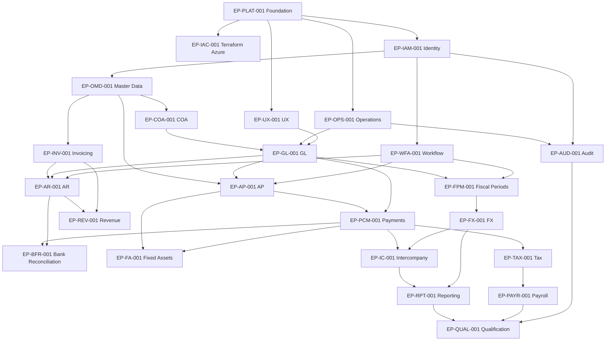

# Finance Platform Dependencies, Milestones and Releases

| Document-control field | Value |
|---|---|
| Version | 1.0 |
| Baseline date | 2026-07-24 |
| Status | Passed |
| Source baseline | Finance DDD v3.1; Functional PRD v1.5; UX v1.0; NFR v1.0; Solution/System Design v1.0; Technical Specifications v1.0 |
| Delivery profile | Solo, part-time learning project; local-first; low-cost Azure demonstrations |
| Owner | Learning Product and Delivery Owner |

> **Purpose:** Define the dependency graph, critical path, milestone content, iteration assumptions, release progression and change rules.
>
> **Planning rule:** Iteration counts and elapsed-time ranges are planning assumptions, not commitments. Reforecast after M2 using observed completion rate, defect rate and available learning time.

## 1. Dependency rules

- A dependency means the predecessor's stable contract and minimum behavior must exist; the predecessor does not need every future enhancement.
- No capability may write another capability's authoritative tables to bypass a dependency.
- A later milestone may begin discovery work early, but implementation does not bypass predecessor exit gates.
- Cross-cutting security, evidence, observability and accessibility are introduced at the first applicable slice and expanded incrementally.

## 2. Epic dependency matrix

| Epic | Depends on | Required by milestone | Dependency rationale |
|---|---|---|---|
| EP-PLAT-001 — Engineering foundation | None | M0 | Repository, Go/React applications, Docker Compose, migrations, sqlc, OpenAPI, testing and conventions. |
| EP-UX-001 — Shared UX and design system | EP-PLAT-001 | M0 | Tailwind, daisyUI abstractions, routing, forms, tables, accessibility and shared operational surfaces. |
| EP-IAC-001 — Terraform and Azure learning environment | EP-PLAT-001 | M0 | Terraform state bootstrap, low-cost Azure modules, budget controls and ephemeral demo deployment. |
| EP-OPS-001 — Observability and operational foundation | EP-PLAT-001 | M0 | Structured logs, traces, metrics, dashboards, runbooks and operational evidence. |
| EP-IAM-001 — Identity and access | EP-PLAT-001 | M1 | Entra authentication, application permissions, accounting-scope authorization and emergency access. |
| EP-OMD-001 — Organization and master data | EP-PLAT-001, EP-IAM-001 | M1 | Legal entities, parties, profiles and fiscal calendars. |
| EP-COA-001 — COA segment configuration | EP-OMD-001, EP-IAM-001 | M1 | Segment definitions, values, combinations and approved segment changes. |
| EP-GL-001 — General Ledger | EP-COA-001, EP-IAM-001, EP-UX-001, EP-OPS-001 | M2 | Journal validation, approval, posting, reversal, gates and ledger inquiry. |
| EP-WFA-001 — Workflow and approvals | EP-IAM-001, EP-UX-001, EP-OPS-001 | M3 | Policies, requests, decisions, delegation, escalation and decision application. |
| EP-FPM-001 — Fiscal period management | EP-GL-001, EP-WFA-001 | M3 | Soft close, hard close, reopen, reclose and control recovery. |
| EP-INV-001 — Invoicing | EP-OMD-001, EP-IAM-001, EP-UX-001 | M4 | Templates, schedules, generated invoices and AR handoff. |
| EP-AR-001 — Accounts Receivable | EP-INV-001, EP-GL-001, EP-WFA-001 | M4 | Invoices, open items, receipts, applications, credits, refunds and adjustments. |
| EP-AP-001 — Accounts Payable | EP-OMD-001, EP-GL-001, EP-WFA-001 | M5 | Vendor invoices, matching, approval, liabilities and payment requests. |
| EP-PCM-001 — Payments and cash management | EP-GL-001, EP-WFA-001, EP-AP-001 | M5 | Batches, instructions, settlements, returns, exceptions and expected incoming settlement. |
| EP-BFR-001 — Bank feeds and reconciliation | EP-PCM-001, EP-AR-001 | M6 | Connections, imports, matching, unmatching and reconciliation. |
| EP-FA-001 — Fixed Assets | EP-GL-001, EP-WFA-001, EP-AP-001, EP-PCM-001 | M7 | Capitalization, depreciation, impairment, transfer, split and disposal. |
| EP-REV-001 — Revenue Recognition | EP-GL-001, EP-WFA-001, EP-INV-001, EP-AR-001 | M7 | Contracts, obligations, profiles, schedules and modifications. |
| EP-FX-001 — Multi-Currency | EP-GL-001, EP-FPM-001 | M8 | Rates, realized FX, revaluation and translation. |
| EP-IC-001 — Intercompany | EP-GL-001, EP-PCM-001, EP-FX-001 | M8 | Agreements, transactions, matching, settlement and eliminations. |
| EP-RPT-001 — Financial Reporting | EP-GL-001, EP-FX-001, EP-IC-001 | M8 | Definitions, statements, consolidation, lineage and publication. |
| EP-TAX-001 — Tax Filing | EP-GL-001, EP-WFA-001, EP-PCM-001 | M9 | Configurations, returns, submissions, amendments, adjustments and payments. |
| EP-PAYR-001 — Payroll | EP-GL-001, EP-WFA-001, EP-PCM-001, EP-TAX-001 | M9 | Profiles, runs, corrections, off-cycle processing, failed payments and filing amendments. |
| EP-AUD-001 — Audit Integrity | EP-OPS-001, EP-IAM-001 | M9 | Evidence ingestion, verification, credential rotation, incidents and proof access. |
| EP-QUAL-001 — Full-system qualification | EP-PLAT-001, EP-UX-001, EP-IAC-001, EP-OPS-001, EP-IAM-001, EP-OMD-001, EP-COA-001, EP-GL-001, EP-WFA-001, EP-FPM-001, EP-INV-001, EP-AR-001, EP-AP-001, EP-PCM-001, EP-BFR-001, EP-FA-001, EP-REV-001, EP-FX-001, EP-IC-001, EP-RPT-001, EP-TAX-001, EP-PAYR-001, EP-AUD-001 | M9 | Security, privacy, accessibility, capacity, performance, recovery and release evidence. |

## 3. Dependency graph

The matrix in Section 2 is authoritative. The diagram emphasizes the critical path and omits repeated cross-cutting edges and the full qualification fan-in for readability.

## 4. Critical path

The baseline critical path is:

`Foundation → Identity/Master Data → COA → GL → Workflow/Fiscal Periods → AP/Payments → Bank Reconciliation → FX/Intercompany/Reporting → Qualification`.

AR, Fixed Assets and Revenue Recognition run as planned branches after their prerequisites but must rejoin before full qualification.

## 5. Milestone content and gates

| Milestone | Required epics | Required workflow demonstrations | Minimum gates |
|---|---|---|---|
| M0 | EP-PLAT-001, EP-UX-001, EP-IAC-001, EP-OPS-001 | Foundation demonstration | QG-01, QG-03, QG-04, QG-05, QG-08, QG-10 |
| M1 | EP-IAM-001, EP-OMD-001, EP-COA-001, EP-GL-001 configuration slice, EP-AUD-001 append-evidence slice | Foundation demonstration | QG-01, QG-02, QG-03, QG-04, QG-05, QG-06, QG-08, QG-10 |
| M2 | EP-GL-001, EP-WFA-001 journal-approval slice, EP-FPM-001 open-period slice | WF-6.6 | QG-01, QG-02, QG-03, QG-04, QG-05, QG-06, QG-07, QG-08, QG-10 |
| M3 | EP-WFA-001, EP-FPM-001 | WF-6.1, WF-6.2, WF-7.12 | QG-01, QG-02, QG-03, QG-04, QG-05, QG-06, QG-07, QG-08, QG-10 |
| M4 | EP-INV-001, EP-AR-001 | WF-6.7 | QG-01, QG-02, QG-03, QG-04, QG-05, QG-06, QG-07, QG-08, QG-10 |
| M5 | EP-AP-001, EP-PCM-001 | WF-7.1, WF-7.2 | QG-01, QG-02, QG-03, QG-04, QG-05, QG-06, QG-07, QG-08, QG-10 |
| M6 | EP-BFR-001, EP-PCM-001 incoming-settlement slice, EP-AP-001 supplier-refund slice, EP-AR-001 chargeback slice | WF-7.3, WF-7.4 | QG-01, QG-02, QG-03, QG-04, QG-05, QG-06, QG-07, QG-08, QG-10 |
| M7 | EP-FA-001, EP-REV-001 | WF-6.4, WF-6.5, WF-7.7, WF-7.8 | QG-01, QG-02, QG-03, QG-04, QG-05, QG-06, QG-07, QG-08, QG-10 |
| M8 | EP-FX-001, EP-IC-001, EP-RPT-001 | WF-6.3, WF-7.5, WF-7.6, WF-7.9 | QG-01, QG-02, QG-03, QG-04, QG-05, QG-06, QG-07, QG-08, QG-10 |
| M9 | EP-TAX-001, EP-PAYR-001, EP-AUD-001, EP-QUAL-001 | WF-7.10, WF-7.11, WF-7.13, WF-7.14, WF-7.15 | QG-01, QG-02, QG-03, QG-04, QG-05, QG-06, QG-07, QG-08, QG-09, QG-10 |

## 6. Iteration planning assumptions

### M0 — Engineering foundation

- **Window:** Iterations 1–3 (6 weeks).
- **Outcome:** Repository, local environment, CI, shared UI, database migration, API and observability foundations are demonstrable.
- **Iteration pattern:** discovery/contract confirmation, vertical implementation, correction/recovery paths, and milestone hardening/demo.
- **Scope rule:** unfinished items return to the backlog; the milestone does not pass on partial percentage completion.

### M1 — Identity and accounting configuration

- **Window:** Iterations 4–7 (8 weeks).
- **Outcome:** Authentication, authorization, accounting scope, master data, ledgers, books, chart and accounts are usable.
- **Iteration pattern:** discovery/contract confirmation, vertical implementation, correction/recovery paths, and milestone hardening/demo.
- **Scope rule:** unfinished items return to the backlog; the milestone does not pass on partial percentage completion.

### M2 — First posted journal vertical slice

- **Window:** Iterations 8–11 (8 weeks).
- **Outcome:** A journal can be created, validated, approved when required, posted, queried and reversed end to end.
- **Iteration pattern:** discovery/contract confirmation, vertical implementation, correction/recovery paths, and milestone hardening/demo.
- **Scope rule:** unfinished items return to the backlog; the milestone does not pass on partial percentage completion.

### M3 — Approval and period controls

- **Window:** Iterations 12–15 (8 weeks).
- **Outcome:** Approval policies, soft/hard close, reopen/reclose and posting-gate recovery are demonstrated.
- **Iteration pattern:** discovery/contract confirmation, vertical implementation, correction/recovery paths, and milestone hardening/demo.
- **Scope rule:** unfinished items return to the backlog; the milestone does not pass on partial percentage completion.

### M4 — Receivables and billing

- **Window:** Iterations 16–21 (12 weeks).
- **Outcome:** Invoice issue, receipt recording, application, unapplication, credits, write-offs and refund obligations are demonstrated; external refund settlement follows in M5.
- **Iteration pattern:** discovery/contract confirmation, vertical implementation, correction/recovery paths, and milestone hardening/demo.
- **Scope rule:** unfinished items return to the backlog; the milestone does not pass on partial percentage completion.

### M5 — Payables and payment execution

- **Window:** Iterations 22–29 (16 weeks).
- **Outcome:** Vendor invoice through payment instruction, settlement, cancellation, return and exception resolution is demonstrable.
- **Iteration pattern:** discovery/contract confirmation, vertical implementation, correction/recovery paths, and milestone hardening/demo.
- **Scope rule:** unfinished items return to the backlog; the milestone does not pass on partial percentage completion.

### M6 — Bank and cash reconciliation

- **Window:** Iterations 30–34 (10 weeks).
- **Outcome:** Statement import, matching, incoming settlement, excess cash, supplier-refund application and customer chargeback correction are complete.
- **Iteration pattern:** discovery/contract confirmation, vertical implementation, correction/recovery paths, and milestone hardening/demo.
- **Scope rule:** unfinished items return to the backlog; the milestone does not pass on partial percentage completion.

### M7 — Assets and revenue

- **Window:** Iterations 35–41 (14 weeks).
- **Outcome:** Fixed-asset lifecycle/disposal and revenue-contract recognition/modification workflows are complete.
- **Iteration pattern:** discovery/contract confirmation, vertical implementation, correction/recovery paths, and milestone hardening/demo.
- **Scope rule:** unfinished items return to the backlog; the milestone does not pass on partial percentage completion.

### M8 — Currency, intercompany and reporting

- **Window:** Iterations 42–48 (14 weeks).
- **Outcome:** FX, revaluation, translation, intercompany settlement, consolidation and statements are demonstrated.
- **Iteration pattern:** discovery/contract confirmation, vertical implementation, correction/recovery paths, and milestone hardening/demo.
- **Scope rule:** unfinished items return to the backlog; the milestone does not pass on partial percentage completion.

### M9 — Tax, payroll, audit and qualification

- **Window:** Iterations 49–54 (12 weeks).
- **Outcome:** Tax/payroll correction flows, audit verification and full security, accessibility, recovery and performance qualification pass.
- **Iteration pattern:** discovery/contract confirmation, vertical implementation, correction/recovery paths, and milestone hardening/demo.
- **Scope rule:** unfinished items return to the backlog; the milestone does not pass on partial percentage completion.

## 7. Release and promotion policy

- `local` is the primary feature environment.
- CI validates every change using ephemeral dependencies.
- `dev` Azure is optional and may be absent between exercises.
- `demo` is created for a release demonstration, recovery exercise or portfolio review and then destroyed.
- A release tag is created only after its milestone gates pass.
- Database migration failure uses forward-fix by default; destructive rollback requires explicit evidence that no established financial fact is lost.
- Feature flags may hide incomplete UI entry points but may not represent an incomplete financial effect as complete.

## 8. Change and dependency control

A proposed change must state affected requirements, workflows, acceptance scenarios, NFRs, epics, milestones, technical specifications, tests, migration impact, cost and risk. A dependency may be removed only if the architecture and ownership rules still hold and the change is recorded through an ADR.
## Verification Checkpoint

| Field | Value |
|---|---|
| Verified body SHA-256 | `91d2cfd94982bc33a978db878838d103674bf58141c415aa03a2cae8cfc7e4a5` |
| Review status | Passed |
| Reuse rule | Re-run structural checks when this body hash and all source hashes remain unchanged. Run targeted semantic review for localized backlog, estimate, dependency, milestone, gate, risk or cost changes. Run the full suite for requirement, workflow, acceptance, architecture, technical-specification or source-hash changes. |

### Checks recorded

- All 24 epics are present in the dependency matrix.
- The epic dependency graph is acyclic.
- Every workflow is assigned to exactly one milestone.
- Every milestone has required epics, workflow demonstrations and quality gates.
- Release and environment promotion rules are explicit.
