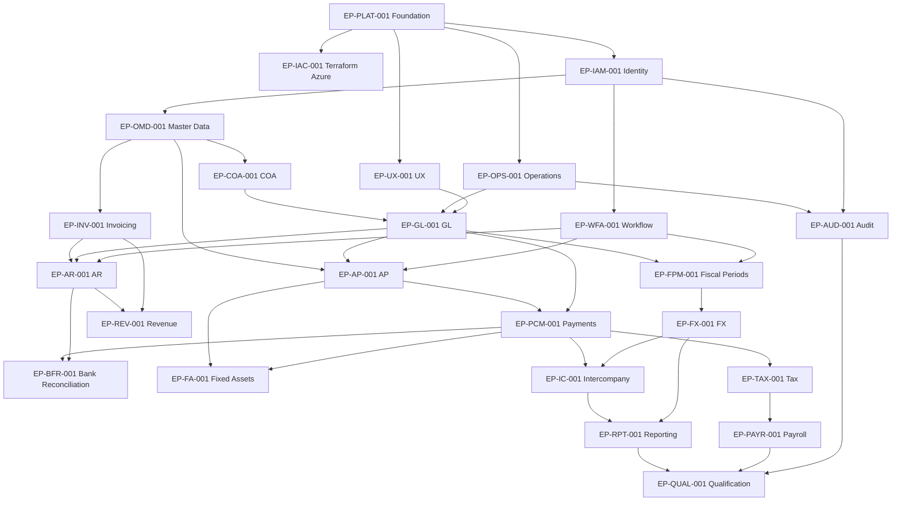

# Finance Platform Delivery Plan

> Consolidated delivery strategy, roadmap, backlog, dependencies, milestones, quality plan, risks, costs, governance, and traceability baseline.

## Finance Platform Delivery Strategy and Roadmap

| Document-control field | Value |
|---|---|
| Version | 1.0 |
| Baseline date | 2026-07-24 |
| Status | Passed |
| Source baseline | Finance DDD v3.1; Functional PRD v1.5; UX v1.0; NFR v1.0; Solution/System Design v1.0; Technical Specifications v1.0 |
| Delivery profile | Solo, part-time learning project; local-first; low-cost Azure demonstrations |
| Owner | Learning Product and Delivery Owner |

> **Purpose:** Define the incremental delivery strategy, phase outcomes, milestone cut lines, release increments and reforecast rules for implementing the approved finance platform as a learning project.
>
> **Planning rule:** Iteration counts and elapsed-time ranges are planning assumptions, not commitments. Reforecast after M2 using observed completion rate, defect rate and available learning time.

### 1. Delivery objectives

The plan optimizes for completed, demonstrable financial workflows and learning evidence rather than percentage completion of horizontal layers. Each increment must cross domain, database, API, frontend, authorization, testing, observability and documentation boundaries.

#### 1.1 Success measures

- A working vertical slice is preferred over broad unfinished scaffolding.
- No milestone is complete while its financial integrity, authorization, correction and recovery paths are untested.
- The modular monolith remains one deployable application unless a later ADR approves extraction.
- Local development remains the default; Azure is used for infrastructure, deployment and recovery exercises.
- Scope may stop at any milestone when the learner's objectives have been met.

#### 1.2 Delivery assumptions

| Assumption | Baseline |
|---|---|
| Team shape | One learner acting in several conceptual roles |
| Weekly effort | Approximately 10–15 focused hours |
| Iteration length | Two weeks |
| Planning horizon | 54 iterations / approximately 108 weeks if the full domain is pursued |
| Reforecast point | Mandatory after M2; optional after every later milestone |
| Environment | Local and CI continuously; Azure dev/demo only when required |
| Release meaning | Demonstrable learning baseline, not production authorization |

### 2. Delivery principles

1. **Vertical slices first.** A slice includes UI, API, application behavior, domain rules, persistence, security, tests and operations evidence.
2. **Accounting integrity before convenience.** A slower correct flow is accepted before a fast flow with uncertain financial effects.
3. **One owner for each fact.** Delivery does not bypass DDD bounded-context ownership to simplify implementation.
4. **Corrections are first-class.** Reversal, adjustment, return, amendment, replacement and compensation are delivered with the original flow or explicitly blocked.
5. **No silent partial success.** Long-running and cross-module work exposes pending, exception, reconciled and terminal outcomes.
6. **Shared patterns earn reuse.** A shared component is generalized after at least two concrete uses, except foundational security, money, scope, idempotency and evidence patterns.
7. **Azure spend follows learning value.** No persistent cloud component is added solely to imitate an enterprise topology.
8. **Traceability is part of delivery.** Requirement, workflow, acceptance, NFR and technical-specification mappings are updated with each completed item.

### 3. Phases and milestone roadmap

| Phase | Theme | Exit milestone | Scope |
|---|---|---|---|
| P0 | Foundation | M0 | Platform, UX system, CI/CD, local environment and engineering controls. |
| P1 | Accounting foundation | M1 | Identity, scope, master data, COA and ledger configuration. |
| P2 | Ledger vertical slice | M2 | Journal posting and reversal through every technical layer. |
| P3 | Controls | M3 | Workflow approvals and fiscal-period control. |
| P4 | Receivables | M4 | Billing, receivables, receipts and customer adjustments. |
| P5 | Payables and payments | M5 | Vendor liabilities and outbound settlement. |
| P6 | Cash reconciliation | M6 | Bank evidence, matching and incoming settlement. |
| P7 | Assets and revenue | M7 | Fixed assets and revenue recognition. |
| P8 | Finance reporting | M8 | FX, intercompany, consolidation and reporting. |
| P9 | Completion and qualification | M9 | Tax, payroll, audit integrity and full quality qualification. |

#### 3.1 Milestones

| Milestone | Outcome | Planning window | Planning duration | Exit evidence |
|---|---|---|---:|---|
| M0 | Engineering foundation | Iterations 1–3 | 6 weeks | Repository, local environment, CI, shared UI, database migration, API and observability foundations are demonstrable. |
| M1 | Identity and accounting configuration | Iterations 4–7 | 8 weeks | Authentication, authorization, accounting scope, master data, ledgers, books, chart and accounts are usable. |
| M2 | First posted journal vertical slice | Iterations 8–11 | 8 weeks | A journal can be created, validated, approved when required, posted, queried and reversed end to end. |
| M3 | Approval and period controls | Iterations 12–15 | 8 weeks | Approval policies, soft/hard close, reopen/reclose and posting-gate recovery are demonstrated. |
| M4 | Receivables and billing | Iterations 16–21 | 12 weeks | Invoice issue, receipt recording, application, unapplication, credits, write-offs and refund obligations are demonstrated; external refund settlement follows in M5. |
| M5 | Payables and payment execution | Iterations 22–29 | 16 weeks | Vendor invoice through payment instruction, settlement, cancellation, return and exception resolution is demonstrable. |
| M6 | Bank and cash reconciliation | Iterations 30–34 | 10 weeks | Statement import, matching, incoming settlement, excess cash, supplier-refund application and customer chargeback correction are complete. |
| M7 | Assets and revenue | Iterations 35–41 | 14 weeks | Fixed-asset lifecycle/disposal and revenue-contract recognition/modification workflows are complete. |
| M8 | Currency, intercompany and reporting | Iterations 42–48 | 14 weeks | FX, revaluation, translation, intercompany settlement, consolidation and statements are demonstrated. |
| M9 | Tax, payroll, audit and qualification | Iterations 49–54 | 12 weeks | Tax/payroll correction flows, audit verification and full security, accessibility, recovery and performance qualification pass. |

#### 3.2 Recommended stopping points

| Stop point | What has been learned | Suitable outcome |
|---|---|---|
| M2 | Complete finance vertical slice, exact money, posting, approval, reversal, persistence, API, UI and testing | Strong portfolio project with limited scope |
| M4 | Subledger-to-ledger integration and local multi-aggregate consistency | Broader accounting application demo |
| M6 | External evidence, payment execution, returns and reconciliation | End-to-end operational finance demo |
| M8 | Period-end, currency, intercompany and reporting | Advanced finance-platform architecture demonstration |
| M9 | Full declared domain and qualification evidence | Long-term reference implementation |

### 4. Release increments

| Release | Name | Milestone | Included outcome |
|---|---|---|---|
| R0 | Foundation preview | M0 | Local application, CI and optional ephemeral Azure deployment. |
| R1 | Accounting core demo | M2 | Configuration plus end-to-end journal posting and reversal. |
| R2 | Controlled ledger demo | M3 | Approvals and period close/reopen control. |
| R3 | Receivables demo | M4 | Invoice-to-receipt plus credits, write-offs and refund-obligation flows. |
| R4 | Payables and cash demo | M6 | Vendor invoice-to-payment and bank reconciliation. |
| R5 | Assets and revenue demo | M7 | Fixed assets and revenue recognition. |
| R6 | Finance suite demo | M8 | Currency, intercompany, consolidation and statements. |
| R7 | Full learning baseline | M9 | Tax, payroll, audit and full qualification evidence. |

### 5. Milestone exit model

A milestone exits only when:

- its required epics are complete or explicitly deferred with no hidden dependency;
- all direct functional requirements assigned to the milestone are implemented or recorded as excluded;
- mapped workflows pass their functional acceptance scenarios;
- applicable quality gates pass;
- database migrations and rollback/forward-fix evidence are available;
- authorization, audit, observability and recovery behavior are demonstrated;
- documentation and traceability are current; and
- the milestone demo can be repeated from a clean environment using versioned seed data.

### 6. Reforecast policy

After M2, calculate observed throughput using completed delivery items that passed every gate. Reforecast remaining milestone windows using:

- median completed vertical slices per iteration;
- defect escape and rework rate;
- average unavailable learning time;
- infrastructure and integration setup overhead; and
- newly discovered technical or domain dependencies.

Do not use raw code volume or partially completed stories as velocity.

### 7. Scope control

Changes to DDD meaning, requirement behavior, UX workflow, NFR target, architecture decision or technical contract enter through change control. Nice-to-have UI refinements, additional providers, mobile clients, advanced analytics and production multi-region topology remain outside the baseline unless separately approved.
### Verification Checkpoint

| Field | Value |
|---|---|
| Verified body SHA-256 | `a85b946c50f3e836c8f3c1d46712aaffa413fddd1430c3719df05d3a1eccaf55` |
| Review status | Passed |
| Reuse rule | Re-run structural checks when this body hash and all source hashes remain unchanged. Run targeted semantic review for localized backlog, estimate, dependency, milestone, gate, risk or cost changes. Run the full suite for requirement, workflow, acceptance, architecture, technical-specification or source-hash changes. |

#### Checks recorded

- All ten milestones and eight releases are defined.
- Planning assumptions are clearly separated from commitments.
- Every phase has an explicit exit milestone and stopping point.
- The strategy preserves modular-monolith, local-first and financial-integrity principles.

---

## Finance Platform Work Breakdown and Backlog

| Document-control field | Value |
|---|---|
| Version | 1.0 |
| Baseline date | 2026-07-24 |
| Status | Passed |
| Source baseline | Finance DDD v3.1; Functional PRD v1.5; UX v1.0; NFR v1.0; Solution/System Design v1.0; Technical Specifications v1.0 |
| Delivery profile | Solo, part-time learning project; local-first; low-cost Azure demonstrations |
| Owner | Learning Product and Delivery Owner |

> **Purpose:** Define epics, requirement delivery items, workflow demonstrations, cross-cutting work and readiness/done criteria with stable delivery identifiers.
>
> **Planning rule:** Iteration counts and elapsed-time ranges are planning assumptions, not commitments. Reforecast after M2 using observed completion rate, defect rate and available learning time.

### 1. Backlog conventions

| Item type | Identifier | Meaning |
|---|---|---|
| Epic | `EP-*` | Coherent capability or platform outcome |
| Functional delivery item | `DLV-FR-*` | One exact `FR-*` requirement delivered through all layers |
| Global delivery item | `DLV-GFR-*` | One cross-cutting `GFR-*` control |
| Workflow demonstration | `DLV-WF-*` | End-to-end workflow and mapped acceptance evidence |
| Quality qualification item | `DLV-NFR-*` | One exact NFR verification obligation |
| Platform item | `DLV-PLAT-*` | Engineering or environment foundation not represented as product behavior |

Priority meanings: `P0` blocks the current milestone; `P1` is required for the declared capability; `P2` belongs to the full-domain path and may be deferred at an approved stopping point.

### 2. Epic catalog

| Epic | Outcome | Milestone | Scope |
|---|---|---|---|
| EP-PLAT-001 | Engineering foundation | M0 | Repository, Go/React applications, Docker Compose, migrations, sqlc, OpenAPI, testing and conventions. |
| EP-UX-001 | Shared UX and design system | M0 | Tailwind, daisyUI abstractions, routing, forms, tables, accessibility and shared operational surfaces. |
| EP-IAC-001 | Terraform and Azure learning environment | M0 | Terraform state bootstrap, low-cost Azure modules, budget controls and ephemeral demo deployment. |
| EP-OPS-001 | Observability and operational foundation | M0 | Structured logs, traces, metrics, dashboards, runbooks and operational evidence. |
| EP-IAM-001 | Identity and access | M1 | Entra authentication, application permissions, accounting-scope authorization and emergency access. |
| EP-OMD-001 | Organization and master data | M1 | Legal entities, parties, profiles and fiscal calendars. |
| EP-COA-001 | COA segment configuration | M1 | Segment definitions, values, combinations and approved segment changes. |
| EP-GL-001 | General Ledger | M2 | Journal validation, approval, posting, reversal, gates and ledger inquiry. |
| EP-WFA-001 | Workflow and approvals | M3 | Policies, requests, decisions, delegation, escalation and decision application. |
| EP-FPM-001 | Fiscal period management | M3 | Soft close, hard close, reopen, reclose and control recovery. |
| EP-INV-001 | Invoicing | M4 | Templates, schedules, generated invoices and AR handoff. |
| EP-AR-001 | Accounts Receivable | M4 | Invoices, open items, receipts, applications, credits, refunds and adjustments. |
| EP-AP-001 | Accounts Payable | M5 | Vendor invoices, matching, approval, liabilities and payment requests. |
| EP-PCM-001 | Payments and cash management | M5 | Batches, instructions, settlements, returns, exceptions and expected incoming settlement. |
| EP-BFR-001 | Bank feeds and reconciliation | M6 | Connections, imports, matching, unmatching and reconciliation. |
| EP-FA-001 | Fixed Assets | M7 | Capitalization, depreciation, impairment, transfer, split and disposal. |
| EP-REV-001 | Revenue Recognition | M7 | Contracts, obligations, profiles, schedules and modifications. |
| EP-FX-001 | Multi-Currency | M8 | Rates, realized FX, revaluation and translation. |
| EP-IC-001 | Intercompany | M8 | Agreements, transactions, matching, settlement and eliminations. |
| EP-RPT-001 | Financial Reporting | M8 | Definitions, statements, consolidation, lineage and publication. |
| EP-TAX-001 | Tax Filing | M9 | Configurations, returns, submissions, amendments, adjustments and payments. |
| EP-PAYR-001 | Payroll | M9 | Profiles, runs, corrections, off-cycle processing, failed payments and filing amendments. |
| EP-AUD-001 | Audit Integrity | M9 | Evidence ingestion, verification, credential rotation, incidents and proof access. |
| EP-QUAL-001 | Full-system qualification | M9 | Security, privacy, accessibility, capacity, performance, recovery and release evidence. |

### 3. Platform foundation backlog

| Delivery ID | Epic | Milestone | Deliverable | Exit evidence |
|---|---|---|---|---|
| DLV-PLAT-001 | EP-PLAT-001 | M0 | Create monorepo with Go API, React application and shared commands. | Clean clone builds and tests locally. |
| DLV-PLAT-002 | EP-PLAT-001 | M0 | Create Docker Compose PostgreSQL development environment. | Database starts, migrates, seeds and resets reproducibly. |
| DLV-PLAT-003 | EP-PLAT-001 | M0 | Establish Goose migrations, pgx and sqlc workflow. | CI detects migration and generated-code drift. |
| DLV-PLAT-004 | EP-PLAT-001 | M0 | Establish OpenAPI-first REST workflow. | OpenAPI validates and generated clients compile. |
| DLV-PLAT-005 | EP-PLAT-001 | M0 | Implement shared money, currency, accounting-scope, identity and version primitives. | Unit and serialization tests pass without floating-point money. |
| DLV-PLAT-006 | EP-PLAT-001 | M0 | Implement request fingerprint and idempotency foundation. | Same identity/same fingerprint and changed-fingerprint tests pass. |
| DLV-PLAT-007 | EP-PLAT-001 | M0 | Implement PostgreSQL outbox/inbox and worker foundation. | Crash-before/after-commit and duplicate-delivery tests pass. |
| DLV-UX-001 | EP-UX-001 | M0 | Implement Tailwind/daisyUI application shell and component abstractions. | Shared worklist, detail, action, status, form and dialog examples pass. |
| DLV-UX-002 | EP-UX-001 | M0 | Implement accessibility test harness. | axe, keyboard and manual screen-reader check procedure is repeatable. |
| DLV-OPS-001 | EP-OPS-001 | M0 | Implement structured logging, correlation and OpenTelemetry. | Trace spans and redacted logs link UI, API, database and worker activity. |
| DLV-OPS-002 | EP-OPS-001 | M0 | Create baseline operational dashboard and runbook template. | Health, error, backlog and business-result panels are visible. |
| DLV-IAC-001 | EP-IAC-001 | M0 | Create Terraform modules and local state bootstrap. | fmt, validate and plan pass with no credentials committed. |
| DLV-IAC-002 | EP-IAC-001 | M0 | Create optional Azure dev/demo deployment. | Static Web App, Container App and PostgreSQL exercise deploy and destroy reproducibly. |
| DLV-CI-001 | EP-PLAT-001 | M0 | Create pull-request CI quality pipeline. | Go, frontend, OpenAPI, SQL, Terraform, security and documentation checks gate merge. |

### 4. Global functional-control backlog

| Delivery ID | Source | Epic | Milestone | Deliverable |
|---|---|---|---|---|
| DLV-GFR-001 | GFR-001 | EP-PLAT-001 | M0 | The product shall use the DDD v3.1 ubiquitous language and bounded-context ownership as the authoritative functional vocabulary. |
| DLV-GFR-002 | GFR-002 | EP-IAM-001 | M1 | Every user action shall be evaluated against the access dimensions applicable to that action, including legal entity, business unit or segment, accou… |
| DLV-GFR-003 | GFR-003 | EP-IAM-001 | M1 | The product shall prevent prohibited segregation-of-duties combinations and shall expose the reason for a denied action. |
| DLV-GFR-004 | GFR-004 | EP-WFA-001 | M2 | Approval-bearing actions shall route through the applicable approval policy and revalidate current business state when the decision is applied. |
| DLV-GFR-005 | GFR-005 | EP-GL-001 | M2 | Posted, accepted, or otherwise established financial facts shall not be edited destructively; correction shall use reversal, adjustment, amendment, r… |
| DLV-GFR-006 | GFR-006 | EP-PLAT-001 | M0 | Repeated submission of the same business identity and fingerprint shall return the established result without repeating the business effect. |
| DLV-GFR-007 | GFR-007 | EP-PLAT-001 | M0 | Reuse of the same business identity with changed functional content shall be rejected as an idempotency conflict. |
| DLV-GFR-008 | GFR-008 | EP-PLAT-001 | M0 | Concurrent changes shall be checked against expected versions and shall never silently overwrite an established business outcome. |
| DLV-GFR-009 | GFR-009 | EP-UX-001 | M0 | Each user-visible workflow shall expose current state, allowed actions, blocked actions, blocking reason, responsible owner, and correction or recove… |
| DLV-GFR-010 | GFR-010 | EP-FX-001 | M8 | Financial amounts shall display transaction, functional, and presentation currency where applicable, including the rate-set and conversion evidence u… |
| DLV-GFR-011 | GFR-011 | EP-GL-001 | M2 | Every accounting effect shall have one owning producer, and the product shall prevent duplicate accounting ownership across capabilities. |
| DLV-GFR-012 | GFR-012 | EP-OPS-001 | M0 | Cross-context workflows shall expose intermediate, exception, reconciliation, and terminal states rather than presenting later outcomes as immediate… |
| DLV-GFR-013 | GFR-013 | EP-PLAT-001 | M0 | The product shall preserve immutable lineage among source facts, approvals, postings, reversals, returns, amendments, replacements, and compensations. |
| DLV-GFR-014 | GFR-014 | EP-AUD-001 | M1 | All material actions and decisions shall be auditable with actor, time, scope, source, action, authorization, correlation, and the applicable before/… |
| DLV-GFR-015 | GFR-015 | EP-IAM-001 | M1 | Sensitive payroll, tax, bank, and personal information shall be shown only to authorized users and shall be minimized in shared business evidence and… |
| DLV-GFR-016 | GFR-016 | EP-UX-001 | M0 | Search, worklists, and reports shall support the filters applicable to their records, including accounting scope, state, owner, date, amount, currenc… |
| DLV-GFR-017 | GFR-017 | EP-UX-001 | M0 | User interfaces shall distinguish dependency unavailability from domain rejection and shall show the next permitted resolution action. |
| DLV-GFR-018 | GFR-018 | EP-AUD-001 | M9 | Business records subject to legal hold shall remain available and immutable until the hold is formally released, even when the ordinary retention per… |
| DLV-GFR-019 | GFR-019 | EP-OMD-001 | M1 | Effective-dated configurations shall preserve the rule and version used by historical transactions. |
| DLV-GFR-020 | GFR-020 | EP-AUD-001 | M9 | The product shall provide exportable, access-controlled evidence for approvals, postings, reconciliations, close/reopen activity, and audit-integrity… |
| DLV-GFR-021 | GFR-021 | EP-PLAT-001 | M0 | PRD-defined functional actions shall not be represented as DDD commands or domain events unless the DDD baseline is explicitly changed. |
| DLV-GFR-022 | GFR-022 | EP-PLAT-001 | M0 | Every functional workflow shall trace to exact requirement IDs for named DDD operations and for explicit PRD functional actions that implement stated… |

### 5. Capability requirement backlog

Every row is a complete vertical delivery item, not a backend-only task. It includes UX, API, domain, persistence, authorization, tests, observability and documentation required by the cited specifications.

| Delivery ID | Requirement | Capability | Action | Epic | Milestone | Priority | Short outcome |
|---|---|---|---|---|---|---|---|
| DLV-FR-AP-001 | FR-AP-001 | Accounts Payable | `RegisterVendorInvoice` | EP-AP-001 | M5 | P1 | The operation result, current lifecycle state, validation/approval status, responsible owner, and any exception or… |
| DLV-FR-AP-002 | FR-AP-002 | Accounts Payable | `ApplyAssetClearingClassification` | EP-AP-001 | M7 | P1 | The accepted, rejected, exception, reconciled, or conflict outcome is visible with the authoritative source refere… |
| DLV-FR-AP-003 | FR-AP-003 | Accounts Payable | `ApplyIncomingSettlement` | EP-AP-001 | M6 | P1 | The accepted, rejected, exception, reconciled, or conflict outcome is visible with the authoritative source refere… |
| DLV-FR-AP-004 | FR-AP-004 | Accounts Payable | `ReverseIncomingSettlementApplication` | EP-AP-001 | M6 | P1 | The linked correction/cancellation outcome, preserved original fact, resulting balances or lifecycle state, and an… |
| DLV-FR-AP-005 | FR-AP-005 | Accounts Payable | `ApplyPaymentReturn` | EP-AP-001 | M5 | P1 | The accepted, rejected, exception, reconciled, or conflict outcome is visible with the authoritative source refere… |
| DLV-FR-AP-006 | FR-AP-006 | Accounts Payable | `ApplyVendorInvoiceApprovalDecision` | EP-AP-001 | M5 | P1 | The applied decision reference and resulting approved, rejected, unchanged, or conflict state are visible; the own… |
| DLV-FR-AP-007 | FR-AP-007 | Accounts Payable | `RequestPayment` | EP-AP-001 | M5 | P1 | The operation result, current lifecycle state, validation/approval status, responsible owner, and any exception or… |
| DLV-FR-AP-008 | FR-AP-008 | Accounts Payable | `ValidateVendorInvoice` | EP-AP-001 | M5 | P1 | The operation result, current lifecycle state, validation/approval status, responsible owner, and any exception or… |
| DLV-FR-AP-009 | FR-AP-009 | Accounts Payable | `DisputeVendorInvoice` | EP-AP-001 | M5 | P1 | The authoritative result and resulting business state are visible to authorized users. |
| DLV-FR-AP-010 | FR-AP-010 | Accounts Payable | `VoidVendorInvoice` | EP-AP-001 | M5 | P1 | The authoritative result and resulting business state are visible to authorized users. |
| DLV-FR-AR-001 | FR-AR-001 | Accounts Receivable | `IssueCustomerInvoice` | EP-AR-001 | M4 | P1 | The operation result, current lifecycle state, validation/approval status, responsible owner, and any exception or… |
| DLV-FR-AR-002 | FR-AR-002 | Accounts Receivable | `RecordReceipt` | EP-AR-001 | M4 | P1 | The operation result, current lifecycle state, validation/approval status, responsible owner, and any exception or… |
| DLV-FR-AR-003 | FR-AR-003 | Accounts Receivable | `ApplyReceipt` | EP-AR-001 | M4 | P1 | The accepted, rejected, exception, reconciled, or conflict outcome is visible with the authoritative source refere… |
| DLV-FR-AR-004 | FR-AR-004 | Accounts Receivable | `UnapplyReceipt` | EP-AR-001 | M4 | P1 | The linked correction/cancellation outcome, preserved original fact, resulting balances or lifecycle state, and an… |
| DLV-FR-AR-005 | FR-AR-005 | Accounts Receivable | `RollbackUnpostedApplicationBatch` | EP-AR-001 | M4 | P1 | The linked correction/cancellation outcome, preserved original fact, resulting balances or lifecycle state, and an… |
| DLV-FR-AR-006 | FR-AR-006 | Accounts Receivable | `IssueCreditNote` | EP-AR-001 | M4 | P1 | The operation result, current lifecycle state, validation/approval status, responsible owner, and any exception or… |
| DLV-FR-AR-007 | FR-AR-007 | Accounts Receivable | `CreateCustomerRefundRequest` | EP-AR-001 | M4 | P1 | The operation result, current lifecycle state, validation/approval status, responsible owner, and any exception or… |
| DLV-FR-AR-008 | FR-AR-008 | Accounts Receivable | `CancelCustomerRefundRequest` | EP-AR-001 | M4 | P1 | The linked correction/cancellation outcome, preserved original fact, resulting balances or lifecycle state, and an… |
| DLV-FR-AR-009 | FR-AR-009 | Accounts Receivable | `ApplyCustomerRefundApprovalDecision` | EP-AR-001 | M4 | P1 | The applied decision reference and resulting approved, rejected, unchanged, or conflict state are visible; the own… |
| DLV-FR-AR-010 | FR-AR-010 | Accounts Receivable | `RequestCustomerRefundPayment` | EP-AR-001 | M5 | P1 | The operation result, current lifecycle state, validation/approval status, responsible owner, and any exception or… |
| DLV-FR-AR-011 | FR-AR-011 | Accounts Receivable | `CancelCustomerRefundPayment` | EP-AR-001 | M5 | P1 | The linked correction/cancellation outcome, preserved original fact, resulting balances or lifecycle state, and an… |
| DLV-FR-AR-012 | FR-AR-012 | Accounts Receivable | `ApplyCustomerRefundPaymentResult` | EP-AR-001 | M5 | P1 | The accepted, rejected, exception, reconciled, or conflict outcome is visible with the authoritative source refere… |
| DLV-FR-AR-013 | FR-AR-013 | Accounts Receivable | `ApplyPaymentReturn` | EP-AR-001 | M5 | P1 | The accepted, rejected, exception, reconciled, or conflict outcome is visible with the authoritative source refere… |
| DLV-FR-AR-014 | FR-AR-014 | Accounts Receivable | `Resolve customer overpayments` | EP-AR-001 | M5 | P1 | The overpayment amount, remaining unapplied balance, selected resolution, linked applications, refund or reclassif… |
| DLV-FR-AR-015 | FR-AR-015 | Accounts Receivable | `Record customer chargebacks` | EP-AR-001 | M6 | P1 | The chargeback record, restored or reclassified balances, linked accounting result, source evidence, correction li… |
| DLV-FR-AR-016 | FR-AR-016 | Accounts Receivable | `Record receivable write-offs` | EP-AR-001 | M4 | P1 | The write-off amount, remaining open balance, approval evidence, posting status and reference, adjustment lineage,… |
| DLV-FR-AUD-001 | FR-AUD-001 | Audit Integrity | `AppendAuditableEvent` | EP-AUD-001 | M1 | P1 | The authoritative result and resulting business state are visible to authorized users. |
| DLV-FR-AUD-002 | FR-AUD-002 | Audit Integrity | `CreateAuditSeal` | EP-AUD-001 | M9 | P1 | The operation result, current lifecycle state, validation/approval status, responsible owner, and any exception or… |
| DLV-FR-AUD-003 | FR-AUD-003 | Audit Integrity | `RotateVerificationCredential` | EP-AUD-001 | M9 | P1 | The authoritative result and resulting business state are visible to authorized users. |
| DLV-FR-AUD-004 | FR-AUD-004 | Audit Integrity | `EscalateIntegrityIncident` | EP-AUD-001 | M9 | P1 | The operation result, current lifecycle state, validation/approval status, responsible owner, and any exception or… |
| DLV-FR-AUD-005 | FR-AUD-005 | Audit Integrity | `VerifyProof` | EP-AUD-001 | M9 | P1 | The authoritative verification outcome, audit scope, evidence range, proof reference, verification-credential refe… |
| DLV-FR-BFR-001 | FR-BFR-001 | Bank Feeds & Reconciliation | `ImportStatement` | EP-BFR-001 | M6 | P1 | The operation result, current lifecycle state, validation/approval status, responsible owner, and any exception or… |
| DLV-FR-BFR-002 | FR-BFR-002 | Bank Feeds & Reconciliation | `ProposeMatch` | EP-BFR-001 | M6 | P1 | The authoritative result and resulting business state are visible to authorized users. |
| DLV-FR-BFR-003 | FR-BFR-003 | Bank Feeds & Reconciliation | `ConfirmMatch` | EP-BFR-001 | M6 | P1 | The operation result, current lifecycle state, validation/approval status, responsible owner, and any exception or… |
| DLV-FR-BFR-004 | FR-BFR-004 | Bank Feeds & Reconciliation | `Unmatch` | EP-BFR-001 | M6 | P1 | The authoritative result and resulting business state are visible to authorized users. |
| DLV-FR-BFR-005 | FR-BFR-005 | Bank Feeds & Reconciliation | `CompleteReconciliation` | EP-BFR-001 | M6 | P1 | The operation result, current lifecycle state, validation/approval status, responsible owner, and any exception or… |
| DLV-FR-BFR-006 | FR-BFR-006 | Bank Feeds & Reconciliation | `Maintain bank-feed connections` | EP-BFR-001 | M6 | P1 | The connection identity, provider, consent status, token-expiry metadata, synchronization cursor and status, last-… |
| DLV-FR-COA-001 | FR-COA-001 | COA Segment Accounting | `Maintain segment definitions` | EP-COA-001 | M1 | P1 | The segment-definition version, effective date, lifecycle status, approval status, and any validation rejection ar… |
| DLV-FR-COA-002 | FR-COA-002 | COA Segment Accounting | `Maintain segment values` | EP-COA-001 | M1 | P1 | The segment-value version, effective date, lifecycle status, approval status, and any validation rejection are vis… |
| DLV-FR-COA-003 | FR-COA-003 | COA Segment Accounting | `Validate segment combinations` | EP-COA-001 | M1 | P1 | The combination-validation result, applicable rule versions, effective-date result, and rejection reasons are disp… |
| DLV-FR-COA-004 | FR-COA-004 | COA Segment Accounting | `Request segment changes` | EP-COA-001 | M1 | P1 | The segment-change request reference, requested effective date, subject version, approval status, and any conflict… |
| DLV-FR-COA-005 | FR-COA-005 | COA Segment Accounting | `ApplySegmentChangeApprovalDecision` | EP-COA-001 | M1 | P1 | The applied decision reference and resulting approved, rejected, unchanged, or conflict state are visible; the own… |
| DLV-FR-FA-001 | FR-FA-001 | Fixed Assets | `CapitalizeAsset` | EP-FA-001 | M7 | P2 | The operation result, current lifecycle state, validation/approval status, responsible owner, and any exception or… |
| DLV-FR-FA-002 | FR-FA-002 | Fixed Assets | `CreateAssetAcquisitionClearing` | EP-FA-001 | M7 | P2 | The operation result, current lifecycle state, validation/approval status, responsible owner, and any exception or… |
| DLV-FR-FA-003 | FR-FA-003 | Fixed Assets | `RunDepreciation` | EP-FA-001 | M7 | P2 | The operation result, current lifecycle state, validation/approval status, responsible owner, and any exception or… |
| DLV-FR-FA-004 | FR-FA-004 | Fixed Assets | `ApplyImpairmentApprovalDecision` | EP-FA-001 | M7 | P2 | The applied decision reference and resulting approved, rejected, unchanged, or conflict state are visible; the own… |
| DLV-FR-FA-005 | FR-FA-005 | Fixed Assets | `DisposeAsset` | EP-FA-001 | M7 | P2 | The operation result, current lifecycle state, validation/approval status, responsible owner, and any exception or… |
| DLV-FR-FA-006 | FR-FA-006 | Fixed Assets | `ApplyAssetDisposalApprovalDecision` | EP-FA-001 | M7 | P2 | The applied decision reference and resulting approved, rejected, unchanged, or conflict state are visible; the own… |
| DLV-FR-FA-007 | FR-FA-007 | Fixed Assets | `CancelUnpostedAssetDisposal` | EP-FA-001 | M7 | P2 | The linked correction/cancellation outcome, preserved original fact, resulting balances or lifecycle state, and an… |
| DLV-FR-FA-008 | FR-FA-008 | Fixed Assets | `CompensateFailedDisposalPosting` | EP-FA-001 | M7 | P2 | The linked correction/cancellation outcome, preserved original fact, resulting balances or lifecycle state, and an… |
| DLV-FR-FA-009 | FR-FA-009 | Fixed Assets | `CreateDisposalSettlementClearing` | EP-FA-001 | M7 | P2 | The operation result, current lifecycle state, validation/approval status, responsible owner, and any exception or… |
| DLV-FR-FA-010 | FR-FA-010 | Fixed Assets | `ApplyAssetSupplierLiabilityResult` | EP-FA-001 | M7 | P2 | The accepted, rejected, exception, reconciled, or conflict outcome is visible with the authoritative source refere… |
| DLV-FR-FA-011 | FR-FA-011 | Fixed Assets | `ApplyIncomingSettlement` | EP-FA-001 | M7 | P2 | The accepted, rejected, exception, reconciled, or conflict outcome is visible with the authoritative source refere… |
| DLV-FR-FA-012 | FR-FA-012 | Fixed Assets | `ReverseIncomingSettlementApplication` | EP-FA-001 | M7 | P2 | The linked correction/cancellation outcome, preserved original fact, resulting balances or lifecycle state, and an… |
| DLV-FR-FA-013 | FR-FA-013 | Fixed Assets | `ApplyPaymentReturn` | EP-FA-001 | M7 | P2 | The accepted, rejected, exception, reconciled, or conflict outcome is visible with the authoritative source refere… |
| DLV-FR-FA-014 | FR-FA-014 | Fixed Assets | `ApplyAssetSettlementResult` | EP-FA-001 | M7 | P2 | The accepted, rejected, exception, reconciled, or conflict outcome is visible with the authoritative source refere… |
| DLV-FR-FA-015 | FR-FA-015 | Fixed Assets | `ReclassifyDisposalCostForPayment` | EP-FA-001 | M7 | P2 | The operation result, current lifecycle state, validation/approval status, responsible owner, and any exception or… |
| DLV-FR-FA-016 | FR-FA-016 | Fixed Assets | `RequestDisposalCostPayment` | EP-FA-001 | M7 | P2 | The operation result, current lifecycle state, validation/approval status, responsible owner, and any exception or… |
| DLV-FR-FA-017 | FR-FA-017 | Fixed Assets | `RequestDisposalCostPaymentReplacement` | EP-FA-001 | M7 | P2 | The operation result, current lifecycle state, validation/approval status, responsible owner, and any exception or… |
| DLV-FR-FA-018 | FR-FA-018 | Fixed Assets | `Record impairment assessments` | EP-FA-001 | M7 | P2 | The impairment-assessment identity, asset scope, recoverable and impairment amounts, assessment date, evidence, ap… |
| DLV-FR-FA-019 | FR-FA-019 | Fixed Assets | `Transfer assets or components` | EP-FA-001 | M7 | P2 | The transfer reference, source and destination classifications, effective date, preserved monetary balances, appro… |
| DLV-FR-FA-020 | FR-FA-020 | Fixed Assets | `Split assets or components` | EP-FA-001 | M7 | P2 | The split reference, source and successor portions, allocation basis, preserved monetary totals, approval and post… |
| DLV-FR-FA-021 | FR-FA-021 | Fixed Assets | `Correct posted asset disposals` | EP-FA-001 | M7 | P2 | The correction request, linked reversals and replacements, preserved original disposal, resulting asset and dispos… |
| DLV-FR-FPM-001 | FR-FPM-001 | Fiscal Period Management | `StartSoftClose` | EP-FPM-001 | M3 | P0 | The operation result, current lifecycle state, validation/approval status, responsible owner, and any exception or… |
| DLV-FR-FPM-002 | FR-FPM-002 | Fiscal Period Management | `EndSoftClose` | EP-FPM-001 | M3 | P0 | The authoritative result and resulting business state are visible to authorized users. |
| DLV-FR-FPM-003 | FR-FPM-003 | Fiscal Period Management | `StartHardClose` | EP-FPM-001 | M3 | P0 | The operation result, current lifecycle state, validation/approval status, responsible owner, and any exception or… |
| DLV-FR-FPM-004 | FR-FPM-004 | Fiscal Period Management | `ResumeCloseRun` | EP-FPM-001 | M3 | P0 | The authoritative result and resulting business state are visible to authorized users. |
| DLV-FR-FPM-005 | FR-FPM-005 | Fiscal Period Management | `AbortCloseRun` | EP-FPM-001 | M3 | P0 | The authoritative result and resulting business state are visible to authorized users. |
| DLV-FR-FPM-006 | FR-FPM-006 | Fiscal Period Management | `ApplyPostingGateResult` | EP-FPM-001 | M3 | P0 | The accepted, rejected, exception, reconciled, or conflict outcome is visible with the authoritative source refere… |
| DLV-FR-FPM-007 | FR-FPM-007 | Fiscal Period Management | `ApplyCloseExceptionApprovalDecision` | EP-FPM-001 | M3 | P0 | The applied decision reference and resulting approved, rejected, unchanged, or conflict state are visible; the own… |
| DLV-FR-FPM-008 | FR-FPM-008 | Fiscal Period Management | `ApplyCloseApprovalDecision` | EP-FPM-001 | M3 | P0 | The applied decision reference and resulting approved, rejected, unchanged, or conflict state are visible; the own… |
| DLV-FR-FPM-009 | FR-FPM-009 | Fiscal Period Management | `RequestReopen` | EP-FPM-001 | M3 | P0 | The operation result, current lifecycle state, validation/approval status, responsible owner, and any exception or… |
| DLV-FR-FPM-010 | FR-FPM-010 | Fiscal Period Management | `ApplyReopenApprovalDecision` | EP-FPM-001 | M3 | P0 | The applied decision reference and resulting approved, rejected, unchanged, or conflict state are visible; the own… |
| DLV-FR-FPM-011 | FR-FPM-011 | Fiscal Period Management | `StartReclose` | EP-FPM-001 | M3 | P0 | The operation result, current lifecycle state, validation/approval status, responsible owner, and any exception or… |
| DLV-FR-FPM-012 | FR-FPM-012 | Fiscal Period Management | `TakeOverPeriodControl` | EP-FPM-001 | M3 | P0 | The operation result, current lifecycle state, validation/approval status, responsible owner, and any exception or… |
| DLV-FR-FPM-013 | FR-FPM-013 | Fiscal Period Management | `ExtendCloseException` | EP-FPM-001 | M3 | P0 | The operation result, current lifecycle state, validation/approval status, responsible owner, and any exception or… |
| DLV-FR-FX-001 | FR-FX-001 | Multi-Currency | `PublishRateSet` | EP-FX-001 | M8 | P1 | The operation result, current lifecycle state, validation/approval status, responsible owner, and any exception or… |
| DLV-FR-FX-002 | FR-FX-002 | Multi-Currency | `RunRevaluation` | EP-FX-001 | M8 | P1 | The operation result, current lifecycle state, validation/approval status, responsible owner, and any exception or… |
| DLV-FR-FX-003 | FR-FX-003 | Multi-Currency | `ApplyRevaluationApprovalDecision` | EP-FX-001 | M8 | P1 | The applied decision reference and resulting approved, rejected, unchanged, or conflict state are visible; the own… |
| DLV-FR-FX-004 | FR-FX-004 | Multi-Currency | `PostRevaluationRun` | EP-FX-001 | M8 | P1 | The operation result, current lifecycle state, validation/approval status, responsible owner, and any exception or… |
| DLV-FR-FX-005 | FR-FX-005 | Multi-Currency | `RunTranslation` | EP-FX-001 | M8 | P1 | The operation result, current lifecycle state, validation/approval status, responsible owner, and any exception or… |
| DLV-FR-GL-001 | FR-GL-001 | General Ledger | `SubmitPostingRequest` | EP-GL-001 | M2 | P0 | The operation result, current lifecycle state, validation/approval status, responsible owner, and any exception or… |
| DLV-FR-GL-002 | FR-GL-002 | General Ledger | `ApplyJournalApprovalDecision` | EP-GL-001 | M2 | P0 | The applied decision reference and resulting approved, rejected, unchanged, or conflict state are visible; the own… |
| DLV-FR-GL-003 | FR-GL-003 | General Ledger | `ReverseJournalEntry` | EP-GL-001 | M2 | P0 | The linked correction/cancellation outcome, preserved original fact, resulting balances or lifecycle state, and an… |
| DLV-FR-GL-004 | FR-GL-004 | General Ledger | `EnterSoftCloseGate` | EP-GL-001 | M2 | P0 | The operation result, current lifecycle state, validation/approval status, responsible owner, and any exception or… |
| DLV-FR-GL-005 | FR-GL-005 | General Ledger | `ExitSoftCloseGate` | EP-GL-001 | M2 | P0 | The operation result, current lifecycle state, validation/approval status, responsible owner, and any exception or… |
| DLV-FR-GL-006 | FR-GL-006 | General Ledger | `AcquirePostingBarrier` | EP-GL-001 | M3 | P0 | The operation result, current lifecycle state, validation/approval status, responsible owner, and any exception or… |
| DLV-FR-GL-007 | FR-GL-007 | General Ledger | `ReleasePostingBarrier` | EP-GL-001 | M3 | P0 | The operation result, current lifecycle state, validation/approval status, responsible owner, and any exception or… |
| DLV-FR-GL-008 | FR-GL-008 | General Ledger | `FinalizePostingGate` | EP-GL-001 | M3 | P0 | The operation result, current lifecycle state, validation/approval status, responsible owner, and any exception or… |
| DLV-FR-GL-009 | FR-GL-009 | General Ledger | `OpenScopedReopenGate` | EP-GL-001 | M3 | P0 | The operation result, current lifecycle state, validation/approval status, responsible owner, and any exception or… |
| DLV-FR-GL-010 | FR-GL-010 | General Ledger | `CloseScopedReopenGate` | EP-GL-001 | M3 | P0 | The operation result, current lifecycle state, validation/approval status, responsible owner, and any exception or… |
| DLV-FR-GL-011 | FR-GL-011 | General Ledger | `OpenOperationalReopenGate` | EP-GL-001 | M3 | P0 | The operation result, current lifecycle state, validation/approval status, responsible owner, and any exception or… |
| DLV-FR-GL-012 | FR-GL-012 | General Ledger | `CloseOperationalReopenGate` | EP-GL-001 | M3 | P0 | The operation result, current lifecycle state, validation/approval status, responsible owner, and any exception or… |
| DLV-FR-GL-013 | FR-GL-013 | General Ledger | `BeginRecloseGate` | EP-GL-001 | M3 | P0 | The operation result, current lifecycle state, validation/approval status, responsible owner, and any exception or… |
| DLV-FR-GL-014 | FR-GL-014 | General Ledger | `GetPostingGateStatus` | EP-GL-001 | M3 | P0 | The current authoritative reference result, scope, version, status, owner, and relevant evidence references are di… |
| DLV-FR-GL-015 | FR-GL-015 | General Ledger | `Maintain ledgers` | EP-GL-001 | M1 | P0 | The accepted ledger version, ownership, currency, calendar, effective-date range, lifecycle status, approval evide… |
| DLV-FR-GL-016 | FR-GL-016 | General Ledger | `Maintain accounting books` | EP-GL-001 | M1 | P0 | The accepted accounting-book version, ledger relationship, accounting basis, policy version, effective dates, life… |
| DLV-FR-GL-017 | FR-GL-017 | General Ledger | `Maintain charts of accounts` | EP-GL-001 | M1 | P0 | The accepted chart-of-accounts version, ledger, account-code policy, effective dates, dependent-account impact, ap… |
| DLV-FR-GL-018 | FR-GL-018 | General Ledger | `Maintain accounts and reporting mappings` | EP-GL-001 | M1 | P0 | The accepted account version, chart relationship, status, restrictions, currency policy, reporting mappings, effec… |
| DLV-FR-IAM-001 | FR-IAM-001 | Identity & Access | `Manage users` | EP-IAM-001 | M1 | P0 | The user identity, UserStatus, authentication-subject reference, assigned role/access scopes, approval evidence wh… |
| DLV-FR-IAM-002 | FR-IAM-002 | Identity & Access | `Manage roles` | EP-IAM-001 | M1 | P0 | The role identity, permission grants, scopes, approval evidence where required, and any segregation conflict are v… |
| DLV-FR-IAM-003 | FR-IAM-003 | Identity & Access | `Manage access policies` | EP-IAM-001 | M1 | P0 | The access-policy version, applicable scopes and actions, effective date, approval evidence, and any validation co… |
| DLV-FR-IAM-004 | FR-IAM-004 | Identity & Access | `Manage segregation rules` | EP-IAM-001 | M1 | P0 | The segregation-rule identity, conflicting permission set, enforcement mode, approval evidence where required, and… |
| DLV-FR-IAM-005 | FR-IAM-005 | Identity & Access | `Grant emergency access` | EP-IAM-001 | M1 | P0 | The emergency-access grant reference, approved scope, reason, approver, start, expiry, and review requirement are… |
| DLV-FR-IAM-006 | FR-IAM-006 | Identity & Access | `Revoke emergency access` | EP-IAM-001 | M1 | P0 | The emergency-access revocation time, reason, actor, affected scope, and post-use review status are visible. |
| DLV-FR-IC-001 | FR-IC-001 | Multi-Entity / Intercompany | `StartSettlement` | EP-IC-001 | M8 | P2 | The operation result, current lifecycle state, validation/approval status, responsible owner, and any exception or… |
| DLV-FR-IC-002 | FR-IC-002 | Multi-Entity / Intercompany | `MatchIntercompanyItems` | EP-IC-001 | M8 | P2 | The operation result, current lifecycle state, validation/approval status, responsible owner, and any exception or… |
| DLV-FR-IC-003 | FR-IC-003 | Multi-Entity / Intercompany | `ApplyResidualApprovalDecision` | EP-IC-001 | M8 | P2 | The applied decision reference and resulting approved, rejected, unchanged, or conflict state are visible; the own… |
| DLV-FR-IC-004 | FR-IC-004 | Multi-Entity / Intercompany | `CreateSettlementInstructions` | EP-IC-001 | M8 | P2 | The operation result, current lifecycle state, validation/approval status, responsible owner, and any exception or… |
| DLV-FR-IC-005 | FR-IC-005 | Multi-Entity / Intercompany | `CompleteSettlementRun` | EP-IC-001 | M8 | P2 | The operation result, current lifecycle state, validation/approval status, responsible owner, and any exception or… |
| DLV-FR-IC-006 | FR-IC-006 | Multi-Entity / Intercompany | `ApplyIncomingSettlement` | EP-IC-001 | M8 | P2 | The accepted, rejected, exception, reconciled, or conflict outcome is visible with the authoritative source refere… |
| DLV-FR-IC-007 | FR-IC-007 | Multi-Entity / Intercompany | `ReverseIncomingSettlementApplication` | EP-IC-001 | M8 | P2 | The linked correction/cancellation outcome, preserved original fact, resulting balances or lifecycle state, and an… |
| DLV-FR-IC-008 | FR-IC-008 | Multi-Entity / Intercompany | `ApplyPaymentReturn` | EP-IC-001 | M8 | P2 | The accepted, rejected, exception, reconciled, or conflict outcome is visible with the authoritative source refere… |
| DLV-FR-IC-009 | FR-IC-009 | Multi-Entity / Intercompany | `RunElimination` | EP-IC-001 | M8 | P2 | The operation result, current lifecycle state, validation/approval status, responsible owner, and any exception or… |
| DLV-FR-IC-010 | FR-IC-010 | Multi-Entity / Intercompany | `Maintain intercompany agreements` | EP-IC-001 | M8 | P2 | The accepted agreement version, participant scopes, settlement currency, rate policy, tolerance, effective dates,… |
| DLV-FR-IC-011 | FR-IC-011 | Multi-Entity / Intercompany | `Record intercompany transactions` | EP-IC-001 | M8 | P2 | The transaction version, participant scopes, counterparty references, amount, currency, lifecycle status, agreemen… |
| DLV-FR-INV-001 | FR-INV-001 | Invoicing | `Configure invoice templates` | EP-INV-001 | M4 | P1 | The invoice-template identity, configured line items and rules, tax and payment settings, usage applicability, and… |
| DLV-FR-INV-002 | FR-INV-002 | Invoicing | `Configure billing schedules` | EP-INV-001 | M4 | P1 | The billing-schedule identity, accounting scope, customer, source contract reference, next billing date, schedule… |
| DLV-FR-INV-003 | FR-INV-003 | Invoicing | `Generate invoices` | EP-INV-001 | M4 | P1 | The generated-invoice reference and version, calculated totals, source evidence, generation outcome, and validatio… |
| DLV-FR-INV-004 | FR-INV-004 | Invoicing | `Finalize generated invoices` | EP-INV-001 | M4 | P1 | The finalized invoice version, finalization outcome, downstream handoff status, and any blocking validation or tax… |
| DLV-FR-INV-005 | FR-INV-005 | Invoicing | `Recalculate unfinalized invoices` | EP-INV-001 | M4 | P1 | The recalculated invoice version, changed calculations, source-version differences, and resulting validation statu… |
| DLV-FR-INV-006 | FR-INV-006 | Invoicing | `Cancel unfinalized invoices` | EP-INV-001 | M4 | P1 | The cancellation result, reason, affected unfinalized version, and confirmation that no finalized downstream invoi… |
| DLV-FR-OMD-001 | FR-OMD-001 | Organization & Master Data | `Maintain legal entities` | EP-OMD-001 | M1 | P1 | The accepted legal-entity change, registrations, addresses, ownership interests, effective-date range, approval ev… |
| DLV-FR-OMD-002 | FR-OMD-002 | Organization & Master Data | `Maintain parties` | EP-OMD-001 | M1 | P1 | The accepted party identity, PartyStatus, contact and address changes, bank-detail references, cooling-off status… |
| DLV-FR-OMD-003 | FR-OMD-003 | Organization & Master Data | `Maintain customer profiles` | EP-OMD-001 | M1 | P1 | The accepted customer terms, limits, billing preferences, tax treatment, and any validation rejection are visible. |
| DLV-FR-OMD-004 | FR-OMD-004 | Organization & Master Data | `Maintain vendor profiles` | EP-OMD-001 | M1 | P1 | The accepted vendor payment terms, withholding treatment, remittance preferences, and any validation rejection are… |
| DLV-FR-OMD-005 | FR-OMD-005 | Organization & Master Data | `Maintain fiscal calendars` | EP-OMD-001 | M1 | P1 | The accepted fiscal-calendar pattern and calendar-period definitions, dependent-scope impact, and any validation r… |
| DLV-FR-OMD-006 | FR-OMD-006 | Organization & Master Data | `Publish approved master-data changes` | EP-OMD-001 | M1 | P1 | The published record identity, applicable status or effective date, approval evidence where required, dependent-ca… |
| DLV-FR-PAYR-001 | FR-PAYR-001 | Payroll | `CalculatePayrollRun` | EP-PAYR-001 | M9 | P2 | The operation result, current lifecycle state, validation/approval status, responsible owner, and any exception or… |
| DLV-FR-PAYR-002 | FR-PAYR-002 | Payroll | `ApplyPayrollRunApprovalDecision` | EP-PAYR-001 | M9 | P2 | The applied decision reference and resulting approved, rejected, unchanged, or conflict state are visible; the own… |
| DLV-FR-PAYR-003 | FR-PAYR-003 | Payroll | `PostPayrollRun` | EP-PAYR-001 | M9 | P2 | The operation result, current lifecycle state, validation/approval status, responsible owner, and any exception or… |
| DLV-FR-PAYR-004 | FR-PAYR-004 | Payroll | `CreatePayrollCorrection` | EP-PAYR-001 | M9 | P2 | The operation result, current lifecycle state, validation/approval status, responsible owner, and any exception or… |
| DLV-FR-PAYR-005 | FR-PAYR-005 | Payroll | `ApplyPaymentReturn` | EP-PAYR-001 | M9 | P2 | The accepted, rejected, exception, reconciled, or conflict outcome is visible with the authoritative source refere… |
| DLV-FR-PAYR-006 | FR-PAYR-006 | Payroll | `Maintain employee payroll profiles` | EP-PAYR-001 | M9 | P2 | The accepted payroll-profile version, pay group, policy references, access restrictions, dependent-run impact, and… |
| DLV-FR-PAYR-007 | FR-PAYR-007 | Payroll | `Maintain payroll tax-filing records` | EP-PAYR-001 | M9 | P2 | The payroll tax-filing record, period, status, evidence references, related payroll runs, Tax Filing handoff statu… |
| DLV-FR-PCM-001 | FR-PCM-001 | Payments & Cash Management | `PreparePaymentBatch` | EP-PCM-001 | M5 | P1 | The operation result, current lifecycle state, validation/approval status, responsible owner, and any exception or… |
| DLV-FR-PCM-002 | FR-PCM-002 | Payments & Cash Management | `ApplyPaymentBatchApprovalDecision` | EP-PCM-001 | M5 | P1 | The applied decision reference and resulting approved, rejected, unchanged, or conflict state are visible; the own… |
| DLV-FR-PCM-003 | FR-PCM-003 | Payments & Cash Management | `CancelPaymentBatch` | EP-PCM-001 | M5 | P1 | The linked correction/cancellation outcome, preserved original fact, resulting balances or lifecycle state, and an… |
| DLV-FR-PCM-004 | FR-PCM-004 | Payments & Cash Management | `RegisterExpectedIncomingSettlement` | EP-PCM-001 | M5 | P1 | The operation result, current lifecycle state, validation/approval status, responsible owner, and any exception or… |
| DLV-FR-PCM-005 | FR-PCM-005 | Payments & Cash Management | `ResolveExpectedIncomingSettlementException` | EP-PCM-001 | M5 | P1 | The accepted, rejected, exception, reconciled, or conflict outcome is visible with the authoritative source refere… |
| DLV-FR-PCM-006 | FR-PCM-006 | Payments & Cash Management | `CancelExpectedIncomingSettlement` | EP-PCM-001 | M5 | P1 | The linked correction/cancellation outcome, preserved original fact, resulting balances or lifecycle state, and an… |
| DLV-FR-PCM-007 | FR-PCM-007 | Payments & Cash Management | `CloseExpectedIncomingSettlement` | EP-PCM-001 | M5 | P1 | The operation result, current lifecycle state, validation/approval status, responsible owner, and any exception or… |
| DLV-FR-PCM-008 | FR-PCM-008 | Payments & Cash Management | `CreatePaymentInstructionFromObligation` | EP-PCM-001 | M5 | P1 | The operation result, current lifecycle state, validation/approval status, responsible owner, and any exception or… |
| DLV-FR-PCM-009 | FR-PCM-009 | Payments & Cash Management | `SubmitPaymentInstruction` | EP-PCM-001 | M5 | P1 | The operation result, current lifecycle state, validation/approval status, responsible owner, and any exception or… |
| DLV-FR-PCM-010 | FR-PCM-010 | Payments & Cash Management | `RetryPaymentInstruction` | EP-PCM-001 | M5 | P1 | The operation result, current lifecycle state, validation/approval status, responsible owner, and any exception or… |
| DLV-FR-PCM-011 | FR-PCM-011 | Payments & Cash Management | `CancelPaymentInstruction` | EP-PCM-001 | M5 | P1 | The linked correction/cancellation outcome, preserved original fact, resulting balances or lifecycle state, and an… |
| DLV-FR-PCM-012 | FR-PCM-012 | Payments & Cash Management | `ApplyPaymentInstructionExceptionDecision` | EP-PCM-001 | M5 | P1 | The accepted, rejected, exception, reconciled, or conflict outcome is visible with the authoritative source refere… |
| DLV-FR-PCM-013 | FR-PCM-013 | Payments & Cash Management | `RecordPaymentReturn` | EP-PCM-001 | M5 | P1 | The operation result, current lifecycle state, validation/approval status, responsible owner, and any exception or… |
| DLV-FR-PCM-014 | FR-PCM-014 | Payments & Cash Management | `CancelUnpostedPaymentReturn` | EP-PCM-001 | M5 | P1 | The linked correction/cancellation outcome, preserved original fact, resulting balances or lifecycle state, and an… |
| DLV-FR-PCM-015 | FR-PCM-015 | Payments & Cash Management | `AcknowledgePaymentReturn` | EP-PCM-001 | M5 | P1 | The accepted, rejected, exception, reconciled, or conflict outcome is visible with the authoritative source refere… |
| DLV-FR-PCM-016 | FR-PCM-016 | Payments & Cash Management | `ResolvePaymentReturnException` | EP-PCM-001 | M5 | P1 | The accepted, rejected, exception, reconciled, or conflict outcome is visible with the authoritative source refere… |
| DLV-FR-PCM-017 | FR-PCM-017 | Payments & Cash Management | `RecordUnallocatedIncomingSettlement` | EP-PCM-001 | M6 | P1 | The operation result, current lifecycle state, validation/approval status, responsible owner, and any exception or… |
| DLV-FR-PCM-018 | FR-PCM-018 | Payments & Cash Management | `ResolveUnallocatedIncomingSettlement` | EP-PCM-001 | M6 | P1 | The accepted, rejected, exception, reconciled, or conflict outcome is visible with the authoritative source refere… |
| DLV-FR-PCM-019 | FR-PCM-019 | Payments & Cash Management | `RecordIncomingSettlement` | EP-PCM-001 | M6 | P1 | The operation result, current lifecycle state, validation/approval status, responsible owner, and any exception or… |
| DLV-FR-PCM-020 | FR-PCM-020 | Payments & Cash Management | `ResolveSettlementReceiptValidationException` | EP-PCM-001 | M6 | P1 | The accepted, rejected, exception, reconciled, or conflict outcome is visible with the authoritative source refere… |
| DLV-FR-PCM-021 | FR-PCM-021 | Payments & Cash Management | `ResolveIncomingSettlementOwnerException` | EP-PCM-001 | M6 | P1 | The accepted, rejected, exception, reconciled, or conflict outcome is visible with the authoritative source refere… |
| DLV-FR-PCM-022 | FR-PCM-022 | Payments & Cash Management | `CancelUnpostedSettlementReceipt` | EP-PCM-001 | M6 | P1 | The linked correction/cancellation outcome, preserved original fact, resulting balances or lifecycle state, and an… |
| DLV-FR-PCM-023 | FR-PCM-023 | Payments & Cash Management | `AcknowledgeIncomingSettlement` | EP-PCM-001 | M6 | P1 | The accepted, rejected, exception, reconciled, or conflict outcome is visible with the authoritative source refere… |
| DLV-FR-PCM-024 | FR-PCM-024 | Payments & Cash Management | `ReverseIncomingSettlement` | EP-PCM-001 | M6 | P1 | The linked correction/cancellation outcome, preserved original fact, resulting balances or lifecycle state, and an… |
| DLV-FR-PCM-025 | FR-PCM-025 | Payments & Cash Management | `Maintain bank accounts` | EP-PCM-001 | M5 | P1 | The accepted bank-account identity, legal-entity ownership, masked identity, currency, status, authorization evide… |
| DLV-FR-REV-001 | FR-REV-001 | Revenue Recognition | `AssessContract` | EP-REV-001 | M7 | P2 | The operation result, current lifecycle state, validation/approval status, responsible owner, and any exception or… |
| DLV-FR-REV-002 | FR-REV-002 | Revenue Recognition | `ApplyRevenueScheduleApprovalDecision` | EP-REV-001 | M7 | P2 | The applied decision reference and resulting approved, rejected, unchanged, or conflict state are visible; the own… |
| DLV-FR-REV-003 | FR-REV-003 | Revenue Recognition | `PublishRevenueAccountingProfile` | EP-REV-001 | M7 | P2 | The operation result, current lifecycle state, validation/approval status, responsible owner, and any exception or… |
| DLV-FR-REV-004 | FR-REV-004 | Revenue Recognition | `ModifyContract` | EP-REV-001 | M7 | P2 | The operation result, current lifecycle state, validation/approval status, responsible owner, and any exception or… |
| DLV-FR-REV-005 | FR-REV-005 | Revenue Recognition | `ApplyContractModificationApprovalDecision` | EP-REV-001 | M7 | P2 | The applied decision reference and resulting approved, rejected, unchanged, or conflict state are visible; the own… |
| DLV-FR-REV-006 | FR-REV-006 | Revenue Recognition | `RunRecognition` | EP-REV-001 | M7 | P2 | The operation result, current lifecycle state, validation/approval status, responsible owner, and any exception or… |
| DLV-FR-RPT-001 | FR-RPT-001 | Financial Reporting | `RunConsolidation` | EP-RPT-001 | M8 | P1 | The operation result, current lifecycle state, validation/approval status, responsible owner, and any exception or… |
| DLV-FR-RPT-002 | FR-RPT-002 | Financial Reporting | `ApplyTranslationResult` | EP-RPT-001 | M8 | P1 | The accepted, rejected, exception, reconciled, or conflict outcome is visible with the authoritative source refere… |
| DLV-FR-RPT-003 | FR-RPT-003 | Financial Reporting | `ApplyConsolidationApprovalDecision` | EP-RPT-001 | M8 | P1 | The applied decision reference and resulting approved, rejected, unchanged, or conflict state are visible; the own… |
| DLV-FR-RPT-004 | FR-RPT-004 | Financial Reporting | `PublishConsolidatedStatement` | EP-RPT-001 | M8 | P1 | The operation result, current lifecycle state, validation/approval status, responsible owner, and any exception or… |
| DLV-FR-RPT-005 | FR-RPT-005 | Financial Reporting | `Maintain report definitions` | EP-RPT-001 | M8 | P1 | The report-definition version, report type, mappings, calculations, validation results, approval evidence where re… |
| DLV-FR-RPT-006 | FR-RPT-006 | Financial Reporting | `Generate and publish ledger financial statements` | EP-RPT-001 | M8 | P1 | The statement version, type, reporting scope, period, presentation currency, report-definition version, source wat… |
| DLV-FR-TAX-001 | FR-TAX-001 | Tax Filing | `DetermineTax` | EP-TAX-001 | M9 | P2 | The operation result, current lifecycle state, validation/approval status, responsible owner, and any exception or… |
| DLV-FR-TAX-002 | FR-TAX-002 | Tax Filing | `PrepareTaxReturn` | EP-TAX-001 | M9 | P2 | The operation result, current lifecycle state, validation/approval status, responsible owner, and any exception or… |
| DLV-FR-TAX-003 | FR-TAX-003 | Tax Filing | `ApplyTaxReturnApprovalDecision` | EP-TAX-001 | M9 | P2 | The applied decision reference and resulting approved, rejected, unchanged, or conflict state are visible; the own… |
| DLV-FR-TAX-004 | FR-TAX-004 | Tax Filing | `SubmitTaxReturn` | EP-TAX-001 | M9 | P2 | The operation result, current lifecycle state, validation/approval status, responsible owner, and any exception or… |
| DLV-FR-TAX-005 | FR-TAX-005 | Tax Filing | `CreateTaxAmendment` | EP-TAX-001 | M9 | P2 | The operation result, current lifecycle state, validation/approval status, responsible owner, and any exception or… |
| DLV-FR-TAX-006 | FR-TAX-006 | Tax Filing | `ApplyTaxAmendmentApprovalDecision` | EP-TAX-001 | M9 | P2 | The applied decision reference and resulting approved, rejected, unchanged, or conflict state are visible; the own… |
| DLV-FR-TAX-007 | FR-TAX-007 | Tax Filing | `SubmitTaxAmendment` | EP-TAX-001 | M9 | P2 | The operation result, current lifecycle state, validation/approval status, responsible owner, and any exception or… |
| DLV-FR-TAX-008 | FR-TAX-008 | Tax Filing | `CreateReturnLevelTaxAdjustment` | EP-TAX-001 | M9 | P2 | The operation result, current lifecycle state, validation/approval status, responsible owner, and any exception or… |
| DLV-FR-TAX-009 | FR-TAX-009 | Tax Filing | `ApplyReturnLevelTaxAdjustmentApprovalDecision` | EP-TAX-001 | M9 | P2 | The applied decision reference and resulting approved, rejected, unchanged, or conflict state are visible; the own… |
| DLV-FR-TAX-010 | FR-TAX-010 | Tax Filing | `PostReturnLevelTaxAdjustment` | EP-TAX-001 | M9 | P2 | The operation result, current lifecycle state, validation/approval status, responsible owner, and any exception or… |
| DLV-FR-TAX-011 | FR-TAX-011 | Tax Filing | `RequestTaxPayment` | EP-TAX-001 | M9 | P2 | The operation result, current lifecycle state, validation/approval status, responsible owner, and any exception or… |
| DLV-FR-TAX-012 | FR-TAX-012 | Tax Filing | `RecordTaxPaymentSettlement` | EP-TAX-001 | M9 | P2 | The operation result, current lifecycle state, validation/approval status, responsible owner, and any exception or… |
| DLV-FR-TAX-013 | FR-TAX-013 | Tax Filing | `ApplyIncomingSettlement` | EP-TAX-001 | M9 | P2 | The accepted, rejected, exception, reconciled, or conflict outcome is visible with the authoritative source refere… |
| DLV-FR-TAX-014 | FR-TAX-014 | Tax Filing | `ReverseIncomingSettlementApplication` | EP-TAX-001 | M9 | P2 | The linked correction/cancellation outcome, preserved original fact, resulting balances or lifecycle state, and an… |
| DLV-FR-TAX-015 | FR-TAX-015 | Tax Filing | `ApplyPaymentReturn` | EP-TAX-001 | M9 | P2 | The accepted, rejected, exception, reconciled, or conflict outcome is visible with the authoritative source refere… |
| DLV-FR-TAX-016 | FR-TAX-016 | Tax Filing | `Maintain tax configurations` | EP-TAX-001 | M9 | P2 | The tax-configuration version, jurisdiction, category, effective dates, rates and rules, approval status, dependen… |
| DLV-FR-WFA-001 | FR-WFA-001 | Workflow & Approvals | `CreateApprovalRequest` | EP-WFA-001 | M3 | P0 | The operation result, current lifecycle state, validation/approval status, responsible owner, and any exception or… |
| DLV-FR-WFA-002 | FR-WFA-002 | Workflow & Approvals | `DecideApprovalRequest` | EP-WFA-001 | M3 | P0 | The operation result, current lifecycle state, validation/approval status, responsible owner, and any exception or… |
| DLV-FR-WFA-003 | FR-WFA-003 | Workflow & Approvals | `DelegateApproval` | EP-WFA-001 | M3 | P0 | The operation result, current lifecycle state, validation/approval status, responsible owner, and any exception or… |
| DLV-FR-WFA-004 | FR-WFA-004 | Workflow & Approvals | `EscalateApproval` | EP-WFA-001 | M3 | P0 | The operation result, current lifecycle state, validation/approval status, responsible owner, and any exception or… |
| DLV-FR-WFA-005 | FR-WFA-005 | Workflow & Approvals | `Maintain approval policies` | EP-WFA-001 | M3 | P0 | The policy version, scope, thresholds, role requirements, effective dates, approval status, activation outcome, de… |

### 6. Workflow demonstration backlog

| Delivery ID | Workflow | Milestone | Demonstration | Direct requirements | Acceptance source |
|---|---|---|---|---|---|
| DLV-WF-6.1 | WF-6.1 — Period Close: Hard Close | M3 | Run the normal, boundary, duplicate, concurrency, failure and recovery paths applicable to this workflow. | FR-FPM-003, FR-FPM-006, FR-FPM-007, FR-FPM-008, FR-GL-006, FR-GL-007, FR-GL-008, FR-GL-014, FR-RPT-006 | DDD acceptance §§14.3 and 14.8 |
| DLV-WF-6.2 | WF-6.2 — Fiscal Period Reopen and Reclose | M3 | Run the normal, boundary, duplicate, concurrency, failure and recovery paths applicable to this workflow. | FR-FPM-006, FR-FPM-009, FR-FPM-010, FR-FPM-011, FR-GL-001, FR-GL-007, FR-GL-008, FR-GL-009, FR-GL-010, FR-GL-013, FR-GL-014 | DDD acceptance §§14.10 and 14.8 |
| DLV-WF-6.3 | WF-6.3 — Intercompany Reconciliation and Settlement | M8 | Run the normal, boundary, duplicate, concurrency, failure and recovery paths applicable to this workflow. | FR-IC-001, FR-IC-002, FR-IC-003, FR-IC-004, FR-IC-005 | DDD acceptance §14.11 |
| DLV-WF-6.4 | WF-6.4 — Fixed Asset Disposal with Gain or Loss Recognition | M7 | Run the normal, boundary, duplicate, concurrency, failure and recovery paths applicable to this workflow. | FR-FA-005, FR-FA-007, FR-FA-008 | DDD acceptance §§14.2 and 14.13.7 |
| DLV-WF-6.5 | WF-6.5 — Revenue Recognition for a SaaS Contract | M7 | Run the normal, boundary, duplicate, concurrency, failure and recovery paths applicable to this workflow. | FR-AR-001, FR-REV-001, FR-REV-002, FR-REV-003, FR-REV-004, FR-REV-005, FR-REV-006 | DDD acceptance §§14.12 and 14.13.8 |
| DLV-WF-6.6 | WF-6.6 — Journal Entry Posting and Reversal | M2 | Run the normal, boundary, duplicate, concurrency, failure and recovery paths applicable to this workflow. | FR-GL-001, FR-GL-002, FR-GL-003 | DDD acceptance §§14.1 and 14.9 |
| DLV-WF-6.7 | WF-6.7 — Customer Receipt Recording with Partial Application | M4 | Run the normal, boundary, duplicate, concurrency, failure and recovery paths applicable to this workflow. | FR-AR-002, FR-AR-003, FR-AR-004, FR-AR-005 | DDD acceptance §14.6 |
| DLV-WF-7.1 | WF-7.1 — Vendor Invoice Registration, Matching, Approval, Dispute, and Void | M5 | Run the normal, boundary, duplicate, concurrency, failure and recovery paths applicable to this workflow. | FR-AP-001, FR-AP-006, FR-AP-008, FR-AP-009, FR-AP-010 | DDD acceptance §14.13.1 |
| DLV-WF-7.2 | WF-7.2 — Payment Batch Approval, Submission, Retry, Partial Settlement, and Cancellation | M5 | Run the normal, boundary, duplicate, concurrency, failure and recovery paths applicable to this workflow. | FR-PCM-003 | DDD acceptance §14.13.2 |
| DLV-WF-7.3 | WF-7.3 — Customer Credit, Refund, Overpayment, Chargeback, and Write-Off | M6 | Run the normal, boundary, duplicate, concurrency, failure and recovery paths applicable to this workflow. | FR-AR-006, FR-AR-007, FR-AR-008, FR-AR-009, FR-AR-010, FR-AR-011, FR-AR-012, FR-AR-013, FR-AR-014, FR-AR-015, FR-AR-016 | DDD acceptance §14.13.3 |
| DLV-WF-7.4 | WF-7.4 — Bank Statement Import, Matching, Unmatching, and Reconciliation | M6 | Run the normal, boundary, duplicate, concurrency, failure and recovery paths applicable to this workflow. | FR-BFR-001, FR-BFR-002, FR-BFR-003, FR-BFR-004, FR-BFR-005 | DDD acceptance §14.13.4 |
| DLV-WF-7.5 | WF-7.5 — Foreign-Currency Invoice Settlement and Realized FX | M8 | Run the normal, boundary, duplicate, concurrency, failure and recovery paths applicable to this workflow. | None named | DDD acceptance §14.13.5 |
| DLV-WF-7.6 | WF-7.6 — Period-End Revaluation, Rerun, and Next-Period Reversal | M8 | Run the normal, boundary, duplicate, concurrency, failure and recovery paths applicable to this workflow. | FR-FX-002, FR-FX-003, FR-FX-004 | DDD acceptance §14.13.6 |
| DLV-WF-7.7 | WF-7.7 — Full Fixed-Asset Lifecycle and Disposal Variants | M7 | Run the normal, boundary, duplicate, concurrency, failure and recovery paths applicable to this workflow. | FR-FA-001, FR-FA-002, FR-FA-003, FR-FA-004, FR-FA-005, FR-FA-006, FR-FA-007, FR-FA-008, FR-FA-018, FR-FA-019, FR-FA-020, FR-FA-021 | DDD acceptance §14.13.7 |
| DLV-WF-7.8 | WF-7.8 — Revenue Modification, Renewal, Cancellation, Refund, and Variable Consideration | M7 | Run the normal, boundary, duplicate, concurrency, failure and recovery paths applicable to this workflow. | FR-REV-004, FR-REV-005 | DDD acceptance §14.13.8 |
| DLV-WF-7.9 | WF-7.9 — Consolidation, Ownership Changes, Translation, Eliminations, and Rerun | M8 | Run the normal, boundary, duplicate, concurrency, failure and recovery paths applicable to this workflow. | FR-RPT-001, FR-RPT-003, FR-RPT-004 | DDD acceptance §14.13.9 |
| DLV-WF-7.10 | WF-7.10 — Tax Return Submission, Rejection, Amendment, Payment, and Evidence | M9 | Run the normal, boundary, duplicate, concurrency, failure and recovery paths applicable to this workflow. | FR-TAX-010 | DDD acceptance §14.13.10 |
| DLV-WF-7.11 | WF-7.11 — Payroll Correction, Off-Cycle Run, Failed Payment, and Tax Amendment | M9 | Run the normal, boundary, duplicate, concurrency, failure and recovery paths applicable to this workflow. | FR-PAYR-001, FR-PAYR-002, FR-PAYR-003, FR-PAYR-004, FR-PAYR-007 | DDD acceptance §14.13.11 |
| DLV-WF-7.12 | WF-7.12 — Period-Control Outage, Takeover, Cutoff, Exception Expiry, and Full Operational Reopen | M3 | Run the normal, boundary, duplicate, concurrency, failure and recovery paths applicable to this workflow. | FR-FPM-001, FR-FPM-012, FR-FPM-013, FR-GL-011, FR-GL-012, FR-GL-013 | DDD acceptance §14.13.12 |
| DLV-WF-7.13 | WF-7.13 — Cross-Context Event Interpretation, Ordering, and Replay | M9 | Run the normal, boundary, duplicate, concurrency, failure and recovery paths applicable to this workflow. | GFR-006, GFR-007, GFR-008, GFR-009, GFR-012, GFR-013, GFR-014 | DDD acceptance §14.13.13 |
| DLV-WF-7.14 | WF-7.14 — Concurrent Aggregate and Domain-Process Modification Rules | M9 | Run the normal, boundary, duplicate, concurrency, failure and recovery paths applicable to this workflow. | GFR-006, GFR-007, GFR-008, GFR-009, GFR-012, GFR-013, GFR-014 | DDD acceptance §14.13.14 |
| DLV-WF-7.15 | WF-7.15 — Audit Integrity Verification, Missing Evidence, Proof Mismatch, Verification-Credential Rotation, and Incident Escalation | M9 | Run the normal, boundary, duplicate, concurrency, failure and recovery paths applicable to this workflow. | FR-AUD-001, FR-AUD-002, FR-AUD-003, FR-AUD-004, FR-AUD-005 | DDD acceptance §14.13.15 |

### 7. NFR qualification backlog

| Delivery ID | NFR | Category | Quality gate | First required milestone | Verification summary |
|---|---|---|---|---|---|
| DLV-NFR-ACC-001 | NFR-ACC-001 | Accessibility and Inclusive Use | QG-05 | M0 | Verify through automated checks and manual testing of representative pages and all 22 critical workflows before release. |
| DLV-NFR-ACC-002 | NFR-ACC-002 | Accessibility and Inclusive Use | QG-05 | M0 | Test without pointing-device input, including conflict, approval, correction, and recovery paths. |
| DLV-NFR-ACC-003 | NFR-ACC-003 | Accessibility and Inclusive Use | QG-05 | M0 | Test with at least two approved screen-reader and browser combinations. |
| DLV-NFR-ACC-004 | NFR-ACC-004 | Accessibility and Inclusive Use | QG-05 | M0 | Verify text labels, icons with accessible names, and patterns where visual distinction is required. |
| DLV-NFR-ACC-005 | NFR-ACC-005 | Accessibility and Inclusive Use | QG-05 | M0 | Test representative dense financial tables, forms, dialogs, and reports. |
| DLV-NFR-ACC-006 | NFR-ACC-006 | Accessibility and Inclusive Use | QG-05 | M0 | Test single-field, multi-line, aggregate, authorization, and conflict errors. |
| DLV-NFR-ACC-007 | NFR-ACC-007 | Accessibility and Inclusive Use | QG-05 | M0 | Test long-running progress, approval outcome, external outcome, and exception creation. |
| DLV-NFR-ACC-008 | NFR-ACC-008 | Accessibility and Inclusive Use | QG-05 | M0 | Test session, approval, authorization, reopen, and provider-window expiries. |
| DLV-NFR-ACC-009 | NFR-ACC-009 | Accessibility and Inclusive Use | QG-05 | M0 | Test operating-system reduced-motion preference. |
| DLV-NFR-ACC-010 | NFR-ACC-010 | Accessibility and Inclusive Use | QG-05 | M0 | Verify at least one human-readable export for each report and evidence class. |
| DLV-NFR-ACC-011 | NFR-ACC-011 | Accessibility and Inclusive Use | QG-05 | M0 | Verify defect classification and release evidence. |
| DLV-NFR-ACC-012 | NFR-ACC-012 | Accessibility and Inclusive Use | QG-05 | M0 | Record findings, decisions, and remediation traceability. |
| DLV-NFR-AUD-001 | NFR-AUD-001 | Auditability, Evidence, and Nonrepudiation | QG-08 | M9 | Reconcile authoritative action counts to audit-evidence counts daily with zero unexplained omissions. |
| DLV-NFR-AUD-002 | NFR-AUD-002 | Auditability, Evidence, and Nonrepudiation | QG-08 | M9 | Measure by event class, capability, and accounting scope. |
| DLV-NFR-AUD-003 | NFR-AUD-003 | Auditability, Evidence, and Nonrepudiation | QG-08 | M9 | Verify 100 percent schema conformance for required fields. |
| DLV-NFR-AUD-004 | NFR-AUD-004 | Auditability, Evidence, and Nonrepudiation | QG-08 | M9 | Verify through authorized and unauthorized modification attempts. |
| DLV-NFR-AUD-005 | NFR-AUD-005 | Auditability, Evidence, and Nonrepudiation | QG-08 | M9 | Execute all DDD §14.13.15 normal, boundary, concurrency, duplicate, and recovery cases. |
| DLV-NFR-AUD-006 | NFR-AUD-006 | Auditability, Evidence, and Nonrepudiation | QG-08 | M9 | Monitor continuously and test recovery from time-source loss. |
| DLV-NFR-AUD-007 | NFR-AUD-007 | Auditability, Evidence, and Nonrepudiation | QG-08 | M9 | Verify permission filtering and masked fields. |
| DLV-NFR-AUD-008 | NFR-AUD-008 | Auditability, Evidence, and Nonrepudiation | QG-08 | M9 | Test every WF-6.x and WF-7.x workflow. |
| DLV-NFR-AUD-009 | NFR-AUD-009 | Auditability, Evidence, and Nonrepudiation | QG-08 | M9 | Verify export and subsequent verification under unchanged and altered-content cases. |
| DLV-NFR-AUD-010 | NFR-AUD-010 | Auditability, Evidence, and Nonrepudiation | QG-08 | M9 | Reconcile privileged audit-access activity monthly. |
| DLV-NFR-AUD-011 | NFR-AUD-011 | Auditability, Evidence, and Nonrepudiation | QG-08 | M9 | Verify incident closure requires approved resolution and post-incident review. |
| DLV-NFR-AUD-012 | NFR-AUD-012 | Auditability, Evidence, and Nonrepudiation | QG-08 | M9 | Verify evidence remains after permitted content destruction. |
| DLV-NFR-AVL-001 | NFR-AVL-001 | Availability and Service Continuity | QG-09 | M9 | Availability is measured by successful completion of representative Class A synthetic and real-user transactions; planned maintenance… |
| DLV-NFR-AVL-002 | NFR-AVL-002 | Availability and Service Continuity | QG-09 | M9 | Measure record, worklist, search, maintenance, and exception-resolution paths by capability and aggregate. |
| DLV-NFR-AVL-003 | NFR-AVL-003 | Availability and Service Continuity | QG-09 | M9 | Measure report, consolidation, revaluation, depreciation, import, export, and verification functions separately from interactive avail… |
| DLV-NFR-AVL-004 | NFR-AVL-004 | Availability and Service Continuity | QG-09 | M9 | Verify that active business records remain usable under established configuration where policy permits. |
| DLV-NFR-AVL-005 | NFR-AVL-005 | Availability and Service Continuity | QG-09 | M9 | Audit maintenance notices and actual windows; overruns count as unavailable time. |
| DLV-NFR-AVL-006 | NFR-AVL-006 | Availability and Service Continuity | QG-09 | M9 | Test provider, authority, reporting, notification, and reference-data failures independently. |
| DLV-NFR-AVL-007 | NFR-AVL-007 | Availability and Service Continuity | QG-09 | M9 | Verify status messaging, blocked actions, owner, and recovery path for each service class. |
| DLV-NFR-AVL-008 | NFR-AVL-008 | Availability and Service Continuity | QG-09 | M9 | Monthly service reporting shall include numerator, denominator, exclusions, and top failure causes. |
| DLV-NFR-AVL-009 | NFR-AVL-009 | Availability and Service Continuity | QG-09 | M9 | The elevated window shall define staffing, monitoring, change restrictions, and recovery expectations without changing domain rules. |
| DLV-NFR-AVL-010 | NFR-AVL-010 | Availability and Service Continuity | QG-09 | M9 | Verify incident start/end, affected functions, impact, root cause category, and corrective action are retained. |
| DLV-NFR-CAP-001 | NFR-CAP-001 | Capacity and Scalability | QG-09 | M9 | Qualification shall use representative role, scope, search, approval, posting, reporting, and exception workloads rather than idle ses… |
| DLV-NFR-CAP-002 | NFR-CAP-002 | Capacity and Scalability | QG-09 | M9 | Qualification mixes journal, approval, receipt, payment, reconciliation, correction, and administrative changes. |
| DLV-NFR-CAP-003 | NFR-CAP-003 | Capacity and Scalability | QG-09 | M9 | Qualification includes permission filtering and realistic data distribution. |
| DLV-NFR-CAP-004 | NFR-CAP-004 | Capacity and Scalability | QG-09 | M9 | Daily qualification totals shall reconcile to authoritative ledger counts and values. |
| DLV-NFR-CAP-005 | NFR-CAP-005 | Capacity and Scalability | QG-09 | M9 | Qualification shall include balanced, unbalanced, mixed-currency, invalid-account, and period-gate cases. |
| DLV-NFR-CAP-006 | NFR-CAP-006 | Capacity and Scalability | QG-09 | M9 | Qualification shall include aged, partially settled, disputed, corrected, and closed items. |
| DLV-NFR-CAP-007 | NFR-CAP-007 | Capacity and Scalability | QG-09 | M9 | Qualification shall include delegation, escalation, expiry, and segregation checks. |
| DLV-NFR-CAP-008 | NFR-CAP-008 | Capacity and Scalability | QG-09 | M9 | Capacity reviews shall be performed at least quarterly and before forecast utilization exceeds 70 percent of any approved limit. |
| DLV-NFR-CAP-009 | NFR-CAP-009 | Capacity and Scalability | QG-09 | M9 | Qualification shall exceed each baseline limit by at least 25 percent and verify typed outcomes and recovery. |
| DLV-NFR-CAP-010 | NFR-CAP-010 | Capacity and Scalability | QG-09 | M9 | Verify monthly capacity reporting and alerts at 70, 80, and 90 percent of approved limits. |
| DLV-NFR-CMP-001 | NFR-CMP-001 | Compatibility and Client Quality | QG-05 | M0 | Verify compatibility for each production release. |
| DLV-NFR-CMP-002 | NFR-CMP-002 | Compatibility and Client Quality | QG-05 | M0 | Test that dense tables scroll within a labeled region while retaining row identity and headers. |
| DLV-NFR-CMP-003 | NFR-CMP-003 | Compatibility and Client Quality | QG-05 | M0 | Test that intentionally unavailable actions are identified before user input is lost. |
| DLV-NFR-CMP-004 | NFR-CMP-004 | Compatibility and Client Quality | QG-05 | M0 | Test disabled storage, interrupted network, unsupported browser, and expired session cases. |
| DLV-NFR-CMP-005 | NFR-CMP-005 | Compatibility and Client Quality | QG-05 | M0 | Test representative long identifiers, multi-currency values, and multi-page tables. |
| DLV-NFR-CMP-006 | NFR-CMP-006 | Compatibility and Client Quality | QG-05 | M0 | Compare the same record under at least three supported locales. |
| DLV-NFR-CMP-007 | NFR-CMP-007 | Compatibility and Client Quality | QG-05 | M0 | Test every Class A submit and approval action. |
| DLV-NFR-CMP-008 | NFR-CMP-008 | Compatibility and Client Quality | QG-05 | M0 | Verify notification at least 90 days before planned support removal. |
| DLV-NFR-INT-001 | NFR-INT-001 | Interoperability and External Dependency Quality | QG-04 | M2 | Verify round-trip evidence for each cross-capability and external workflow. |
| DLV-NFR-INT-002 | NFR-INT-002 | Interoperability and External Dependency Quality | QG-04 | M2 | Test current, prior-supported, unknown, and malformed versions. |
| DLV-NFR-INT-003 | NFR-INT-003 | Interoperability and External Dependency Quality | QG-04 | M2 | Execute duplicate, replay, reorder, and delayed-delivery tests across recovery. |
| DLV-NFR-INT-004 | NFR-INT-004 | Interoperability and External Dependency Quality | QG-04 | M2 | Verify exception evidence, owner, age, retry eligibility, and resolution. |
| DLV-NFR-INT-005 | NFR-INT-005 | Interoperability and External Dependency Quality | QG-04 | M2 | Test bank, payment, tax, rate, identity, and notification dependency outages. |
| DLV-NFR-INT-006 | NFR-INT-006 | Interoperability and External Dependency Quality | QG-04 | M2 | Test full acceptance, full rejection, mixed result, restart, and corrected re-import. |
| DLV-NFR-INT-007 | NFR-INT-007 | Interoperability and External Dependency Quality | QG-04 | M2 | Verify authorized and restricted export cases. |
| DLV-NFR-INT-008 | NFR-INT-008 | Interoperability and External Dependency Quality | QG-04 | M2 | Test that automated retry cannot create a second business obligation. |
| DLV-NFR-INT-009 | NFR-INT-009 | Interoperability and External Dependency Quality | QG-04 | M2 | Verify backward-compatibility and rollback evidence before release. |
| DLV-NFR-INT-010 | NFR-INT-010 | Interoperability and External Dependency Quality | QG-04 | M2 | Data freshness shall meet NFR-OBS-001. |
| DLV-NFR-LOC-001 | NFR-LOC-001 | Localization, Currency, Date, and Language Quality | QG-05 | M0 | Test at least three locales with different date, decimal, grouping, and negative-number conventions. |
| DLV-NFR-LOC-002 | NFR-LOC-002 | Localization, Currency, Date, and Language Quality | QG-05 | M0 | Test cutoff, due date, posting date, occurred time, and recorded time. |
| DLV-NFR-LOC-003 | NFR-LOC-003 | Localization, Currency, Date, and Language Quality | QG-05 | M0 | Test cross-currency invoice, settlement, revaluation, translation, and reporting workflows. |
| DLV-NFR-LOC-004 | NFR-LOC-004 | Localization, Currency, Date, and Language Quality | QG-05 | M0 | Verify historical records after policy change. |
| DLV-NFR-LOC-005 | NFR-LOC-005 | Localization, Currency, Date, and Language Quality | QG-05 | M0 | Test skipped, repeated, and offset-changing local times. |
| DLV-NFR-LOC-006 | NFR-LOC-006 | Localization, Currency, Date, and Language Quality | QG-05 | M0 | Test combining characters, non-Latin scripts, and right-to-left content values even when the interface language remains left-to-right. |
| DLV-NFR-LOC-007 | NFR-LOC-007 | Localization, Currency, Date, and Language Quality | QG-05 | M0 | Test longest supported translations and responsive layouts. |
| DLV-NFR-LOC-008 | NFR-LOC-008 | Localization, Currency, Date, and Language Quality | QG-05 | M0 | Verify no unsupported statutory interpretation is implied. |
| DLV-NFR-MNT-001 | NFR-MNT-001 | Maintainability, Change Safety, and Operability | QG-01 | M0 | Verify 100 percent traceability completeness at release. |
| DLV-NFR-MNT-002 | NFR-MNT-002 | Maintainability, Change Safety, and Operability | QG-01 | M0 | Verify source hashes and change-impact review. |
| DLV-NFR-MNT-003 | NFR-MNT-003 | Maintainability, Change Safety, and Operability | QG-01 | M0 | Test rule change, rollback where permitted, and historical reproduction. |
| DLV-NFR-MNT-004 | NFR-MNT-004 | Maintainability, Change Safety, and Operability | QG-01 | M0 | Verify compatibility tests before production release. |
| DLV-NFR-MNT-005 | NFR-MNT-005 | Maintainability, Change Safety, and Operability | QG-01 | M0 | Exercise rollback or forward-fix procedure before high-risk releases. |
| DLV-NFR-MNT-006 | NFR-MNT-006 | Maintainability, Change Safety, and Operability | QG-01 | M0 | Verify changes for OMD, GL, COA, tax, workflow, identity, reporting, rates, and bank connections. |
| DLV-NFR-MNT-007 | NFR-MNT-007 | Maintainability, Change Safety, and Operability | QG-01 | M0 | Runbooks shall identify owner, prerequisites, decision points, evidence, escalation, and completion checks and be reviewed at least qu… |
| DLV-NFR-MNT-008 | NFR-MNT-008 | Maintainability, Change Safety, and Operability | QG-01 | M0 | Verify documentation-to-product consistency by sampling before release. |
| DLV-NFR-MNT-009 | NFR-MNT-009 | Maintainability, Change Safety, and Operability | QG-01 | M0 | Compare release candidate to the current production baseline. |
| DLV-NFR-MNT-010 | NFR-MNT-010 | Maintainability, Change Safety, and Operability | QG-01 | M0 | Verify every high-severity exception has documented owner, impact, expiry, compensating control, and approval. |
| DLV-NFR-MNT-011 | NFR-MNT-011 | Maintainability, Change Safety, and Operability | QG-01 | M0 | Review at least quarterly and alert 180 days before end of support. |
| DLV-NFR-MNT-012 | NFR-MNT-012 | Maintainability, Change Safety, and Operability | QG-01 | M0 | Any changed requirement or source hash shall trigger the affected-category and traceability review. |
| DLV-NFR-OBS-001 | NFR-OBS-001 | Observability, Operations, and Supportability | QG-08 | M0 | Data freshness shall be no older than 2 minutes for Class A and 5 minutes for other classes. |
| DLV-NFR-OBS-002 | NFR-OBS-002 | Observability, Operations, and Supportability | QG-08 | M0 | Verify through quarterly alert exercises and production incident records. |
| DLV-NFR-OBS-003 | NFR-OBS-003 | Observability, Operations, and Supportability | QG-08 | M0 | Verify support can diagnose without requesting secrets or unrestricted screenshots. |
| DLV-NFR-OBS-004 | NFR-OBS-004 | Observability, Operations, and Supportability | QG-08 | M0 | Verify automated sensitive-data scans run continuously and before release. |
| DLV-NFR-OBS-005 | NFR-OBS-005 | Observability, Operations, and Supportability | QG-08 | M0 | Reports shall include availability, p95/p99 latency, completion windows, data freshness, incident impact, and exclusions. |
| DLV-NFR-OBS-006 | NFR-OBS-006 | Observability, Operations, and Supportability | QG-08 | M0 | Verify alert thresholds are configurable by workflow and business calendar. |
| DLV-NFR-OBS-007 | NFR-OBS-007 | Observability, Operations, and Supportability | QG-08 | M0 | Verify no production critical alert remains unowned for more than 15 minutes. |
| DLV-NFR-OBS-008 | NFR-OBS-008 | Observability, Operations, and Supportability | QG-08 | M0 | Verify service reporting does not combine these outcomes into one generic error rate. |
| DLV-NFR-OBS-009 | NFR-OBS-009 | Observability, Operations, and Supportability | QG-08 | M0 | High-severity incidents require review within 5 business days. |
| DLV-NFR-OBS-010 | NFR-OBS-010 | Observability, Operations, and Supportability | QG-08 | M0 | Verify retention classification and legal-hold compatibility. |
| DLV-NFR-OBS-011 | NFR-OBS-011 | Observability, Operations, and Supportability | QG-08 | M0 | Verify updates occur at least every 30 minutes during a material incident. |
| DLV-NFR-OBS-012 | NFR-OBS-012 | Observability, Operations, and Supportability | QG-08 | M0 | Verify before/after values, owner, approval, effective time, and rollback path. |
| DLV-NFR-PERF-001 | NFR-PERF-001 | Performance and Responsiveness | QG-09 | M9 | Measure from action submission to presentation of validated, rejected, conflict, or dependency-unavailable outcome over rolling 30-day… |
| DLV-NFR-PERF-002 | NFR-PERF-002 | Performance and Responsiveness | QG-09 | M9 | Measure from accepted submission to authoritative result reference and lifecycle state becoming visible to the initiating user. |
| DLV-NFR-PERF-003 | NFR-PERF-003 | Performance and Responsiveness | QG-09 | M9 | Measure separately from external-provider completion time; no external dependency time may be reported as local processing time. |
| DLV-NFR-PERF-004 | NFR-PERF-004 | Performance and Responsiveness | QG-09 | M9 | Test records with up to 10,000 lineage items, using bounded first-page retrieval and visible continuation. |
| DLV-NFR-PERF-005 | NFR-PERF-005 | Performance and Responsiveness | QG-09 | M9 | Measure with representative filters for scope, state, owner, date, amount, currency, exception, and approval status. |
| DLV-NFR-PERF-006 | NFR-PERF-006 | Performance and Responsiveness | QG-09 | M9 | Qualification shall include exact identifier, source reference, party, amount/date range, and authorized full-text searches. |
| DLV-NFR-PERF-007 | NFR-PERF-007 | Performance and Responsiveness | QG-09 | M9 | Measure with at least 100,000 open approval tasks and all applicable segregation checks enabled. |
| DLV-NFR-PERF-008 | NFR-PERF-008 | Performance and Responsiveness | QG-09 | M9 | Verify that progress includes stage, completed/total counts where meaningful, last update, owner, blockers, and cancellation eligibili… |
| DLV-NFR-PERF-009 | NFR-PERF-009 | Performance and Responsiveness | QG-09 | M9 | Qualification uses the baseline reporting profile and records the definition version and source watermarks. |
| DLV-NFR-PERF-010 | NFR-PERF-010 | Performance and Responsiveness | QG-09 | M9 | Measure end-to-end processing time by stage and separately report blocked business time. |
| DLV-NFR-PERF-011 | NFR-PERF-011 | Performance and Responsiveness | QG-09 | M9 | Verify validation exceptions are itemized and successful instructions are not delayed by unrelated invalid instructions unless policy… |
| DLV-NFR-PERF-012 | NFR-PERF-012 | Performance and Responsiveness | QG-09 | M9 | Measure rejected-line reporting, duplicate detection, balance checks, and progress visibility under the same target. |
| DLV-NFR-PERF-013 | NFR-PERF-013 | Performance and Responsiveness | QG-09 | M9 | Measure from authoritative outcome time to notification availability; external delivery-channel delay is reported separately. |
| DLV-NFR-PERF-014 | NFR-PERF-014 | Performance and Responsiveness | QG-09 | M9 | Measure from authoritative publication to first authorized dependent view; exceptions beyond p99 shall be visible and alertable. |
| DLV-NFR-PRV-001 | NFR-PRV-001 | Privacy, Retention, and Legal Hold | QG-06 | M1 | Review data inventory before release and after material field additions. |
| DLV-NFR-PRV-002 | NFR-PRV-002 | Privacy, Retention, and Legal Hold | QG-06 | M1 | Verify that identifiers or masked references replace full sensitive values wherever the business purpose permits. |
| DLV-NFR-PRV-003 | NFR-PRV-003 | Privacy, Retention, and Legal Hold | QG-06 | M1 | Test role combinations and indirect disclosure through filters, counts, comparisons, and errors. |
| DLV-NFR-PRV-004 | NFR-PRV-004 | Privacy, Retention, and Legal Hold | QG-06 | M1 | Verify retention decisions against declared policy and source relationships. |
| DLV-NFR-PRV-005 | NFR-PRV-005 | Privacy, Retention, and Legal Hold | QG-06 | M1 | Verify hold propagation to source records, evidence, exports, backups subject to policy, and scheduled destruction. |
| DLV-NFR-PRV-006 | NFR-PRV-006 | Privacy, Retention, and Legal Hold | QG-06 | M1 | Verify that denied deletion cites the lawful retention basis and that permitted corrections use linked lineage. |
| DLV-NFR-PRV-007 | NFR-PRV-007 | Privacy, Retention, and Legal Hold | QG-06 | M1 | Qualification shall verify storage, processing, export, support, and recovery locations against approved policy. |
| DLV-NFR-PRV-008 | NFR-PRV-008 | Privacy, Retention, and Legal Hold | QG-06 | M1 | Audit samples quarterly and after incident data capture. |
| DLV-NFR-PRV-009 | NFR-PRV-009 | Privacy, Retention, and Legal Hold | QG-06 | M1 | Automated tests shall scan notification content and templates before release. |
| DLV-NFR-PRV-010 | NFR-PRV-010 | Privacy, Retention, and Legal Hold | QG-06 | M1 | Verify counts, scope, approval, hold checks, completion time, and exception reporting. |
| DLV-NFR-REC-001 | NFR-REC-001 | Resilience, Backup, and Disaster Recovery | QG-09 | M9 | Fault-injection and disaster-recovery tests shall confirm every acknowledged outcome is present exactly once after recovery. |
| DLV-NFR-REC-002 | NFR-REC-002 | Resilience, Backup, and Disaster Recovery | QG-09 | M9 | Verify autosave or equivalent user-visible recovery without establishing unauthorized business effects. |
| DLV-NFR-REC-003 | NFR-REC-003 | Resilience, Backup, and Disaster Recovery | QG-09 | M9 | Measure time to verified business operation, reconciliation, and user access, not only technical process start. |
| DLV-NFR-REC-004 | NFR-REC-004 | Resilience, Backup, and Disaster Recovery | QG-09 | M9 | Test each service class independently and report unmet dependencies. |
| DLV-NFR-REC-005 | NFR-REC-005 | Resilience, Backup, and Disaster Recovery | QG-09 | M9 | Execute interruption at each documented state boundary and compare authoritative outcomes. |
| DLV-NFR-REC-006 | NFR-REC-006 | Resilience, Backup, and Disaster Recovery | QG-09 | M9 | Tests shall include financial reconciliation, audit proof, access controls, legal holds, and source/dependent consistency. |
| DLV-NFR-REC-007 | NFR-REC-007 | Resilience, Backup, and Disaster Recovery | QG-09 | M9 | Verify restored records against pre-failure control totals and hashes. |
| DLV-NFR-REC-008 | NFR-REC-008 | Resilience, Backup, and Disaster Recovery | QG-09 | M9 | Measure backlog age, catch-up rate, duplicate prevention, and exception volume. |
| DLV-NFR-REC-009 | NFR-REC-009 | Resilience, Backup, and Disaster Recovery | QG-09 | M9 | Test payment, tax, bank, filing, and provider-return uncertainty. |
| DLV-NFR-REC-010 | NFR-REC-010 | Resilience, Backup, and Disaster Recovery | QG-09 | M9 | Verify no direct destructive edit bypasses domain correction semantics. |
| DLV-NFR-REC-011 | NFR-REC-011 | Resilience, Backup, and Disaster Recovery | QG-09 | M9 | Verify recovery locations and restored policy enforcement. |
| DLV-NFR-REC-012 | NFR-REC-012 | Resilience, Backup, and Disaster Recovery | QG-09 | M9 | Verify sign-off by business, operations, and security owners for Class A recovery. |
| DLV-NFR-REL-001 | NFR-REL-001 | Reliability, Data Integrity, and Consistency | QG-07 | M2 | Verify by fault injection immediately before, during, and after acknowledgement. |
| DLV-NFR-REL-002 | NFR-REL-002 | Reliability, Data Integrity, and Consistency | QG-07 | M2 | Execute duplicate tests at least 100 times per critical command and across recovery boundaries. |
| DLV-NFR-REL-003 | NFR-REL-003 | Reliability, Data Integrity, and Consistency | QG-07 | M2 | Verify conflict evidence includes established identity, fingerprint/result reference, and required new-action path. |
| DLV-NFR-REL-004 | NFR-REL-004 | Reliability, Data Integrity, and Consistency | QG-07 | M2 | Run race tests for every multi-aggregate and ownership-transfer rule defined by DDD §9.1. |
| DLV-NFR-REL-005 | NFR-REL-005 | Reliability, Data Integrity, and Consistency | QG-07 | M2 | Reconcile journal headers, lines, gate evidence, and source references continuously and during qualification. |
| DLV-NFR-REL-006 | NFR-REL-006 | Reliability, Data Integrity, and Consistency | QG-07 | M2 | Test minor-unit, high-precision rate, rounding boundary, negative correction, and aggregate-total cases. |
| DLV-NFR-REL-007 | NFR-REL-007 | Reliability, Data Integrity, and Consistency | QG-07 | M2 | Execute invariant checks during qualification, reconciliation, and controlled production monitoring. |
| DLV-NFR-REL-008 | NFR-REL-008 | Reliability, Data Integrity, and Consistency | QG-07 | M2 | Verify bidirectional navigation and totals before and after correction. |
| DLV-NFR-REL-009 | NFR-REL-009 | Reliability, Data Integrity, and Consistency | QG-07 | M2 | Reconcile published outcome counts and values by source identity and owner. |
| DLV-NFR-REL-010 | NFR-REL-010 | Reliability, Data Integrity, and Consistency | QG-07 | M2 | Verify payment, disposal, close, receipt, consolidation, and filing workflows with mixed outcomes. |
| DLV-NFR-REL-011 | NFR-REL-011 | Reliability, Data Integrity, and Consistency | QG-07 | M2 | Compare authoritative and dependent records for 100 percent of sampled cross-capability outcomes. |
| DLV-NFR-REL-012 | NFR-REL-012 | Reliability, Data Integrity, and Consistency | QG-07 | M2 | Verify that regeneration from unchanged inputs reproduces the same authoritative values. |
| DLV-NFR-REL-013 | NFR-REL-013 | Reliability, Data Integrity, and Consistency | QG-07 | M2 | Test time-zone boundaries, daylight-saving transitions, period cutoff, and legal-date rules. |
| DLV-NFR-REL-014 | NFR-REL-014 | Reliability, Data Integrity, and Consistency | QG-07 | M2 | Verify before/after reporting and correction behavior after configuration changes. |
| DLV-NFR-REL-015 | NFR-REL-015 | Reliability, Data Integrity, and Consistency | QG-07 | M2 | Qualification shall prove no silent record omission or duplication. |
| DLV-NFR-REL-016 | NFR-REL-016 | Reliability, Data Integrity, and Consistency | QG-07 | M2 | Verify exception includes scope, record identities, amount/value difference, first occurrence, and resolution status. |
| DLV-NFR-SEC-001 | NFR-SEC-001 | Security, Identity, and Access Control | QG-06 | M1 | Verify identity source, authentication assurance, and emergency-account inventory quarterly. |
| DLV-NFR-SEC-002 | NFR-SEC-002 | Security, Identity, and Access Control | QG-06 | M1 | Verify at authentication and step-up points through positive and negative tests. |
| DLV-NFR-SEC-003 | NFR-SEC-003 | Security, Identity, and Access Control | QG-06 | M1 | High-risk actions include payment release, bank-detail change, manual journal approval above threshold, period reopen, emergency acces… |
| DLV-NFR-SEC-004 | NFR-SEC-004 | Security, Identity, and Access Control | QG-06 | M1 | Test every role against allowed and denied legal entity, segment, account, transaction, amount, currency, period, sensitivity, and act… |
| DLV-NFR-SEC-005 | NFR-SEC-005 | Security, Identity, and Access Control | QG-06 | M1 | Test all minimum segregation rules from DDD §8.2 and configured extensions. |
| DLV-NFR-SEC-006 | NFR-SEC-006 | Security, Identity, and Access Control | QG-06 | M1 | Measure from authoritative access-policy change to denied access in every affected capability. |
| DLV-NFR-SEC-007 | NFR-SEC-007 | Security, Identity, and Access Control | QG-06 | M1 | Verify unsaved work handling does not establish unauthorized actions after expiry. |
| DLV-NFR-SEC-008 | NFR-SEC-008 | Security, Identity, and Access Control | QG-06 | M1 | Verify no sensitive action proceeds when the required assurance cannot be established. |
| DLV-NFR-SEC-009 | NFR-SEC-009 | Security, Identity, and Access Control | QG-06 | M1 | Verify coverage for business records, evidence, exports, backups, and administrative channels. |
| DLV-NFR-SEC-010 | NFR-SEC-010 | Security, Identity, and Access Control | QG-06 | M1 | Run automated secret scanning and manual negative tests before every release. |
| DLV-NFR-SEC-011 | NFR-SEC-011 | Security, Identity, and Access Control | QG-06 | M1 | Test payroll, tax, bank, personal, and security-sensitive fields in views, comparisons, exports, notifications, and errors. |
| DLV-NFR-SEC-012 | NFR-SEC-012 | Security, Identity, and Access Control | QG-06 | M1 | Verify actor, approver where required, reason, scope, before/after fingerprints, and effective interval. |
| DLV-NFR-SEC-013 | NFR-SEC-013 | Security, Identity, and Access Control | QG-06 | M1 | Verify automatic expiry and complete action review. |
| DLV-NFR-SEC-014 | NFR-SEC-014 | Security, Identity, and Access Control | QG-06 | M1 | Verify environment data inventories and sampling at least quarterly. |
| DLV-NFR-SEC-015 | NFR-SEC-015 | Security, Identity, and Access Control | QG-06 | M1 | Measure from validated finding time; exceptions require accountable owner, expiry, compensating controls, and approval. |
| DLV-NFR-SEC-016 | NFR-SEC-016 | Security, Identity, and Access Control | QG-06 | M1 | Verify that no unresolved critical finding remains at release. |
| DLV-NFR-SEC-017 | NFR-SEC-017 | Security, Identity, and Access Control | QG-06 | M1 | Verify exports cannot infer or include unauthorized values. |
| DLV-NFR-SEC-018 | NFR-SEC-018 | Security, Identity, and Access Control | QG-06 | M1 | Verify event-to-alert latency and incident ownership through quarterly exercises. |
| DLV-NFR-TST-001 | NFR-TST-001 | Verification, Testing, and Release Quality | QG-10 | M9 | Coverage shall preserve normal, boundary, concurrency, duplicate, and failure/recovery meanings. |
| DLV-NFR-TST-002 | NFR-TST-002 | Verification, Testing, and Release Quality | QG-10 | M9 | Critical workflow criteria shall be exercised end to end. |
| DLV-NFR-TST-003 | NFR-TST-003 | Verification, Testing, and Release Quality | QG-10 | M9 | Coverage completeness shall be 100 percent before release. |
| DLV-NFR-TST-004 | NFR-TST-004 | Verification, Testing, and Release Quality | QG-10 | M9 | Verify zero unexplained financial differences and zero duplicate effects. |
| DLV-NFR-TST-005 | NFR-TST-005 | Verification, Testing, and Release Quality | QG-10 | M9 | Results shall include p50, p95, p99, throughput, saturation, error classes, and recovery after overload. |
| DLV-NFR-TST-006 | NFR-TST-006 | Verification, Testing, and Release Quality | QG-10 | M9 | Verify that no critical security finding remains unresolved. |
| DLV-NFR-TST-007 | NFR-TST-007 | Verification, Testing, and Release Quality | QG-10 | M9 | Verify release severity is assigned according to NFR-ACC-011. |
| DLV-NFR-TST-008 | NFR-TST-008 | Verification, Testing, and Release Quality | QG-10 | M9 | Required exercises shall meet NFR-REC objectives. |
| DLV-NFR-TST-009 | NFR-TST-009 | Verification, Testing, and Release Quality | QG-10 | M9 | Verify missing mandatory evidence blocks release. |
| DLV-NFR-TST-010 | NFR-TST-010 | Verification, Testing, and Release Quality | QG-10 | M9 | Verify any critical failure triggers rollback or forward-correction under NFR-MNT-005. |

### 8. Definition of Ready

A delivery item is ready only when:

- source `FR-*`, `GFR-*`, `NFR-*`, workflow and acceptance IDs are known;
- owning module and authoritative record are identified;
- UX screen/state and user-visible errors are defined;
- API, persistence, event and authorization contracts exist or are included in the item;
- dependencies are complete or scheduled earlier in the same milestone;
- normal, correction, duplicate, concurrency and failure tests are identified where applicable; and
- the item is small enough to demonstrate within one or a short chain of reviewable changes.

### 9. Definition of Done

A delivery item is done only when:

- required code, migrations and generated contracts are complete;
- domain, repository, API, frontend and end-to-end tests pass as applicable;
- authorization, sensitive-data and audit behavior are tested;
- idempotency, concurrency, correction and recovery paths pass where applicable;
- accessibility and localization checks pass for user-facing behavior;
- logs, metrics and traces identify the business outcome without exposing secrets;
- requirement, technical-specification and test traceability are updated;
- the clean-environment demo passes; and
- no critical or high unresolved defect remains.
### Verification Checkpoint

| Field | Value |
|---|---|
| Verified body SHA-256 | `79cfdab38cefcfa01c383324541241fd9791711020566c42a7371a9cfe63e4e1` |
| Review status | Passed |
| Reuse rule | Re-run structural checks when this body hash and all source hashes remain unchanged. Run targeted semantic review for localized backlog, estimate, dependency, milestone, gate, risk or cost changes. Run the full suite for requirement, workflow, acceptance, architecture, technical-specification or source-hash changes. |

#### Checks recorded

- All 22 GFRs have delivery items.
- All 193 FRs have stable vertical delivery items.
- All 22 workflows have demonstration items.
- All 174 NFRs have qualification items.
- Platform, readiness and done criteria are defined.

---

## Finance Platform Dependencies, Milestones and Releases

| Document-control field | Value |
|---|---|
| Version | 1.0 |
| Baseline date | 2026-07-24 |
| Status | Passed |
| Source baseline | Finance DDD v3.1; Functional PRD v1.5; UX v1.0; NFR v1.0; Solution/System Design v1.0; Technical Specifications v1.0 |
| Delivery profile | Solo, part-time learning project; local-first; low-cost Azure demonstrations |
| Owner | Learning Product and Delivery Owner |

> **Purpose:** Define the dependency graph, critical path, milestone content, iteration assumptions, release progression and change rules.
>
> **Planning rule:** Iteration counts and elapsed-time ranges are planning assumptions, not commitments. Reforecast after M2 using observed completion rate, defect rate and available learning time.

### 1. Dependency rules

- A dependency means the predecessor's stable contract and minimum behavior must exist; the predecessor does not need every future enhancement.
- No capability may write another capability's authoritative tables to bypass a dependency.
- A later milestone may begin discovery work early, but implementation does not bypass predecessor exit gates.
- Cross-cutting security, evidence, observability and accessibility are introduced at the first applicable slice and expanded incrementally.

### 2. Epic dependency matrix

| Epic | Depends on | Required by milestone | Dependency rationale |
|---|---|---|---|
| EP-PLAT-001 — Engineering foundation | None | M0 | Repository, Go/React applications, Docker Compose, migrations, sqlc, OpenAPI, testing and conventions. |
| EP-UX-001 — Shared UX and design system | EP-PLAT-001 | M0 | Tailwind, daisyUI abstractions, routing, forms, tables, accessibility and shared operational surfaces. |
| EP-IAC-001 — Terraform and Azure learning environment | EP-PLAT-001 | M0 | Terraform state bootstrap, low-cost Azure modules, budget controls and ephemeral demo deployment. |
| EP-OPS-001 — Observability and operational foundation | EP-PLAT-001 | M0 | Structured logs, traces, metrics, dashboards, runbooks and operational evidence. |
| EP-IAM-001 — Identity and access | EP-PLAT-001 | M1 | Entra authentication, application permissions, accounting-scope authorization and emergency access. |
| EP-OMD-001 — Organization and master data | EP-PLAT-001, EP-IAM-001 | M1 | Legal entities, parties, profiles and fiscal calendars. |
| EP-COA-001 — COA segment configuration | EP-OMD-001, EP-IAM-001 | M1 | Segment definitions, values, combinations and approved segment changes. |
| EP-GL-001 — General Ledger | EP-COA-001, EP-IAM-001, EP-UX-001, EP-OPS-001 | M2 | Journal validation, approval, posting, reversal, gates and ledger inquiry. |
| EP-WFA-001 — Workflow and approvals | EP-IAM-001, EP-UX-001, EP-OPS-001 | M3 | Policies, requests, decisions, delegation, escalation and decision application. |
| EP-FPM-001 — Fiscal period management | EP-GL-001, EP-WFA-001 | M3 | Soft close, hard close, reopen, reclose and control recovery. |
| EP-INV-001 — Invoicing | EP-OMD-001, EP-IAM-001, EP-UX-001 | M4 | Templates, schedules, generated invoices and AR handoff. |
| EP-AR-001 — Accounts Receivable | EP-INV-001, EP-GL-001, EP-WFA-001 | M4 | Invoices, open items, receipts, applications, credits, refunds and adjustments. |
| EP-AP-001 — Accounts Payable | EP-OMD-001, EP-GL-001, EP-WFA-001 | M5 | Vendor invoices, matching, approval, liabilities and payment requests. |
| EP-PCM-001 — Payments and cash management | EP-GL-001, EP-WFA-001, EP-AP-001 | M5 | Batches, instructions, settlements, returns, exceptions and expected incoming settlement. |
| EP-BFR-001 — Bank feeds and reconciliation | EP-PCM-001, EP-AR-001 | M6 | Connections, imports, matching, unmatching and reconciliation. |
| EP-FA-001 — Fixed Assets | EP-GL-001, EP-WFA-001, EP-AP-001, EP-PCM-001 | M7 | Capitalization, depreciation, impairment, transfer, split and disposal. |
| EP-REV-001 — Revenue Recognition | EP-GL-001, EP-WFA-001, EP-INV-001, EP-AR-001 | M7 | Contracts, obligations, profiles, schedules and modifications. |
| EP-FX-001 — Multi-Currency | EP-GL-001, EP-FPM-001 | M8 | Rates, realized FX, revaluation and translation. |
| EP-IC-001 — Intercompany | EP-GL-001, EP-PCM-001, EP-FX-001 | M8 | Agreements, transactions, matching, settlement and eliminations. |
| EP-RPT-001 — Financial Reporting | EP-GL-001, EP-FX-001, EP-IC-001 | M8 | Definitions, statements, consolidation, lineage and publication. |
| EP-TAX-001 — Tax Filing | EP-GL-001, EP-WFA-001, EP-PCM-001 | M9 | Configurations, returns, submissions, amendments, adjustments and payments. |
| EP-PAYR-001 — Payroll | EP-GL-001, EP-WFA-001, EP-PCM-001, EP-TAX-001 | M9 | Profiles, runs, corrections, off-cycle processing, failed payments and filing amendments. |
| EP-AUD-001 — Audit Integrity | EP-OPS-001, EP-IAM-001 | M9 | Evidence ingestion, verification, credential rotation, incidents and proof access. |
| EP-QUAL-001 — Full-system qualification | EP-PLAT-001, EP-UX-001, EP-IAC-001, EP-OPS-001, EP-IAM-001, EP-OMD-001, EP-COA-001, EP-GL-001, EP-WFA-001, EP-FPM-001, EP-INV-001, EP-AR-001, EP-AP-001, EP-PCM-001, EP-BFR-001, EP-FA-001, EP-REV-001, EP-FX-001, EP-IC-001, EP-RPT-001, EP-TAX-001, EP-PAYR-001, EP-AUD-001 | M9 | Security, privacy, accessibility, capacity, performance, recovery and release evidence. |

### 3. Dependency graph

The matrix in Section 2 is authoritative. The diagram emphasizes the critical path and omits repeated cross-cutting edges and the full qualification fan-in for readability.

### 4. Critical path

The baseline critical path is:

`Foundation → Identity/Master Data → COA → GL → Workflow/Fiscal Periods → AP/Payments → Bank Reconciliation → FX/Intercompany/Reporting → Qualification`.

AR, Fixed Assets and Revenue Recognition run as planned branches after their prerequisites but must rejoin before full qualification.

### 5. Milestone content and gates

| Milestone | Required epics | Required workflow demonstrations | Minimum gates |
|---|---|---|---|
| M0 | EP-PLAT-001, EP-UX-001, EP-IAC-001, EP-OPS-001 | Foundation demonstration | QG-01, QG-03, QG-04, QG-05, QG-08, QG-10 |
| M1 | EP-IAM-001, EP-OMD-001, EP-COA-001, EP-GL-001 configuration slice, EP-AUD-001 append-evidence slice | Foundation demonstration | QG-01, QG-02, QG-03, QG-04, QG-05, QG-06, QG-08, QG-10 |
| M2 | EP-GL-001, EP-WFA-001 journal-approval slice, EP-FPM-001 open-period slice | WF-6.6 | QG-01, QG-02, QG-03, QG-04, QG-05, QG-06, QG-07, QG-08, QG-10 |
| M3 | EP-WFA-001, EP-FPM-001 | WF-6.1, WF-6.2, WF-7.12 | QG-01, QG-02, QG-03, QG-04, QG-05, QG-06, QG-07, QG-08, QG-10 |
| M4 | EP-INV-001, EP-AR-001 | WF-6.7 | QG-01, QG-02, QG-03, QG-04, QG-05, QG-06, QG-07, QG-08, QG-10 |
| M5 | EP-AP-001, EP-PCM-001 | WF-7.1, WF-7.2 | QG-01, QG-02, QG-03, QG-04, QG-05, QG-06, QG-07, QG-08, QG-10 |
| M6 | EP-BFR-001, EP-PCM-001 incoming-settlement slice, EP-AP-001 supplier-refund slice, EP-AR-001 chargeback slice | WF-7.3, WF-7.4 | QG-01, QG-02, QG-03, QG-04, QG-05, QG-06, QG-07, QG-08, QG-10 |
| M7 | EP-FA-001, EP-REV-001 | WF-6.4, WF-6.5, WF-7.7, WF-7.8 | QG-01, QG-02, QG-03, QG-04, QG-05, QG-06, QG-07, QG-08, QG-10 |
| M8 | EP-FX-001, EP-IC-001, EP-RPT-001 | WF-6.3, WF-7.5, WF-7.6, WF-7.9 | QG-01, QG-02, QG-03, QG-04, QG-05, QG-06, QG-07, QG-08, QG-10 |
| M9 | EP-TAX-001, EP-PAYR-001, EP-AUD-001, EP-QUAL-001 | WF-7.10, WF-7.11, WF-7.13, WF-7.14, WF-7.15 | QG-01, QG-02, QG-03, QG-04, QG-05, QG-06, QG-07, QG-08, QG-09, QG-10 |

### 6. Iteration planning assumptions

#### M0 — Engineering foundation

- **Window:** Iterations 1–3 (6 weeks).
- **Outcome:** Repository, local environment, CI, shared UI, database migration, API and observability foundations are demonstrable.
- **Iteration pattern:** discovery/contract confirmation, vertical implementation, correction/recovery paths, and milestone hardening/demo.
- **Scope rule:** unfinished items return to the backlog; the milestone does not pass on partial percentage completion.

#### M1 — Identity and accounting configuration

- **Window:** Iterations 4–7 (8 weeks).
- **Outcome:** Authentication, authorization, accounting scope, master data, ledgers, books, chart and accounts are usable.
- **Iteration pattern:** discovery/contract confirmation, vertical implementation, correction/recovery paths, and milestone hardening/demo.
- **Scope rule:** unfinished items return to the backlog; the milestone does not pass on partial percentage completion.

#### M2 — First posted journal vertical slice

- **Window:** Iterations 8–11 (8 weeks).
- **Outcome:** A journal can be created, validated, approved when required, posted, queried and reversed end to end.
- **Iteration pattern:** discovery/contract confirmation, vertical implementation, correction/recovery paths, and milestone hardening/demo.
- **Scope rule:** unfinished items return to the backlog; the milestone does not pass on partial percentage completion.

#### M3 — Approval and period controls

- **Window:** Iterations 12–15 (8 weeks).
- **Outcome:** Approval policies, soft/hard close, reopen/reclose and posting-gate recovery are demonstrated.
- **Iteration pattern:** discovery/contract confirmation, vertical implementation, correction/recovery paths, and milestone hardening/demo.
- **Scope rule:** unfinished items return to the backlog; the milestone does not pass on partial percentage completion.

#### M4 — Receivables and billing

- **Window:** Iterations 16–21 (12 weeks).
- **Outcome:** Invoice issue, receipt recording, application, unapplication, credits, write-offs and refund obligations are demonstrated; external refund settlement follows in M5.
- **Iteration pattern:** discovery/contract confirmation, vertical implementation, correction/recovery paths, and milestone hardening/demo.
- **Scope rule:** unfinished items return to the backlog; the milestone does not pass on partial percentage completion.

#### M5 — Payables and payment execution

- **Window:** Iterations 22–29 (16 weeks).
- **Outcome:** Vendor invoice through payment instruction, settlement, cancellation, return and exception resolution is demonstrable.
- **Iteration pattern:** discovery/contract confirmation, vertical implementation, correction/recovery paths, and milestone hardening/demo.
- **Scope rule:** unfinished items return to the backlog; the milestone does not pass on partial percentage completion.

#### M6 — Bank and cash reconciliation

- **Window:** Iterations 30–34 (10 weeks).
- **Outcome:** Statement import, matching, incoming settlement, excess cash, supplier-refund application and customer chargeback correction are complete.
- **Iteration pattern:** discovery/contract confirmation, vertical implementation, correction/recovery paths, and milestone hardening/demo.
- **Scope rule:** unfinished items return to the backlog; the milestone does not pass on partial percentage completion.

#### M7 — Assets and revenue

- **Window:** Iterations 35–41 (14 weeks).
- **Outcome:** Fixed-asset lifecycle/disposal and revenue-contract recognition/modification workflows are complete.
- **Iteration pattern:** discovery/contract confirmation, vertical implementation, correction/recovery paths, and milestone hardening/demo.
- **Scope rule:** unfinished items return to the backlog; the milestone does not pass on partial percentage completion.

#### M8 — Currency, intercompany and reporting

- **Window:** Iterations 42–48 (14 weeks).
- **Outcome:** FX, revaluation, translation, intercompany settlement, consolidation and statements are demonstrated.
- **Iteration pattern:** discovery/contract confirmation, vertical implementation, correction/recovery paths, and milestone hardening/demo.
- **Scope rule:** unfinished items return to the backlog; the milestone does not pass on partial percentage completion.

#### M9 — Tax, payroll, audit and qualification

- **Window:** Iterations 49–54 (12 weeks).
- **Outcome:** Tax/payroll correction flows, audit verification and full security, accessibility, recovery and performance qualification pass.
- **Iteration pattern:** discovery/contract confirmation, vertical implementation, correction/recovery paths, and milestone hardening/demo.
- **Scope rule:** unfinished items return to the backlog; the milestone does not pass on partial percentage completion.

### 7. Release and promotion policy

- `local` is the primary feature environment.
- CI validates every change using ephemeral dependencies.
- `dev` Azure is optional and may be absent between exercises.
- `demo` is created for a release demonstration, recovery exercise or portfolio review and then destroyed.
- A release tag is created only after its milestone gates pass.
- Database migration failure uses forward-fix by default; destructive rollback requires explicit evidence that no established financial fact is lost.
- Feature flags may hide incomplete UI entry points but may not represent an incomplete financial effect as complete.

### 8. Change and dependency control

A proposed change must state affected requirements, workflows, acceptance scenarios, NFRs, epics, milestones, technical specifications, tests, migration impact, cost and risk. A dependency may be removed only if the architecture and ownership rules still hold and the change is recorded through an ADR.
### Verification Checkpoint

| Field | Value |
|---|---|
| Verified body SHA-256 | `91d2cfd94982bc33a978db878838d103674bf58141c415aa03a2cae8cfc7e4a5` |
| Review status | Passed |
| Reuse rule | Re-run structural checks when this body hash and all source hashes remain unchanged. Run targeted semantic review for localized backlog, estimate, dependency, milestone, gate, risk or cost changes. Run the full suite for requirement, workflow, acceptance, architecture, technical-specification or source-hash changes. |

#### Checks recorded

- All 24 epics are present in the dependency matrix.
- The epic dependency graph is acyclic.
- Every workflow is assigned to exactly one milestone.
- Every milestone has required epics, workflow demonstrations and quality gates.
- Release and environment promotion rules are explicit.

---

## Finance Platform Quality, Testing and Environment Plan

| Document-control field | Value |
|---|---|
| Version | 1.0 |
| Baseline date | 2026-07-24 |
| Status | Passed |
| Source baseline | Finance DDD v3.1; Functional PRD v1.5; UX v1.0; NFR v1.0; Solution/System Design v1.0; Technical Specifications v1.0 |
| Delivery profile | Solo, part-time learning project; local-first; low-cost Azure demonstrations |
| Owner | Learning Product and Delivery Owner |

> **Purpose:** Define quality gates, test layers, acceptance execution, environment progression, seed data, defect policy and milestone qualification.
>
> **Planning rule:** Iteration counts and elapsed-time ranges are planning assumptions, not commitments. Reforecast after M2 using observed completion rate, defect rate and available learning time.

### 1. Quality model

Quality evidence is delivered continuously. A later test layer does not replace an earlier one, and a milestone demonstration does not replace repeatable automated verification.

### 2. Quality gates

| Gate | Name | Pass condition |
|---|---|---|
| QG-01 | Traceability and source integrity | Every item has valid source IDs; source/checkpoint hashes match; no unapproved scope is introduced. |
| QG-02 | Domain and application correctness | Domain invariants, lifecycle transitions, corrections and application handlers pass deterministic tests. |
| QG-03 | Persistence and migration safety | PostgreSQL constraints, migrations, rollback/forward-fix, sqlc generation and repository tests pass. |
| QG-04 | API and integration contracts | OpenAPI, event contracts, idempotency, ordering and compatibility checks pass. |
| QG-05 | UX, accessibility and localization | Component, workflow, keyboard, screen-reader, contrast, locale and error-state checks pass. |
| QG-06 | Security, privacy and authorization | Authentication, scope authorization, SoD, secret handling, privacy and export controls pass. |
| QG-07 | Concurrency, idempotency and financial integrity | Duplicate, stale-version, concurrent update, correction and reconciliation tests pass. |
| QG-08 | Observability and operational readiness | Logs, metrics, traces, alerts, dashboards and runbook evidence are complete. |
| QG-09 | Performance, capacity and recovery qualification | Applicable NFR performance, capacity, availability, backup, restore and DR targets pass. |
| QG-10 | Release evidence and demonstration | All required tests, documentation, traceability, cost checks and milestone demo scenarios pass. |

### 3. Test layers

| Layer | Scope | Required evidence |
|---|---|---|
| Domain unit | Value objects, aggregates, invariants, state transitions and calculations | Deterministic table-driven Go tests |
| Application | Command handlers, authorization orchestration and outcomes | Handler tests with controlled repositories and clocks |
| Persistence integration | PostgreSQL constraints, locks, transactions, migrations and sqlc queries | Testcontainers tests using production-equivalent PostgreSQL major version |
| API contract | OpenAPI requests, responses, errors, pagination, idempotency and concurrency | Contract validation and generated-client compatibility |
| Event/worker | Outbox/inbox, ordering, retries, deduplication, leases and recovery | Crash and redelivery tests |
| Frontend component | daisyUI abstractions, forms, tables, permissions and states | Vitest, React Testing Library and MSW |
| Workflow E2E | User journeys through API and database effects | Playwright with versioned scenario data |
| Accessibility | Keyboard, focus, labels, contrast and screen-reader behavior | Automated checks plus manual screen-reader script |
| Security | Authentication, authorization, SoD, privacy, exports, secrets and dependencies | Automated tests and threat-based review |
| Financial integrity | Balance, uniqueness, ownership, immutable correction and reconciliation | Cross-layer assertions and reconciliation queries |
| Performance/capacity | NFR latency, throughput, volume and degradation behavior | Repeatable load scripts and result report |
| Recovery | Backup, restore, restart, replay, reconciliation and DR | Exercise log with before/after financial controls |

### 4. Acceptance-scenario execution plan

Every `FAC-*` scenario remains authoritative from Functional PRD v1.5. Delivery groups scenarios by their source acceptance section and milestone.

| Acceptance group | Scenario count | Primary milestone | Test pack |
|---|---:|---|---|
| FAC-14-1 | 9 | M2 | `tests/acceptance/fac-14-1` |
| FAC-14-2 | 20 | M7 | `tests/acceptance/fac-14-2` |
| FAC-14-3 | 21 | M3 | `tests/acceptance/fac-14-3` |
| FAC-14-4 | 8 | M9 | `tests/acceptance/fac-14-4` |
| FAC-14-5 | 4 | M9 | `tests/acceptance/fac-14-5` |
| FAC-14-6 | 22 | M4 | `tests/acceptance/fac-14-6` |
| FAC-14-7 | 6 | M8 | `tests/acceptance/fac-14-7` |
| FAC-14-8 | 3 | M3 | `tests/acceptance/fac-14-8` |
| FAC-14-9 | 3 | M9 | `tests/acceptance/fac-14-9` |
| FAC-14-10 | 8 | M3 | `tests/acceptance/fac-14-10` |
| FAC-14-11 | 6 | M8 | `tests/acceptance/fac-14-11` |
| FAC-14-12 | 6 | M7 | `tests/acceptance/fac-14-12` |
| FAC-14-13-1 | 5 | M5 | `tests/acceptance/fac-14-13-1` |
| FAC-14-13-2 | 13 | M5 | `tests/acceptance/fac-14-13-2` |
| FAC-14-13-3 | 5 | M4 | `tests/acceptance/fac-14-13-3` |
| FAC-14-13-4 | 5 | M6 | `tests/acceptance/fac-14-13-4` |
| FAC-14-13-5 | 5 | M8 | `tests/acceptance/fac-14-13-5` |
| FAC-14-13-6 | 5 | M8 | `tests/acceptance/fac-14-13-6` |
| FAC-14-13-7 | 5 | M7 | `tests/acceptance/fac-14-13-7` |
| FAC-14-13-8 | 5 | M7 | `tests/acceptance/fac-14-13-8` |
| FAC-14-13-9 | 5 | M8 | `tests/acceptance/fac-14-13-9` |
| FAC-14-13-10 | 5 | M9 | `tests/acceptance/fac-14-13-10` |
| FAC-14-13-11 | 5 | M9 | `tests/acceptance/fac-14-13-11` |
| FAC-14-13-12 | 5 | M3 | `tests/acceptance/fac-14-13-12` |
| FAC-14-13-13 | 5 | M9 | `tests/acceptance/fac-14-13-13` |
| FAC-14-13-14 | 5 | M9 | `tests/acceptance/fac-14-13-14` |
| FAC-14-13-15 | 5 | M9 | `tests/acceptance/fac-14-13-15` |

### 5. Environment plan

| Environment | Purpose | Data | Lifetime | Promotion gate |
|---|---|---|---|---|
| Local | Daily development and debugging | Synthetic, resettable | Continuous on learner machine | Unit and local integration tests |
| CI | Pull-request verification | Ephemeral generated scenarios | Per workflow run | All required checks green |
| Azure dev | Terraform, identity, networking and managed-service exercises | Synthetic, non-sensitive | Created only when needed | Terraform plan review and cost check |
| Azure demo | Milestone demonstration and recovery exercise | Versioned synthetic milestone dataset | Ephemeral; destroy after use | Milestone quality gates |
| Qualification | Full NFR exercise when pursued | Generated baseline-scale dataset | Temporary dedicated exercise | QG-09 and QG-10 |

### 6. Test-data strategy

Versioned scenario packs must include:

- multiple tenants, legal entities, ledgers, books and fiscal periods;
- transaction, functional and presentation currencies;
- active, pending, failed, returned, reversed, reconciled and corrected states;
- duplicate identities with same and changed fingerprints;
- expected-version conflicts and deterministic concurrency barriers;
- legal-hold and sensitive-data cases;
- period close, reopen, reclose and expired-control cases;
- high-volume generators separate from human-readable demo fixtures; and
- reconciliation control totals before and after failure/recovery exercises.

No production personal, payroll, tax or bank data is permitted.

### 7. Defect policy

| Severity | Definition | Milestone rule |
|---|---|---|
| Critical | Financial misstatement, duplicate effect, unauthorized access, data loss or unrecoverable integrity failure | Blocks all releases |
| High | Required workflow, correction, recovery, security or accessibility path cannot complete | Blocks affected milestone |
| Medium | Workaround exists and no financial/security integrity is at risk | May defer with recorded owner and target milestone |
| Low | Cosmetic or minor usability issue | May defer through normal backlog |

### 8. NFR qualification sequencing

- Security, privacy, accessibility, maintainability and observability are tested from M0/M1 onward.
- Reliability, idempotency and concurrency are mandatory from the first financial state change in M2.
- Capability-specific performance smoke tests run at every milestone.
- Full baseline capacity, availability and recovery qualification is scheduled at M9 or earlier if the learner chooses to pursue production-like evidence.
- A requirement not exercised is reported as **not yet qualified**, never as passed by documentation alone.

### 9. Release evidence package

Each milestone produces:

- source and build identifiers;
- migration and configuration versions;
- requirement/workflow/acceptance coverage report;
- test results and defect disposition;
- accessibility and security evidence;
- operational dashboard and runbook checks;
- cost and resource inventory;
- demo script and screenshots or recording; and
- checkpoint hashes for changed documents.
### Verification Checkpoint

| Field | Value |
|---|---|
| Verified body SHA-256 | `3321a68aec5eb4b78f80cda779c1cae9ac94538aba4f5c7bd5b430fe18229ca2` |
| Review status | Passed |
| Reuse rule | Re-run structural checks when this body hash and all source hashes remain unchanged. Run targeted semantic review for localized backlog, estimate, dependency, milestone, gate, risk or cost changes. Run the full suite for requirement, workflow, acceptance, architecture, technical-specification or source-hash changes. |

#### Checks recorded

- All 10 quality gates are defined.
- All 199 acceptance scenarios are assigned through 27 acceptance groups.
- Environment, test-data, defect and qualification policies are defined.
- Unexecuted NFR qualification cannot be reported as passed.

---

## Finance Platform Risks, Costs, Governance and Traceability

| Document-control field | Value |
|---|---|
| Version | 1.0 |
| Baseline date | 2026-07-24 |
| Status | Passed |
| Source baseline | Finance DDD v3.1; Functional PRD v1.5; UX v1.0; NFR v1.0; Solution/System Design v1.0; Technical Specifications v1.0 |
| Delivery profile | Solo, part-time learning project; local-first; low-cost Azure demonstrations |
| Owner | Learning Product and Delivery Owner |

> **Purpose:** Define delivery governance, conceptual ownership, risk and cost controls, exact source-to-delivery traceability and the final review checkpoint.
>
> **Planning rule:** Iteration counts and elapsed-time ranges are planning assumptions, not commitments. Reforecast after M2 using observed completion rate, defect rate and available learning time.

### 1. Governance model

One learner may perform several roles, but decisions and reviews are recorded using distinct conceptual responsibilities.

| Role | Responsibilities | May also implement? | Required independent perspective |
|---|---|---|---|
| Product owner | Scope, priority, milestone outcome and acceptance | Yes | Challenges whether work delivers user value |
| Domain owner | Accounting semantics, invariants and terminology | Yes | Reviews financial correctness separately from implementation convenience |
| Architecture owner | Boundaries, dependencies, ADRs and NFR fit | Yes | Challenges unnecessary complexity |
| Backend owner | Go, domain/application code, API and workers | Yes | Peer/self-review checklist |
| Frontend owner | React, Tailwind/daisyUI, UX behavior and accessibility | Yes | Manual user and accessibility perspective |
| Database owner | PostgreSQL schema, migrations, queries and recovery | Yes | Reconciliation and restore perspective |
| Security/privacy owner | Identity, authorization, SoD, secrets and sensitive data | Yes | Threat-based review |
| QA owner | Test design, acceptance, defects and release evidence | Yes | Attempts to falsify success criteria |
| Operations/cloud owner | Terraform, Azure, observability, backup and cost | Yes | Operational exercise evidence |

### 2. Decision and change control

- Architecture or technology changes require an ADR.
- Requirement, workflow, NFR or acceptance changes update their authoritative source before delivery mappings.
- Milestone scope changes record impact on dependencies, dates, cost, risk and tests.
- Deferrals identify the exact IDs, reason, consequence and next review point.
- A milestone cannot conceal unsatisfied scope under a generic “future enhancement” label.

### 3. Risk register

| Risk | Description | Probability | Impact | Mitigation | Owner |
|---|---|---|---|---|---|
| RISK-001 | Scope exceeds a solo learning project | High | High | Use milestone cut lines; pause after M2, M4 or M6 if learning objectives are met; do not begin a phase without its dependencies. | Product owner |
| RISK-002 | Architecture becomes a distributed system prematurely | Medium | High | Keep one deployable modular monolith and one PostgreSQL database; require an ADR before extracting a service. | Architecture owner |
| RISK-003 | Financial invariants are implemented inconsistently | Medium | Critical | Centralize value objects and invariant tests within owning modules; require QG-02 and QG-07. | Domain owner |
| RISK-004 | Cross-module database access bypasses ownership | Medium | High | Schema ownership, role grants, static dependency checks and repository boundary tests. | Database owner |
| RISK-005 | Azure costs exceed the learning budget | Medium | Medium | Local-first development, scale-to-zero, ephemeral demo environments, Terraform destroy plans, budget alerts and monthly review. | Cloud owner |
| RISK-006 | Authentication setup blocks domain learning | Medium | Medium | Provide local development identity mode with production-equivalent claims; integrate Entra incrementally before M1 exit. | Security owner |
| RISK-007 | UI breadth delays complete workflows | High | Medium | Build shared worklist/detail/action patterns; deliver only screens required for the current vertical slice. | UX owner |
| RISK-008 | Concurrency defects remain hidden in happy-path tests | Medium | Critical | Testcontainers concurrency suites, deterministic barriers, repeated race tests and QG-07 before milestone exit. | QA owner |
| RISK-009 | Reporting queries degrade transaction processing | Medium | High | Use projections, bounded queries, read replicas only when justified, and performance tests before M8. | Reporting owner |
| RISK-010 | Generated API, SQL or Terraform artifacts drift | Medium | Medium | CI regeneration checks, format/validate gates and committed generated contracts where appropriate. | Engineering owner |
| RISK-011 | NFR baseline is unrealistic for the learning deployment | High | Medium | Separate functional learning acceptance from production qualification; document unexecuted qualification as unsatisfied, not silently passed. | Architecture owner |
| RISK-012 | Seed/demo data does not represent financial edge cases | Medium | High | Versioned scenario datasets covering currencies, periods, duplicates, corrections, failures and concurrent changes. | QA owner |
| RISK-013 | Sensitive information appears in logs or demo data | Low | High | Synthetic data only, log redaction tests, secret scanning and QG-06. | Security owner |
| RISK-014 | Long-running workflows lack recoverability | Medium | High | Durable state, outbox/inbox, restart tests, reconciliation worklists and runbooks. | Operations owner |
| RISK-015 | Delivery dates are treated as commitments | Medium | Medium | Label all dates as planning assumptions; reforecast after M2 using measured throughput. | Product owner |
| RISK-016 | Technical specifications are too broad to implement safely in one change | High | High | One vertical slice per pull request chain; feature flags and small migrations; maximum reviewable change limits. | Engineering owner |
| RISK-017 | Accessibility is deferred until late | Medium | High | Shared accessible components in M0; automated checks every change; manual screen-reader gates at milestone demos. | UX owner |
| RISK-018 | Backups exist but restoration is unproven | Medium | Critical | Scheduled restore exercises and financial reconciliation after restore before M9. | Operations owner |

### 4. Cost-control plan

The thresholds below are governance choices, not Azure price guarantees. Review current Azure pricing before every material provisioning change.

| Control | Rule |
|---|---|
| COST-001 — Local-first default | Daily development uses Docker Compose and local PostgreSQL; Azure is not required for feature work. |
| COST-002 — Learning budget alert | Configure an Azure monthly budget alert at USD 20 or the learner-selected local-currency equivalent. |
| COST-003 — Hard review threshold | Do not approve a Terraform apply expected to make the active-month total exceed USD 50 without explicit review. |
| COST-004 — Ephemeral demo environment | Create the demo environment only for deployment/recovery exercises and destroy it after the exercise. |
| COST-005 — Scale-to-zero | Use minimum replicas zero for eligible learning workloads and one maximum replica until a qualification exercise requires more. |
| COST-006 — Database discipline | Use local PostgreSQL normally; provision the smallest suitable Azure PostgreSQL profile only for Azure-specific exercises. |
| COST-007 — No premium platform by default | Do not add AKS, Kafka, Redis, Elasticsearch, API Management, service mesh or paid UI grids without an approved ADR and cost impact. |
| COST-008 — Pre-apply review | Terraform plan must include a human-readable resource and cost-impact summary before apply. |
| COST-009 — Tagging | Every Azure resource carries project, environment, owner, expiry and cost-center tags. |
| COST-010 — Monthly reconciliation | Review actual Azure charges, orphaned resources and budget alerts at least monthly while Azure resources exist. |

### 5. Progress reporting

| Metric | Definition | Anti-pattern avoided |
|---|---|---|
| Milestone health | Passed gates, unresolved blockers and forecast | Percent-complete optimism |
| Delivered requirements | Exact `FR-*` and `GFR-*` items meeting DoD | Counting started stories |
| Workflow evidence | Workflows passing mapped acceptance packs | UI-only demos |
| Defect escape | Defects found after milestone demo | Hiding rework inside velocity |
| Rework ratio | Time spent correcting previously accepted work | Inflated throughput |
| NFR qualification | Passed, failed or not-yet-qualified exact NFRs | Treating documents as execution evidence |
| Cloud spend | Actual charges, forecast and orphaned resources | Unbounded learning cost |
| Learning outcome | Decisions, patterns and failure modes understood | Code volume as learning measure |

### 6. Exact functional requirement traceability

| Requirement | Delivery item | Epic | Milestone |
|---|---|---|---|
| FR-AP-001 | DLV-FR-AP-001 | EP-AP-001 | M5 |
| FR-AP-002 | DLV-FR-AP-002 | EP-AP-001 | M7 |
| FR-AP-003 | DLV-FR-AP-003 | EP-AP-001 | M6 |
| FR-AP-004 | DLV-FR-AP-004 | EP-AP-001 | M6 |
| FR-AP-005 | DLV-FR-AP-005 | EP-AP-001 | M5 |
| FR-AP-006 | DLV-FR-AP-006 | EP-AP-001 | M5 |
| FR-AP-007 | DLV-FR-AP-007 | EP-AP-001 | M5 |
| FR-AP-008 | DLV-FR-AP-008 | EP-AP-001 | M5 |
| FR-AP-009 | DLV-FR-AP-009 | EP-AP-001 | M5 |
| FR-AP-010 | DLV-FR-AP-010 | EP-AP-001 | M5 |
| FR-AR-001 | DLV-FR-AR-001 | EP-AR-001 | M4 |
| FR-AR-002 | DLV-FR-AR-002 | EP-AR-001 | M4 |
| FR-AR-003 | DLV-FR-AR-003 | EP-AR-001 | M4 |
| FR-AR-004 | DLV-FR-AR-004 | EP-AR-001 | M4 |
| FR-AR-005 | DLV-FR-AR-005 | EP-AR-001 | M4 |
| FR-AR-006 | DLV-FR-AR-006 | EP-AR-001 | M4 |
| FR-AR-007 | DLV-FR-AR-007 | EP-AR-001 | M4 |
| FR-AR-008 | DLV-FR-AR-008 | EP-AR-001 | M4 |
| FR-AR-009 | DLV-FR-AR-009 | EP-AR-001 | M4 |
| FR-AR-010 | DLV-FR-AR-010 | EP-AR-001 | M5 |
| FR-AR-011 | DLV-FR-AR-011 | EP-AR-001 | M5 |
| FR-AR-012 | DLV-FR-AR-012 | EP-AR-001 | M5 |
| FR-AR-013 | DLV-FR-AR-013 | EP-AR-001 | M5 |
| FR-AR-014 | DLV-FR-AR-014 | EP-AR-001 | M5 |
| FR-AR-015 | DLV-FR-AR-015 | EP-AR-001 | M6 |
| FR-AR-016 | DLV-FR-AR-016 | EP-AR-001 | M4 |
| FR-AUD-001 | DLV-FR-AUD-001 | EP-AUD-001 | M1 |
| FR-AUD-002 | DLV-FR-AUD-002 | EP-AUD-001 | M9 |
| FR-AUD-003 | DLV-FR-AUD-003 | EP-AUD-001 | M9 |
| FR-AUD-004 | DLV-FR-AUD-004 | EP-AUD-001 | M9 |
| FR-AUD-005 | DLV-FR-AUD-005 | EP-AUD-001 | M9 |
| FR-BFR-001 | DLV-FR-BFR-001 | EP-BFR-001 | M6 |
| FR-BFR-002 | DLV-FR-BFR-002 | EP-BFR-001 | M6 |
| FR-BFR-003 | DLV-FR-BFR-003 | EP-BFR-001 | M6 |
| FR-BFR-004 | DLV-FR-BFR-004 | EP-BFR-001 | M6 |
| FR-BFR-005 | DLV-FR-BFR-005 | EP-BFR-001 | M6 |
| FR-BFR-006 | DLV-FR-BFR-006 | EP-BFR-001 | M6 |
| FR-COA-001 | DLV-FR-COA-001 | EP-COA-001 | M1 |
| FR-COA-002 | DLV-FR-COA-002 | EP-COA-001 | M1 |
| FR-COA-003 | DLV-FR-COA-003 | EP-COA-001 | M1 |
| FR-COA-004 | DLV-FR-COA-004 | EP-COA-001 | M1 |
| FR-COA-005 | DLV-FR-COA-005 | EP-COA-001 | M1 |
| FR-FA-001 | DLV-FR-FA-001 | EP-FA-001 | M7 |
| FR-FA-002 | DLV-FR-FA-002 | EP-FA-001 | M7 |
| FR-FA-003 | DLV-FR-FA-003 | EP-FA-001 | M7 |
| FR-FA-004 | DLV-FR-FA-004 | EP-FA-001 | M7 |
| FR-FA-005 | DLV-FR-FA-005 | EP-FA-001 | M7 |
| FR-FA-006 | DLV-FR-FA-006 | EP-FA-001 | M7 |
| FR-FA-007 | DLV-FR-FA-007 | EP-FA-001 | M7 |
| FR-FA-008 | DLV-FR-FA-008 | EP-FA-001 | M7 |
| FR-FA-009 | DLV-FR-FA-009 | EP-FA-001 | M7 |
| FR-FA-010 | DLV-FR-FA-010 | EP-FA-001 | M7 |
| FR-FA-011 | DLV-FR-FA-011 | EP-FA-001 | M7 |
| FR-FA-012 | DLV-FR-FA-012 | EP-FA-001 | M7 |
| FR-FA-013 | DLV-FR-FA-013 | EP-FA-001 | M7 |
| FR-FA-014 | DLV-FR-FA-014 | EP-FA-001 | M7 |
| FR-FA-015 | DLV-FR-FA-015 | EP-FA-001 | M7 |
| FR-FA-016 | DLV-FR-FA-016 | EP-FA-001 | M7 |
| FR-FA-017 | DLV-FR-FA-017 | EP-FA-001 | M7 |
| FR-FA-018 | DLV-FR-FA-018 | EP-FA-001 | M7 |
| FR-FA-019 | DLV-FR-FA-019 | EP-FA-001 | M7 |
| FR-FA-020 | DLV-FR-FA-020 | EP-FA-001 | M7 |
| FR-FA-021 | DLV-FR-FA-021 | EP-FA-001 | M7 |
| FR-FPM-001 | DLV-FR-FPM-001 | EP-FPM-001 | M3 |
| FR-FPM-002 | DLV-FR-FPM-002 | EP-FPM-001 | M3 |
| FR-FPM-003 | DLV-FR-FPM-003 | EP-FPM-001 | M3 |
| FR-FPM-004 | DLV-FR-FPM-004 | EP-FPM-001 | M3 |
| FR-FPM-005 | DLV-FR-FPM-005 | EP-FPM-001 | M3 |
| FR-FPM-006 | DLV-FR-FPM-006 | EP-FPM-001 | M3 |
| FR-FPM-007 | DLV-FR-FPM-007 | EP-FPM-001 | M3 |
| FR-FPM-008 | DLV-FR-FPM-008 | EP-FPM-001 | M3 |
| FR-FPM-009 | DLV-FR-FPM-009 | EP-FPM-001 | M3 |
| FR-FPM-010 | DLV-FR-FPM-010 | EP-FPM-001 | M3 |
| FR-FPM-011 | DLV-FR-FPM-011 | EP-FPM-001 | M3 |
| FR-FPM-012 | DLV-FR-FPM-012 | EP-FPM-001 | M3 |
| FR-FPM-013 | DLV-FR-FPM-013 | EP-FPM-001 | M3 |
| FR-FX-001 | DLV-FR-FX-001 | EP-FX-001 | M8 |
| FR-FX-002 | DLV-FR-FX-002 | EP-FX-001 | M8 |
| FR-FX-003 | DLV-FR-FX-003 | EP-FX-001 | M8 |
| FR-FX-004 | DLV-FR-FX-004 | EP-FX-001 | M8 |
| FR-FX-005 | DLV-FR-FX-005 | EP-FX-001 | M8 |
| FR-GL-001 | DLV-FR-GL-001 | EP-GL-001 | M2 |
| FR-GL-002 | DLV-FR-GL-002 | EP-GL-001 | M2 |
| FR-GL-003 | DLV-FR-GL-003 | EP-GL-001 | M2 |
| FR-GL-004 | DLV-FR-GL-004 | EP-GL-001 | M2 |
| FR-GL-005 | DLV-FR-GL-005 | EP-GL-001 | M2 |
| FR-GL-006 | DLV-FR-GL-006 | EP-GL-001 | M3 |
| FR-GL-007 | DLV-FR-GL-007 | EP-GL-001 | M3 |
| FR-GL-008 | DLV-FR-GL-008 | EP-GL-001 | M3 |
| FR-GL-009 | DLV-FR-GL-009 | EP-GL-001 | M3 |
| FR-GL-010 | DLV-FR-GL-010 | EP-GL-001 | M3 |
| FR-GL-011 | DLV-FR-GL-011 | EP-GL-001 | M3 |
| FR-GL-012 | DLV-FR-GL-012 | EP-GL-001 | M3 |
| FR-GL-013 | DLV-FR-GL-013 | EP-GL-001 | M3 |
| FR-GL-014 | DLV-FR-GL-014 | EP-GL-001 | M3 |
| FR-GL-015 | DLV-FR-GL-015 | EP-GL-001 | M1 |
| FR-GL-016 | DLV-FR-GL-016 | EP-GL-001 | M1 |
| FR-GL-017 | DLV-FR-GL-017 | EP-GL-001 | M1 |
| FR-GL-018 | DLV-FR-GL-018 | EP-GL-001 | M1 |
| FR-IAM-001 | DLV-FR-IAM-001 | EP-IAM-001 | M1 |
| FR-IAM-002 | DLV-FR-IAM-002 | EP-IAM-001 | M1 |
| FR-IAM-003 | DLV-FR-IAM-003 | EP-IAM-001 | M1 |
| FR-IAM-004 | DLV-FR-IAM-004 | EP-IAM-001 | M1 |
| FR-IAM-005 | DLV-FR-IAM-005 | EP-IAM-001 | M1 |
| FR-IAM-006 | DLV-FR-IAM-006 | EP-IAM-001 | M1 |
| FR-IC-001 | DLV-FR-IC-001 | EP-IC-001 | M8 |
| FR-IC-002 | DLV-FR-IC-002 | EP-IC-001 | M8 |
| FR-IC-003 | DLV-FR-IC-003 | EP-IC-001 | M8 |
| FR-IC-004 | DLV-FR-IC-004 | EP-IC-001 | M8 |
| FR-IC-005 | DLV-FR-IC-005 | EP-IC-001 | M8 |
| FR-IC-006 | DLV-FR-IC-006 | EP-IC-001 | M8 |
| FR-IC-007 | DLV-FR-IC-007 | EP-IC-001 | M8 |
| FR-IC-008 | DLV-FR-IC-008 | EP-IC-001 | M8 |
| FR-IC-009 | DLV-FR-IC-009 | EP-IC-001 | M8 |
| FR-IC-010 | DLV-FR-IC-010 | EP-IC-001 | M8 |
| FR-IC-011 | DLV-FR-IC-011 | EP-IC-001 | M8 |
| FR-INV-001 | DLV-FR-INV-001 | EP-INV-001 | M4 |
| FR-INV-002 | DLV-FR-INV-002 | EP-INV-001 | M4 |
| FR-INV-003 | DLV-FR-INV-003 | EP-INV-001 | M4 |
| FR-INV-004 | DLV-FR-INV-004 | EP-INV-001 | M4 |
| FR-INV-005 | DLV-FR-INV-005 | EP-INV-001 | M4 |
| FR-INV-006 | DLV-FR-INV-006 | EP-INV-001 | M4 |
| FR-OMD-001 | DLV-FR-OMD-001 | EP-OMD-001 | M1 |
| FR-OMD-002 | DLV-FR-OMD-002 | EP-OMD-001 | M1 |
| FR-OMD-003 | DLV-FR-OMD-003 | EP-OMD-001 | M1 |
| FR-OMD-004 | DLV-FR-OMD-004 | EP-OMD-001 | M1 |
| FR-OMD-005 | DLV-FR-OMD-005 | EP-OMD-001 | M1 |
| FR-OMD-006 | DLV-FR-OMD-006 | EP-OMD-001 | M1 |
| FR-PAYR-001 | DLV-FR-PAYR-001 | EP-PAYR-001 | M9 |
| FR-PAYR-002 | DLV-FR-PAYR-002 | EP-PAYR-001 | M9 |
| FR-PAYR-003 | DLV-FR-PAYR-003 | EP-PAYR-001 | M9 |
| FR-PAYR-004 | DLV-FR-PAYR-004 | EP-PAYR-001 | M9 |
| FR-PAYR-005 | DLV-FR-PAYR-005 | EP-PAYR-001 | M9 |
| FR-PAYR-006 | DLV-FR-PAYR-006 | EP-PAYR-001 | M9 |
| FR-PAYR-007 | DLV-FR-PAYR-007 | EP-PAYR-001 | M9 |
| FR-PCM-001 | DLV-FR-PCM-001 | EP-PCM-001 | M5 |
| FR-PCM-002 | DLV-FR-PCM-002 | EP-PCM-001 | M5 |
| FR-PCM-003 | DLV-FR-PCM-003 | EP-PCM-001 | M5 |
| FR-PCM-004 | DLV-FR-PCM-004 | EP-PCM-001 | M5 |
| FR-PCM-005 | DLV-FR-PCM-005 | EP-PCM-001 | M5 |
| FR-PCM-006 | DLV-FR-PCM-006 | EP-PCM-001 | M5 |
| FR-PCM-007 | DLV-FR-PCM-007 | EP-PCM-001 | M5 |
| FR-PCM-008 | DLV-FR-PCM-008 | EP-PCM-001 | M5 |
| FR-PCM-009 | DLV-FR-PCM-009 | EP-PCM-001 | M5 |
| FR-PCM-010 | DLV-FR-PCM-010 | EP-PCM-001 | M5 |
| FR-PCM-011 | DLV-FR-PCM-011 | EP-PCM-001 | M5 |
| FR-PCM-012 | DLV-FR-PCM-012 | EP-PCM-001 | M5 |
| FR-PCM-013 | DLV-FR-PCM-013 | EP-PCM-001 | M5 |
| FR-PCM-014 | DLV-FR-PCM-014 | EP-PCM-001 | M5 |
| FR-PCM-015 | DLV-FR-PCM-015 | EP-PCM-001 | M5 |
| FR-PCM-016 | DLV-FR-PCM-016 | EP-PCM-001 | M5 |
| FR-PCM-017 | DLV-FR-PCM-017 | EP-PCM-001 | M6 |
| FR-PCM-018 | DLV-FR-PCM-018 | EP-PCM-001 | M6 |
| FR-PCM-019 | DLV-FR-PCM-019 | EP-PCM-001 | M6 |
| FR-PCM-020 | DLV-FR-PCM-020 | EP-PCM-001 | M6 |
| FR-PCM-021 | DLV-FR-PCM-021 | EP-PCM-001 | M6 |
| FR-PCM-022 | DLV-FR-PCM-022 | EP-PCM-001 | M6 |
| FR-PCM-023 | DLV-FR-PCM-023 | EP-PCM-001 | M6 |
| FR-PCM-024 | DLV-FR-PCM-024 | EP-PCM-001 | M6 |
| FR-PCM-025 | DLV-FR-PCM-025 | EP-PCM-001 | M5 |
| FR-REV-001 | DLV-FR-REV-001 | EP-REV-001 | M7 |
| FR-REV-002 | DLV-FR-REV-002 | EP-REV-001 | M7 |
| FR-REV-003 | DLV-FR-REV-003 | EP-REV-001 | M7 |
| FR-REV-004 | DLV-FR-REV-004 | EP-REV-001 | M7 |
| FR-REV-005 | DLV-FR-REV-005 | EP-REV-001 | M7 |
| FR-REV-006 | DLV-FR-REV-006 | EP-REV-001 | M7 |
| FR-RPT-001 | DLV-FR-RPT-001 | EP-RPT-001 | M8 |
| FR-RPT-002 | DLV-FR-RPT-002 | EP-RPT-001 | M8 |
| FR-RPT-003 | DLV-FR-RPT-003 | EP-RPT-001 | M8 |
| FR-RPT-004 | DLV-FR-RPT-004 | EP-RPT-001 | M8 |
| FR-RPT-005 | DLV-FR-RPT-005 | EP-RPT-001 | M8 |
| FR-RPT-006 | DLV-FR-RPT-006 | EP-RPT-001 | M8 |
| FR-TAX-001 | DLV-FR-TAX-001 | EP-TAX-001 | M9 |
| FR-TAX-002 | DLV-FR-TAX-002 | EP-TAX-001 | M9 |
| FR-TAX-003 | DLV-FR-TAX-003 | EP-TAX-001 | M9 |
| FR-TAX-004 | DLV-FR-TAX-004 | EP-TAX-001 | M9 |
| FR-TAX-005 | DLV-FR-TAX-005 | EP-TAX-001 | M9 |
| FR-TAX-006 | DLV-FR-TAX-006 | EP-TAX-001 | M9 |
| FR-TAX-007 | DLV-FR-TAX-007 | EP-TAX-001 | M9 |
| FR-TAX-008 | DLV-FR-TAX-008 | EP-TAX-001 | M9 |
| FR-TAX-009 | DLV-FR-TAX-009 | EP-TAX-001 | M9 |
| FR-TAX-010 | DLV-FR-TAX-010 | EP-TAX-001 | M9 |
| FR-TAX-011 | DLV-FR-TAX-011 | EP-TAX-001 | M9 |
| FR-TAX-012 | DLV-FR-TAX-012 | EP-TAX-001 | M9 |
| FR-TAX-013 | DLV-FR-TAX-013 | EP-TAX-001 | M9 |
| FR-TAX-014 | DLV-FR-TAX-014 | EP-TAX-001 | M9 |
| FR-TAX-015 | DLV-FR-TAX-015 | EP-TAX-001 | M9 |
| FR-TAX-016 | DLV-FR-TAX-016 | EP-TAX-001 | M9 |
| FR-WFA-001 | DLV-FR-WFA-001 | EP-WFA-001 | M3 |
| FR-WFA-002 | DLV-FR-WFA-002 | EP-WFA-001 | M3 |
| FR-WFA-003 | DLV-FR-WFA-003 | EP-WFA-001 | M3 |
| FR-WFA-004 | DLV-FR-WFA-004 | EP-WFA-001 | M3 |
| FR-WFA-005 | DLV-FR-WFA-005 | EP-WFA-001 | M3 |

### 7. Exact global requirement traceability

| Requirement | Delivery item | Epic | Milestone |
|---|---|---|---|
| GFR-001 | DLV-GFR-001 | EP-PLAT-001 | M0 |
| GFR-002 | DLV-GFR-002 | EP-IAM-001 | M1 |
| GFR-003 | DLV-GFR-003 | EP-IAM-001 | M1 |
| GFR-004 | DLV-GFR-004 | EP-WFA-001 | M2 |
| GFR-005 | DLV-GFR-005 | EP-GL-001 | M2 |
| GFR-006 | DLV-GFR-006 | EP-PLAT-001 | M0 |
| GFR-007 | DLV-GFR-007 | EP-PLAT-001 | M0 |
| GFR-008 | DLV-GFR-008 | EP-PLAT-001 | M0 |
| GFR-009 | DLV-GFR-009 | EP-UX-001 | M0 |
| GFR-010 | DLV-GFR-010 | EP-FX-001 | M8 |
| GFR-011 | DLV-GFR-011 | EP-GL-001 | M2 |
| GFR-012 | DLV-GFR-012 | EP-OPS-001 | M0 |
| GFR-013 | DLV-GFR-013 | EP-PLAT-001 | M0 |
| GFR-014 | DLV-GFR-014 | EP-AUD-001 | M1 |
| GFR-015 | DLV-GFR-015 | EP-IAM-001 | M1 |
| GFR-016 | DLV-GFR-016 | EP-UX-001 | M0 |
| GFR-017 | DLV-GFR-017 | EP-UX-001 | M0 |
| GFR-018 | DLV-GFR-018 | EP-AUD-001 | M9 |
| GFR-019 | DLV-GFR-019 | EP-OMD-001 | M1 |
| GFR-020 | DLV-GFR-020 | EP-AUD-001 | M9 |
| GFR-021 | DLV-GFR-021 | EP-PLAT-001 | M0 |
| GFR-022 | DLV-GFR-022 | EP-PLAT-001 | M0 |

### 8. Exact workflow traceability

| Workflow | Delivery item | Milestone | Acceptance source |
|---|---|---|---|
| WF-6.1 | DLV-WF-6.1 | M3 | DDD acceptance §§14.3 and 14.8 |
| WF-6.2 | DLV-WF-6.2 | M3 | DDD acceptance §§14.10 and 14.8 |
| WF-6.3 | DLV-WF-6.3 | M8 | DDD acceptance §14.11 |
| WF-6.4 | DLV-WF-6.4 | M7 | DDD acceptance §§14.2 and 14.13.7 |
| WF-6.5 | DLV-WF-6.5 | M7 | DDD acceptance §§14.12 and 14.13.8 |
| WF-6.6 | DLV-WF-6.6 | M2 | DDD acceptance §§14.1 and 14.9 |
| WF-6.7 | DLV-WF-6.7 | M4 | DDD acceptance §14.6 |
| WF-7.1 | DLV-WF-7.1 | M5 | DDD acceptance §14.13.1 |
| WF-7.2 | DLV-WF-7.2 | M5 | DDD acceptance §14.13.2 |
| WF-7.3 | DLV-WF-7.3 | M6 | DDD acceptance §14.13.3 |
| WF-7.4 | DLV-WF-7.4 | M6 | DDD acceptance §14.13.4 |
| WF-7.5 | DLV-WF-7.5 | M8 | DDD acceptance §14.13.5 |
| WF-7.6 | DLV-WF-7.6 | M8 | DDD acceptance §14.13.6 |
| WF-7.7 | DLV-WF-7.7 | M7 | DDD acceptance §14.13.7 |
| WF-7.8 | DLV-WF-7.8 | M7 | DDD acceptance §14.13.8 |
| WF-7.9 | DLV-WF-7.9 | M8 | DDD acceptance §14.13.9 |
| WF-7.10 | DLV-WF-7.10 | M9 | DDD acceptance §14.13.10 |
| WF-7.11 | DLV-WF-7.11 | M9 | DDD acceptance §14.13.11 |
| WF-7.12 | DLV-WF-7.12 | M3 | DDD acceptance §14.13.12 |
| WF-7.13 | DLV-WF-7.13 | M9 | DDD acceptance §14.13.13 |
| WF-7.14 | DLV-WF-7.14 | M9 | DDD acceptance §14.13.14 |
| WF-7.15 | DLV-WF-7.15 | M9 | DDD acceptance §14.13.15 |

### 9. Exact NFR traceability

| NFR | Delivery item | Quality gate | First required milestone |
|---|---|---|---|
| NFR-ACC-001 | DLV-NFR-ACC-001 | QG-05 | M0 |
| NFR-ACC-002 | DLV-NFR-ACC-002 | QG-05 | M0 |
| NFR-ACC-003 | DLV-NFR-ACC-003 | QG-05 | M0 |
| NFR-ACC-004 | DLV-NFR-ACC-004 | QG-05 | M0 |
| NFR-ACC-005 | DLV-NFR-ACC-005 | QG-05 | M0 |
| NFR-ACC-006 | DLV-NFR-ACC-006 | QG-05 | M0 |
| NFR-ACC-007 | DLV-NFR-ACC-007 | QG-05 | M0 |
| NFR-ACC-008 | DLV-NFR-ACC-008 | QG-05 | M0 |
| NFR-ACC-009 | DLV-NFR-ACC-009 | QG-05 | M0 |
| NFR-ACC-010 | DLV-NFR-ACC-010 | QG-05 | M0 |
| NFR-ACC-011 | DLV-NFR-ACC-011 | QG-05 | M0 |
| NFR-ACC-012 | DLV-NFR-ACC-012 | QG-05 | M0 |
| NFR-AUD-001 | DLV-NFR-AUD-001 | QG-08 | M9 |
| NFR-AUD-002 | DLV-NFR-AUD-002 | QG-08 | M9 |
| NFR-AUD-003 | DLV-NFR-AUD-003 | QG-08 | M9 |
| NFR-AUD-004 | DLV-NFR-AUD-004 | QG-08 | M9 |
| NFR-AUD-005 | DLV-NFR-AUD-005 | QG-08 | M9 |
| NFR-AUD-006 | DLV-NFR-AUD-006 | QG-08 | M9 |
| NFR-AUD-007 | DLV-NFR-AUD-007 | QG-08 | M9 |
| NFR-AUD-008 | DLV-NFR-AUD-008 | QG-08 | M9 |
| NFR-AUD-009 | DLV-NFR-AUD-009 | QG-08 | M9 |
| NFR-AUD-010 | DLV-NFR-AUD-010 | QG-08 | M9 |
| NFR-AUD-011 | DLV-NFR-AUD-011 | QG-08 | M9 |
| NFR-AUD-012 | DLV-NFR-AUD-012 | QG-08 | M9 |
| NFR-AVL-001 | DLV-NFR-AVL-001 | QG-09 | M9 |
| NFR-AVL-002 | DLV-NFR-AVL-002 | QG-09 | M9 |
| NFR-AVL-003 | DLV-NFR-AVL-003 | QG-09 | M9 |
| NFR-AVL-004 | DLV-NFR-AVL-004 | QG-09 | M9 |
| NFR-AVL-005 | DLV-NFR-AVL-005 | QG-09 | M9 |
| NFR-AVL-006 | DLV-NFR-AVL-006 | QG-09 | M9 |
| NFR-AVL-007 | DLV-NFR-AVL-007 | QG-09 | M9 |
| NFR-AVL-008 | DLV-NFR-AVL-008 | QG-09 | M9 |
| NFR-AVL-009 | DLV-NFR-AVL-009 | QG-09 | M9 |
| NFR-AVL-010 | DLV-NFR-AVL-010 | QG-09 | M9 |
| NFR-CAP-001 | DLV-NFR-CAP-001 | QG-09 | M9 |
| NFR-CAP-002 | DLV-NFR-CAP-002 | QG-09 | M9 |
| NFR-CAP-003 | DLV-NFR-CAP-003 | QG-09 | M9 |
| NFR-CAP-004 | DLV-NFR-CAP-004 | QG-09 | M9 |
| NFR-CAP-005 | DLV-NFR-CAP-005 | QG-09 | M9 |
| NFR-CAP-006 | DLV-NFR-CAP-006 | QG-09 | M9 |
| NFR-CAP-007 | DLV-NFR-CAP-007 | QG-09 | M9 |
| NFR-CAP-008 | DLV-NFR-CAP-008 | QG-09 | M9 |
| NFR-CAP-009 | DLV-NFR-CAP-009 | QG-09 | M9 |
| NFR-CAP-010 | DLV-NFR-CAP-010 | QG-09 | M9 |
| NFR-CMP-001 | DLV-NFR-CMP-001 | QG-05 | M0 |
| NFR-CMP-002 | DLV-NFR-CMP-002 | QG-05 | M0 |
| NFR-CMP-003 | DLV-NFR-CMP-003 | QG-05 | M0 |
| NFR-CMP-004 | DLV-NFR-CMP-004 | QG-05 | M0 |
| NFR-CMP-005 | DLV-NFR-CMP-005 | QG-05 | M0 |
| NFR-CMP-006 | DLV-NFR-CMP-006 | QG-05 | M0 |
| NFR-CMP-007 | DLV-NFR-CMP-007 | QG-05 | M0 |
| NFR-CMP-008 | DLV-NFR-CMP-008 | QG-05 | M0 |
| NFR-INT-001 | DLV-NFR-INT-001 | QG-04 | M2 |
| NFR-INT-002 | DLV-NFR-INT-002 | QG-04 | M2 |
| NFR-INT-003 | DLV-NFR-INT-003 | QG-04 | M2 |
| NFR-INT-004 | DLV-NFR-INT-004 | QG-04 | M2 |
| NFR-INT-005 | DLV-NFR-INT-005 | QG-04 | M2 |
| NFR-INT-006 | DLV-NFR-INT-006 | QG-04 | M2 |
| NFR-INT-007 | DLV-NFR-INT-007 | QG-04 | M2 |
| NFR-INT-008 | DLV-NFR-INT-008 | QG-04 | M2 |
| NFR-INT-009 | DLV-NFR-INT-009 | QG-04 | M2 |
| NFR-INT-010 | DLV-NFR-INT-010 | QG-04 | M2 |
| NFR-LOC-001 | DLV-NFR-LOC-001 | QG-05 | M0 |
| NFR-LOC-002 | DLV-NFR-LOC-002 | QG-05 | M0 |
| NFR-LOC-003 | DLV-NFR-LOC-003 | QG-05 | M0 |
| NFR-LOC-004 | DLV-NFR-LOC-004 | QG-05 | M0 |
| NFR-LOC-005 | DLV-NFR-LOC-005 | QG-05 | M0 |
| NFR-LOC-006 | DLV-NFR-LOC-006 | QG-05 | M0 |
| NFR-LOC-007 | DLV-NFR-LOC-007 | QG-05 | M0 |
| NFR-LOC-008 | DLV-NFR-LOC-008 | QG-05 | M0 |
| NFR-MNT-001 | DLV-NFR-MNT-001 | QG-01 | M0 |
| NFR-MNT-002 | DLV-NFR-MNT-002 | QG-01 | M0 |
| NFR-MNT-003 | DLV-NFR-MNT-003 | QG-01 | M0 |
| NFR-MNT-004 | DLV-NFR-MNT-004 | QG-01 | M0 |
| NFR-MNT-005 | DLV-NFR-MNT-005 | QG-01 | M0 |
| NFR-MNT-006 | DLV-NFR-MNT-006 | QG-01 | M0 |
| NFR-MNT-007 | DLV-NFR-MNT-007 | QG-01 | M0 |
| NFR-MNT-008 | DLV-NFR-MNT-008 | QG-01 | M0 |
| NFR-MNT-009 | DLV-NFR-MNT-009 | QG-01 | M0 |
| NFR-MNT-010 | DLV-NFR-MNT-010 | QG-01 | M0 |
| NFR-MNT-011 | DLV-NFR-MNT-011 | QG-01 | M0 |
| NFR-MNT-012 | DLV-NFR-MNT-012 | QG-01 | M0 |
| NFR-OBS-001 | DLV-NFR-OBS-001 | QG-08 | M0 |
| NFR-OBS-002 | DLV-NFR-OBS-002 | QG-08 | M0 |
| NFR-OBS-003 | DLV-NFR-OBS-003 | QG-08 | M0 |
| NFR-OBS-004 | DLV-NFR-OBS-004 | QG-08 | M0 |
| NFR-OBS-005 | DLV-NFR-OBS-005 | QG-08 | M0 |
| NFR-OBS-006 | DLV-NFR-OBS-006 | QG-08 | M0 |
| NFR-OBS-007 | DLV-NFR-OBS-007 | QG-08 | M0 |
| NFR-OBS-008 | DLV-NFR-OBS-008 | QG-08 | M0 |
| NFR-OBS-009 | DLV-NFR-OBS-009 | QG-08 | M0 |
| NFR-OBS-010 | DLV-NFR-OBS-010 | QG-08 | M0 |
| NFR-OBS-011 | DLV-NFR-OBS-011 | QG-08 | M0 |
| NFR-OBS-012 | DLV-NFR-OBS-012 | QG-08 | M0 |
| NFR-PERF-001 | DLV-NFR-PERF-001 | QG-09 | M9 |
| NFR-PERF-002 | DLV-NFR-PERF-002 | QG-09 | M9 |
| NFR-PERF-003 | DLV-NFR-PERF-003 | QG-09 | M9 |
| NFR-PERF-004 | DLV-NFR-PERF-004 | QG-09 | M9 |
| NFR-PERF-005 | DLV-NFR-PERF-005 | QG-09 | M9 |
| NFR-PERF-006 | DLV-NFR-PERF-006 | QG-09 | M9 |
| NFR-PERF-007 | DLV-NFR-PERF-007 | QG-09 | M9 |
| NFR-PERF-008 | DLV-NFR-PERF-008 | QG-09 | M9 |
| NFR-PERF-009 | DLV-NFR-PERF-009 | QG-09 | M9 |
| NFR-PERF-010 | DLV-NFR-PERF-010 | QG-09 | M9 |
| NFR-PERF-011 | DLV-NFR-PERF-011 | QG-09 | M9 |
| NFR-PERF-012 | DLV-NFR-PERF-012 | QG-09 | M9 |
| NFR-PERF-013 | DLV-NFR-PERF-013 | QG-09 | M9 |
| NFR-PERF-014 | DLV-NFR-PERF-014 | QG-09 | M9 |
| NFR-PRV-001 | DLV-NFR-PRV-001 | QG-06 | M1 |
| NFR-PRV-002 | DLV-NFR-PRV-002 | QG-06 | M1 |
| NFR-PRV-003 | DLV-NFR-PRV-003 | QG-06 | M1 |
| NFR-PRV-004 | DLV-NFR-PRV-004 | QG-06 | M1 |
| NFR-PRV-005 | DLV-NFR-PRV-005 | QG-06 | M1 |
| NFR-PRV-006 | DLV-NFR-PRV-006 | QG-06 | M1 |
| NFR-PRV-007 | DLV-NFR-PRV-007 | QG-06 | M1 |
| NFR-PRV-008 | DLV-NFR-PRV-008 | QG-06 | M1 |
| NFR-PRV-009 | DLV-NFR-PRV-009 | QG-06 | M1 |
| NFR-PRV-010 | DLV-NFR-PRV-010 | QG-06 | M1 |
| NFR-REC-001 | DLV-NFR-REC-001 | QG-09 | M9 |
| NFR-REC-002 | DLV-NFR-REC-002 | QG-09 | M9 |
| NFR-REC-003 | DLV-NFR-REC-003 | QG-09 | M9 |
| NFR-REC-004 | DLV-NFR-REC-004 | QG-09 | M9 |
| NFR-REC-005 | DLV-NFR-REC-005 | QG-09 | M9 |
| NFR-REC-006 | DLV-NFR-REC-006 | QG-09 | M9 |
| NFR-REC-007 | DLV-NFR-REC-007 | QG-09 | M9 |
| NFR-REC-008 | DLV-NFR-REC-008 | QG-09 | M9 |
| NFR-REC-009 | DLV-NFR-REC-009 | QG-09 | M9 |
| NFR-REC-010 | DLV-NFR-REC-010 | QG-09 | M9 |
| NFR-REC-011 | DLV-NFR-REC-011 | QG-09 | M9 |
| NFR-REC-012 | DLV-NFR-REC-012 | QG-09 | M9 |
| NFR-REL-001 | DLV-NFR-REL-001 | QG-07 | M2 |
| NFR-REL-002 | DLV-NFR-REL-002 | QG-07 | M2 |
| NFR-REL-003 | DLV-NFR-REL-003 | QG-07 | M2 |
| NFR-REL-004 | DLV-NFR-REL-004 | QG-07 | M2 |
| NFR-REL-005 | DLV-NFR-REL-005 | QG-07 | M2 |
| NFR-REL-006 | DLV-NFR-REL-006 | QG-07 | M2 |
| NFR-REL-007 | DLV-NFR-REL-007 | QG-07 | M2 |
| NFR-REL-008 | DLV-NFR-REL-008 | QG-07 | M2 |
| NFR-REL-009 | DLV-NFR-REL-009 | QG-07 | M2 |
| NFR-REL-010 | DLV-NFR-REL-010 | QG-07 | M2 |
| NFR-REL-011 | DLV-NFR-REL-011 | QG-07 | M2 |
| NFR-REL-012 | DLV-NFR-REL-012 | QG-07 | M2 |
| NFR-REL-013 | DLV-NFR-REL-013 | QG-07 | M2 |
| NFR-REL-014 | DLV-NFR-REL-014 | QG-07 | M2 |
| NFR-REL-015 | DLV-NFR-REL-015 | QG-07 | M2 |
| NFR-REL-016 | DLV-NFR-REL-016 | QG-07 | M2 |
| NFR-SEC-001 | DLV-NFR-SEC-001 | QG-06 | M1 |
| NFR-SEC-002 | DLV-NFR-SEC-002 | QG-06 | M1 |
| NFR-SEC-003 | DLV-NFR-SEC-003 | QG-06 | M1 |
| NFR-SEC-004 | DLV-NFR-SEC-004 | QG-06 | M1 |
| NFR-SEC-005 | DLV-NFR-SEC-005 | QG-06 | M1 |
| NFR-SEC-006 | DLV-NFR-SEC-006 | QG-06 | M1 |
| NFR-SEC-007 | DLV-NFR-SEC-007 | QG-06 | M1 |
| NFR-SEC-008 | DLV-NFR-SEC-008 | QG-06 | M1 |
| NFR-SEC-009 | DLV-NFR-SEC-009 | QG-06 | M1 |
| NFR-SEC-010 | DLV-NFR-SEC-010 | QG-06 | M1 |
| NFR-SEC-011 | DLV-NFR-SEC-011 | QG-06 | M1 |
| NFR-SEC-012 | DLV-NFR-SEC-012 | QG-06 | M1 |
| NFR-SEC-013 | DLV-NFR-SEC-013 | QG-06 | M1 |
| NFR-SEC-014 | DLV-NFR-SEC-014 | QG-06 | M1 |
| NFR-SEC-015 | DLV-NFR-SEC-015 | QG-06 | M1 |
| NFR-SEC-016 | DLV-NFR-SEC-016 | QG-06 | M1 |
| NFR-SEC-017 | DLV-NFR-SEC-017 | QG-06 | M1 |
| NFR-SEC-018 | DLV-NFR-SEC-018 | QG-06 | M1 |
| NFR-TST-001 | DLV-NFR-TST-001 | QG-10 | M9 |
| NFR-TST-002 | DLV-NFR-TST-002 | QG-10 | M9 |
| NFR-TST-003 | DLV-NFR-TST-003 | QG-10 | M9 |
| NFR-TST-004 | DLV-NFR-TST-004 | QG-10 | M9 |
| NFR-TST-005 | DLV-NFR-TST-005 | QG-10 | M9 |
| NFR-TST-006 | DLV-NFR-TST-006 | QG-10 | M9 |
| NFR-TST-007 | DLV-NFR-TST-007 | QG-10 | M9 |
| NFR-TST-008 | DLV-NFR-TST-008 | QG-10 | M9 |
| NFR-TST-009 | DLV-NFR-TST-009 | QG-10 | M9 |
| NFR-TST-010 | DLV-NFR-TST-010 | QG-10 | M9 |

### 10. Exact acceptance traceability

| Acceptance scenario | Test pack | Primary milestone |
|---|---|---|
| FAC-14-1-01 | `tests/acceptance/fac-14-1` | M2 |
| FAC-14-1-02 | `tests/acceptance/fac-14-1` | M2 |
| FAC-14-1-03 | `tests/acceptance/fac-14-1` | M2 |
| FAC-14-1-04 | `tests/acceptance/fac-14-1` | M2 |
| FAC-14-1-05 | `tests/acceptance/fac-14-1` | M2 |
| FAC-14-1-06 | `tests/acceptance/fac-14-1` | M2 |
| FAC-14-1-07 | `tests/acceptance/fac-14-1` | M2 |
| FAC-14-1-08 | `tests/acceptance/fac-14-1` | M2 |
| FAC-14-1-09 | `tests/acceptance/fac-14-1` | M2 |
| FAC-14-2-01 | `tests/acceptance/fac-14-2` | M7 |
| FAC-14-2-02 | `tests/acceptance/fac-14-2` | M7 |
| FAC-14-2-03 | `tests/acceptance/fac-14-2` | M7 |
| FAC-14-2-04 | `tests/acceptance/fac-14-2` | M7 |
| FAC-14-2-05 | `tests/acceptance/fac-14-2` | M7 |
| FAC-14-2-06 | `tests/acceptance/fac-14-2` | M7 |
| FAC-14-2-07 | `tests/acceptance/fac-14-2` | M7 |
| FAC-14-2-08 | `tests/acceptance/fac-14-2` | M7 |
| FAC-14-2-09 | `tests/acceptance/fac-14-2` | M7 |
| FAC-14-2-10 | `tests/acceptance/fac-14-2` | M7 |
| FAC-14-2-11 | `tests/acceptance/fac-14-2` | M7 |
| FAC-14-2-12 | `tests/acceptance/fac-14-2` | M7 |
| FAC-14-2-13 | `tests/acceptance/fac-14-2` | M7 |
| FAC-14-2-14 | `tests/acceptance/fac-14-2` | M7 |
| FAC-14-2-15 | `tests/acceptance/fac-14-2` | M7 |
| FAC-14-2-16 | `tests/acceptance/fac-14-2` | M7 |
| FAC-14-2-17 | `tests/acceptance/fac-14-2` | M7 |
| FAC-14-2-18 | `tests/acceptance/fac-14-2` | M7 |
| FAC-14-2-19 | `tests/acceptance/fac-14-2` | M7 |
| FAC-14-2-20 | `tests/acceptance/fac-14-2` | M7 |
| FAC-14-3-01 | `tests/acceptance/fac-14-3` | M3 |
| FAC-14-3-02 | `tests/acceptance/fac-14-3` | M3 |
| FAC-14-3-03 | `tests/acceptance/fac-14-3` | M3 |
| FAC-14-3-04 | `tests/acceptance/fac-14-3` | M3 |
| FAC-14-3-05 | `tests/acceptance/fac-14-3` | M3 |
| FAC-14-3-06 | `tests/acceptance/fac-14-3` | M3 |
| FAC-14-3-07 | `tests/acceptance/fac-14-3` | M3 |
| FAC-14-3-08 | `tests/acceptance/fac-14-3` | M3 |
| FAC-14-3-09 | `tests/acceptance/fac-14-3` | M3 |
| FAC-14-3-10 | `tests/acceptance/fac-14-3` | M3 |
| FAC-14-3-11 | `tests/acceptance/fac-14-3` | M3 |
| FAC-14-3-12 | `tests/acceptance/fac-14-3` | M3 |
| FAC-14-3-13 | `tests/acceptance/fac-14-3` | M3 |
| FAC-14-3-14 | `tests/acceptance/fac-14-3` | M3 |
| FAC-14-3-15 | `tests/acceptance/fac-14-3` | M3 |
| FAC-14-3-16 | `tests/acceptance/fac-14-3` | M3 |
| FAC-14-3-17 | `tests/acceptance/fac-14-3` | M3 |
| FAC-14-3-18 | `tests/acceptance/fac-14-3` | M3 |
| FAC-14-3-19 | `tests/acceptance/fac-14-3` | M3 |
| FAC-14-3-20 | `tests/acceptance/fac-14-3` | M3 |
| FAC-14-3-21 | `tests/acceptance/fac-14-3` | M3 |
| FAC-14-4-01 | `tests/acceptance/fac-14-4` | M9 |
| FAC-14-4-02 | `tests/acceptance/fac-14-4` | M9 |
| FAC-14-4-03 | `tests/acceptance/fac-14-4` | M9 |
| FAC-14-4-04 | `tests/acceptance/fac-14-4` | M9 |
| FAC-14-4-05 | `tests/acceptance/fac-14-4` | M9 |
| FAC-14-4-06 | `tests/acceptance/fac-14-4` | M9 |
| FAC-14-4-07 | `tests/acceptance/fac-14-4` | M9 |
| FAC-14-4-08 | `tests/acceptance/fac-14-4` | M9 |
| FAC-14-5-01 | `tests/acceptance/fac-14-5` | M9 |
| FAC-14-5-02 | `tests/acceptance/fac-14-5` | M9 |
| FAC-14-5-03 | `tests/acceptance/fac-14-5` | M9 |
| FAC-14-5-04 | `tests/acceptance/fac-14-5` | M9 |
| FAC-14-6-01 | `tests/acceptance/fac-14-6` | M4 |
| FAC-14-6-02 | `tests/acceptance/fac-14-6` | M4 |
| FAC-14-6-03 | `tests/acceptance/fac-14-6` | M4 |
| FAC-14-6-04 | `tests/acceptance/fac-14-6` | M4 |
| FAC-14-6-05 | `tests/acceptance/fac-14-6` | M4 |
| FAC-14-6-06 | `tests/acceptance/fac-14-6` | M4 |
| FAC-14-6-07 | `tests/acceptance/fac-14-6` | M4 |
| FAC-14-6-08 | `tests/acceptance/fac-14-6` | M4 |
| FAC-14-6-09 | `tests/acceptance/fac-14-6` | M4 |
| FAC-14-6-10 | `tests/acceptance/fac-14-6` | M4 |
| FAC-14-6-11 | `tests/acceptance/fac-14-6` | M4 |
| FAC-14-6-12 | `tests/acceptance/fac-14-6` | M4 |
| FAC-14-6-13 | `tests/acceptance/fac-14-6` | M4 |
| FAC-14-6-14 | `tests/acceptance/fac-14-6` | M4 |
| FAC-14-6-15 | `tests/acceptance/fac-14-6` | M4 |
| FAC-14-6-16 | `tests/acceptance/fac-14-6` | M4 |
| FAC-14-6-17 | `tests/acceptance/fac-14-6` | M4 |
| FAC-14-6-18 | `tests/acceptance/fac-14-6` | M4 |
| FAC-14-6-19 | `tests/acceptance/fac-14-6` | M4 |
| FAC-14-6-20 | `tests/acceptance/fac-14-6` | M4 |
| FAC-14-6-21 | `tests/acceptance/fac-14-6` | M4 |
| FAC-14-6-22 | `tests/acceptance/fac-14-6` | M4 |
| FAC-14-7-01 | `tests/acceptance/fac-14-7` | M8 |
| FAC-14-7-02 | `tests/acceptance/fac-14-7` | M8 |
| FAC-14-7-03 | `tests/acceptance/fac-14-7` | M8 |
| FAC-14-7-04 | `tests/acceptance/fac-14-7` | M8 |
| FAC-14-7-05 | `tests/acceptance/fac-14-7` | M8 |
| FAC-14-7-06 | `tests/acceptance/fac-14-7` | M8 |
| FAC-14-8-01 | `tests/acceptance/fac-14-8` | M3 |
| FAC-14-8-02 | `tests/acceptance/fac-14-8` | M3 |
| FAC-14-8-03 | `tests/acceptance/fac-14-8` | M3 |
| FAC-14-9-01 | `tests/acceptance/fac-14-9` | M9 |
| FAC-14-9-02 | `tests/acceptance/fac-14-9` | M9 |
| FAC-14-9-03 | `tests/acceptance/fac-14-9` | M9 |
| FAC-14-10-01 | `tests/acceptance/fac-14-10` | M3 |
| FAC-14-10-02 | `tests/acceptance/fac-14-10` | M3 |
| FAC-14-10-03 | `tests/acceptance/fac-14-10` | M3 |
| FAC-14-10-04 | `tests/acceptance/fac-14-10` | M3 |
| FAC-14-10-05 | `tests/acceptance/fac-14-10` | M3 |
| FAC-14-10-06 | `tests/acceptance/fac-14-10` | M3 |
| FAC-14-10-07 | `tests/acceptance/fac-14-10` | M3 |
| FAC-14-10-08 | `tests/acceptance/fac-14-10` | M3 |
| FAC-14-11-01 | `tests/acceptance/fac-14-11` | M8 |
| FAC-14-11-02 | `tests/acceptance/fac-14-11` | M8 |
| FAC-14-11-03 | `tests/acceptance/fac-14-11` | M8 |
| FAC-14-11-04 | `tests/acceptance/fac-14-11` | M8 |
| FAC-14-11-05 | `tests/acceptance/fac-14-11` | M8 |
| FAC-14-11-06 | `tests/acceptance/fac-14-11` | M8 |
| FAC-14-12-01 | `tests/acceptance/fac-14-12` | M7 |
| FAC-14-12-02 | `tests/acceptance/fac-14-12` | M7 |
| FAC-14-12-03 | `tests/acceptance/fac-14-12` | M7 |
| FAC-14-12-04 | `tests/acceptance/fac-14-12` | M7 |
| FAC-14-12-05 | `tests/acceptance/fac-14-12` | M7 |
| FAC-14-12-06 | `tests/acceptance/fac-14-12` | M7 |
| FAC-14-13-1-01 | `tests/acceptance/fac-14-13-1` | M5 |
| FAC-14-13-1-02 | `tests/acceptance/fac-14-13-1` | M5 |
| FAC-14-13-1-03 | `tests/acceptance/fac-14-13-1` | M5 |
| FAC-14-13-1-04 | `tests/acceptance/fac-14-13-1` | M5 |
| FAC-14-13-1-05 | `tests/acceptance/fac-14-13-1` | M5 |
| FAC-14-13-2-01 | `tests/acceptance/fac-14-13-2` | M5 |
| FAC-14-13-2-02 | `tests/acceptance/fac-14-13-2` | M5 |
| FAC-14-13-2-03 | `tests/acceptance/fac-14-13-2` | M5 |
| FAC-14-13-2-04 | `tests/acceptance/fac-14-13-2` | M5 |
| FAC-14-13-2-05 | `tests/acceptance/fac-14-13-2` | M5 |
| FAC-14-13-2-06 | `tests/acceptance/fac-14-13-2` | M5 |
| FAC-14-13-2-07 | `tests/acceptance/fac-14-13-2` | M5 |
| FAC-14-13-2-08 | `tests/acceptance/fac-14-13-2` | M5 |
| FAC-14-13-2-09 | `tests/acceptance/fac-14-13-2` | M5 |
| FAC-14-13-2-10 | `tests/acceptance/fac-14-13-2` | M5 |
| FAC-14-13-2-11 | `tests/acceptance/fac-14-13-2` | M5 |
| FAC-14-13-2-12 | `tests/acceptance/fac-14-13-2` | M5 |
| FAC-14-13-2-13 | `tests/acceptance/fac-14-13-2` | M5 |
| FAC-14-13-3-01 | `tests/acceptance/fac-14-13-3` | M4 |
| FAC-14-13-3-02 | `tests/acceptance/fac-14-13-3` | M4 |
| FAC-14-13-3-03 | `tests/acceptance/fac-14-13-3` | M4 |
| FAC-14-13-3-04 | `tests/acceptance/fac-14-13-3` | M4 |
| FAC-14-13-3-05 | `tests/acceptance/fac-14-13-3` | M4 |
| FAC-14-13-4-01 | `tests/acceptance/fac-14-13-4` | M6 |
| FAC-14-13-4-02 | `tests/acceptance/fac-14-13-4` | M6 |
| FAC-14-13-4-03 | `tests/acceptance/fac-14-13-4` | M6 |
| FAC-14-13-4-04 | `tests/acceptance/fac-14-13-4` | M6 |
| FAC-14-13-4-05 | `tests/acceptance/fac-14-13-4` | M6 |
| FAC-14-13-5-01 | `tests/acceptance/fac-14-13-5` | M8 |
| FAC-14-13-5-02 | `tests/acceptance/fac-14-13-5` | M8 |
| FAC-14-13-5-03 | `tests/acceptance/fac-14-13-5` | M8 |
| FAC-14-13-5-04 | `tests/acceptance/fac-14-13-5` | M8 |
| FAC-14-13-5-05 | `tests/acceptance/fac-14-13-5` | M8 |
| FAC-14-13-6-01 | `tests/acceptance/fac-14-13-6` | M8 |
| FAC-14-13-6-02 | `tests/acceptance/fac-14-13-6` | M8 |
| FAC-14-13-6-03 | `tests/acceptance/fac-14-13-6` | M8 |
| FAC-14-13-6-04 | `tests/acceptance/fac-14-13-6` | M8 |
| FAC-14-13-6-05 | `tests/acceptance/fac-14-13-6` | M8 |
| FAC-14-13-7-01 | `tests/acceptance/fac-14-13-7` | M7 |
| FAC-14-13-7-02 | `tests/acceptance/fac-14-13-7` | M7 |
| FAC-14-13-7-03 | `tests/acceptance/fac-14-13-7` | M7 |
| FAC-14-13-7-04 | `tests/acceptance/fac-14-13-7` | M7 |
| FAC-14-13-7-05 | `tests/acceptance/fac-14-13-7` | M7 |
| FAC-14-13-8-01 | `tests/acceptance/fac-14-13-8` | M7 |
| FAC-14-13-8-02 | `tests/acceptance/fac-14-13-8` | M7 |
| FAC-14-13-8-03 | `tests/acceptance/fac-14-13-8` | M7 |
| FAC-14-13-8-04 | `tests/acceptance/fac-14-13-8` | M7 |
| FAC-14-13-8-05 | `tests/acceptance/fac-14-13-8` | M7 |
| FAC-14-13-9-01 | `tests/acceptance/fac-14-13-9` | M8 |
| FAC-14-13-9-02 | `tests/acceptance/fac-14-13-9` | M8 |
| FAC-14-13-9-03 | `tests/acceptance/fac-14-13-9` | M8 |
| FAC-14-13-9-04 | `tests/acceptance/fac-14-13-9` | M8 |
| FAC-14-13-9-05 | `tests/acceptance/fac-14-13-9` | M8 |
| FAC-14-13-10-01 | `tests/acceptance/fac-14-13-10` | M9 |
| FAC-14-13-10-02 | `tests/acceptance/fac-14-13-10` | M9 |
| FAC-14-13-10-03 | `tests/acceptance/fac-14-13-10` | M9 |
| FAC-14-13-10-04 | `tests/acceptance/fac-14-13-10` | M9 |
| FAC-14-13-10-05 | `tests/acceptance/fac-14-13-10` | M9 |
| FAC-14-13-11-01 | `tests/acceptance/fac-14-13-11` | M9 |
| FAC-14-13-11-02 | `tests/acceptance/fac-14-13-11` | M9 |
| FAC-14-13-11-03 | `tests/acceptance/fac-14-13-11` | M9 |
| FAC-14-13-11-04 | `tests/acceptance/fac-14-13-11` | M9 |
| FAC-14-13-11-05 | `tests/acceptance/fac-14-13-11` | M9 |
| FAC-14-13-12-01 | `tests/acceptance/fac-14-13-12` | M3 |
| FAC-14-13-12-02 | `tests/acceptance/fac-14-13-12` | M3 |
| FAC-14-13-12-03 | `tests/acceptance/fac-14-13-12` | M3 |
| FAC-14-13-12-04 | `tests/acceptance/fac-14-13-12` | M3 |
| FAC-14-13-12-05 | `tests/acceptance/fac-14-13-12` | M3 |
| FAC-14-13-13-01 | `tests/acceptance/fac-14-13-13` | M9 |
| FAC-14-13-13-02 | `tests/acceptance/fac-14-13-13` | M9 |
| FAC-14-13-13-03 | `tests/acceptance/fac-14-13-13` | M9 |
| FAC-14-13-13-04 | `tests/acceptance/fac-14-13-13` | M9 |
| FAC-14-13-13-05 | `tests/acceptance/fac-14-13-13` | M9 |
| FAC-14-13-14-01 | `tests/acceptance/fac-14-13-14` | M9 |
| FAC-14-13-14-02 | `tests/acceptance/fac-14-13-14` | M9 |
| FAC-14-13-14-03 | `tests/acceptance/fac-14-13-14` | M9 |
| FAC-14-13-14-04 | `tests/acceptance/fac-14-13-14` | M9 |
| FAC-14-13-14-05 | `tests/acceptance/fac-14-13-14` | M9 |
| FAC-14-13-15-01 | `tests/acceptance/fac-14-13-15` | M9 |
| FAC-14-13-15-02 | `tests/acceptance/fac-14-13-15` | M9 |
| FAC-14-13-15-03 | `tests/acceptance/fac-14-13-15` | M9 |
| FAC-14-13-15-04 | `tests/acceptance/fac-14-13-15` | M9 |
| FAC-14-13-15-05 | `tests/acceptance/fac-14-13-15` | M9 |

### 11. Technical specification applicability

| Technical specification | Delivery use |
|---|---|
| 01 Backend Module Specifications | Module packages, command handlers, domain implementation and dependency rules |
| 02 API and OpenAPI Specifications | Exact operation routes, schemas, errors and idempotency contracts |
| 03 Database and Persistence Specifications | PostgreSQL schemas, constraints, indexes, locks and migrations |
| 04 Events, Workers and Integration Specifications | Outbox/inbox, workers, event contracts and external integrations |
| 05 Frontend and UI Technical Specifications | Routes, screens, components, forms and accessibility |
| 06 Security, Identity and Authorization Specifications | Entra, permissions, scope, SoD and sensitive data |
| 07 Terraform and Azure Deployment Specifications | Infrastructure modules, environments, state and deployment |
| 08 Observability and Operations Specifications | Logs, metrics, traces, alerts and runbooks |
| 09 Testing, Performance and Recovery Specifications | Test suites, load profiles, backup, restore and DR |
| 10 Technical Traceability and Decisions | Technical ADRs and source-to-contract verification |

### 12. Unscheduled scope

The baseline does not schedule mobile clients, advanced procurement, inventory, manufacturing, expense management, advanced treasury, production multi-region topology, Kafka, Redis, Elasticsearch, AKS, service mesh or a dedicated data lake. Such work requires new approved scope and delivery analysis.
### Verification Checkpoint

| Field | Value |
|---|---|
| Verified body SHA-256 | `f85868c1abb31e39a996de6a377a642c23937758f93c94b3421b47d8ec6e7488` |
| Review status | Passed |
| Reuse rule | Re-run structural checks when this body hash and all source hashes remain unchanged. Run targeted semantic review for localized backlog, estimate, dependency, milestone, gate, risk or cost changes. Run the full suite for requirement, workflow, acceptance, architecture, technical-specification or source-hash changes. |

#### Checks recorded

- All 193 FRs, 22 GFRs, 22 workflows, 174 NFRs and 199 acceptance scenarios are mapped exactly.
- 18 delivery risks and 10 cost controls are recorded.
- Governance, conceptual ownership, progress metrics and change control are defined.
- Technical-specification applicability and unscheduled scope are explicit.
