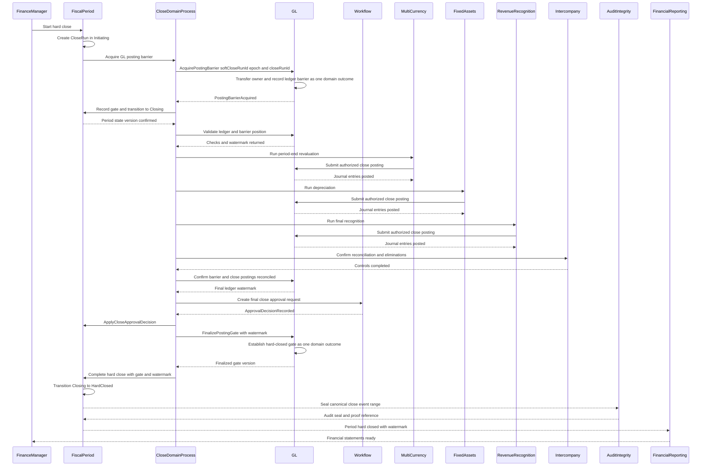
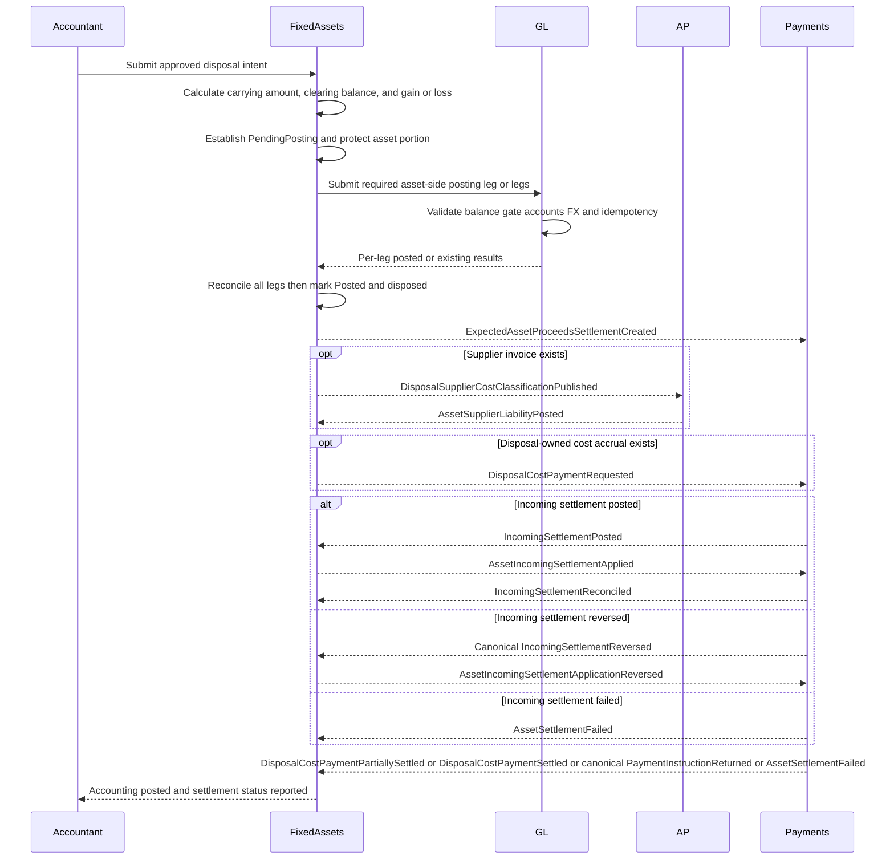

# Finance Domain Model & Use Cases — DDD Baseline

| Document-control field | Value |
|---|---|
| Version | 3.1 |
| Baseline date | 2026-07-24 |
| Status | Domain-complete DDD baseline |
| Scope | Finance domain concepts, bounded contexts, aggregates, invariants, domain services, commands, events, policies, lifecycle behavior, and domain acceptance criteria |
| Document owner | Finance Domain Architecture |

> **Purpose:** This document is a Domain-Driven Design artifact. It defines the finance domain's ubiquitous language, bounded contexts, ownership boundaries, aggregates, value objects, invariants, domain commands and events, business policies, lifecycle models, cross-context semantic contracts, and representative domain acceptance criteria.
>
> **Non-goals:** This document does not prescribe application architecture, APIs or transport protocols, database schemas or indexes, persistence technologies, messaging products, deployment topology, infrastructure, observability, performance targets, migrations, operational runbooks, release planning, or sprint readiness. Those concerns belong in separate solution-design and delivery artifacts.
>
> **Revision status:** Version 3.1 completes a checkpointed consistency review of the DDD baseline: it aligns incoming-settlement expiry transitions with the aggregate definition, assigns overall excess-allocation completion to Bank Feeds & Reconciliation rather than an undefined parent process, makes customer-refund failure recovery explicit, and adds a durable verification checkpoint and review-trigger policy.
>
> **Domain status:** All use cases and scenarios in Sections 6 and 7 satisfy the domain-completeness and traceability criteria in Section 13 and are approved as part of this DDD baseline.
>
> **Primary concerns addressed:** ledger and accounting-book ownership, accounting-scope-specific fiscal periods, aggregate scoping, accounting invariants, lifecycle states, posting semantics, idempotent business behavior, approval-time revalidation, period-control ownership, close and reopen recovery, receipt application and unapplication, fixed-asset accounting and settlement recovery, immutable correction semantics, cross-context clearing and cash ownership, authorization, failure recovery, privacy, scenario-specific accounting examples, concurrency rules, and domain acceptance coverage.

<a id="table-of-contents"></a>
## Table of Contents

Use these stable links to move directly to any major section, use case, scenario, or acceptance-criteria group.

- [Finance Domain Model \& Use Cases — DDD Baseline](#finance-domain-model--use-cases--ddd-baseline)
  - [Table of Contents](#table-of-contents)
  - [1. Bounded Context Map](#1-bounded-context-map)
    - [1.1 Entity Ownership and Context Boundaries](#11-entity-ownership-and-context-boundaries)
    - [1.2 Context Relationships](#12-context-relationships)
    - [1.3 Accounting Entry Ownership Matrix](#13-accounting-entry-ownership-matrix)
  - [2. Core Domain Entities, Value Objects, and Aggregates](#2-core-domain-entities-value-objects-and-aggregates)
    - [2.1 Organization \& Master Data](#21-organization--master-data)
    - [2.2 General Ledger](#22-general-ledger)
    - [2.3 Accounts Payable](#23-accounts-payable)
    - [2.4 Accounts Receivable](#24-accounts-receivable)
    - [2.5 Payroll](#25-payroll)
    - [2.6 Invoicing](#26-invoicing)
    - [2.7 Payments \& Cash Management](#27-payments--cash-management)
    - [2.8 Financial Reporting](#28-financial-reporting)
    - [2.9 Multi-Entity and Intercompany](#29-multi-entity-and-intercompany)
    - [2.10 Revenue Recognition](#210-revenue-recognition)
    - [2.11 Fixed Assets](#211-fixed-assets)
    - [2.12 Multi-Currency](#212-multi-currency)
    - [2.13 Fiscal Period Management](#213-fiscal-period-management)
    - [2.14 COA Segment Accounting](#214-coa-segment-accounting)
    - [2.15 Bank Feeds and Reconciliation](#215-bank-feeds-and-reconciliation)
    - [2.16 Tax Filing](#216-tax-filing)
    - [2.17 Workflow and Approvals](#217-workflow-and-approvals)
    - [2.18 Identity and Access](#218-identity-and-access)
    - [2.19 Audit Integrity](#219-audit-integrity)
  - [3. Aggregate Invariants](#3-aggregate-invariants)
    - [3.1 General Ledger Invariants](#31-general-ledger-invariants)
    - [3.2 AP and AR Invariants](#32-ap-and-ar-invariants)
    - [3.3 Fiscal Close Invariants](#33-fiscal-close-invariants)
    - [3.4 Intercompany Invariants](#34-intercompany-invariants)
    - [3.5 Revenue Recognition Invariants](#35-revenue-recognition-invariants)
    - [3.6 Fixed Asset Invariants](#36-fixed-asset-invariants)
    - [3.7 Payment Invariants](#37-payment-invariants)
    - [3.8 Cross-Context Event and Audit Invariants](#38-cross-context-event-and-audit-invariants)
  - [4. Aggregate Lifecycle Models](#4-aggregate-lifecycle-models)
    - [4.1 Journal Entry](#41-journal-entry)
    - [4.2 Vendor Invoice](#42-vendor-invoice)
    - [4.3 Customer Invoice](#43-customer-invoice)
    - [4.4 Fiscal Period](#44-fiscal-period)
    - [4.5 Payment Batch and Settlement](#45-payment-batch-and-settlement)
    - [4.6 Revenue Contract](#46-revenue-contract)
    - [4.7 Close Run](#47-close-run)
    - [4.8 Asset Disposal](#48-asset-disposal)
    - [4.9 Receipt Accounting and Adjustment Batches](#49-receipt-accounting-and-adjustment-batches)
  - [5. Domain Commands, Events, and Posting Contract](#5-domain-commands-events-and-posting-contract)
    - [5.1 Standard Posting Request](#51-standard-posting-request)
    - [5.2 Accounting Posting Responsibilities](#52-accounting-posting-responsibilities)
    - [5.3 Period Posting Gate Contract](#53-period-posting-gate-contract)
    - [5.4 Revenue Accounting Profile Contract](#54-revenue-accounting-profile-contract)
    - [5.5 Representative Commands, Events, and Reference Operations](#55-representative-commands-events-and-reference-operations)
  - [6. Use Case Scenario Walkthroughs](#6-use-case-scenario-walkthroughs)
    - [6.1 Period Close: Hard Close](#61-period-close-hard-close)
    - [6.2 Fiscal Period Reopen and Reclose](#62-fiscal-period-reopen-and-reclose)
    - [6.3 Intercompany Reconciliation and Settlement](#63-intercompany-reconciliation-and-settlement)
    - [6.4 Fixed Asset Disposal with Gain or Loss Recognition](#64-fixed-asset-disposal-with-gain-or-loss-recognition)
    - [6.5 Revenue Recognition for a SaaS Contract](#65-revenue-recognition-for-a-saas-contract)
    - [6.6 Journal Entry Posting and Reversal](#66-journal-entry-posting-and-reversal)
    - [6.7 Customer Receipt Recording with Partial Application](#67-customer-receipt-recording-with-partial-application)
  - [7. Domain-Complete Additional Scenario Catalog](#7-domain-complete-additional-scenario-catalog)
    - [7.1 Vendor Invoice Registration, Matching, Approval, Dispute, and Void](#71-vendor-invoice-registration-matching-approval-dispute-and-void)
    - [7.2 Payment Batch Approval, Submission, Retry, Partial Settlement, and Cancellation](#72-payment-batch-approval-submission-retry-partial-settlement-and-cancellation)
    - [7.3 Customer Credit, Refund, Overpayment, Chargeback, and Write-Off](#73-customer-credit-refund-overpayment-chargeback-and-write-off)
    - [7.4 Bank Statement Import, Matching, Unmatching, and Reconciliation](#74-bank-statement-import-matching-unmatching-and-reconciliation)
    - [7.5 Foreign-Currency Invoice Settlement and Realized FX](#75-foreign-currency-invoice-settlement-and-realized-fx)
    - [7.6 Period-End Revaluation, Rerun, and Next-Period Reversal](#76-period-end-revaluation-rerun-and-next-period-reversal)
    - [7.7 Full Fixed-Asset Lifecycle and Disposal Variants](#77-full-fixed-asset-lifecycle-and-disposal-variants)
    - [7.8 Revenue Modification, Renewal, Cancellation, Refund, and Variable Consideration](#78-revenue-modification-renewal-cancellation-refund-and-variable-consideration)
    - [7.9 Consolidation, Ownership Changes, Translation, Eliminations, and Rerun](#79-consolidation-ownership-changes-translation-eliminations-and-rerun)
    - [7.10 Tax Return Submission, Rejection, Amendment, Payment, and Evidence](#710-tax-return-submission-rejection-amendment-payment-and-evidence)
    - [7.11 Payroll Correction, Off-Cycle Run, Failed Payment, and Tax Amendment](#711-payroll-correction-off-cycle-run-failed-payment-and-tax-amendment)
    - [7.12 Period-Control Outage, Takeover, Cutoff, Exception Expiry, and Full Operational Reopen](#712-period-control-outage-takeover-cutoff-exception-expiry-and-full-operational-reopen)
    - [7.13 Cross-Context Event Interpretation, Ordering, and Replay](#713-cross-context-event-interpretation-ordering-and-replay)
    - [7.14 Concurrent Aggregate and Domain-Process Modification Rules](#714-concurrent-aggregate-and-domain-process-modification-rules)
    - [7.15 Audit Integrity Verification, Missing Evidence, Proof Mismatch, Verification-Credential Rotation, and Incident Escalation](#715-audit-integrity-verification-missing-evidence-proof-mismatch-verification-credential-rotation-and-incident-escalation)
  - [8. Authorization, Approval, and Segregation of Duties](#8-authorization-approval-and-segregation-of-duties)
    - [8.1 Required Access Dimensions](#81-required-access-dimensions)
    - [8.2 Minimum Segregation Rules](#82-minimum-segregation-rules)
    - [8.3 Emergency Access](#83-emergency-access)
  - [9. Consistency, Concurrency, and Recovery Rules](#9-consistency-concurrency-and-recovery-rules)
    - [9.1 Domain Consistency Boundaries](#91-domain-consistency-boundaries)
    - [9.2 Optimistic Concurrency](#92-optimistic-concurrency)
    - [9.3 Idempotency](#93-idempotency)
    - [9.4 Failure and Compensation](#94-failure-and-compensation)
  - [10. Effective Dating, Currency, and Precision](#10-effective-dating-currency-and-precision)
  - [11. Audit, Retention, and Privacy](#11-audit-retention-and-privacy)
    - [11.1 Audit Event Minimum Fields](#111-audit-event-minimum-fields)
    - [11.2 Retention and Legal Hold](#112-retention-and-legal-hold)
    - [11.3 Privacy and Secret Handling](#113-privacy-and-secret-handling)
  - [12. Domain Scope Exclusions](#12-domain-scope-exclusions)
  - [13. Domain Completeness and Traceability](#13-domain-completeness-and-traceability)
    - [13.1 Domain-Completeness Traceability](#131-domain-completeness-traceability)
      - [13.1.1 Additional Scenario Traceability](#1311-additional-scenario-traceability)
  - [14. Representative Acceptance Criteria](#14-representative-acceptance-criteria)
    - [14.1 GL Posting](#141-gl-posting)
    - [14.2 Fixed Asset Disposal](#142-fixed-asset-disposal)
    - [14.3 Hard Close](#143-hard-close)
    - [14.4 Accounting Ownership](#144-accounting-ownership)
    - [14.5 Scope and Published Contracts](#145-scope-and-published-contracts)
    - [14.6 Receipt Application Concurrency](#146-receipt-application-concurrency)
    - [14.7 Posting Currency Semantics](#147-posting-currency-semantics)
    - [14.8 Fiscal-Period Scope and Exclusivity](#148-fiscal-period-scope-and-exclusivity)
    - [14.9 Idempotent Event Handling and Duplicate Delivery](#149-idempotent-event-handling-and-duplicate-delivery)
    - [14.10 Fiscal Reopen and Reclose](#1410-fiscal-reopen-and-reclose)
    - [14.11 Intercompany Settlement](#1411-intercompany-settlement)
    - [14.12 Revenue Recognition](#1412-revenue-recognition)
    - [14.13 Additional Scenario Acceptance Criteria](#1413-additional-scenario-acceptance-criteria)
      - [14.13.1 Vendor Invoice](#14131-vendor-invoice)
      - [14.13.2 Payment Execution](#14132-payment-execution)
      - [14.13.3 Customer Adjustments](#14133-customer-adjustments)
      - [14.13.4 Bank Reconciliation](#14134-bank-reconciliation)
      - [14.13.5 FX Settlement](#14135-fx-settlement)
      - [14.13.6 Revaluation](#14136-revaluation)
      - [14.13.7 Fixed-Asset Lifecycle](#14137-fixed-asset-lifecycle)
      - [14.13.8 Revenue Modifications](#14138-revenue-modifications)
      - [14.13.9 Consolidation](#14139-consolidation)
      - [14.13.10 Tax Filing](#141310-tax-filing)
      - [14.13.11 Payroll Corrections](#141311-payroll-corrections)
      - [14.13.12 Period-Control Recovery](#141312-period-control-recovery)
      - [14.13.13 Cross-Context Event Handling](#141313-cross-context-event-handling)
      - [14.13.14 Concurrency Rules](#141314-concurrency-rules)
      - [14.13.15 Audit Integrity](#141315-audit-integrity)
  - [15. Domain Baseline Decision](#15-domain-baseline-decision)
  - [16. Verification Checkpoint and Review Policy](#16-verification-checkpoint-and-review-policy)
    - [Checks completed](#checks-completed)
    - [Version 3.1 corrections included in this checkpoint](#version-31-corrections-included-in-this-checkpoint)
    - [Review reuse rule](#review-reuse-rule)

<a id="section-1"></a>
## 1. Bounded Context Map

The finance domain is decomposed into bounded contexts with explicit ownership, published contracts, and independent domain rules. An aggregate is authoritative only inside its owning context. Other contexts hold identifiers or projections rather than modifying the source aggregate directly.

| Bounded Context | Classification | Core Responsibility | Authoritative Aggregates |
|---|---|---|---|
| **Organization & Master Data** | Supporting | Legal entities, parties, fiscal calendars, registrations, organization hierarchy | LegalEntity, Party, CustomerProfile, VendorProfile, FiscalCalendar |
| **General Ledger (GL)** | Core | Ledger and accounting-book configuration, chart of accounts, journal validation, posting, and authoritative posting admission | Ledger, AccountingBook, ChartOfAccounts, Account, JournalEntry, PeriodPostingGate |
| **Accounts Payable (AP)** | Core | Vendor invoices, matching against procurement snapshots, liabilities, payment requests | VendorInvoice, PaymentRequest |
| **Accounts Receivable (AR)** | Core | Customer invoices, receivable open items, receipts, credit notes, refunds, and collections balances | CustomerInvoice, ReceivableOpenItem, CustomerReceipt, CreditNote, CustomerRefundRequest |
| **Payroll** | Supporting | Payroll calculation, liabilities, deductions, payroll posting requests | PayrollRun, EmployeePayrollProfile, PayrollTaxFiling |
| **Invoicing** | Core | Billing schedules, usage and charge calculation, invoice generation | InvoiceTemplate, BillingSchedule, GeneratedInvoice |
| **Payments & Cash Management** | Supporting | Payment batches, bank accounts, outgoing payment execution and returns, expected non-customer incoming settlements, observed settlement receipts, unallocated incoming cash, cash posting, and reconciliation status | BankAccount, PaymentBatch, PaymentInstruction, PaymentReturn, ExpectedIncomingSettlement, SettlementReceipt, UnallocatedIncomingSettlement |
| **Financial Reporting** | Core | Financial statements, consolidation, report definitions and mappings | ReportDefinition, ConsolidationRun, FinancialStatement |
| **Multi-Entity / Intercompany** | Core | Intercompany agreements, reconciliation, netting, settlement and elimination instructions | IntercompanyAgreement, IntercompanyTransaction, SettlementRun, EliminationRun |
| **Revenue Recognition** | Core | ASC 606 or IFRS 15 assessment, allocation, contract balances and recognition schedules | RevenueContract, RevenueSchedule, ContractModification |
| **Fixed Assets** | Core | Asset acquisition, capitalization, depreciation, impairment, transfer and disposal | FixedAsset, DepreciationRun, ImpairmentAssessment, AssetDisposal |
| **Multi-Currency** | Core | FX-rate publication, translation, revaluation and realized or unrealized gain/loss calculation | CurrencyRateSet, RevaluationRun, TranslationRun |
| **Fiscal Period Management** | Core | Fiscal-period state authority, close orchestration, and scoped or operational reopen controls | FiscalPeriod, SoftCloseRun, CloseRun, ReopenRequest |
| **COA Segment Accounting** | Supporting | Segment definitions, combinations, assignments and effective-dated controls | SegmentDefinition, SegmentCombination, SegmentChangeRequest |
| **Bank Feeds & Reconciliation** | Supporting | Provider connections, statement ingestion, transaction matching and reconciliation | BankFeedConnection, BankStatement, ReconciliationSession |
| **Tax Filing** | Supporting | Tax determination inputs, returns, submissions, amendments, return-level adjustments, tax-payment obligations, and filing status | TaxConfiguration, TaxReturn, FilingSubmission, TaxAmendment, ReturnLevelTaxAdjustment, TaxPaymentObligation |
| **Workflow & Approvals** | Generic | Configurable approval policies, steps, decisions, delegation and escalation | ApprovalPolicy, ApprovalRequest, Delegation |
| **Identity & Access** | Generic | Users, roles, permissions, access scopes and segregation-of-duties controls | User, Role, AccessPolicy, SegregationRule |
| **Audit Integrity** | Supporting | Append-only audit evidence, integrity sealing, proof generation, verification, and incident lineage | AuditChain |

<a id="section-1-1"></a>
### 1.1 Entity Ownership and Context Boundaries

- **Ledger** and **AccountingBook** are aggregates owned by GL. A ledger identifies the legal-entity ledger, functional currency, and fiscal calendar. An accounting book identifies the accounting basis and posting policy within that ledger. Their identifiers and relationship are explicit in every ledger-bound `AccountingScope`.
- **ChartOfAccounts** and **Account** are owned by GL. `ChartOfAccounts` owns the account-code policy and version for a ledger; `Account` has stable identity, lifecycle, effective dates, posting restrictions, normal balance, currency policy, and reporting mappings. Account-code uniqueness is enforced within the effective chart-of-accounts scope.
- **FiscalPeriod** is owned only by Fiscal Period Management and is explicitly scoped by `AccountingScope`. A calendar period may therefore have separate accounting-period states for different ledgers or accounting books. GL, AP, AR, Payroll, Fixed Assets, Revenue Recognition, and other posting contexts reference the scoped `FiscalPeriodId` and consume period-state events. GL separately owns `PeriodPostingGate`, the local consistency boundary that authoritatively admits or rejects ledger postings for the same accounting scope and period.
- **JournalEntry** is created, validated, posted, and reversed only by GL. No subledger directly creates or modifies a journal entry. Audit Integrity records integrity evidence for the related audit-event history rather than modifying the journal entry.
- Subledgers send a versioned **PostingRequest** to GL. GL returns `JournalEntryPosted`, `PostingRejected`, `PostingPendingApproval`, or `IdempotencyConflict` according to the validated outcome.
- **GeneratedInvoice** is owned by Invoicing. A finalized generated invoice is translated into an AR command such as `IssueCustomerInvoice` through a published contract or anti-corruption layer.
- **VendorInvoice** and **CustomerInvoice** are separate aggregates and do not inherit from a shared invoice entity. Common document-formatting or calculation concepts do not imply a shared invoice aggregate.
- **CustomerProfile**, **VendorProfile**, and **LegalEntity** are mastered in Organization & Master Data. Business contexts reference their identifiers and keep only necessary immutable snapshots.
- **CurrencyRateSet** is mastered by Multi-Currency. Other bounded contexts reference the rate-set identifier, source, rate type, timestamp, and version used in each calculation.
- **Credentials and bank tokens are not domain values.** `BankFeedConnection` retains only a secret reference, consent metadata, provider connection identifier, and token-expiry information.
- **Approval decisions** are owned by Workflow & Approvals through `DecideApprovalRequest`. Business contexts do not decide their own approvals; they consume the immutable decision and execute an `Apply...ApprovalDecision` command that revalidates the current business state before changing the aggregate lifecycle. Business aggregates retain the approval-request identifier, decision identifier, policy version, and applied-decision version.
- **PaymentInstruction** is an independent aggregate because provider submission, retry, partial settlement, cancellation, exception resolution, and provider return can change independently and concurrently. Each **PaymentReturn** references one instruction. Its provider-return observation and amount are immutable, while the aggregate owns the return lifecycle; the instruction owns cumulative returned and net-settled balances and enforces that active returns net of linked reversals never exceed gross settlement. `PaymentBatch` holds instruction identifiers and approved versions rather than owning mutable instruction entities.
- **ExpectedIncomingSettlement** owns the authorized incoming amount and cumulative received and reconciled balances for one non-customer obligation. Each **SettlementReceipt** represents one observed bank allocation and references exactly one expectation. Its observation identity, amount, and evidence are immutable, while the aggregate owns validation, posting, owner-application, reconciliation, and reversal state. Allocation never exceeds the expectation remaining amount; any excess bank allocation remains a separately owned **UnallocatedIncomingSettlement** exception until resolved, refunded, reclassified, or applied to a newly approved expectation.
- **ReceiptApplication** is owned by the AR `ReceivableOpenItem` aggregate because that aggregate is authoritative for the invoice amount still available to apply. `CustomerReceipt` owns the receipt amount and unapplied amount and stores immutable application references. `ApplyReceipt` is a domain service that validates the receipt and all affected open items and establishes one all-or-nothing application outcome.
- **PerformanceObligation** is an entity inside `RevenueContract`; it is not an independent aggregate root.
- **AuditEvent** and **AuditSeal** are append-only records in an `AuditChain`, not independently mutable aggregates.
- **AccountingScope** identifies tenant, legal entity, ledger, accounting book, and functional currency. Every ledger-bound aggregate, posting request, and close or posting-control command carries this scope explicitly. Cross-entity orchestration aggregates carry immutable participant-scope or consolidation-scope references; scope is never inferred solely from ambient tenant context or legal entity. A legal entity may have more than one ledger or accounting book.
- AP does not master procurement. It references immutable purchase-order and receipt snapshots supplied by an external or separately scoped Procurement context.

<a id="section-1-2"></a>
### 1.2 Context Relationships

| Upstream Context | Downstream Context | Relationship | Published Contract | Consistency |
|---|---|---|---|---|
| Organization & Master Data | All business contexts | Published language | Master-data events and authoritative reference contract | Eventual propagation with immediate authoritative validation for critical commands |
| Invoicing | AR | Customer-supplier | `InvoiceFinalized`, `IssueCustomerInvoice` | Idempotent handoff with eventual downstream state |
| Revenue Recognition | AR | Published language | `RevenueAccountingProfilePublished`, versioned profile reference contract | Immutable versioned classification required before invoice accounting |
| AP, AR, Payroll, Payments & Cash Management, Fixed Assets, Revenue Recognition, Multi-Currency, Multi-Entity / Intercompany | GL | Customer-supplier | `PostingRequest`, `JournalEntryPosted`, `PostingRejected`, `PostingPendingApproval`, `IdempotencyConflict` | Idempotent cross-context handoff with command-fingerprint validation |
| Fiscal Period Management | GL and all posting contexts | Orchestrated customer-supplier | `EnterSoftCloseGate`, `ExitSoftCloseGate`, `AcquirePostingBarrier`, `ReleasePostingBarrier`, `FinalizePostingGate`, `GetPostingGateStatus`, `OpenScopedReopenGate`, `CloseScopedReopenGate`, `OpenOperationalReopenGate`, `CloseOperationalReopenGate`, `BeginRecloseGate`, `PeriodStateChanged` | Immediate authoritative GL gate decisions with eventual period-state propagation |
| Multi-Currency | GL, Financial Reporting, Multi-Entity / Intercompany, AP, AR | Published language | `RateSetPublished`, `TranslationResultPublished`, versioned rate and translation-result reference contracts | Immutable versioned rates and translation calculations |
| GL | Financial Reporting | Customer-supplier | `JournalEntryPosted`, `JournalEntryReversed`, ledger reference model | Eventual with immutable history suitable for reconstruction |
| Fixed Assets | AP | Customer-supplier | `AssetAcquisitionClearingPublished`, `DisposalSupplierCostClassificationPublished` | Idempotent classification handoff with immutable clearing references |
| AP | Fixed Assets | Published language | `AssetSupplierLiabilityPosted`, `AssetSupplierLiabilityReversed` | Eventual, versioned and reconciled by clearing identifier |
| Fixed Assets | Payments & Cash Management | Customer-supplier | `ExpectedAssetProceedsSettlementCreated`, `DisposalCostPaymentRequested`, `DisposalCostPaymentReplacementRequested`, `AssetIncomingSettlementApplied`, `AssetIncomingSettlementApplicationRejected`, `AssetIncomingSettlementApplicationReversed`, `PaymentReturnApplied` | Idempotent obligation handoff plus owner acknowledgement |
| Payments & Cash Management | Fixed Assets | Published language | `ExpectedIncomingSettlementRegistered`, `IncomingSettlementPosted`, `IncomingSettlementAwaitingOwnerAcknowledgement`, `IncomingSettlementReconciled`, canonical `IncomingSettlementReversed` with asset-proceeds classification, `DisposalCostPaymentPartiallySettled`, `DisposalCostPaymentSettled`, canonical `PaymentInstructionReturned` with disposal-cost classification, `AssetSettlementFailed` | Eventual and reconciled by expectation, receipt, instruction, or return reference |
| Payments & Cash Management | AP, AR, Fixed Assets, Intercompany, Tax Filing, Payroll, Bank Feeds & Reconciliation | Customer-supplier | Outgoing payment status, expected-incoming registration, observed receipt, posted-cash, acknowledgement, reconciliation, return, and reversal events | Eventual with explicit owning-context acknowledgement |
| AP, Intercompany, Tax Filing | Payments & Cash Management | Published language | `IncomingSettlementApplied`, `IncomingSettlementApplicationRejected`, `IncomingSettlementApplicationReversed` | Eventual acknowledgement with expected versions and clearing reference |
| AP, AR, Fixed Assets, Intercompany, Tax Filing, Payroll | Payments & Cash Management | Published language | `PaymentReturnApplied`, `PaymentReturnApplicationRejected`, `PaymentInstructionExceptionDecisionRecorded` | Eventual return acknowledgement and owner-controlled exception decision with instruction, amount, owner aggregate and version, approval and accounting or replacement evidence |
| AR | Payments & Cash Management | Customer-supplier | `CustomerRefundPaymentRequested`, `CustomerRefundPaymentCancellationRequested`, `CustomerRefundPaymentReplacementRequested` | Idempotent obligation handoff with eventual settlement-state propagation |
| Payments & Cash Management | AR | Published language | `CustomerRefundPartiallySettled`, `CustomerRefundSettled`, `CustomerRefundFailed`, `CustomerRefundRemainderCancelled`, canonical `PaymentInstructionReturned` with customer-refund classification | Eventual, monotonic and reconciled by refund, instruction, and return reference |
| Bank Feeds & Reconciliation | AR, AP, Payments & Cash Management | Anti-corruption layer | Normalized bank transaction and match events | Eventual and idempotent |
| External or separately scoped Procurement | AP | Anti-corruption layer | Immutable purchase-order and receipt snapshots | Eventual, versioned and validated during matching |
| Tax Filing | Invoicing, AP, AR | Published language | `TaxDeterminationRequest`, `TaxDetermined`, versioned tax-rule reference contract | Finalization requires an authoritative tax determination; unresolved determinations block finalization |
| Workflow & Approvals | Business contexts | Generic service | Approval request and decision events | Eventual, with commands blocked until approved |
| All contexts | Audit Integrity | Published language | `AuditableEvent` | Append-only evidence with eventual integrity status |

Fixed Assets clearing and settlement contracts carry the immutable clearing or settlement identifier, accounting scope, amount, currency, source aggregate and version, idempotency reference, and correlation and causation identifiers. AP and Payments reject changed business content under the same identifier and return typed results that preserve the original clearing reference. For incoming cash, Payments publishes `IncomingSettlementPosted`; the owning context applies the amount to its clearing obligation and publishes a typed `...IncomingSettlementApplied` acknowledgement; Payments then records reconciliation through `AcknowledgeIncomingSettlement`. AR refund contracts carry the immutable refund request, all payment-instruction and clearing-leg references, customer-receipt or credit reference, authorized amount, gross settlement, returned amount, net settlement, cancelled and remaining amounts, currency, source version, and fingerprint-validated idempotency identities. AR remains authoritative for refund eligibility, refund payable and clearing; Payments remains authoritative for provider execution, returns, and bank cash. Outgoing payment returns use `PaymentInstructionReturned` followed by an owning-context `PaymentReturnApplied` acknowledgement and Payments-side `AcknowledgePaymentReturn` reconciliation.

<a id="section-1-3"></a>
### 1.3 Accounting Entry Ownership Matrix

Each business accounting event has exactly one subledger producer. Other contexts may provide calculations or classification instructions, but they do not submit a duplicate posting for the same accounting effect.

| Accounting Effect | Owning Producer | Clarification |
|---|---|---|
| Customer invoice and receivable recognition | AR | Invoicing finalizes the commercial document; AR owns the receivable and billing posting. |
| Scheduled revenue recognition and contract-balance reclassification | Revenue Recognition | Revenue Recognition does not repost the receivable created by AR. |
| Vendor invoice and liability recognition | AP | Procurement information is consumed as immutable matching evidence. |
| Customer receipt, unapplied cash, application, unapplication and customer-refund obligation | AR | Bank Feeds & Reconciliation supplies normalized bank evidence; AR owns receipt, application and unapplication accounting, refund eligibility, refund payable, and reclassification to payment settlement clearing. Payments owns only the external refund bank-cash leg. |
| Bank cash settlement of outgoing payment instructions and expected non-customer incoming settlements | Payments & Cash Management | The obligation-owning context reclassifies its payable or receivable to settlement clearing when required. Payments owns the `ExpectedIncomingSettlement`, each observed `SettlementReceipt`, and only the bank-cash leg. Ordinary customer remittances remain AR-owned `CustomerReceipt` flows. |
| Payroll expense and payroll liabilities | Payroll | Payment execution can be delegated to Payments without transferring payroll calculation ownership. |
| Asset capitalization, depreciation, impairment and disposal | Fixed Assets | Fixed Assets owns asset cost, accumulated depreciation or impairment, disposal gain or loss, and asset-specific acquisition, proceeds, or disposal-cost clearing. It never creates a supplier liability or bank-cash entry; AP owns supplier liabilities and Payments owns bank cash. |
| FX revaluation adjustments and translation calculation results | Multi-Currency | Multi-Currency owns immutable rate evidence, revaluation calculations and postings, and versioned translation results; it does not own customer-receipt cash, payment cash, or consolidation-workspace records. |
| Realized FX on invoice settlement | AR for customer receipts; AP for vendor settlements | The invoice-owning subledger calculates and posts realized FX using immutable cash-settlement and rate evidence. AR also owns customer-receipt cash; Payments owns bank cash for AP payment instructions. |
| Consolidation-workspace translated balances and CTA records | Financial Reporting | Reporting consumes versioned `TranslationResult` data from Multi-Currency and owns translated balances, CTA, and consolidation records. Statutory GL is unchanged unless a separate consolidation-ledger posting contract is approved. |
| Intercompany residuals, netting and settlement-clearing reclassifications | Intercompany | Intercompany reclassifies due-to and due-from balances to outgoing or incoming settlement clearing, applies posted incoming settlements to its clearing obligation, and acknowledges the application. Payments owns the corresponding `PaymentInstruction`, `ExpectedIncomingSettlement`, `SettlementReceipt`, and bank-cash legs. |
| Consolidation elimination records | Financial Reporting | Intercompany publishes versioned elimination instructions. Reporting owns consolidation elimination records and does not modify statutory GL unless a separately approved consolidation-ledger posting contract applies. |
| Return-level tax adjustments | Tax Filing | Source subledgers correct transaction-level tax. Tax Filing alone produces approved return-level adjustment postings; GL originates only separately authorized manual tax journals. |
| Manual journals and all final ledger records | GL | GL validates and records; it does not originate subledger business facts. |

<a id="section-2"></a>
## 2. Core Domain Entities, Value Objects, and Aggregates

**Shared accounting value object:** `AccountingScope(TenantId, LegalEntityId, LedgerId, AccountingBookId, FunctionalCurrency)`. Ledger-bound aggregates and commands use this value object rather than relying on ambient request or tenant context. Cross-entity runs use immutable `ParticipantScope` or `ConsolidationScope` references that contain the applicable accounting-scope identifiers.

**Shared approval value object:** `ApprovalDecisionReference(ApprovalRequestId, DecisionId, PolicyVersion, DecisionVersion, AppliedSubjectVersion, DecidedAt, AppliedAt)`. An aggregate in `PendingApproval` may retain only its `ApprovalRequestId`; after `Apply...ApprovalDecision` succeeds, it retains the complete immutable decision reference and the business version against which it was applied.

**Shared period-control value objects:** `ActiveGateAdmissionCounters(ControlOwnerType, ControlOwnerId, ControlOwnerEpoch, ClosePostingAdmitted, ReopenPostingAdmitted, AdmittedPostingCount, FirstAdmittedLedgerPosition, LastAdmittedLedgerPosition)` is the mutable GL-owned counter set updated during journal append. `FrozenGateAdmissionSummary(ControlOwnerType, ControlOwnerId, ControlOwnerEpoch, ClosePostingAdmitted, ReopenPostingAdmitted, AdmittedPostingCount, FirstAdmittedLedgerPosition, LastAdmittedLedgerPosition, FrozenAtGateVersion, FrozenByCommandFingerprint, FrozenByCommandType)` is the immutable ownership-boundary result returned by GL and retained by Fiscal Period Management. `ControlOwnerType` is `SoftCloseRun`, `CloseRun`, or `ReopenRequest`; `ControlOwnerEpoch` is mandatory for a soft-close epoch and null for non-epoch owners.

<a id="section-2-1"></a>
### 2.1 Organization & Master Data

- **Aggregate Root: LegalEntity**
  - Entities: Registration, EntityAddress, OwnershipInterest
  - Value Objects: LegalEntityId, LegalName, FunctionalCurrency, PresentationCurrency, TaxRegistrationId, EffectiveDateRange
- **Aggregate Root: Party**
  - Entities: ContactMethod, Address, BankDetailReference
  - Value Objects: PartyId, PartyType, TaxIdentifier, PartyStatus
- **Aggregate Root: CustomerProfile**
  - Value Objects: CustomerId, PartyId, CreditTerms, CreditLimit, BillingPreference, TaxTreatment
- **Aggregate Root: VendorProfile**
  - Value Objects: VendorId, PartyId, PaymentTerms, WithholdingTreatment, RemittancePreference
- **Aggregate Root: FiscalCalendar**
  - Entities: CalendarPeriod
  - Value Objects: CalendarId, CalendarType, PeriodPattern

<a id="section-2-2"></a>
### 2.2 General Ledger

- **Aggregate Root: Ledger**
  - Value Objects: LedgerId, LegalEntityId, LedgerType, FunctionalCurrency, FiscalCalendarId, LedgerStatus, EffectiveDateRange
- **Aggregate Root: AccountingBook**
  - Value Objects: AccountingBookId, LedgerId, BookType, AccountingBasis, PostingPolicyVersion, BookStatus, EffectiveDateRange
- **Aggregate Root: ChartOfAccounts**
  - Value Objects: ChartOfAccountsId, LedgerId, AccountCodePolicy, Version, EffectiveDateRange
- **Aggregate Root: Account**
  - Entities: AccountReportingMapping, AccountRestriction
  - Value Objects: AccountId, ChartOfAccountsId, AccountCode, AccountName, AccountType, NormalBalance, AccountStatus, CurrencyPolicy, EffectiveDateRange
- **Aggregate Root: JournalEntry**
  - Entities: JournalEntryLine
  - Value Objects: JournalEntryId, JournalNumber, AccountingScope, PostingDate, FiscalPeriodId, PeriodStateVersion, PostingGateVersion, PostingPurpose, SourceReference, TransactionMoney, FunctionalMoney, LineCurrencyMode, DebitCredit, SegmentCombinationId, IdempotencyKey, ApprovalRequestId, ApprovalDecisionReference, ReversalOfJournalEntryId
- **Aggregate Root: PeriodPostingGate**
  - Value Objects: FiscalPeriodId, AccountingScope, GateMode, GateVersion, ActiveSoftCloseRunId, SoftClosePolicyVersion, ActiveCloseRunId, ActiveReopenRequestId, ActiveCloseType, PriorControlProcessId, PriorControlProcessType, PriorControlEpoch, PriorGateMode, ActiveSoftCloseControlEpoch, BarrierLedgerPosition, FinalLedgerWatermark, FinalizedCloseRunId, FinalizationCommandFingerprint, AuthorizationScope, AuthorizationExpiry, ControlAuthorityEpoch, ActiveGateAdmissionCounters, LastFrozenAdmissionSummary, FrozenAdmissionSummaryHistoryReference
  - `GateMode` is `Open`, `SoftClosePolicy`, `CloseOnly`, `HardClosed`, `ScopedReopen`, or `OperationalReopen`. GL changes and validates this gate in the same domain consistency boundary used to append journal entries. Every ownership acquisition initializes `ActiveGateAdmissionCounters` for the new process. Every release, closure, handoff, or finalization freezes those counters into a `FrozenGateAdmissionSummary`, stores it as `LastFrozenAdmissionSummary`, retains the command result in immutable history keyed by command fingerprint, and returns it to Fiscal Period Management. Authorized close or reopen journal append updates only the active counters. Fiscal Period Management orchestrates gate commands and stores frozen summaries but does not write the gate directly.
  - On hard-close finalization, GL retains as authoritative domain state the finalized close-run identifier, canonical finalization-command fingerprint, final ledger watermark, and resulting gate version for idempotent retry and interruption recovery. The active control-owner reference is cleared only after the finalized state is recorded as authoritative domain state.
`JournalEntry` statuses are `Draft`, `PendingApproval`, `Posted`, and `Cancelled`. Posted journal entries, including their recorded status and lines, are immutable. A reversal is a separate posted journal entry carrying `ReversalOfJournalEntryId`; whether the original is displayed as reversed is derived in a query or reporting projection and is not a mutation of the original aggregate. A rejected `PostingRequest` does not create a journal entry; rejection is a posting-attempt outcome.

<a id="section-2-3"></a>
### 2.3 Accounts Payable

- **Aggregate Root: VendorInvoice**
  - Entities: VendorInvoiceLine, MatchResult, InvoiceTaxLine
  - Value Objects: VendorInvoiceId, AccountingScope, VendorId, SupplierInvoiceNumber, InvoiceDate, DueDate, PaymentTerms, InvoiceStatus, Money, PurchaseOrderReference, ReceiptReference, ProcurementSnapshotVersion, DuplicateFingerprint, ApprovalRequestId, ApprovalDecisionReference
- **Aggregate Root: PaymentRequest**
  - Entities: PaymentAllocation with VendorInvoiceId, RequestedAmount, and AllocationReference
  - Value Objects: PaymentRequestId, AccountingScope, RequestedDate, BankAccountId, PaymentCurrency, TotalRequestedAmount, PaymentRequestStatus, Version

A `PaymentRequest` may contain one or more invoice allocations in the same accounting scope and payment currency. A request for one invoice contains one `PaymentAllocation`; invoice identity and allocated amount are not duplicated as singular root fields. The root total must equal the sum of its allocations.

AP stores purchase-order and receipt references plus the immutable snapshot version used for matching. It does not create or modify procurement orders or receipts.

<a id="section-2-4"></a>
### 2.4 Accounts Receivable

- **Aggregate Root: CustomerInvoice**
  - Entities: CustomerInvoiceLine, InvoiceTaxLine
  - Value Objects: CustomerInvoiceId, AccountingScope, CustomerId, DueDate, PaymentTerms, InvoiceStatus, Money, BillingReference, ReceivableOpenItemId
- **Aggregate Root: ReceivableOpenItem**
  - Entities: ReceiptApplication; ReceiptApplicationAdjustment with AdjustmentId, ApplicationId, UnapplicationBatchId, AdjustmentVersion, AdjustedAmount, ReasonCode, and CreatedAt; ReceiptApplicationRollback with RollbackId, ApplicationId, ApplicationBatchId, RollbackVersion, RolledBackAmount, ReasonCode, and CreatedAt
  - Value Objects: ReceivableOpenItemId, AccountingScope, CustomerInvoiceId, Currency, OriginalAmount, OpenAmount, OpenItemStatus, Version
- **Aggregate Root: CustomerReceipt**
  - Entities: ReceiptApplicationReference with ApplicationId, ReceivableOpenItemId, ApplicationBatchId, ApplicationVersion, and AppliedAmount; ReceiptApplicationBatch with ApplicationBatchId, BatchVersion, TotalAppliedAmount, ApplicationAccountingStatus, ApplicationPostingReference, PostingCancellationEvidence, and RollbackReferenceIds; ReceiptUnapplicationBatch with UnapplicationBatchId, BatchVersion, OriginalApplicationBatchIds, TotalUnappliedAmount, UnapplicationAccountingStatus, and UnapplicationPostingReference
  - Value Objects: ReceiptId, AccountingScope, CustomerId, ReceiptDate, Money, AppliedAmount, UnappliedAmount, BankTransactionReference, ReceiptAccountingStatus, ReceiptPostingReference
- **Aggregate Root: CreditNote**
  - Entities: CreditNoteLine
  - Value Objects: CreditNoteId, AccountingScope, CustomerInvoiceId, ReasonCode, Money
- **Aggregate Root: CustomerRefundRequest**
  - Entities: RefundPaymentInstructionReference, RefundClearingPostingLeg, RefundSettlementReference, RefundReturnReference
  - Value Objects: CustomerRefundRequestId, AccountingScope, CustomerId, SourceReceiptId, SourceCreditNoteId, AuthorizedMoney, GrossSettledMoney, ReturnedMoney, NetSettledMoney, CancelledMoney, RemainingMoney, RefundStatus, ApprovalRequestId, ApprovalDecisionReference, ClearingPostingRequestIds, ClearingJournalEntryIds, PaymentInstructionIds, ActivePaymentInstructionId, ReturnCorrectionReferences, FailureReason, Version
  - Each `RefundClearingPostingLeg` retains its leg type, stable posting request identifier, request fingerprint, posting status, journal reference, failure reason, and posting-cancellation evidence. `AuthorizedMoney = NetSettledMoney + CancelledMoney + RemainingMoney` and `NetSettledMoney = GrossSettledMoney - ReturnedMoney`. Gross settlement, cancellation and posted-return totals are monotonic; `RemainingMoney` increases only after the linked AR clearing-to-refund-payable return-correction leg has an authoritative posted result. `RefundStatus` is `Draft`, `PendingApproval`, `Approved`, `Rejected`, `ClearingPostingPending`, `PaymentRequested`, `PartiallySettled`, `Settled`, `Failed`, `Cancelled`, `PartiallySettledCancelled`, `ReturnCorrectionPending`, `ReturnCorrectionPostingFailed`, `ReturnCorrectionException`, or `Returned`. `Cancelled` requires zero gross settlement for the cancelled payment path, while `PartiallySettledCancelled` requires positive gross settlement and cancellation of the unpaid remainder. `Failed` is nonterminal and may return to `PaymentRequested` through an approved retry or linked replacement instruction without reversing the refund authorization or existing clearing leg. `Returned` is nonterminal and may move to `PaymentRequested` through a new linked clearing leg and replacement instruction. AR creates the refund obligation and each payment-settlement-clearing leg before publishing a corresponding request. Prior instructions, clearing legs, settlements and returns remain immutable.

`ReceiptApplication` is an immutable fact created only within its owning `ReceivableOpenItem`. The `ApplyReceipt` domain service validates both receipt availability and invoice open amounts and establishes the receipt, open-item, application, and balance changes as one all-or-nothing domain outcome. All allocations established by one `ApplyReceipt` command belong to one immutable allocation set identified by `ApplicationBatchId`. The allocation references remain immutable facts; the related `ReceiptApplicationBatch` owns the versioned posting state and journal reference for exactly one application-accounting request.

`UnapplyReceipt` never edits or deletes an original `ReceiptApplication`. It creates immutable `ReceiptApplicationAdjustment` records on the affected open items and one `ReceiptUnapplicationBatch` on the receipt. The unapplication batch owns exactly one versioned reversal or compensating-posting result. Cumulative adjustments against an application cannot exceed its original applied amount. `RecordReceipt`, `ApplyReceipt`, and `UnapplyReceipt` have separate, ordered accounting effects: receipt recording normally debits cash and credits unapplied cash; application debits unapplied cash and credits receivables; unapplication restores receivables and unapplied cash without reversing the original bank-cash effect. Application is admitted only after receipt-recording accounting is posted. `CustomerInvoice` exposes open and applied balances as projections of its receivable open item.

<a id="section-2-5"></a>
### 2.5 Payroll

- **Aggregate Root: PayrollRun**
  - Entities: EmployeePayrollLine, EmployerTaxLine, DeductionLine
  - Value Objects: PayrollRunId, AccountingScope, PayPeriod, GrossPay, Deduction, NetPay, TaxWithholding, PayrollStatus, ApprovalRequestId, ApprovalDecisionReference
- **Aggregate Root: EmployeePayrollProfile**
  - Value Objects: EmployeeId, LegalEntityId, PayGroup, TaxProfileReference, PaymentMethodReference
- **Aggregate Root: PayrollTaxFiling**
  - Entities: PayrollTaxLine
  - Value Objects: FilingId, TaxPeriod, JurisdictionId, FilingStatus

<a id="section-2-6"></a>
### 2.6 Invoicing

- **Aggregate Root: InvoiceTemplate**
  - Entities: TemplateLineItem
  - Value Objects: TemplateId, BillingFrequency, ChargeRule, TaxCategory, PaymentMethod
- **Aggregate Root: BillingSchedule**
  - Entities: ScheduledCharge
  - Value Objects: BillingScheduleId, AccountingScope, CustomerId, ContractReference, NextBillingDate, ScheduleStatus
- **Aggregate Root: GeneratedInvoice**
  - Entities: GeneratedInvoiceLine
  - Value Objects: GeneratedInvoiceId, AccountingScope, CustomerId, InvoiceVersion, Money, GenerationSource, IdempotencyKey

<a id="section-2-7"></a>
### 2.7 Payments & Cash Management

- **Aggregate Root: BankAccount**
  - Value Objects: BankAccountId, LegalEntityId, MaskedAccountNumber, Currency, BankIdentifier, AccountStatus
- **Aggregate Root: PaymentBatch**
  - Entities: PaymentInstructionReference
  - Value Objects: PaymentBatchId, AccountingScope, PaymentMethod, ExecutionDate, ControlTotalsByCurrency, InstructionIds, BatchStatus, BatchOutcome, ApprovalRequestId, ApprovalDecisionReference
  - `BatchStatus` is `Draft`, `PendingApproval`, `Approved`, `Submitted`, `InProgress`, `Completed`, `Cancelled`, `Rejected`, or `Failed`. `BatchOutcome` is empty before completion and is exactly one of `FullySettled`, `FullyCancelled`, `PartiallySettledCancelled`, or `CompletedWithExceptions` when `BatchStatus = Completed`. `Cancelled` is used only when `CancelPaymentBatch` succeeds before any instruction is provider-submitted. After provider submission begins, terminal instruction mixtures are represented by `Completed` plus outcome; a batch whose submitted instructions are all later cancelled completes with `BatchOutcome = FullyCancelled`.
- **Aggregate Root: PaymentInstruction**
  - Entities: SettlementAttemptReference, PaymentReturnReference, InstructionExceptionResolutionReference
  - Value Objects: PaymentInstructionId, PaymentBatchId, AccountingScope, BankAccountId, BeneficiaryReference, AuthorizedMoney, SettledMoney, ReservedReturnMoney, PostedReturnMoney, ReversedReturnMoney, ReconciledReturnMoney, NetSettledMoney, CancelledMoney, RemainingMoney, RemittanceReference, ExecutionStatus, ExceptionOutcome, ExceptionDecisionReference, ProviderAttempts, FailureReason, Version
- **Aggregate Root: PaymentReturn**
  - Value Objects: PaymentReturnId, OriginalPaymentInstructionId, AccountingScope, ProviderReturnKey, ReturnedMoney, ReturnReason, ReturnStatus, ReturnExceptionOutcome, ProviderEvidenceReference, PostingRequestId, JournalEntryId, PostingCancellationEvidence, ReservationRollbackReference, ReturnReversalReference, OwnerAggregateReference, OwnerApplicationReference, ExceptionResolutionReference, FailureReason, Version
  - A `PaymentReturn` is a linked correction aggregate for bank funds returned after an outgoing instruction settled. Its provider-return key, observed amount, reason, and provider evidence are immutable; lifecycle and reconciliation state may advance without editing the original provider settlement. `ReturnStatus` is `Observed`, `Validated`, `ValidationRejected`, `PostingPending`, `AwaitingOwnerAcknowledgement`, `Exception`, `AcceptedException`, `PostingFailed`, `CancellingNoJournal`, `CancelledNoJournal`, `ReversalPending`, `ReversalFailed`, `Reversed`, or `Reconciled`. `PaymentReturnPosted` is a posting milestone event; after that milestone the stable aggregate status is `AwaitingOwnerAcknowledgement`, not a second `Posted` lifecycle state. `PostingFailed` is restricted to failure before any return-cash journal exists and may retry or follow the evidence-backed no-journal cancellation path. `ReturnExceptionOutcome` is one of `CorrectedOwnerApplication`, `ApprovedOwnerReclassification`, `AcceptedReturnException`, or `ReturnRejectedWithReversal`; each outcome records immutable evidence and an explicit resulting state. `ReturnRejectedWithReversal` is valid only for a posted, unreconciled return and reaches `Reversed` only after the linked bank-cash reversal is authoritative.
  - `ReturnReversalReference` retains the stable reversal posting identity, request fingerprint, authoritative journal reference, reversal reason, and resulting reversal status.
- **Aggregate Root: ExpectedIncomingSettlement**
  - Entities: SettlementReceiptReference, ExpectationAllocationRollbackReference, ExpectationResolutionReference
  - Value Objects: ExpectedIncomingSettlementId, AccountingScope, SourceContext, SourceAggregateReference, ClearingReference, ExpectedMoney, ReceivedMoney, ReconciledMoney, RemainingMoney, ExpectationStatus, AllocationTolerancePolicyVersion, ExpiresAt, ExceptionReason, Version
- **Aggregate Root: UnallocatedIncomingSettlement**
  - Value Objects: UnallocatedIncomingSettlementId, AccountingScope, BankAccountId, BankTransactionReference, BankTransactionAllocationReference, ObservedMoney, CandidateExpectationId, SuspenseClearingReference, PostingStatus, PostingRequestId, JournalEntryId, ExceptionReason, ResolutionStatus, ResolutionPostingReference, ResolutionReference, Version
  - `PostingStatus` is `NotRequested`, `PostingPending`, `Posted`, or `PostingFailed`; retry reuses the stable posting identifier. `ResolutionStatus` is `Open`, `AllocatedToNewExpectation`, `RefundRequested`, `Reclassified`, or `Closed`. Payments posts the excess bank amount exactly once as `Dr Cash / Cr Unallocated incoming cash clearing` before business resolution. Resolution moves or refunds the suspense balance through a linked authoritative posting; an excess amount is never forced into an expectation or represented by negative remaining money.
- **Aggregate Root: SettlementReceipt**
  - Value Objects: SettlementReceiptId, ExpectedIncomingSettlementId, AccountingScope, BankAccountId, BankTransactionReference, BankTransactionAllocationReference, ObservedMoney, ValidationStatus, PostingStatus, OwnerApplicationStatus, ReconciliationStatus, ProviderEvidenceVersion, CorrelationReference, PostingRequestId, JournalEntryId, PostingCancellationEvidence, AllocationRollbackReference, ReversalReference, Version

`ExecutionStatus` is `Prepared`, `Submitted`, `Acknowledged`, `PartiallySettled`, `Settled`, `Failed`, `ExceptionPending`, `ExceptionResolved`, `CancelPending`, `Cancelled`, or `PartiallySettledCancelled`. `ExceptionOutcome` is empty unless status is `ExceptionResolved` and is one of `CancelledRemainder`, `ReplacementObligationCreated`, `AcceptedUnpaidException`, or `WrittenOffUnderPolicy`. Payments may apply an exception outcome only from an immutable owning-context `PaymentInstructionExceptionDecisionRecorded` reference that identifies the exact amount, owner aggregate and version, approval evidence, replacement obligation or accounting reference where applicable. A payment instruction is independently versioned because provider submission, retry, partial settlement, cancellation, terminal exception resolution, and provider return may occur at different times. `AuthorizedMoney = SettledMoney + CancelledMoney + RemainingMoney`, `NetSettledMoney = SettledMoney - PostedReturnMoney + ReversedReturnMoney`, `ReservedReturnMoney + PostedReturnMoney - ReversedReturnMoney <= SettledMoney`, and `ReversedReturnMoney + ReconciledReturnMoney <= PostedReturnMoney`. Return validation increases only `ReservedReturnMoney`; the authoritative return cash posting moves that amount from reserved to posted as one consistency outcome; owner acknowledgement increases only `ReconciledReturnMoney`. An authoritative linked reversal of an unreconciled posted return increases only `ReversedReturnMoney` and restores `NetSettledMoney`; all posted-return and reversal facts remain immutable. A confirmed cancellation with no settled amount produces `Cancelled`; a confirmed cancellation after partial settlement produces `PartiallySettledCancelled`, preserves gross settlement, moves the unpaid remainder to `CancelledMoney`, and publishes `PaymentInstructionRemainderCancelled` and `PaymentInstructionUnpaidAmountRestored`. A later bank return creates a separate `PaymentReturn`; `RecordPaymentReturn` applies the named instruction-and-return consistency rule with a unique provider-return key, and `PaymentInstructionReturned` is published only after the return cash posting is authoritative.

`ExpectedIncomingSettlement` is created from an immutable non-customer obligation such as intercompany settlement, asset-disposal proceeds, supplier refund, or tax refund. It owns the authorized expected amount, cumulative allocated amount, cumulative reconciled amount, remaining amount, receipt references, expiry, allocation rollback references, exception-resolution references, and allocation-tolerance policy. `ExpectedMoney = ReceivedMoney + RemainingMoney`; both balances are nonnegative. `ReceivedMoney` is the sum of active validated allocations, including posting-pending allocations; `ReconciledMoney` is the sum of active receipts whose cash posting and owning-context application are both reconciled. Allocation above `RemainingMoney` is prohibited. Any excess bank allocation becomes a separate `UnallocatedIncomingSettlement` and does not change expectation balances until a new or amended expectation is approved. `ExpectationStatus` is `Open`, `PartiallyReceived`, `FullyReceived`, `Reconciled`, `Expired`, `Exception`, `Cancelled`, or `Closed`. `RegisterExpectedIncomingSettlement` creates the expectation directly in `Open` after validating the immutable owning-context obligation and publishes `ExpectedIncomingSettlementRegistered`; registration is a creation fact, not a separate stable lifecycle state. Expiry may occur from `Open` or `PartiallyReceived` and never erases received amounts. A linked receipt reversal returns a collectible expectation to `Open` or `PartiallyReceived`; cancellation or policy closure is explicit and does not misuse receipt-reversal terminology. It never represents an ordinary customer remittance or AR `CustomerReceipt`.

Each `SettlementReceipt` represents exactly one normalized bank-transaction allocation and references one `ExpectedIncomingSettlement`. Bank Feeds & Reconciliation may split an aggregate bank line into immutable allocation references before Payments records receipts; allocation totals may not exceed the source bank line. It is idempotent by accounting scope, bank transaction reference, allocation reference, amount, currency, and expectation identifier.

`ValidationStatus` is `Observed`, `Validated`, `ValidationRejected`, or `ValidationException`. `PostingStatus` is `NotRequested`, `PostingPending`, `Posted`, `PostingFailed`, `CancellingNoJournal`, or `CancelledNoJournal`. `OwnerApplicationStatus` is `NotRequested`, `Pending`, `Applied`, `OwnerApplicationRejected`, or `Reversed`. `ReconciliationStatus` is `NotReady`, `AwaitingOwnerAcknowledgement`, `Reconciled`, `Exception`, `ReversalPending`, or `Reversed`. Initial validation rejection creates no posting intent. `ResolveSettlementReceiptValidationException` moves `ValidationException` to `Validated` or `ValidationRejected` using immutable resolution evidence. Owner rejection after cash posting leaves the posted cash visible in clearing and requires corrected application, approved clearing reclassification, or authorized cash reversal; `ResolveIncomingSettlementOwnerException` selects and records that resolution.

Payments defines a named multi-aggregate consistency rule for `ExpectedIncomingSettlement` and `SettlementReceipt` whenever validated allocation, no-journal allocation rollback, acknowledgement, reversal, or exception resolution changes both aggregates. The rule validates expected versions, enforces a unique normalized bank-allocation key, and establishes balances, receipt references, receipt state, command or event identity, and resulting domain events as one all-or-nothing outcome. Payments defines a second consistency rule for `PaymentInstruction` and `PaymentReturn` for return reservation, posting-result application, evidence-backed no-journal reservation release, owner acknowledgement, and typed return-exception resolution; it enforces a unique provider-return key, `ReservedReturnMoney + PostedReturnMoney - ReversedReturnMoney <= SettledMoney`, and `ReversedReturnMoney + ReconciledReturnMoney <= PostedReturnMoney`. `CancelUnpostedPaymentReturn` establishes that prior return-posting attempts cannot still succeed, obtains authoritative GL proof that no return journal exists, appends an immutable return-reservation rollback, decreases only `ReservedReturnMoney`, and establishes the return as `CancelledNoJournal` in the same consistency outcome. A linked reversal of an unreconciled posted return increases `ReversedReturnMoney` and establishes `Reversed` only after its reversal journal is authoritative. An unallocated excess is independently posted and resolved; it is linked to, but is not a participant in, the expectation/receipt consistency boundary.

`CancelUnpostedSettlementReceipt` is permitted only when authoritative evidence confirms that the original posting identifier produced no journal and no unresolved posting attempt can still establish one. The command preserves the immutable bank observation, appends an expectation-allocation rollback, restores `ReceivedMoney` and `RemainingMoney` together with the receipt's `CancelledNoJournal` state as one consistency outcome, and reuses the stable posting identifier for any retry.

`ResolveExpectedIncomingSettlementException` moves a nonterminal expectation exception back to `Open`, `PartiallyReceived`, `FullyReceived`, or `Expired` according to current amounts and expiry. `CancelExpectedIncomingSettlement` is permitted only when `ReceivedMoney = 0` and moves an open or expired expectation to `Cancelled`. `CloseExpectedIncomingSettlement` records an approved policy closure as `Closed`; it is used for partially received, fully received, expired, or exception cases after every retained receipt and remaining amount has an explicit disposition.

<a id="section-2-8"></a>
### 2.8 Financial Reporting

- **Aggregate Root: ReportDefinition**
  - Entities: ReportLine, MappingRule, CalculationRule
  - Value Objects: ReportDefinitionId, ReportType, ReportPeriod, PresentationCurrency, Version
- **Aggregate Root: ConsolidationRun**
  - Entities: ConsolidationEntity, TranslationAdjustment, EliminationReference
  - Value Objects: ConsolidationRunId, ConsolidationScope, OwnershipModel, ConsolidationPeriod, RunStatus, ApprovalRequestId, ApprovalDecisionReference
- **Aggregate Root: FinancialStatement**
  - Entities: StatementLine
  - Value Objects: StatementId, StatementType, ReportingScope, ReportPeriod, PresentationCurrency, ReportDefinitionId, ReportDefinitionVersion, SourceLedgerWatermarks, PublicationStatus
  - `ReportingScope` is either one explicit `AccountingScope` for a statutory or ledger statement or one explicit `ConsolidationScope` for a consolidated statement. Published statements retain the exact report-definition version and source ledger watermark or watermarks used to produce them.

<a id="section-2-9"></a>
### 2.9 Multi-Entity and Intercompany

- **Aggregate Root: IntercompanyAgreement**
  - Value Objects: AgreementId, SendingAccountingScope, ReceivingAccountingScope, SettlementCurrency, RatePolicy, MatchingTolerance, EffectiveDateRange
- **Aggregate Root: IntercompanyTransaction**
  - Entities: IntercompanyLine, CounterpartyReference
  - Value Objects: IntercompanyTransactionId, SendingAccountingScope, ReceivingAccountingScope, Money, TransactionStatus
- **Aggregate Root: SettlementRun**
  - Entities: SettlementItem, ResidualDifference
  - Value Objects: SettlementRunId, ParticipantScopes, RateSetId, MatchingTolerance, SettlementStatus, ResidualApprovalRequestId, ResidualApprovalDecisionReference
- **Aggregate Root: EliminationRun**
  - Entities: EliminationInstruction
  - Value Objects: EliminationRunId, ParticipantScopes, ConsolidationScope, ConsolidationPeriod, EliminationStatus

Settlement, reconciliation, and consolidation elimination are distinct business processes.

<a id="section-2-10"></a>
### 2.10 Revenue Recognition

- **Aggregate Root: RevenueContract**
  - Entities: ContractLine, PerformanceObligation, ContractBalance
  - Value Objects: RevenueContractId, AccountingScope, CustomerId, TransactionPrice, CollectibilityAssessment, ContractStatus, AccountingPolicyVersion
- **Aggregate Root: RevenueSchedule**
  - Entities: RecognitionMilestone, ScheduledRecognition
  - Value Objects: RevenueScheduleId, AccountingScope, RecognitionMethod, RecognitionDate, Money, ScheduleVersion, ApprovalRequestId, ApprovalDecisionReference
- **Aggregate Root: ContractModification**
  - Value Objects: ModificationId, AccountingScope, ModificationType, EffectiveDate, ReallocationMethod, ApprovalRequestId, ApprovalDecisionReference
- **Published Contract: RevenueAccountingProfile**
  - Value Objects: RevenueAccountingProfileId, RevenueContractId, AccountingScope, ProfileVersion, EffectiveDateRange, SourceScheduleVersion, BillingLineClassification, RevenueAccountId, ContractAssetAccountId, ContractLiabilityAccountId, TaxTreatmentReference, Status
  - The profile is immutable after publication. A changed classification creates a new version; AR records the exact profile identifier and version used for each invoice line.

The context distinguishes receivables, billed or unbilled contract assets, and contract liabilities. Billing or cash receipt drives the related balance entry. Contract approval by itself does not automatically create deferred revenue.

<a id="section-2-11"></a>
### 2.11 Fixed Assets

- **Aggregate Root: FixedAsset**
  - Entities: AssetComponent, AssetTransfer, DepreciationRecord, AssetAcquisitionClearing
  - Value Objects: AssetId, AccountingScope, AssetClass, AcquisitionCost, CapitalizationDate, UsefulLife, ResidualValue, DepreciationMethod, CarryingAmount, AssetStatus
- **Aggregate Root: DepreciationRun**
  - Entities: DepreciationCalculation
  - Value Objects: DepreciationRunId, AccountingScope, FiscalPeriodId, PolicyVersion, RunStatus
- **Aggregate Root: ImpairmentAssessment**
  - Value Objects: AssessmentId, AccountingScope, RecoverableAmount, ImpairmentAmount, AssessmentDate, ApprovalRequestId, ApprovalDecisionReference
- **Aggregate Root: AssetDisposal**
  - Entities: DisposalProceedsClearing, DisposalCostAccrual, DisposalPostingLeg, IncomingSettlementReceiptReference, DisposalCostPaymentReference
  - Value Objects: DisposalId, AccountingScope, AssetId, DisposedComponentIds, DisposalDate, GrossProceeds, CarryingAmountAtDisposal, DisposalCostAmount, DisposalAccountingTreatment, AssetSideGainLossAmount, CombinedNetDisposalResult, ApprovalRequestId, ApprovalDecisionReference, AccountingStatus, RequiredPostingLegTypes, PostingRequestIds, JournalEntryIds, ProceedsSettlementStatus, ProceedsGrossSettledAmount, ProceedsReversedAmount, ProceedsNetSettledAmount, OutstandingProceedsAmount, DisposalCostSettlementStatus, DisposalCostGrossSettledAmount, DisposalCostReturnedAmount, DisposalCostNetSettledAmount, OutstandingDisposalCostAmount, SourceVersion, ExpectedIncomingSettlementId, OutgoingPaymentInstructionIds, SettlementFailureReason, Version
  - `DisposalPostingLeg` retains `PostingLegType`, `PostingRequestId`, request fingerprint, posting status, journal-entry reference, posting-cancellation evidence, reversal request and journal references, and failure reason. Required leg types are `Derecognition` and, only for `NoSupplierSeparateExpense`, `SeparateExpenseAccrual`. `AccountingStatus` becomes `Posted` only when every required leg has an authoritative posted result. Mixed success is `PartiallyPosted`; recovery reconciles and retries each leg independently without resubmitting a successful leg.
  - `DisposalAccountingTreatment` is exactly one of `NoCost`, `NoSupplierNetResult`, `NoSupplierSeparateExpense`, `SupplierInvoiceSeparateExpense`, or `WithheldFromProceedsNetResult`. These values are the complete allowed policy combinations; no independent source or presentation dimensions exist in the aggregate model.
  - `AssetSideGainLossAmount` and `CombinedNetDisposalResult` use a signed convention in which gains are positive and losses are negative. `CombinedNetDisposalResult = GrossProceeds - DisposalCostAmount - CarryingAmountAtDisposal`. The selected treatment determines which amount Fixed Assets posts and whether a separate expense leg or AP-owned supplier expense exists.
  - `DisposalProceedsClearing` is an asset-specific non-cash balance linked to one Payments-owned `ExpectedIncomingSettlement`. `DisposalCostAccrual` is permitted only for `NoSupplierNetResult` or `NoSupplierSeparateExpense`; it is not an AP vendor liability. When treatment is `SupplierInvoiceSeparateExpense`, AP owns the expense and liability and `SupplierLiabilityPosted` is the terminal Fixed Assets handoff outcome.
  - `AccountingStatus` is `Draft`, `PendingApproval`, `Approved`, `PendingPosting`, `PartiallyPosted`, `Posted`, `PostingFailed`, `CancellingNoJournal`, `CancelledNoJournal`, `Compensating`, `CompensatedFailed`, `Rejected`, or `Cancelled`. `ProceedsSettlementStatus` is `NotExpected`, `Expected`, `PartiallySettled`, `Settled`, or `Failed`; a receipt reversal reduces net settlement and returns the status to `Expected` or `PartiallySettled` rather than creating a terminal reversed obligation. `DisposalCostSettlementStatus` is `NotRequired`, `Accrued`, `SupplierClassificationPublished`, `SupplierLiabilityPosted`, `PaymentRequested`, `PartiallySettled`, `Settled`, or `Failed`; a payment return reduces net settlement and returns the no-supplier path to `PaymentRequested` or `PartiallySettled`. `ProceedsNetSettledAmount = ProceedsGrossSettledAmount - ProceedsReversedAmount` and `DisposalCostNetSettledAmount = DisposalCostGrossSettledAmount - DisposalCostReturnedAmount`. Multiple immutable receipt, reversal, payment, and return references are allowed, and net settled plus outstanding equals the related clearing or obligation amount.

<a id="section-2-12"></a>
### 2.12 Multi-Currency

- **Aggregate Root: CurrencyRateSet**
  - Entities: CurrencyRate
  - Value Objects: RateSetId, CurrencyPair, Rate, RateType, RateDate, Provider, PublishedAt, Version
- **Aggregate Root: RevaluationRun**
  - Entities: RevaluationResult
  - Value Objects: RevaluationRunId, AccountingScope, FiscalPeriodId, RateSetId, GainLossAmount, RunStatus, ApprovalRequestId, ApprovalDecisionReference, PostingRequestIds, JournalEntryIds, ReversalReferences
- **Aggregate Root: TranslationRun**
  - Entities: TranslationCalculation
  - Value Objects: TranslationRunId, ParticipantScopes, ConsolidationScope, PresentationCurrency, RatePolicy, SourceLedgerWatermarks, TranslationStatus, TranslationResultVersion
  - Multi-Currency owns rate selection and immutable translation calculations. It publishes versioned `TranslationResult` records; Financial Reporting consumes those results and owns translated balances, CTA, elimination, and statement records in the consolidation workspace.

<a id="section-2-13"></a>
### 2.13 Fiscal Period Management

- **Aggregate Root: FiscalPeriod**
  - Value Objects: FiscalPeriodId, AccountingScope, CalendarId, CalendarPeriodReference, StartDate, EndDate, PeriodStatus, Version
  - A fiscal-period state is unique for `AccountingScope` and calendar-period reference. Different ledgers or accounting books sharing a fiscal calendar do not share mutable close status.
- **Aggregate Root: SoftCloseRun**
  - Entities: SoftCloseControlEpoch
  - Value Objects: SoftCloseRunId, AccountingScope, FiscalPeriodId, PolicyVersion, PostingGateVersion, CurrentControlEpoch, SoftCloseRunStatus, StartedAt, EndedAt, SupersededByCloseRunId
  - `SoftCloseControlEpoch` retains `EpochNumber`, `OpenedAtGateVersion`, `FrozenGateAdmissionSummary`, `HandoffCloseRunId`, `Outcome`, and timestamps. A soft-close run owns the gate only while GL identifies it as `ActiveSoftCloseRunId`. Barrier acquisition freezes the current epoch and changes the run to recoverable `HandoffPending`; authorized barrier release opens a new epoch and returns it to `Active`; hard-close finalization changes it to `Superseded`; voluntary exit changes it to `Completed`. Prior epochs are immutable and never overwritten by a later handoff attempt.
- **Aggregate Root: CloseRun**
  - Entities: CloseChecklistItem, CloseStep, CloseException
  - Value Objects: CloseRunId, AccountingScope, FiscalPeriodId, CloseType, PriorControlProcessId, PriorControlProcessType, PriorGateMode, BarrierLedgerPosition, PostingGateVersion, FrozenGateAdmissionSummary, FinalLedgerWatermark, CloseRunStatus, ApprovalRequestIds, ApprovalDecisionReferences, SealStatus, SealRequestId, SealProofReference, StartedAt, CompletedAt
  - `CloseType` is `InitialHardClose` or `Reclose`. A reclose run is mandatory after an admitted reopen posting and cannot release its barrier back to the reopen process.
  - `SealStatus` is `NotRequested`, `SealPending`, `Sealed`, or `SealFailed`. The accounting close may be `Completed` while sealing is pending or failed; domain projections and reports must expose that condition until the proof is recorded.
- **Aggregate Root: ReopenRequest**
  - Value Objects: ReopenRequestId, AccountingScope, FiscalPeriodId, ReopenMode, Reason, RequestedBy, ReopenScope, AuthorizationExpiry, PostingGateVersion, ControlAuthorityEpoch, FrozenGateAdmissionSummary, RequestStatus, ApprovalRequestId, ApprovalDecisionReference

`ApprovalDecisionReference` uses the shared value-object contract from Section 2. Each close approval or exception retains its own request identifier and applied decision reference. Fiscal Period Management applies decisions after revalidating current business state but never originates or edits them. A candidate hard-close or reclose run may enter `Initiating` before gate handoff, but it has no posting-gate authority until GL establishes it as `ActiveCloseRunId`.

Period statuses are `Open`, `SoftClosed`, `Closing`, `HardClosed`, and `Reopening`. `ReopenMode` is `ScopedCorrection` or `Operational`; both retain the period status `Reopening`, while the GL gate mode determines whether only correction postings or a bounded set of ordinary operational postings may be admitted. `ExpiredPendingClosure` means admission has expired but the process still owns or must close the gate; it is not terminal. `ReopenRequest` terminal outcomes distinguish `CompletedNoChange`, which retains the prior watermark and financial close seal, from `Completed`, which follows reclose and records a revised watermark and seal lineage.

<a id="section-2-14"></a>
### 2.14 COA Segment Accounting

- **Aggregate Root: SegmentDefinition**
  - Entities: SegmentValue
  - Value Objects: SegmentDefinitionId, SegmentType, Code, Name, EffectiveDateRange, SegmentStatus
- **Aggregate Root: SegmentCombination**
  - Entities: SegmentCombinationValue
  - Value Objects: SegmentCombinationId, ValidationStatus, EffectiveDateRange
- **Aggregate Root: SegmentChangeRequest**
  - Value Objects: ChangeRequestId, ChangeType, ApprovalRequestId, ApprovalDecisionReference, RequestedEffectiveDate
  - Workflow owns the decision; COA Segment Accounting applies it through `ApplySegmentChangeApprovalDecision` after revalidating the current segment-definition version and effective-date policy.

<a id="section-2-15"></a>
### 2.15 Bank Feeds and Reconciliation

- **Aggregate Root: BankFeedConnection**
  - Value Objects: ConnectionId, Provider, SecretReference, ConsentStatus, TokenExpiry, SyncCursor, LastSyncTimestamp, ConnectionStatus
- **Aggregate Root: BankStatement**
  - Entities: BankStatementLine
  - Value Objects: StatementId, BankAccountId, StatementPeriod, OpeningBalance, ClosingBalance, ImportFingerprint
- **Aggregate Root: ReconciliationSession**
  - Entities: ReconciliationMatch, ReconciliationDifference
  - Value Objects: ReconciliationSessionId, BankAccountId, MatchingRuleVersion, ReconciliationStatus

<a id="section-2-16"></a>
### 2.16 Tax Filing

- **Aggregate Root: TaxConfiguration**
  - Entities: TaxRate, TaxRule
  - Value Objects: TaxConfigurationId, TaxJurisdictionId, EffectiveDateRange, TaxCategory
- **Aggregate Root: TaxReturn**
  - Entities: TaxLine
  - Value Objects: TaxReturnId, AccountingScope, TaxPeriod, JurisdictionId, TotalAmount, DueDate, ReturnStatus, ReturnVersion, ApprovalRequestId, ApprovalDecisionReference
- **Aggregate Root: FilingSubmission**
  - Entities: SubmissionAttempt
  - Value Objects: FilingSubmissionId, SubjectType, SubjectId, SubjectVersion, ExternalReference, SubmissionStatus, RejectionCode
- **Aggregate Root: TaxAmendment**
  - Value Objects: TaxAmendmentId, OriginalReturnId, OriginalReturnVersion, AccountingScope, AmendmentReason, AmendmentStatus, AmendmentVersion, ApprovalRequestId, ApprovalDecisionReference, FilingSubmissionId
  - An accepted `TaxReturn` is never mutated to an amended state. A `TaxAmendment` is a separate lineage aggregate; once an amendment version is accepted, that accepted version is immutable. Reporting projections may display that the original return has one or more accepted amendments.
- **Aggregate Root: ReturnLevelTaxAdjustment**
  - Value Objects: TaxAdjustmentId, AccountingScope, AdjustmentSubjectType, AdjustmentSubjectId, AdjustmentSubjectVersion, AdjustmentReason, Money, ApprovalRequestId, ApprovalDecisionReference, PostingStatus, PostingRequestId, JournalEntryId, Version
  - The adjustment owns its authoritative posting, retry-eligibility, failure, and GL-reconciliation state independently of the accepted return and amendment aggregates.
- **Aggregate Root: TaxPaymentObligation**
  - Value Objects: TaxPaymentObligationId, AccountingScope, ObligationSubjectType, ObligationSubjectId, ObligationSubjectVersion, JurisdictionId, Amount, Currency, DueDate, PaymentRequestStatus, PaymentInstructionId, SettlementStatus, Version
  - Tax Filing owns the obligation and settlement projection. Payments owns the external payment instruction and authoritative bank-cash posting.

<a id="section-2-17"></a>
### 2.17 Workflow and Approvals

- **Aggregate Root: ApprovalPolicy**
  - Entities: ApprovalRule, ApprovalStepDefinition
  - Value Objects: ApprovalPolicyId, PolicyVersion, AmountThreshold, RoleRequirement, EffectiveDateRange
- **Aggregate Root: ApprovalRequest**
  - Entities: ApprovalStep, ApprovalDecision
  - Value Objects: ApprovalRequestId, SubjectReference, RequestStatus, SubmittedBy, DecisionReason
- **Aggregate Root: Delegation**
  - Value Objects: DelegationId, DelegatorId, DelegateId, Scope, EffectiveDateRange

<a id="section-2-18"></a>
### 2.18 Identity and Access

- **Aggregate Root: User**
  - Entities: RoleAssignment, EntityAccessScope
  - Value Objects: UserId, UserStatus, AuthenticationSubject
- **Aggregate Root: Role**
  - Entities: PermissionGrant
  - Value Objects: RoleId, Permission, Scope
- **Aggregate Root: AccessPolicy**
  - Entities: AccessRule
  - Value Objects: AccessPolicyId, PolicyVersion, SubjectScope, ResourceScope, ActionSet, EffectiveDateRange
- **Aggregate Root: SegregationRule**
  - Value Objects: SegregationRuleId, ConflictingPermissionSet, EnforcementMode

<a id="section-2-19"></a>
### 2.19 Audit Integrity

- **Aggregate Root: AuditChain**
  - Append-only Records: AuditEvent, AuditSeal
  - Value Objects: AuditChainId, AuditScope, AuditSequence, EventId, OccurredAt, RecordedAt, IntegrityFormatVersion, EventFingerprint, PriorEventFingerprint, SealFingerprint, VerificationCredentialReference, ProofReference

An `AuditEvent` or `AuditSeal` is appended to one scoped chain and cannot be edited independently. The aggregate preserves event order, seal lineage, verification evidence, and supersession history without prescribing a specific cryptographic algorithm or storage mechanism.

<a id="section-3"></a>
## 3. Aggregate Invariants

<a id="section-3-1"></a>
### 3.1 General Ledger Invariants

1. A posting request has exactly one transaction currency. Each line declares `lineCurrencyMode = TransactionAndFunctional` or `FunctionalOnlyAdjustment`. A transaction-and-functional line has a nonzero transaction amount in the header currency and its permitted functional representation. A functional-only line has `transactionAmount = 0` in the header currency and a nonzero functional amount, is allowed only for an authorized settlement, revaluation, rounding, or similar adjustment with immutable calculation evidence, and never changes source-currency open-item quantity. Debit and credit totals must balance in both transaction and functional currency after including those lines.
2. A journal entry contains at least two lines. A zero transaction amount is prohibited except for an authorized `FunctionalOnlyAdjustment` line or an explicitly permitted statistical-ledger line; a functional-only line must have a nonzero functional amount and cannot bypass account, authorization, or idempotency validation.
3. A posted journal entry is immutable. Corrections are made through reversal and replacement entries.
4. Accounting scope, posting date, fiscal period, account, currency, and segment combination must be valid and effective on the posting date.
5. GL validates its locally owned `PeriodPostingGate`, expected `postingGateVersion`, period-state reference, posting purpose, and any close or reopen authorization as part of the same GL domain outcome that appends the journal entry.
6. `HardClosed` periods reject all postings except a separately authorized reopen flow. `Closing` periods reject ordinary postings and accept only postings authorized for the active close run. `SoftClosed` behavior is controlled by policy and authorization.
7. A source transaction and idempotency key cannot generate more than one active posting result within the accounting scope. GL stores a request fingerprint; reuse of the key with a different fingerprint is rejected as an idempotency conflict.
8. Ledger, accounting book, legal entity, functional currency, chart of accounts, and fiscal calendar relationships must be valid and effective for the posting date.
9. Reversal entries reference the original entry and cannot be reversed more than once without a controlled counter-reversal.
10. Monetary amounts follow currency-specific scale and configured rounding rules.
11. GL is authoritative for functional-currency amounts unless the contract explicitly permits a subledger-calculated amount with immutable rate evidence; GL always validates the rate set and arithmetic before posting.

<a id="section-3-2"></a>
### 3.2 AP and AR Invariants

1. Supplier invoice identity is unique within the configured vendor, legal-entity, invoice-number, date, and amount scope.
2. An invoice cannot be paid, applied, credited, or written off beyond its authoritative payable or receivable open-item balance except through an explicit overpayment, unapplied-cash, refund, or approved recovery process.
3. Receipt application preserves both sides as one domain consistency outcome: the sum applied from a receipt plus its unapplied amount equals the receipt amount, and the sum applied to an open item cannot exceed its original amount after credits, write-offs, or other authorized adjustments.
4. Issued invoices are not edited in place. Corrections use credit notes, debit notes, cancellation, or replacement documents.
5. Three-way-match tolerances are policy-driven and versioned. The matching result records the purchase-order and receipt snapshot versions used.
6. A `ReceiptApplication` belongs to exactly one `ReceivableOpenItem` and references exactly one `CustomerReceipt`. The receipt stores an immutable application reference rather than owning a second mutable copy.
7. `ApplyReceipt` validates the receipt and all affected open items as one domain operation; stale versions or insufficient balances reject the whole command without partial application.
8. One `ApplyReceipt` command creates exactly one `ReceiptApplicationBatch`. Every established allocation belongs to that batch, and the batch owns exactly one idempotent application-accounting result for its version.
9. `ApplyReceipt` requires the receipt-recording accounting state to be `Posted`; application accounting cannot overtake the cash-to-unapplied posting.
10. An original `ReceiptApplication` is never edited or deleted. `UnapplyReceipt` creates immutable `ReceiptApplicationAdjustment` records linked to the original application and one `ReceiptUnapplicationBatch` for the established adjustment set.
11. Cumulative unapplication against one application cannot exceed its original applied amount. Receipt and open-item balances are restored as one domain consistency outcome, and stale versions or insufficient adjusted balance reject the whole command.
12. One `UnapplyReceipt` command creates exactly one `ReceiptUnapplicationBatch`, and that batch owns at most one idempotent reversal or compensating-posting result for its version.
13. `UnapplyReceipt` requires every referenced application batch to be `Posted`. A terminal no-journal application is restored only through `RollbackUnpostedApplicationBatch`, which establishes that earlier posting attempts cannot still succeed and reconciles GL before changing balances.
14. A `CustomerRefundRequest` cannot exceed authoritative refundable unapplied cash or approved credit. `AuthorizedMoney = NetSettledMoney + CancelledMoney + RemainingMoney` and `NetSettledMoney = GrossSettledMoney - ReturnedMoney`. A return increases `ReturnedMoney` and restores `RemainingMoney` only after AR posts the linked clearing-to-refund-payable correction. Every clearing leg, instruction, settlement and return remains immutable and may not be overwritten by a replacement request.
15. Billing, receipt, application, unapplication, no-journal balance restoration, credit, refund, and write-off effects each have a single owning producer and cannot create duplicate GL effects.

<a id="section-3-3"></a>
### 3.3 Fiscal Close Invariants

1. A fiscal-period state is unique for an accounting scope and calendar-period reference; close status is never shared implicitly across ledgers or accounting books.
2. At most one period-control process owns the posting gate for an accounting scope and fiscal period. A candidate hard-close or reclose record may exist before handoff but has no admission authority. GL transfers ownership as one exclusive domain consistency outcome from soft close to hard close or from reopen to reclose; two process identifiers are never authoritative at the same gate version.
3. Hard close requires completed mandatory steps, resolved or approved exceptions, and required approvals.
4. Before Fiscal Period Management transitions to `Closing`, it must obtain an authoritative GL-owned posting barrier. GL changes the `PeriodPostingGate`, increments `postingGateVersion`, and records the barrier ledger position as one GL domain outcome.
5. After the barrier is acquired, requests carrying an earlier gate version are rejected even if a delayed `PeriodStateChanged` event has not yet arrived. The close run cannot complete until all postings admitted before the barrier and all authorized close postings have reached a terminal, reconciled result.
6. Whenever GL appends a `Close`, `ReopenCorrection`, or `OperationalReopen` journal, it validates and retains `ControlOwnerType`, `ControlOwnerId`, and `ControlOwnerEpoch` and updates the applicable admitted flag, `AdmittedPostingCount`, and first or last admitted ledger positions on `PeriodPostingGate` as part of the same GL domain consistency outcome. Gate release, no-change closure, and reclose handoff rely only on this authoritative retained evidence, never on a caller assertion or eventually consistent projection.
7. Soft-close entry and exit, exclusive soft-close-to-hard-close handoff, barrier release, finalization, status queries, scoped reopen, operational reopen, both reopen-closure commands, and `BeginRecloseGate` are idempotent by accounting scope and process identifiers. Reuse with conflicting policy version, prior owner, successor owner, scope, actor class, transaction class, authority epoch, expiry, or other canonical parameters returns a domain conflict.
8. A barrier for `CloseType = InitialHardClose` may be released only when `ClosePostingAdmitted = false` and only through an audited `ReleasePostingBarrier` command for the active close run. A barrier created by `BeginRecloseGate` for `CloseType = Reclose` is not releasable: after `ReopenPostingAdmitted = true`, recovery must resume the mandatory reclose until finalization.
9. If GL finalizes the gate but Fiscal Period Management fails before recording `HardClosed`, the domain process reconciles through `GetPostingGateStatus` and idempotently completes the period transition from the finalized gate version and watermark. A finalized hard-close gate is not released; correction requires an approved reopen.
10. Hard close and the final ledger watermark are authoritative before the audit seal is requested.
11. While the fiscal period is `Reopening`, posting admission is determined exclusively by the authoritative GL gate: `ScopedReopen` admits only approved `ReopenCorrection` postings, while `OperationalReopen` admits only the bounded operational transaction classes and actors recorded on the active request.
12. Every reopen requires a reason, immutable Workflow approval reference, authorization scope, expiry, expected gate version, and complete audit trail. Operational reopen additionally requires a control authority epoch and posting-admission actor and transaction-class validation.
13. An expired reopen gate rejects new postings but retains its control owner until closure and reconciliation. The request moves to `ExpiredPendingClosure`; no admitted posting permits `CompletedNoChange`, while any admitted scoped-correction or operational-reopen posting makes reclose mandatory.
14. Reclose produces a new close-run version and a new audit seal while retaining the prior close and proof.

<a id="section-3-4"></a>
### 3.4 Intercompany Invariants

1. Both counterparties, currencies, agreement version, and matching policy are identified for every transaction.
2. Matching uses configured currency precision and tolerance rather than binary equality.
3. Residual differences are either rejected or assigned to an approved FX or rounding account.
4. Settlement instructions and consolidation eliminations are separate and traceable.
5. One-sided or disputed transactions cannot silently settle.
6. Intercompany owns every due-to or due-from reclassification to settlement clearing. Payments owns only the corresponding outgoing or incoming bank-cash leg. Settlement completion reconciles each `PaymentInstruction`, `ExpectedIncomingSettlement`, and observed `SettlementReceipt` state.

<a id="section-3-5"></a>
### 3.5 Revenue Recognition Invariants

1. Accounting conclusions are tied to an immutable policy version and documented assessment.
2. Allocation across performance obligations equals the transaction price after approved adjustments.
3. Recognition cannot exceed the amount allocated to a performance obligation.
4. Contract modifications create a new schedule version and preserve prior-period history.
5. Recognition entries, receivables, contract assets, and contract liabilities remain separately traceable.
6. AR is the sole producer of customer-invoice and receivable postings. Revenue Recognition is the sole producer of scheduled recognition and contract-balance reclassification postings; it does not repost AR billing effects.

<a id="section-3-6"></a>
### 3.6 Fixed Asset Invariants

1. Depreciation does not begin before capitalization and does not continue after disposal or full depreciation.
2. Carrying amount cannot fall below residual value unless impairment or policy explicitly permits it.
3. `CombinedNetDisposalResult = GrossProceeds - DisposalCostAmount - CarryingAmountAtDisposal`.
4. Exactly one valid `DisposalAccountingTreatment` applies to a disposal. `NoCost` requires `DisposalCostAmount = 0`; every other treatment requires a positive approved cost and treatment-compatible evidence:
   - `NoCost`: no disposal cost, accrual, supplier classification, or separate expense leg.
   - `NoSupplierNetResult`: Fixed Assets posts net gain or loss and a narrowly scoped cost accrual; the cost is not separately expensed.
   - `NoSupplierSeparateExpense`: Fixed Assets posts gross gain or loss plus a separate disposal-expense/accrual posting leg.
   - `SupplierInvoiceSeparateExpense`: Fixed Assets posts gross gain or loss; AP alone posts disposal expense and supplier liability.
   - `WithheldFromProceedsNetResult`: Fixed Assets uses net proceeds clearing, posts net gain or loss, and creates neither accrual nor separate expense.
5. Every treatment has a deterministic set of required posting legs. `AccountingStatus = Posted` only when all required legs are posted. `PartiallyPosted` means at least one required leg is posted and not all required legs are posted, regardless of whether the remaining legs are retryable, failed, unknown, or irrecoverably rejected. Successful legs remain immutable while nonterminal legs retry or the approved compensation process reverses posted legs.
6. Fixed Assets never credits bank cash or a generic accounts-payable balance. AP and Payments entries reconcile through stable clearing, expectation, receipt, or instruction references.
7. Every Fixed Assets disposal posting set derecognizes disposed cost, accumulated depreciation, and accumulated impairment and balances by leg in transaction and functional currency. Under the signed convention, `AssetSideGainLossAmount - separately recognized disposal expense = CombinedNetDisposalResult`.
8. Proceeds and no-supplier cost settlements maintain `net settled + outstanding = authorized clearing amount`. Receipt reversals and payment returns reduce net settlement and increase outstanding amounts through linked immutable records; cumulative gross settlements, reversals and returns are separately auditable.
9. Asset transfers and partial disposals preserve component-level traceability.

<a id="section-3-7"></a>
### 3.7 Payment Invariants

1. A payment batch contains instructions from one accounting scope and approved funding-account policy; mixed currencies require separate control totals by currency.
2. The approved batch records the immutable identifiers and versions of all included payment instructions.
3. A user cannot both prepare and approve the same batch except under an explicitly approved emergency policy.
4. Provider retries reuse the same submission idempotency key unless a new business instruction is intentionally created.
5. For every `PaymentInstruction`, `AuthorizedMoney = SettledMoney + CancelledMoney + RemainingMoney`, `NetSettledMoney = SettledMoney - PostedReturnMoney + ReversedReturnMoney`, `ReservedReturnMoney + PostedReturnMoney - ReversedReturnMoney <= SettledMoney`, and `ReversedReturnMoney + ReconciledReturnMoney <= PostedReturnMoney`. Partial settlement is authoritative on the instruction. Confirmed cancellation of a partially settled instruction moves the unpaid remainder to `CancelledMoney`, emits typed remainder-cancelled and unpaid-obligation events, and reaches terminal `PartiallySettledCancelled`.
6. A payment batch reaches `Completed` only when every instruction is terminal. `BatchOutcome` distinguishes `FullySettled`, `FullyCancelled`, `PartiallySettledCancelled`, and `CompletedWithExceptions`; whole-batch `Cancelled` is reserved for cancellation before any instruction is provider-submitted.
7. A failed instruction can enter `ExceptionPending`; `ApplyPaymentInstructionExceptionDecision` applies the owning-context decision and records an approved terminal outcome such as cancelled remainder, replacement obligation, accepted unpaid exception, or write-off and moves it to `ExceptionResolved`. `CompletedWithExceptions` requires every included exception to be resolved; unresolved exceptions keep the batch nonterminal.
8. An outgoing provider return creates a linked `PaymentReturn`; it does not edit the original instruction settlement. `RecordPaymentReturn` and `AcknowledgePaymentReturn` apply the named instruction-and-return consistency rule, active return totals net of linked reversals cannot exceed gross settlement, and the return reaches `Reconciled` only after the obligation-owning context publishes `PaymentReturnApplied` for the same instruction, return, amount, currency, clearing and owner version.
9. AP invoice, AR customer-refund, payroll, tax, fixed-asset, intercompany or other obligation state changes only after authoritative settlement, cancellation, remainder, return and return-application events; payment requests and provider submission alone do not mark an obligation paid.
10. One `ExpectedIncomingSettlement` owns the authorized amount, cumulative allocated amount, reconciled amount, remaining amount, receipt references, allocation rollback references, and resolution references. `ExpectedMoney = ReceivedMoney + RemainingMoney`; both are nonnegative. Allocation above `RemainingMoney` is rejected, and any excess bank allocation remains in a separate `UnallocatedIncomingSettlement` until resolved.
11. `ReconciledMoney` cannot exceed `ReceivedMoney`. An expectation is `Reconciled` only when policy-required allocated receipts are fully reconciled and no unresolved receipt or expectation exception remains. A separately owned `UnallocatedIncomingSettlement` does not block the expectation's own status. Bank Feeds & Reconciliation cannot complete reconciliation of the source bank-statement line until every allocated and excess portion has terminal accounting and resolution.
12. Each `SettlementReceipt` represents one immutable bank observation allocation. Validation rejection creates no posting intent. A posted cash journal can precede business reconciliation, but reconciliation requires an idempotent owner application for the same expectation, receipt, amount, currency, and clearing reference.
13. `CancelUnpostedSettlementReceipt` may restore expectation balances only after authoritative posting-cancellation evidence and GL proof that the original posting identifier and request fingerprint produced no journal. The immutable observation and allocation rollback remain auditable.
14. Nonterminal instruction, return, expectation and receipt exceptions require typed resolution commands and immutable resolution evidence. Owner application rejection after cash posting leaves cash posted and may resolve through corrected application, clearing reclassification, or linked cash reversal.
15. Duplicate or out-of-order provider evidence cannot regress `PaymentInstruction`, `PaymentReturn`, `ExpectedIncomingSettlement`, `UnallocatedIncomingSettlement`, or `SettlementReceipt` state or create another cash posting. Reversal and return use linked immutable records.
16. An acknowledgement racing with reversal or a return acknowledgement racing with a second return is accepted only when all references still identify unreversed, non-overreturned effects; otherwise the later command returns a typed conflict and recovery follows the linked correction process.

<a id="section-3-8"></a>
### 3.8 Cross-Context Event and Audit Invariants

1. Published commands and events identify their semantic contract version, business scope, source aggregate and version, correlation reference, causation reference, and business idempotency identity when applicable.
2. A receiving bounded context applies one local domain effect for one event identity; repeated or out-of-order observations cannot duplicate or regress business state.
3. Unknown contract versions, invalid scope, or missing prerequisites produce an explicit deferred, rejected, or exception outcome without silently changing domain state.
4. Audit events are append-only and include actor, action, subject, before and after state fingerprints, timestamp, source context, and correlation reference.
5. Secrets, tokens, personal payroll data, and full bank-account numbers are never copied into ordinary domain events.

<a id="section-4"></a>
## 4. Aggregate Lifecycle Models

<a id="section-4-1"></a>
### 4.1 Journal Entry

```text
Draft -> PendingApproval -> Posted
  |           |
  |           -> Draft       on changes requested
  |           -> Cancelled   on approval rejection
  -> Cancelled               before posting

Posted -- linked equal-and-opposite entry --> Reversed display state in projection
```

- A posted journal entry's recorded status and lines are immutable.
- A reversal is a new posted journal entry containing `ReversalOfJournalEntryId`; the original remains an immutable `Posted` fact.
- Query and reporting projections may display the original as `Reversed` after the linked reversal is posted.
- Posting requests generated under an approved automated accounting policy may bypass human approval.
- Approval-required journals have no ledger effect while `PendingApproval`. Approval-time posting revalidates the current period, posting gate, authorization, account effective dates, currency rules, and balance before transition to `Posted`.
- `PostingRejected` and `IdempotencyConflict` are posting-attempt outcomes and do not create rejected journal-entry aggregates.
- A rejected manual-journal approval cancels or returns the draft according to policy; it is not represented as a posted-ledger state.

<a id="section-4-2"></a>
### 4.2 Vendor Invoice

```text
Received -> Validated -> PendingApproval -> Approved -> PartiallyPaid -> Paid
    |           |              |              |
    |           -> Disputed    -> Rejected    -> Voided
    -> DuplicateSuspected
```

<a id="section-4-3"></a>
### 4.3 Customer Invoice

```text
Draft -> Issued -> PartiallyPaid -> Paid -> Closed
           |          |
           |          -> Overdue -> PartiallyPaid or Paid
           -> Overdue -> PartiallyPaid or Paid

Issued or PartiallyPaid or Overdue -> FullyCredited or FullyWrittenOff -> Closed
```

A fully paid invoice closes normally. Partial credits or write-offs reduce the authoritative open item and retain the appropriate open state; only a full credit or full write-off closes it. Later refunds, chargebacks, or other post-settlement corrections are separate immutable adjustment flows and do not rewrite the paid invoice lifecycle.

<a id="section-4-4"></a>
### 4.4 Fiscal Period

```text
Open -> SoftClosed -> Closing -> HardClosed
 ^          |            |
 |          -> Open      -> SoftClosed only after authorized initial-close barrier release with zero close admissions
 |                                      |
 +--------------------------------------+

HardClosed -> Reopening -> HardClosed       on no-change closure
                         -> Closing -> HardClosed after reclose
```

- `Reopening` is a neutral period-control state. Posting admission is determined only by the authoritative GL gate: `ScopedReopen` permits approved correction postings, while `OperationalReopen` permits only the bounded operational transaction classes and actors authorized by the active request.
- Both reopen modes permit the direct `Reopening -> HardClosed` path only when authoritative GL gate evidence proves that no reopen posting was admitted. When any scoped-correction or operational-reopen posting is admitted, the only valid path is `Reopening -> Closing -> HardClosed` through a non-releasable reclose barrier. Operational reopen additionally requires `ReopenMode = Operational`, an authority epoch, expiry, and posting-admission authorization checks.

<a id="section-4-5"></a>
### 4.5 Payment Batch and Settlement

```text
PaymentBatch:
Draft -> PendingApproval -> Approved -> Submitted -> InProgress -> Completed
Draft -> Cancelled
PendingApproval -> Rejected
Approved or Submitted -> Cancelled only before any instruction is provider-submitted
InProgress -> Failed -> InProgress on retry
Completed outcome: FullySettled | FullyCancelled | PartiallySettledCancelled | CompletedWithExceptions

PaymentInstruction:
Prepared -> Submitted -> Acknowledged -> PartiallySettled -> Settled
               |              |                 |
               -> Failed      -> Failed         -> Failed
Failed -> Submitted on approved retry
Failed -> ExceptionPending -> ExceptionResolved only after owning-context decision application
Submitted or Acknowledged or PartiallySettled -> CancelPending
CancelPending -> Cancelled                    when SettledMoney = 0
              -> PartiallySettledCancelled    when SettledMoney > 0
Settled or PartiallySettledCancelled or ExceptionResolved -- linked provider return when NetSettledMoney > 0 --> PaymentReturn

PaymentReturn:
Observed -> Validated -> PostingPending -> AwaitingOwnerAcknowledgement -> Reconciled
Observed -> ValidationRejected
PostingPending -> PostingFailed -> PostingPending on retry
PostingFailed -> CancellingNoJournal -> CancelledNoJournal after authoritative no-journal evidence and reservation rollback
AwaitingOwnerAcknowledgement -> Exception on owner application rejection
Exception -> AwaitingOwnerAcknowledgement on corrected owner application
Exception -> Reconciled on approved owner reclassification
Exception -> AcceptedException on approved terminal exception
Exception -> ReversalPending -> Reversed after authoritative linked reversal
ReversalPending -> ReversalFailed -> ReversalPending on retry

ExpectedIncomingSettlement:
Open -> PartiallyReceived -> FullyReceived -> Reconciled
Open -> Expired
PartiallyReceived -> Expired
Open or PartiallyReceived or FullyReceived -> Exception
Exception -> Open or PartiallyReceived or FullyReceived or Expired on resolution
Open or Expired -> Cancelled on approved cancellation when ReceivedMoney = 0
Open or PartiallyReceived or FullyReceived or Expired or Exception -> Closed on approved policy closure
Reconciled -> Open or PartiallyReceived on linked receipt reversal while collectible

UnallocatedIncomingSettlement PostingStatus:
NotRequested -> PostingPending -> Posted
                       |
                       -> PostingFailed -> PostingPending on retry

UnallocatedIncomingSettlement ResolutionStatus:
Open -> AllocatedToNewExpectation or RefundRequested or Reclassified -> Closed

SettlementReceipt ValidationStatus:
Observed -> Validated
     |         |
     -> ValidationRejected
     -> ValidationException -> Validated or ValidationRejected on resolution

SettlementReceipt PostingStatus:
NotRequested -> PostingPending -> Posted
                       |
                       -> PostingFailed -> PostingPending on retry
PostingFailed -> CancellingNoJournal -> CancelledNoJournal after authoritative no-journal evidence

SettlementReceipt OwnerApplicationStatus:
NotRequested -> Pending -> Applied
                   |
                   -> OwnerApplicationRejected -> Pending on corrected application
Applied -> Reversed through linked owner correction

SettlementReceipt ReconciliationStatus:
NotReady -> AwaitingOwnerAcknowledgement -> Reconciled
                         |                    |
                         -> Exception         -> ReversalPending
Exception -> AwaitingOwnerAcknowledgement on corrected owner application
Exception -> ReversalPending on authorized cash reversal
AwaitingOwnerAcknowledgement or Reconciled -> ReversalPending -> Reversed

CustomerRefundRequest:
Draft -> PendingApproval -> Approved -> ClearingPostingPending -> PaymentRequested
  |             |              |
  -> Cancelled  -> Rejected     -> Cancelled before payment request
PendingApproval -> Cancelled on requester withdrawal
PaymentRequested -> Cancelled when GrossSettledMoney = 0 and the payment remainder is cancelled
PaymentRequested -> PartiallySettled -> Settled
PaymentRequested or PartiallySettled -> Failed
Failed -> PaymentRequested on approved retry or linked replacement instruction
PartiallySettled -> PartiallySettledCancelled when the unpaid remainder is cancelled
Settled or PartiallySettledCancelled -- provider return --> ReturnCorrectionPending
ReturnCorrectionPending -> Returned on authoritative correction posting
                        -> ReturnCorrectionPostingFailed -> ReturnCorrectionPending on retry
                        -> ReturnCorrectionException on approved terminal exception
Returned -> ClearingPostingPending -> PaymentRequested on linked replacement
```

- `SettledMoney`, `ReservedReturnMoney`, `PostedReturnMoney`, `ReversedReturnMoney`, `ReconciledReturnMoney`, `NetSettledMoney`, `CancelledMoney`, and `RemainingMoney` change under the named instruction-and-return consistency rule. A return reservation does not reduce net settlement; only an authoritative return posting moves reserved to posted and reduces `NetSettledMoney`. A linked reversal of an unreconciled posted return increases `ReversedReturnMoney`, restores `NetSettledMoney`, and reaches `Reversed`; it never enters the no-journal cancellation path. A reservation that never posts is released only through `CancelUnpostedPaymentReturn` after authoritative posting-cancellation evidence. `PartiallySettledCancelled` is terminal and publishes the unpaid remainder. `ExceptionResolved` is terminal only after applying an immutable owning-context decision. A later provider return creates a linked `PaymentReturn`; `PaymentInstructionReturned` is published only after return cash posting, and `PaymentReturnReconciled` requires owner acknowledgement.
- `PaymentBatch` uses `Completed` plus `BatchOutcome`; a fully cancelled terminal instruction set is not mislabeled as financially settled, and `CompletedWithExceptions` is reachable only through resolved instruction exceptions.
- `ExpectedIncomingSettlement` owns cumulative allocation and reconciliation under `ExpectedMoney = ReceivedMoney + RemainingMoney`. Expiry from `Open` or `PartiallyReceived` rejects new allocation but preserves balances; `FullyReceived` does not expire and instead proceeds to reconciliation, exception resolution, or approved policy closure. Excess bank money is posted to unallocated incoming cash clearing through `UnallocatedIncomingSettlement` rather than making `RemainingMoney` negative. The expectation's own reconciliation is based solely on its allocated receipts. Bank Feeds & Reconciliation keeps the source bank-statement line open until both allocated and excess portions have terminal accounting and resolution. Exception resolution derives the next status from current amounts and expiry. Explicit cancellation or policy closure is separate from receipt reversal.
- `UnallocatedIncomingSettlement.ResolutionStatus` cannot leave `Open` until its `PostingStatus = Posted`. Each allocation, refund, or reclassification resolution retains its own authoritative accounting reference before the exception may reach `Closed`.
- A bank observation creates one `SettlementReceipt`; its observation identity, amount, and evidence are immutable. Initial validation rejection has no cash posting. Validation exceptions require an explicit resolution. After cash posting, owner application rejection leaves cash in clearing and may resolve through corrected application, approved reclassification, or linked cash reversal.
- `CancelUnpostedSettlementReceipt` requires authoritative evidence that every prior posting attempt has a terminal no-journal outcome. Only then does it append an allocation rollback, restore expectation balances, and change posting status to `CancelledNoJournal` as one domain outcome.
- Duplicate acknowledgement returns the existing result. A reversal before acknowledgement invalidates the pending acknowledgement. A linked reversal after reconciliation requires the owning-context correction before Payments changes expectation and receipt balances.

<a id="section-4-6"></a>
### 4.6 Revenue Contract

```text
Draft -> UnderAssessment -> Active -> Completed
   |            |            |
   -> Cancelled -> Rejected   -> Modified -> Active
                             -> Terminated
```

<a id="section-4-7"></a>
### 4.7 Close Run

```text
SoftCloseRun: Initiating -> Active -> Completed
                   |          |
                   -> Failed   -> HandoffPending -> Superseded on hard-close finalization
                       |             |
                       |             -> Active on authorized barrier release
                       -> Initiating on retry

CloseRun: Initiating -> BarrierAcquired -> InProgress -> AwaitingApproval -> Finalizing -> Completed
     |              |               |               |
     |              |               |               -> Failed -> InProgress on ResumeCloseRun
     |              |               -> Failed -> InProgress on ResumeCloseRun
     |              -> Aborting -> Aborted only after an authorized barrier release
     -> Failed -> Initiating on ResumeCloseRun
```

- A `SoftCloseRun` is the sole owner only in `Active`; `HandoffPending` retains the prior-process lineage but has no gate authority. Each ownership interval is a separate immutable `SoftCloseControlEpoch`. `Completed` and `Superseded` are terminal. `HandoffPending` returns to `Active` only after GL releases the matching barrier and opens the next epoch; a later hard-close attempt freezes that new epoch rather than overwriting the prior summary. A `Failed` run may return to `Initiating` only through an idempotent retry.
- For a hard-close or reclose `CloseRun`, `Completed` and `Aborted` are terminal. A completed run cannot be released or reused for another period or accounting scope. `CloseType = InitialHardClose` may enter `Aborting` under the release conditions below; `CloseType = Reclose` never enters `Aborting` after ownership handoff.
- `Aborting` is permitted only for an initial hard close while GL reports `ClosePostingAdmitted = false`, zero admissions for the active process, and a releasable barrier. Mandatory reclose resumes from authoritative state instead of restoring the prior reopen owner.
- An interruption during `Finalizing` is recovered by querying the authoritative GL posting-gate state. A finalized gate completes the run idempotently; it is never converted to `Aborted`.
- Every transition validates the expected close-run version and active period-control ownership. `Initiating` is non-owning during a handoff; `BarrierAcquired` or `InProgress` requires GL to identify the run as `ActiveCloseRunId`.
- Hard-close completion and audit sealing are separately observable. Final gate and period-state completion set `SealStatus = SealPending` and create an immutable seal request. Successful proof recording changes it to `Sealed`; an unresolved seal failure changes it to `SealFailed` without reopening or reversing the period.

<a id="section-4-8"></a>
### 4.8 Asset Disposal

```text
AccountingStatus:
Draft -> PendingApproval -> Approved -> PendingPosting -> Posted
             |                           |
             -> Rejected                 -> PartiallyPosted -> Posted
Approved -> Cancelled before submission
PendingPosting or PostingFailed -> CancellingNoJournal -> CancelledNoJournal after authoritative evidence proves that no leg has a journal
PendingPosting -> PostingFailed -> PendingPosting on retry when no leg posted
PartiallyPosted -> PartiallyPosted on retry or -> Posted when all legs post
PartiallyPosted -> Compensating -> CompensatedFailed after every posted leg is reversed

ProceedsSettlementStatus:
NotExpected -> Expected -> PartiallySettled -> Settled
                   |              |             |
                   -> Failed      -> Failed      -> Expected or PartiallySettled on receipt reversal
Failed -> Expected or PartiallySettled or Settled on authoritative recovery result

DisposalCostSettlementStatus — no-supplier path:
NotRequired
Accrued -> PaymentRequested -> PartiallySettled -> Settled
   |             |                  |               |
   -> Failed     -> Failed          -> Failed        -> PaymentRequested or PartiallySettled on payment return
Failed -> PaymentRequested or PartiallySettled or Settled on retry, replacement, or reconciliation

DisposalCostSettlementStatus — supplier path:
SupplierClassificationPublished -> SupplierLiabilityPosted
                    |
                    -> Failed -> SupplierClassificationPublished on retry
```

- Required `DisposalPostingLeg` records are fixed by `DisposalAccountingTreatment`. `NoSupplierSeparateExpense` requires both `Derecognition` and `SeparateExpenseAccrual`; other treatments require only the applicable derecognition leg.
- `AccountingStatus = PartiallyPosted` means at least one required leg is posted and not all required legs are posted, regardless of whether the remaining legs are retryable, failed, unknown, or irrecoverably rejected. Each leg has its own stable posting identifier and authoritative GL result. Recovery queries or retries only nonterminal legs; a successful leg is never repeated. When policy declares a remaining leg irrecoverable, `CompensateFailedDisposalPosting` moves the disposal to `Compensating`, posts linked reversals for every successful leg, and reaches `CompensatedFailed` only after all reversal results are authoritative.
- The affected asset portion remains `DisposalPending` while accounting is `PendingPosting`, `PartiallyPosted`, `PostingFailed`, `CancellingNoJournal`, or `Compensating`. `CancelUnpostedAssetDisposal` may restore the asset only after every posting leg is proven unable to establish a journal and GL proves that no leg posted. `CompensatedFailed` restores the asset portion only after all posted legs are reversed. The asset becomes disposed and downstream settlement or supplier intents are published only after every required leg is posted and accounting reaches `Posted`.
- Proceeds outcomes update gross, reversed, net-settled and outstanding amounts from Payments-owned expectation and receipt references. Fixed Assets consumes exactly one canonical correction event per receipt reversal: the generic `IncomingSettlementReversed` envelope with `SourceEffectType = AssetProceeds`; no separate asset-specific reversal event exists. No-supplier cost outcomes update gross, returned, net-settled and outstanding amounts from Payments-owned instruction and return references. Fixed Assets consumes exactly one canonical `PaymentInstructionReturned` event with `SourceEffectType = DisposalCost`; no separate disposal-cost return event exists. These corrections return the relevant path to `Expected`, `PartiallySettled`, or `PaymentRequested`, and Fixed Assets may publish `DisposalCostPaymentReplacementRequested`. Failed settlement states recover to the amount-derived status after retry, replacement, or authoritative reconciliation. The supplier path terminates for Fixed Assets when AP posts the classified supplier liability.
- Proposal and approval routing, cancellation before posting, correction of a posted disposal, and the broader fixed-asset lifecycle are specified as domain-complete companion variants in Sections 7.7 and 14.13.7.

<a id="section-4-9"></a>
### 4.9 Receipt Accounting and Adjustment Batches

```text
ReceiptAccounting:      PostingPending -> Posted
                               |
                               -> PostingFailed -> PostingPending on retry

ApplicationBatch:       PostingPending -> Posted
                               |
                               -> PostingFailed -> PostingPending on retry
PostingPending or PostingFailed -> CancellingNoJournal -> CancelledNoJournal

UnapplicationBatch:     PostingPending -> Posted
                               |
                               -> PostingFailed -> PostingPending on retry
```

- Posting-state transitions change only the owning receipt or batch status and posting reference. Established application and adjustment facts remain immutable; the no-journal rollback rules append separate immutable `ReceiptApplicationRollback` facts rather than editing or deleting the original applications.
- `UnapplyReceipt` is admitted only for application facts whose owning `ReceiptApplicationBatch` is `Posted`. It is rejected while any referenced batch is `PostingPending`, `PostingFailed`, or `CancellingNoJournal`.
- A terminally unposted application is recovered by `RollbackUnpostedApplicationBatch`, not by `UnapplyReceipt`. AR first changes the batch to `CancellingNoJournal` as one domain consistency outcome, records cancellation pending and establishes that all prior posting attempts are resolved. AR then reconciles the original posting identity with GL. If an authoritative journal result exists, AR records `Posted` and normal unapplication may proceed. Only after GL authoritatively confirms that no journal was admitted and no unresolved prior posting attempt can establish a journal, AR restores receipt and open-item balances as one domain consistency outcome, appends immutable `ReceiptApplicationRollback` facts, records their references on the batch, and marks the batch `CancelledNoJournal` without creating a reversal.
- Retry uses the same posting identifier and command fingerprint. Changed business content requires a new business command, batch version, and idempotency key.

<a id="section-5"></a>
## 5. Domain Commands, Events, and Posting Contract

<a id="section-5-1"></a>
### 5.1 Standard Posting Request

All subledger postings use the following conceptual contract:

```text
PostingRequest
- contractVersion: 2
- requestId
- idempotencyKey
- requestFingerprint
- sourceContext
- sourceAggregateType
- sourceAggregateId
- sourceVersion
- accountingScope
  - tenantId
  - legalEntityId
  - ledgerId
  - accountingBookId
  - functionalCurrency
- postingDate
- fiscalPeriodId
- periodStateVersion
- postingGateVersion
- postingPurpose: Ordinary | Close | ReopenCorrection | OperationalReopen | PolicyAdjustment
- adjustmentPeriodIndicator
- postingAuthorizationId when required
- closeRunId when postingPurpose is Close
- reopenRequestId when postingPurpose is ReopenCorrection
- operationalReopenRequestId when postingPurpose is OperationalReopen
- controlAuthorityEpoch when postingPurpose is OperationalReopen
- transactionCurrency
- conversionEvidence when applicable
  - rateSetId
  - rateType
  - conversionDate
  - conversionTimestamp
- description
- lines
  - accountId
  - debitOrCredit
  - lineCurrencyMode: TransactionAndFunctional | FunctionalOnlyAdjustment
  - transactionAmount expressed in the request transactionCurrency; zero only for FunctionalOnlyAdjustment
  - functionalAmount when permitted or required by policy
  - segmentCombinationId
  - lineReference
- reversalOfJournalEntryId when applicable
- automaticReversalDate when applicable
- approvalReference when required
- correlationReference
- causationReference
```

Posting-contract version 2 supports exactly one `transactionCurrency` per `PostingRequest`; operational-reopen postings use `postingPurpose = OperationalReopen` and carry the active request identifier and authority epoch. A `TransactionAndFunctional` line carries a nonzero transaction amount in the header currency. A `FunctionalOnlyAdjustment` line carries `transactionAmount = 0` in that same header currency and a nonzero functional amount, is permitted only under an explicit posting policy with immutable calculation evidence, and does not change source-currency quantity. A request containing another transaction currency is rejected. A business event with genuinely different transaction currencies is represented by separate, correlated posting requests with an explicit settlement or clearing reference.

For a posting that does not require human approval, GL validates its local posting gate, expected gate version, period-state reference, header currency, line amounts, and idempotency record and appends the journal entry as one GL domain outcome. For an approval-required posting, GL first establishes `PendingApproval` without a ledger effect; `ApplyJournalApprovalDecision` verifies the immutable Workflow decision, revalidates all current posting conditions, and then establishes the posted journal as a separate domain transition. The default policy makes GL authoritative for functional-currency conversion. A subledger-provided functional amount is accepted only when the posting policy permits it and the immutable rate evidence can be validated.

GL returns one of:

- `JournalEntryPosted`
- `PostingRejected`
- `PostingPendingApproval`
- `IdempotencyConflict`

A retry with the same accounting scope, idempotency key, and request fingerprint returns the existing in-progress or terminal result rather than creating another entry. Reuse of the same key with a different request fingerprint returns `IdempotencyConflict` and creates no journal entry. A corrected request uses a new source version and idempotency key. Rejected attempts are retained as posting-attempt records but do not create journal entries.

<a id="section-5-2"></a>
### 5.2 Accounting Posting Responsibilities

- Invoicing creates commercial billing documents and sends `IssueCustomerInvoice` to AR; Invoicing never submits the billing journal entry.
- AR submits customer-invoice, receivable, receipt, credit-note, unapplied-cash, refund-payable, refund-settlement-clearing, chargeback, write-off, and customer-settlement realized-FX postings. It never posts the external customer-refund bank-cash leg.
- AP submits vendor-liability, vendor-settlement clearing, and vendor-settlement realized-FX postings. Payments never directly mutates or posts AP's authoritative payable balance.
- Revenue Recognition publishes versioned accounting classification consumed by AR and submits only recognition or contract-balance reclassification postings.
- Payments & Cash Management owns incoming `ExpectedIncomingSettlement` balances and submits authoritative bank-cash postings for outgoing `PaymentInstruction`, linked `PaymentReturn`, and observed `SettlementReceipt` aggregates. Obligation-owning contexts reclassify their balances to settlement clearing, apply posted receipts to their local clearing obligations, and acknowledge that application without duplicating cash.
- Fixed Assets submits asset-cost, depreciation, impairment, derecognition, gain-or-loss, and asset-specific clearing or narrowly scoped disposal-cost-accrual postings. AP alone creates supplier liabilities, and Payments alone posts bank cash for asset acquisitions, disposal proceeds, and disposal-cost settlement.
- Source subledgers correct transaction-level tax. Tax Filing submits only approved return-level tax adjustments; GL originates tax effects only through separately authorized manual journals.
- Every posting producer uses the standard contract and retains the returned journal-entry reference.

<a id="section-5-3"></a>
### 5.3 Period Posting Gate Contract

The GL-owned gate contract is authoritative and idempotent. Every command carries `accountingScope`, `fiscalPeriodId`, expected gate version, process identifier, command fingerprint, correlation and causation identifiers, and authorization evidence when required.

`ActiveGateAdmissionCounters` contains `ControlOwnerType`, `ControlOwnerId`, `ControlOwnerEpoch`, `ClosePostingAdmitted`, `ReopenPostingAdmitted`, `AdmittedPostingCount`, `FirstAdmittedLedgerPosition`, and `LastAdmittedLedgerPosition`. It is mutable only as part of the GL posting-gate domain decision. `FrozenGateAdmissionSummary` contains the same accounting fields plus `FrozenAtGateVersion`, `FrozenByCommandFingerprint`, and `FrozenByCommandType`. Every ownership-boundary command freezes the outgoing counters into that immutable type, returns it, retains it as `LastFrozenAdmissionSummary`, and preserves the complete idempotent command result in immutable history keyed by command fingerprint.

- `EnterSoftCloseGate(softCloseRunId, controlEpoch = 1, policyVersion)` changes an eligible `Open` gate to `SoftClosePolicy`, records restrictions, sets `ActiveSoftCloseRunId` and `ActiveSoftCloseControlEpoch`, and initializes zero `ActiveGateAdmissionCounters` with `ControlOwnerType = SoftCloseRun`, `ControlOwnerId = softCloseRunId`, and `ControlOwnerEpoch = controlEpoch`. Soft-close observations do not set close or reopen admitted flags.
- `ExitSoftCloseGate(softCloseRunId, softCloseControlEpoch)` verifies the active epoch, freezes its counters, retains and returns the epoch-qualified `FrozenGateAdmissionSummary`, restores `Open`, and clears the owner only for the matching process and epoch.
- `AcquirePostingBarrier(softCloseRunId, softCloseControlEpoch, closeRunId)` verifies the active epoch, freezes its counters, records prior-owner metadata and `PriorControlEpoch`, clears the soft-close owner and active epoch, sets `ActiveCloseRunId` and `ActiveCloseType = InitialHardClose`, changes the gate to `CloseOnly`, records the barrier position, and initializes zero counters with `ControlOwnerType = CloseRun`, `ControlOwnerId = closeRunId`, and null owner epoch.
- `ReleasePostingBarrier(closeRunId)` is valid only for `InitialHardClose`. It freezes the close counters, verifies zero close admissions, restores the prior mode and owner, sets `ActiveSoftCloseControlEpoch = PriorControlEpoch + 1`, initializes fresh zero counters with the restored soft-close run and new epoch as owner, returns the new epoch to Fiscal Period Management, and clears the active close owner. A reclose barrier is never releasable.
- `FinalizePostingGate(closeRunId, finalLedgerWatermark)` freezes the active close counters, changes the gate to `HardClosed`, clears active ownership, retains the finalized identifiers and watermark, and clears active counters only after the frozen summary is authoritative.
- `GetPostingGateStatus` returns authoritative mode, version, active and prior owners, barrier position, final watermark, authorization scope, authority epoch, expiry, current `ActiveGateAdmissionCounters`, and `LastFrozenAdmissionSummary` including command fingerprint and command type.
- `OpenScopedReopenGate(reopenRequestId)` changes `HardClosed` to `ScopedReopen`, records scope and expiry, sets the reopen owner, and initializes zero counters with `ControlOwnerType = ReopenRequest`, `ControlOwnerId = reopenRequestId`, and null owner epoch.
- `CloseScopedReopenGate(reopenRequestId)` freezes and returns the reopen counters. With zero reopen admissions and permitted no-change policy, it restores `HardClosed` and clears ownership. Otherwise it changes to `CloseOnly` while retaining the reopen owner and the frozen summary until reclose handoff.
- `OpenOperationalReopenGate(reopenRequestId)` changes `HardClosed` to `OperationalReopen`, records permitted classes, actor scope, authority epoch, and expiry, and initializes zero counters with `ControlOwnerType = ReopenRequest`, `ControlOwnerId = reopenRequestId`, and null owner epoch.
- `CloseOperationalReopenGate(reopenRequestId)` freezes and returns the operational-reopen counters. With zero admissions and permitted no-change policy, it restores `HardClosed`; otherwise it changes to `CloseOnly` and retains the request and frozen summary until reclose.
- `BeginRecloseGate(reopenRequestId, recloseRunId)` verifies the retained frozen reopen summary has a positive reopen count, returns that summary, records prior-owner metadata, transfers ownership to the reclose run, records the reclose barrier position, and initializes zero counters with `ControlOwnerType = CloseRun`, `ControlOwnerId = recloseRunId`, and null owner epoch. The reclose barrier cannot be released.

For every admitted `Close`, `ReopenCorrection`, or `OperationalReopen` posting, GL updates `ActiveGateAdmissionCounters` as part of the same GL domain decision that establishes the journal. Fiscal Period Management applies each returned `FrozenGateAdmissionSummary` by `ControlOwnerType`, `ControlOwnerId`, and `ControlOwnerEpoch` to the matching immutable `SoftCloseControlEpoch`, `CloseRun`, or `ReopenRequest` through the named Fiscal Period Management consistency rule and emits `GateAdmissionSummaryRecorded`. Recovery matches `FrozenByCommandFingerprint`, `FrozenByCommandType`, process identifier, and gate version before applying `LastFrozenAdmissionSummary`. When the latest summary belongs to a later boundary, the domain process retries the original command with the identical fingerprint and reads its retained idempotent result; a later summary cannot be mistaken for an earlier command result.

Conflicting reuse of a process identifier, expected version, command fingerprint, prior owner, successor owner, scope, authority epoch, expiry, or watermark returns a domain conflict. At most one soft-close, close, scoped-reopen, operational-reopen, reclose, or takeover process owns the gate. Gate ownership transfer and journal admission share the same GL domain decision.

<a id="section-5-4"></a>
### 5.4 Revenue Accounting Profile Contract

`RevenueAccountingProfilePublished` carries an immutable profile identifier and version, accounting scope, revenue-contract and schedule versions, effective dates, and line-level classification for revenue, contract asset, contract liability, and tax treatment. AR must retain the exact profile identifier and version used for each invoice version. Missing, expired, superseded-without-compatible-effective-date, or internally inconsistent profiles block invoice accounting rather than defaulting account classification.

A changed assessment publishes a new profile version. It never overwrites the version already used by a posted invoice; corrections use the owning subledger's credit, reversal, replacement, or reclassification flow.

<a id="section-5-5"></a>
### 5.5 Representative Commands, Events, and Reference Operations

| Context | Commands | Events |
|---|---|---|
| General Ledger (GL) | `SubmitPostingRequest`, `ApplyJournalApprovalDecision`, `ReverseJournalEntry`, `EnterSoftCloseGate`, `ExitSoftCloseGate`, `AcquirePostingBarrier`, `ReleasePostingBarrier`, `FinalizePostingGate`, `OpenScopedReopenGate`, `CloseScopedReopenGate`, `OpenOperationalReopenGate`, `CloseOperationalReopenGate`, `BeginRecloseGate` | `JournalEntryPosted`, `PostingRejected`, `PostingPendingApproval`, `IdempotencyConflict`, `JournalEntryReversed`, `PostingAdmissionRecorded`, `SoftCloseGateEntered`, `SoftCloseGateExited`, `PostingBarrierAcquired`, `PostingBarrierReleased`, `PostingGateFinalized`, `ScopedReopenGateOpened`, `ScopedReopenGateClosed`, `OperationalReopenGateOpened`, `OperationalReopenGateClosed`, `OperationalReopenGateExpired`, `RecloseGateBegun` |
| Fiscal Period Management | `StartSoftClose`, `EndSoftClose`, `StartHardClose`, `ResumeCloseRun`, `AbortCloseRun`, `ApplyPostingGateResult`, `ApplyCloseExceptionApprovalDecision`, `ApplyCloseApprovalDecision`, `RequestReopen`, `ApplyReopenApprovalDecision`, `StartReclose`, `TakeOverPeriodControl`, `ExtendCloseException` | `SoftCloseStarted`, `SoftCloseEnded`, `SoftCloseHandoffStarted`, `SoftCloseResumed`, `SoftCloseSuperseded`, `GateAdmissionSummaryRecorded`, `PeriodStateChanged`, `CloseStepCompleted`, `CloseRunResumed`, `CloseRunAborted`, `ReopenRequested`, `PeriodReopened`, `ReopenCompletedNoChange`, `RecloseHandoffStarted`, `OperationalReopenActivated`, `OperationalReopenRequestExpired`, `PeriodReclosed` |
| Workflow & Approvals | `CreateApprovalRequest`, `DecideApprovalRequest`, `DelegateApproval`, `EscalateApproval` | `ApprovalRequested`, `ApprovalDecisionRecorded`, `ApprovalDelegated`, `ApprovalEscalated` |
| Accounts Payable (AP) | `RegisterVendorInvoice`, `ApplyAssetClearingClassification`, `ApplyIncomingSettlement`, `ReverseIncomingSettlementApplication`, `ApplyPaymentReturn`, `ApplyVendorInvoiceApprovalDecision`, `RequestPayment` | `VendorInvoiceApprovalApplied`, `VendorInvoiceApproved`, `AssetSupplierLiabilityPosted`, `AssetSupplierLiabilityReversed`, `IncomingSettlementApplied`, `IncomingSettlementApplicationRejected`, `IncomingSettlementApplicationReversed`, `PaymentReturnApplied`, `PaymentReturnApplicationRejected`, `PaymentInstructionExceptionDecisionRecorded`, `PaymentRequested`, `VendorInvoicePaid` |
| Accounts Receivable (AR) | `IssueCustomerInvoice`, `RecordReceipt`, `ApplyReceipt`, `UnapplyReceipt`, `RollbackUnpostedApplicationBatch`, `IssueCreditNote`, `CreateCustomerRefundRequest`, `CancelCustomerRefundRequest`, `ApplyCustomerRefundApprovalDecision`, `RequestCustomerRefundPayment`, `CancelCustomerRefundPayment`, `ApplyCustomerRefundPaymentResult`, `ApplyPaymentReturn` | `CustomerInvoiceIssued`, `ReceivableOpenItemCreated`, `ReceiptRecorded`, `ReceiptAccountingPosted`, `ReceiptAccountingFailed`, `ReceiptApplied`, `ReceiptApplicationAccountingPosted`, `ReceiptApplicationAccountingFailed`, `ReceiptApplicationCancellationStarted`, `ReceiptApplicationCancelledNoJournal`, `ReceiptUnapplied`, `ReceiptUnapplicationAccountingPosted`, `ReceiptUnapplicationAccountingFailed`, `ReceivableOpenItemBalanceChanged`, `CreditNoteIssued`, `CustomerRefundRequestCreated`, `CustomerRefundRequestCancelled`, `CustomerRefundApprovalApplied`, `CustomerRefundPaymentRequested`, `CustomerRefundPaymentCancellationRequested`, `CustomerRefundPaymentReplacementRequested`, `CustomerRefundStatusUpdated`, `PaymentReturnApplied`, `PaymentReturnApplicationRejected`, `PaymentInstructionExceptionDecisionRecorded` |
| Payments & Cash Management | `PreparePaymentBatch`, `ApplyPaymentBatchApprovalDecision`, `CancelPaymentBatch`, `RegisterExpectedIncomingSettlement`, `ResolveExpectedIncomingSettlementException`, `CancelExpectedIncomingSettlement`, `CloseExpectedIncomingSettlement`, `CreatePaymentInstructionFromObligation`, `SubmitPaymentInstruction`, `RetryPaymentInstruction`, `CancelPaymentInstruction`, `ApplyPaymentInstructionExceptionDecision`, `RecordPaymentReturn`, `CancelUnpostedPaymentReturn`, `AcknowledgePaymentReturn`, `ResolvePaymentReturnException`, `RecordUnallocatedIncomingSettlement`, `ResolveUnallocatedIncomingSettlement`, `RecordIncomingSettlement`, `ResolveSettlementReceiptValidationException`, `ResolveIncomingSettlementOwnerException`, `CancelUnpostedSettlementReceipt`, `AcknowledgeIncomingSettlement`, `ReverseIncomingSettlement` | `PaymentBatchApprovalApplied`, `PaymentBatchCancelled`, `PaymentBatchCompleted`, `ExpectedIncomingSettlementRegistered`, `ExpectedIncomingSettlementExceptionResolved`, `ExpectedIncomingSettlementCancelled`, `ExpectedIncomingSettlementClosed`, `PaymentInstructionSubmitted`, `PaymentInstructionPartiallySettled`, `PaymentInstructionCancelled`, `PaymentInstructionRemainderCancelled`, `PaymentInstructionUnpaidAmountRestored`, `PaymentInstructionPartiallySettledCancelled`, `PaymentInstructionFailed`, `PaymentInstructionExceptionPending`, `PaymentInstructionExceptionDecisionRequired`, `PaymentInstructionExceptionResolved`, `PaymentInstructionSettled`, `PaymentReturnRecorded`, `PaymentReturnValidationRejected`, `PaymentReturnPosted`, `PaymentReturnAwaitingOwnerAcknowledgement`, `PaymentReturnPostingFailed`, `PaymentReturnCancellationStarted`, `PaymentReturnCancelledNoJournal`, `PaymentReturnExceptionDecisionApplied`, `PaymentReturnReversalPending`, `PaymentReturnReversalFailed`, `PaymentReturnReversed`, `PaymentReturnReconciled`, `PaymentInstructionReturned`, `UnallocatedIncomingSettlementRecorded`, `UnallocatedIncomingSettlementPostingPending`, `UnallocatedIncomingSettlementPosted`, `UnallocatedIncomingSettlementPostingFailed`, `UnallocatedIncomingSettlementResolved`, `CustomerRefundPartiallySettled`, `CustomerRefundSettled`, `CustomerRefundFailed`, `CustomerRefundRemainderCancelled`, `IncomingSettlementRecorded`, `IncomingSettlementValidationRejected`, `IncomingSettlementValidationExceptionResolved`, `IncomingSettlementPosted`, `IncomingSettlementAwaitingOwnerAcknowledgement`, `IncomingSettlementOwnerApplicationRejected`, `IncomingSettlementOwnerExceptionResolved`, `IncomingSettlementCancellationStarted`, `IncomingSettlementCancelledNoJournal`, `IncomingSettlementFailed`, `IncomingSettlementReconciled`, `IncomingSettlementReversed`, `DisposalCostPaymentPartiallySettled`, `DisposalCostPaymentSettled`, `AssetSettlementFailed` |
| Multi-Entity / Intercompany | `StartSettlement`, `MatchIntercompanyItems`, `ApplyResidualApprovalDecision`, `CreateSettlementInstructions`, `CompleteSettlementRun`, `ApplyIncomingSettlement`, `ReverseIncomingSettlementApplication`, `ApplyPaymentReturn`, `RunElimination` | `IncomingSettlementApplied`, `IncomingSettlementApplicationRejected`, `IncomingSettlementApplicationReversed`, `PaymentReturnApplied`, `PaymentReturnApplicationRejected`, `PaymentInstructionExceptionDecisionRecorded`, `SettlementCompleted`, `SettlementFailed`, `EliminationInstructionsCreated` |
| Revenue Recognition | `AssessContract`, `ApplyRevenueScheduleApprovalDecision`, `PublishRevenueAccountingProfile`, `ModifyContract`, `ApplyContractModificationApprovalDecision`, `RunRecognition` | `RevenueScheduleApprovalApplied`, `RevenueAccountingProfilePublished`, `RevenueScheduleActivated`, `ContractModificationApprovalApplied`, `ContractModified`, `RevenueRecognized` |
| Multi-Currency | `PublishRateSet`, `RunRevaluation`, `ApplyRevaluationApprovalDecision`, `PostRevaluationRun`, `RunTranslation` | `RateSetPublished`, `RevaluationApprovalApplied`, `RevaluationPostingStarted`, `RevaluationCompleted`, `RevaluationFailed`, `TranslationResultPublished`, `TranslationRunFailed` |
| Financial Reporting | `RunConsolidation`, `ApplyTranslationResult`, `ApplyConsolidationApprovalDecision`, `PublishConsolidatedStatement` | `ConsolidationApprovalApplied`, `ConsolidationPublished`, `ConsolidationFailed`, `ConsolidatedStatementPublished` |
| Fixed Assets | `CapitalizeAsset`, `CreateAssetAcquisitionClearing`, `RunDepreciation`, `ApplyImpairmentApprovalDecision`, `DisposeAsset`, `ApplyAssetDisposalApprovalDecision`, `CancelUnpostedAssetDisposal`, `CompensateFailedDisposalPosting`, `CreateDisposalSettlementClearing`, `ApplyAssetSupplierLiabilityResult`, `ApplyIncomingSettlement`, `ReverseIncomingSettlementApplication`, `ApplyPaymentReturn`, `ApplyAssetSettlementResult`, `ReclassifyDisposalCostForPayment`, `RequestDisposalCostPayment`, `RequestDisposalCostPaymentReplacement` | `AssetCapitalized`, `AssetAcquisitionClearingPublished`, `DepreciationCalculated`, `ImpairmentApprovalApplied`, `AssetDisposalApprovalApplied`, `AssetDisposalApproved`, `DisposalSettlementClearingCreated`, `DisposalSupplierCostClassificationPublished`, `ExpectedAssetProceedsSettlementCreated`, `AssetIncomingSettlementApplied`, `AssetIncomingSettlementApplicationRejected`, `AssetIncomingSettlementApplicationReversed`, `DisposalCostReclassifiedForPayment`, `DisposalCostPaymentRequested`, `DisposalCostPaymentReplacementRequested`, `PaymentReturnApplied`, `PaymentReturnApplicationRejected`, `PaymentInstructionExceptionDecisionRecorded`, `AssetDisposalCancellationStarted`, `AssetDisposalCancelledNoJournal`, `AssetDisposalCompensationStarted`, `AssetDisposalCompensatedFailed`, `AssetDisposalCompensationFailed`, `AssetDisposed` |
| Bank Feeds & Reconciliation | `ImportStatement`, `ProposeMatch`, `ConfirmMatch`, `Unmatch`, `CompleteReconciliation` | `StatementImported`, `MatchConfirmed`, `MatchReversed`, `ReconciliationCompleted` |
| Payroll | `CalculatePayrollRun`, `ApplyPayrollRunApprovalDecision`, `PostPayrollRun`, `CreatePayrollCorrection`, `ApplyPaymentReturn` | `PayrollRunCalculated`, `PaymentReturnApplied`, `PaymentReturnApplicationRejected`, `PaymentInstructionExceptionDecisionRecorded`, `PayrollRunApprovalApplied`, `PayrollRunPosted`, `PayrollCorrectionCreated` |
| Tax Filing | `DetermineTax`, `PrepareTaxReturn`, `ApplyTaxReturnApprovalDecision`, `SubmitTaxReturn`, `CreateTaxAmendment`, `ApplyTaxAmendmentApprovalDecision`, `SubmitTaxAmendment`, `CreateReturnLevelTaxAdjustment`, `ApplyReturnLevelTaxAdjustmentApprovalDecision`, `PostReturnLevelTaxAdjustment`, `RequestTaxPayment`, `RecordTaxPaymentSettlement`, `ApplyIncomingSettlement`, `ReverseIncomingSettlementApplication`, `ApplyPaymentReturn` | `TaxDetermined`, `TaxReturnApprovalApplied`, `TaxReturnSubmitted`, `TaxSubmissionRejected`, `TaxAmendmentCreated`, `TaxAmendmentApprovalApplied`, `TaxAmendmentSubmitted`, `TaxAmendmentAccepted`, `TaxAmendmentRejected`, `ReturnLevelTaxAdjustmentCreated`, `ReturnLevelTaxAdjustmentApprovalApplied`, `ReturnLevelTaxAdjustmentPosted`, `ReturnLevelTaxAdjustmentFailed`, `TaxPaymentRequested`, `TaxPaymentSettled`, `TaxPaymentFailed`, `IncomingSettlementApplied`, `IncomingSettlementApplicationRejected`, `IncomingSettlementApplicationReversed`, `PaymentReturnApplied`, `PaymentReturnApplicationRejected`, `PaymentInstructionExceptionDecisionRecorded` |
| Audit Integrity | `AppendAuditableEvent`, `CreateAuditSeal`, `RotateVerificationCredential`, `EscalateIntegrityIncident` | `AuditableEventAppended`, `AuditSealCreated`, `VerificationCredentialRotated`, `IntegrityIncidentEscalated` |

`GetPostingGateStatus` and `VerifyProof` are authoritative domain reference operations rather than state-changing commands. Their returned `PostingGateStatus` and `AuditProofVerificationResult` values are reference results, not domain events. A caller may use those results to decide a later command, but reading them establishes no new business fact by itself.

Commands named `Apply...ApprovalDecision` do not originate an approval. They consume an immutable `ApprovalDecisionRecorded` event or verified Workflow decision reference, revalidate the current aggregate version and policy applicability, and then apply the approved or rejected outcome in the owning business context.

For a non-customer incoming settlement, `RegisterExpectedIncomingSettlement` creates or returns the expectation. `RecordIncomingSettlement` first records one immutable receipt observation for one normalized bank allocation. If validation succeeds, the named expectation-and-receipt consistency rule allocates it and records the stable cash-posting intent; validation rejection or exception changes no expectation balance and creates no posting intent. `ResolveSettlementReceiptValidationException` supplies the missing evidence or rejects the observation. After posting, Payments emits `IncomingSettlementPosted`; the owning context applies the amount and publishes either a context-scoped applied or application-rejected result. Owner rejection leaves the cash journal in clearing and `ResolveIncomingSettlementOwnerException` records corrected application, clearing reclassification, or cash reversal. `AcknowledgeIncomingSettlement` records reconciliation only for a matching unreversed application. `CancelUnpostedSettlementReceipt` uses authoritative posting-cancellation evidence before the same expectation-and-receipt consistency rule restores balances and records `CancelledNoJournal`. Expectation exceptions, cancellation, and closure use typed commands and immutable resolution records. A bank allocation above the expectation remaining amount is split before receipt creation: the allowable amount may become a `SettlementReceipt`, while the excess becomes `UnallocatedIncomingSettlement` and is resolved independently. Duplicate commands return existing results, and acknowledgement or cancellation racing with posting or reversal returns a typed conflict.

The canonical settlement-correction events are `IncomingSettlementReversed`, `PaymentInstructionReturned`, and `PaymentReturnReversed`. `SourceEffectType` identifies asset proceeds, disposal cost, customer refund, or another owning-context classification. Payments publishes one canonical event for each correction or linked reversal; source-specific display labels do not represent additional domain events.

For a terminal payment-instruction exception, the obligation-owning context records `PaymentInstructionExceptionDecisionRecorded` with amount, owner aggregate and version, approval reference, and any replacement or accounting evidence. Payments applies that immutable decision through `ApplyPaymentInstructionExceptionDecision`; it cannot originate write-off, accepted-unpaid, replacement, or cancelled-remainder outcomes. Only the applied owner decision may move the instruction from `ExceptionPending` to `ExceptionResolved` and permit batch completion.

For an outgoing provider return, `RecordPaymentReturn` validates the instruction, provider evidence, unique return key and remaining gross-settlement ceiling in the named instruction-and-return consistency rule, records the return posting intent, and increases `ReservedReturnMoney`. After the bank-cash correction posts, the same consistency rule moves the amount from reserved to `PostedReturnMoney`, publishes `PaymentInstructionReturned`, and moves the return to `AwaitingOwnerAcknowledgement`. The obligation owner applies the return to its clearing or open obligation through `ApplyPaymentReturn` and publishes `PaymentReturnApplied`; Payments then runs `AcknowledgePaymentReturn`, increases `ReconciledReturnMoney`, and records `PaymentReturnReconciled`. Owner rejection produces `PaymentReturnApplicationRejected` and a visible return exception. `ResolvePaymentReturnException` records one typed outcome: corrected owner application returns to acknowledgement, approved owner reclassification increases `ReconciledReturnMoney` and reconciles with evidence, accepted exception reaches `AcceptedException`, or `ReturnRejectedWithReversal` moves an unreconciled posted return to `ReversalPending`. An authoritative linked reversal then increases `ReversedReturnMoney`, restores `NetSettledMoney`, publishes `PaymentReturnReversed`, and reaches `Reversed`; reversal failure remains `ReversalFailed` and retries the same reversal identity. If the original return posting never occurs, `CancelUnpostedPaymentReturn` releases only `ReservedReturnMoney` after authoritative posting-cancellation evidence.

For a customer refund, AR creates and approves `CustomerRefundRequest`, posts its refund-payable-to-payment-clearing leg, and publishes `CustomerRefundPaymentRequested`. Payments creates or returns the correlated instruction and publishes partial, settled, failure, remainder-cancelled, or return outcomes. AR applies settlement outcomes idempotently. On a return, AR first records `ReturnCorrectionPending` and submits a new linked `Dr Payment settlement clearing / Cr Refund payable` correction with a stable request identifier and request fingerprint. An uncertain result is reconciled by that identifier; an identical repetition returns the existing outcome. Posting failure changes the refund to `ReturnCorrectionPostingFailed` and retries the same leg; an approved irrecoverable condition becomes `ReturnCorrectionException`. Only an authoritative posted result, as one domain consistency outcome, increases `ReturnedMoney` and `RemainingMoney`, derives `NetSettledMoney`, publishes `PaymentReturnApplied`, and permits a new clearing leg and replacement instruction. Prior clearing, instruction, settlement, and return references remain immutable.

For AR application events, `ReceiptApplied`, `ReceiptApplicationAccountingPosted`, and `ReceiptApplicationAccountingFailed` carry the authoritative `ApplicationBatchId`, batch version, affected application references, and posting reference when available. `ReceiptUnapplied`, `ReceiptUnapplicationAccountingPosted`, and `ReceiptUnapplicationAccountingFailed` carry the authoritative `UnapplicationBatchId`, batch version, original application and batch references, immutable adjustment references, and posting reference when available.

<a id="section-6"></a>
## 6. Use Case Scenario Walkthroughs

<a id="section-6-1"></a>
### 6.1 Period Close: Hard Close

**Primary Actor:** Finance Manager
**Supporting Actors:** Workflow & Approvals, close approvers, accountants, automated close scheduler

**Owning Command:** `StartHardClose`
**Owning Context:** Fiscal Period Management
**Consistency Boundaries:** `FiscalPeriod`, `SoftCloseRun`, and candidate `CloseRun` retain separate aggregate identities. Applying a GL ownership-handoff, barrier-release, or hard-close-finalization result is one named Fiscal Period Management consistency rule: expected versions must match, all affected lifecycle states change together, and the resulting domain events represent that single outcome. Other close-step transitions remain within `CloseRun`. GL remains authoritative for each posting-gate and journal-admission decision. Cross-context progress is modeled through explicit domain-process states rather than a shared aggregate boundary.
**Accounting-Posting Ownership:** Fiscal Period Management produces no journal entry. Each required close adjustment remains owned by its subledger producer under Section 1.3 and is submitted through the standard GL posting contract.

**Preconditions:**

- Fiscal period is `SoftClosed` for the specified `AccountingScope`.
- The close checklist template and mandatory preliminary evidence are available.
- The GL posting gate is `SoftClosePolicy` for the matching active soft-close process and policy version.
- The requester is authorized for the accounting scope and period.
- No period-control process other than the matching active `SoftCloseRun` owns the posting gate for the accounting scope and period.

**Trigger:** Finance Manager initiates hard close.

**Main Flow:**

1. Fiscal Period Management creates one candidate `CloseRun` in non-owning `Initiating` state while the period remains `SoftClosed`; the existing soft-close process remains the sole gate owner.
2. The close orchestrator issues `AcquirePostingBarrier(softCloseRunId, softCloseControlEpoch, closeRunId)` with the accounting scope, fiscal period, expected gate version, policy version, both process identifiers, and command fingerprint.
3. As one domain consistency outcome, GL verifies the active soft-close owner and epoch, freezes and stores that epoch's admission summary, records the run and epoch as the prior process, clears `ActiveSoftCloseRunId` and `ActiveSoftCloseControlEpoch`, sets `ActiveCloseRunId`, initializes a zero admission summary for the close run, changes the gate to `CloseOnly`, increments `postingGateVersion`, records the barrier ledger position, and returns `PostingBarrierAcquired` with the frozen soft-close summary. There is no gate version at which both processes own admission.
4. Through `ApplyPostingGateResult`, Fiscal Period Management records the frozen summary on the current `SoftCloseControlEpoch`, marks the soft-close run `HandoffPending`, transitions the close run to `BarrierAcquired`, changes the period from `SoftClosed` to `Closing`, increments `periodStateVersion`, and emits `GateAdmissionSummaryRecorded`, `SoftCloseHandoffStarted`, and `PeriodStateChanged`.
5. The close orchestrator validates ledger balance, required reconciliations, checklist evidence, and unresolved exceptions against the approved policy version.
6. Multi-Currency runs revaluation using an immutable period-end rate set and submits authorized close posting requests to GL.
7. Fixed Assets calculates depreciation through period end and submits authorized close posting requests to GL.
8. Revenue Recognition creates final recognition postings for the period and submits authorized close posting requests to GL.
9. Intercompany confirms reconciliation and creates approved residual, netting, settlement, or elimination instructions as applicable without duplicating Payments or Reporting ownership.
10. The close orchestrator waits until all postings admitted before the barrier and every required close posting have terminal, reconciled GL results. Each close step is updated idempotently.
11. Workflow & Approvals records the immutable final-checklist and material-exception decisions. Fiscal Period Management consumes those decisions through `ApplyCloseApprovalDecision` and `ApplyCloseExceptionApprovalDecision`, revalidates the current close-run version and policy applicability, and records only immutable decision references.
12. Fiscal Period Management sends `FinalizePostingGate` to GL with the final ledger watermark, `closeRunId`, and command fingerprint. GL freezes and retains the close-run admission summary, changes the gate to hard-closed mode as one domain consistency outcome, and returns the finalized gate version, authoritative watermark, and frozen summary. An identical retry returns the original result.
13. Using `ApplyPostingGateResult` as the named Fiscal Period Management consistency rule, Fiscal Period Management records the frozen summary on `CloseRun`, transitions the period to `HardClosed`, increments the period-state version, sets the close run to `Completed` with `SealStatus = SealPending`, changes the prior `SoftCloseRun` from `HandoffPending` to `Superseded`, and records, as part of that same consistency outcome, `GateAdmissionSummaryRecorded`, `PeriodStateChanged`, `SoftCloseSuperseded`, and the seal-request domain event.
14. Audit Integrity seals the canonical audit-event range through the hard-close transition and publishes the proof reference and verification-credential reference. Fiscal Period Management records the proof and changes `SealStatus` to `Sealed` idempotently.
15. Financial Reporting creates or refreshes the period-end reporting view from the final ledger watermark and exposes the current seal status.

**Alternative and Failure Flows:**

- If gate acquisition fails, the period remains `SoftClosed`, the original soft-close process remains the sole gate owner, and the candidate close run records a retryable or terminal failure.
- If Fiscal Period Management fails after GL acquires the barrier but before the period reaches `Closing`, the domain process uses `GetPostingGateStatus`; when the latest frozen summary is from a later boundary, it retries `AcquirePostingBarrier` with the identical command fingerprint to obtain the existing original result, then resumes the transition. Because this is `CloseType = InitialHardClose`, it may call `ReleasePostingBarrier` only when GL returns `ClosePostingAdmitted = false`, zero admissions, and a releasable barrier. GL freezes and returns the close summary, restores the soft-close owner with a fresh zero summary for the next control epoch, and the named three-aggregate consistency rule records the frozen close summary, opens that next `SoftCloseControlEpoch`, returns the soft-close run to `Active`, the period to `SoftClosed`, and the close run to `Aborted`.
- If a later close step fails, the close run records the failure. The posting gate remains restrictive until in-flight postings are reconciled, after which the run is resumed or the barrier is released under the same release preconditions. On release, Fiscal Period Management establishes, as one domain consistency outcome, the close run as `Aborted`, opens the next immutable `SoftCloseControlEpoch`, returns the `SoftCloseRun` from `HandoffPending` to `Active`, returns the period to `SoftClosed`, and emits `SoftCloseResumed` plus `PeriodStateChanged`.
- If Fiscal Period Management fails after GL finalizes the hard-close gate but before recording `HardClosed`, the domain process uses `GetPostingGateStatus`, validates the finalized `closeRunId`, gate version, watermark, and `LastFrozenAdmissionSummary`, and idempotently completes the period transition and summary recording. The finalized gate is not released.
- If finalization is retried with the same `closeRunId`, watermark and command fingerprint, GL returns the existing result. Conflicting parameters return a domain conflict.
- If an ordinary posting was validated before the barrier but has not yet established a journal, authoritative gate-version validation at posting admission rejects it.
- If a late transaction is discovered, the close is stopped before finalization or handled through the controlled reopen process after hard close.
- A duplicate close command returns the active or completed close-run result when the command fingerprint matches; conflicting reuse is rejected.
- If seal creation fails after hard close, the period remains hard closed, the close run records `SealFailed`, and the same immutable seal request is retried idempotently. No accounting transaction is reversed solely because proof status failed, and domain projections continue to show that proof status is incomplete.

**Postconditions:**

- Fiscal period is `HardClosed` with a final ledger watermark.
- Ordinary and automated postings to the period are rejected unless a controlled reopen is active.
- The close run, barrier, approvals, posting results, and exceptions are auditable.
- An immutable, idempotent seal request exists for the canonical closing event range, and the close run exposes `SealPending`, `Sealed`, or `SealFailed` until proof status succeeds.



<a id="section-6-2"></a>
### 6.2 Fiscal Period Reopen and Reclose

**Primary Actor:** Controller
**Supporting Actors:** Independent approvers, affected subledger owners, close domain process, General Ledger (GL), Audit Integrity, Financial Reporting

**Owning Commands:** `RequestReopen`, `ApplyReopenApprovalDecision`, `OpenScopedReopenGate`, `SubmitPostingRequest`, `CloseScopedReopenGate`, `StartReclose`, and `BeginRecloseGate`
**Owning Context:** Fiscal Period Management owns `ReopenRequest`, the period transitions, and reclose orchestration. GL owns the posting gate and every journal-entry admission decision. Workflow owns approval decisions.
**Consistency Boundaries:** Workflow owns each immutable approval decision. GL owns gate opening, closure, and ownership transfer. Fiscal Period Management defines named consistency rules for no-change closure and reclose handoff so the affected `FiscalPeriod`, `ReopenRequest`, and candidate `CloseRun` lifecycle states change together or not at all. Correction-producing subledgers own their correction intents and use the standard GL posting contract. Cross-context progress is represented by explicit domain-process states and authoritative handoff results.
**Sole Accounting-Posting Producer:** The context that owns the corrected business fact is the sole producer. GL is the producer only for an authorized manual-journal correction. Fiscal Period Management and Workflow create no journal entry.

**Preconditions and Authorization:**

- The fiscal period is `HardClosed` for the specified `AccountingScope` and has a verifiable close-run identifier, final ledger watermark, and seal state.
- A material correction package identifies affected transactions, accounts or transaction classes, proposed reversal and replacement entries, report and tax impact, maximum duration, and expected period and gate versions.
- Reopen policy permits the requested correction scope. The requester cannot approve the same request, and approvers have access to the accounting scope but not conflicting preparer permissions.
- No other close, reopen, reclose, or takeover process owns the period posting gate.

**State Transitions:**

```text
ReopenRequest: Draft -> PendingApproval -> Approved -> GateOpening -> Active
                    |          |                         |
                    -> Cancelled -> Rejected             -> ExpiredPendingClosure
Active or ExpiredPendingClosure -> GateClosing -> CompletedNoChange
                                               -> RecloseHandoff -> RecloseInProgress -> Completed
                         |             |                 |
                         -> Failed     -> Failed         -> Failed -> RecloseInProgress on retry

FiscalPeriod: HardClosed -> Reopening -> HardClosed on no-change closure
                                      -> Closing -> HardClosed after reclose
```

- `ExpiredPendingClosure` rejects new correction admission but remains nonterminal and preserves gate ownership until closure. If authoritative retained GL evidence records no admitted posting, it proceeds to `CompletedNoChange`; if any posting was admitted, it proceeds through `GateClosing`, `RecloseHandoff`, and mandatory reclose. `CompletedNoChange` is terminal only when GL proves that no reopen posting was admitted.
- Every transition validates the expected request version, period version, gate version, and exclusive period-control ownership.

**Main Flow:**

1. The Controller submits `RequestReopen` with accounting scope, reason, affected accounts or transaction classes, proposed corrections, impact analysis, authorization expiry, and expected period and gate versions.
2. Fiscal Period Management creates `ReopenRequest` in `PendingApproval`, records the immutable request fingerprint, and emits `ReopenRequested` through its domain events.
3. Workflow evaluates segregation of duties and records an immutable approval decision. Fiscal Period Management consumes it through `ApplyReopenApprovalDecision`, revalidates the request version and policy applicability, and moves the request to `Approved` or `Rejected` without changing the period or GL gate.
4. After approval, Fiscal Period Management sends `OpenScopedReopenGate` with the approved scope, expiry, `reopenRequestId`, expected gate version, and command fingerprint.
5. GL changes the gate from hard-closed to scoped-reopen mode as one domain consistency outcome, initializes a zero admission summary for `reopenRequestId`, increments `postingGateVersion`, records the authorization scope and expiry, and returns `ScopedReopenGateOpened`. A duplicate identical command returns the existing result.
6. Fiscal Period Management records the gate result, transitions the request to `Active`, changes the period from `HardClosed` to `Reopening`, increments `periodStateVersion`, and emits `PeriodStateChanged` and `PeriodReopened`.
7. Each affected subledger submits only approved `ReopenCorrection` postings carrying the active `reopenRequestId`, permitted account or transaction-class scope, expected gate version, and unexpired authorization. GL revalidates all conditions as part of the same GL domain decision that establishes the journal.
8. Posted entries are corrected through linked reversals and replacements; original entries remain immutable. The domain process reconciles every planned correction to a terminal GL result and verifies the resulting ledger watermark.
9. Affected subledgers, tax calculations, consolidation data, and financial statements are recomputed from the revised ledger position. Differences outside the approved impact envelope require a new approval version before further postings.
10. Fiscal Period Management sends `CloseScopedReopenGate`. Because this main flow has posted corrections, GL freezes and returns the positive reopen summary, stores it as `LastFrozenAdmissionSummary`, stops admitting corrections, changes the gate to `CloseOnly`, and retains the reopen request as sole owner pending handoff. Through `ApplyPostingGateResult`, Fiscal Period Management stores the summary on `ReopenRequest`, emits `GateAdmissionSummaryRecorded`, and transitions the request to `GateClosing`; the period remains `Reopening` until reclose ownership is established.
11. `StartReclose` uses the named three-aggregate consistency rule to create a candidate non-owning `CloseRun` with `CloseType = Reclose`, move the request to `RecloseHandoff`, emit `RecloseHandoffStarted`, and retain the period in `Reopening`; it then sends `BeginRecloseGate(reopenRequestId, recloseRunId)`. GL validates and returns the frozen reopen summary, records the reopen request as the typed prior process, clears the reopen owner, sets the reclose run as `ActiveCloseRunId` with `ActiveCloseType = Reclose`, initializes a zero reclose summary, records the reclose barrier ledger position, and returns the new gate version and barrier position. Fiscal Period Management validates the returned prior summary against the value already stored and applies that result in the same named three-aggregate consistency rule, moving the request to `RecloseInProgress`, the close run to `BarrierAcquired`, and the period to `Closing`. It reruns the hard-close controls against the revised ledger watermark, obtains final Workflow approval, calls `FinalizePostingGate`, and transitions the request and close run to `Completed` and the period to `HardClosed`. A reclose barrier cannot be released; failure resumes from authoritative state.
12. Audit Integrity creates a new seal linked to the prior close and reopen request. Reporting publishes revised statements with both prior and current ledger watermarks retained for audit comparison.

**Worked Correction Example:**

An original manual entry incorrectly recognized a 12,000 USD annual service prepayment as current-period expense:

```text
Original posted entry
Dr Service expense                         12,000
    Cr Accounts payable                              12,000

Reopen reversal
Dr Accounts payable                        12,000
    Cr Service expense                               12,000

Replacement entry
Dr Prepaid service                         12,000
    Cr Accounts payable                              12,000
```

The reversal references the original `JournalEntryId`; the replacement uses a new source version and idempotency key. Later amortization of the prepaid balance is a separately owned scheduled posting.

**Idempotency and Concurrency:**

- A `reopenRequestId` is unique within the accounting scope and period. Reuse with a different request fingerprint, scope, expiry, or correction envelope returns a domain conflict.
- The GL gate admits only one period-control owner. Concurrent close, reopen, reclose, or takeover attempts are rejected or return the existing active process.
- Correction commands use expected source-aggregate versions and independent idempotency keys. Duplicate delivery with the same command fingerprint returns the prior result; changed business content requires a new source version and approval where material.
- Authorization expiry is checked by GL at journal append, not only by the caller. A request validated before expiry but admitted after expiry is rejected.
- A multi-entry correction package may be processed incrementally, but reclose cannot begin until every required posting is terminal and reconciled. There is no rollback by deleting a posted journal.

**Alternative, Failure, and Recovery Flows:**

- If gate opening fails, the period remains `HardClosed`; the request stays approved or records a retryable failure.
- If Fiscal Period Management is interrupted after GL opens or closes the gate, the domain process uses `GetPostingGateStatus`, validates the process identifier, command fingerprint, current counters, and `LastFrozenAdmissionSummary`; if a later boundary has replaced the latest summary, it retries the original gate command with the identical fingerprint to retrieve the retained result and completes the local transition idempotently.
- If authorization expires, Fiscal Period Management first records `ExpiredPendingClosure`. If the request is cancelled or expired and the authoritative gate summary has `ReopenPostingAdmitted = false` with zero admissions, `CloseScopedReopenGate` may, as one domain consistency outcome, restore the GL gate to `HardClosed` and clear the owner under audited no-change policy; Fiscal Period Management then uses the named two-aggregate consistency rule to set the request to `CompletedNoChange` and the period to `HardClosed` idempotently. The existing ledger watermark and financial close seal remain authoritative, while immutable reopen and no-admission evidence is appended and `ReopenCompletedNoChange` is emitted. No reclose run or financial reseal is required. If any correction posted, reclose ownership transfer and finalization are mandatory.
- If a planned correction is rejected because an aggregate changed concurrently, the owner recalculates the correction, obtains a new source version and any required renewed approval, and submits a new idempotency key.
- If a duplicate reversal or replacement event is delivered, the owning context and GL return the original result without repeating the accounting effect.
- If Fiscal Period Management is interrupted before or after `BeginRecloseGate`, recovery uses `GetPostingGateStatus`. Before transfer, the reopen request remains owner and the candidate run is non-owning; after transfer, only the recorded reclose run may resume or finalize. If reclose later fails, the gate remains `CloseOnly`, `ReleasePostingBarrier` is prohibited, and the process resumes from the last recorded domain state. Ordinary posting never becomes available.
- If the new audit seal fails, the period remains hard closed with `SealPending` or `SealFailed`; seal generation retries without reversing accounting.

**Audit and Privacy:**

- The audit trail includes requester, approvers, segregation checks, reason, impact envelope, gate versions, authorization expiry, every correction source and journal reference, revised watermark, report changes, and prior and new seal references.
- Events contain identifiers, summarized reason codes, amounts, and classification scope but exclude unnecessary customer, employee, supplier, payroll, bank, or tax detail. Restricted correction evidence remains in access-controlled records.

**Postconditions:**

- **No-change outcome:** The period is `HardClosed`, the request is `CompletedNoChange`, the prior final ledger watermark and financial close seal remain authoritative, and immutable reopen, closure, and no-admission evidence is retained.
- **Changed-ledger outcome:** The period is `HardClosed`, the request and reclose run are `Completed`, a revised final ledger watermark and new seal lineage are recorded, and the prior watermark, close run, and proof remain independently verifiable.
- Original entries are unchanged; every reversal and replacement is linked to the reopen request and source correction.
- All affected subledger, tax, consolidation, and reporting projections reconcile either to the unchanged prior watermark or to the revised watermark according to the recorded outcome.

<a id="section-6-3"></a>
### 6.3 Intercompany Reconciliation and Settlement

**Primary Actor:** Intercompany Accountant
**Supporting Actors:** Counterparty accountants, residual approver, Workflow & Approvals, Multi-Currency, Payments & Cash Management, GL, Financial Reporting

**Owning Commands:** `StartSettlement`, `MatchIntercompanyItems`, `ApplyResidualApprovalDecision`, `CreateSettlementInstructions`, and `CompleteSettlementRun`
**Owning Context:** Multi-Entity / Intercompany owns agreements, reciprocal matching, netting, residual treatment, and settlement-run state. Payments owns bank execution. Financial Reporting owns consolidation elimination records.
**Consistency Boundaries:** Each participant scope retains its own intercompany open items. `SettlementRun` owns the immutable participant-item snapshot, agreement version, rate-set version, tolerance policy, and calculated net positions. Payment instructions, expected incoming settlements, observed receipts, and reporting eliminations remain independently owned downstream aggregates and are reconciled through the settlement domain process.
**Sole Accounting-Posting Producers:** Intercompany alone produces approved non-cash netting, clearing, and residual postings. Payments alone produces bank-cash settlement postings. Financial Reporting alone records consolidation eliminations and does not modify statutory GL unless an explicitly approved consolidation-ledger posting contract applies.

**Preconditions and Authorization:**

- Both participant accounting scopes have eligible open intercompany items and an effective agreement defining counterparties, settlement currency, matching keys, tolerances, rate policy, and permitted accounts.
- Immutable item versions and an approved rate-set version are available. Disputed, legally restricted, or already reserved items are ineligible.
- The initiator has access to every participant scope. Residual approval follows amount thresholds and segregation-of-duties policy.

**State Transitions:**

```text
SettlementRun: Draft -> Matching -> ExceptionsPending -> Matching
                    |          |
                    |          -> Cancelled when no item is reserved
                    -> ReadyForApproval -> Approved -> SettlementInProgress
                                                        |
                                                        -> PartiallySettled -> Completed
                                                        -> Failed -> SettlementInProgress on retry
```

- Item reservations are versioned and expire or are explicitly released. A completed run is immutable; corrections create a new linked run.

**Main Flow:**

1. The accountant starts a settlement run with participant scopes, agreement version, cutoff, rate policy, and expected open-item versions.
2. Intercompany snapshots and reserves eligible items, rejecting items already reserved, settled, disputed, or changed after the cutoff.
3. Multi-Entity / Intercompany matches reciprocal documents using agreement identifiers, source references, dates, currencies, amounts, and tolerance rules. One-sided or ambiguous items move to `ExceptionsPending` and remain open.
4. Multi-Currency supplies the immutable settlement rate set. Intercompany calculates gross reciprocal balances, approved netting, settlement positions, and any residual differences in the agreed currency.
5. Residuals within auto-approval tolerance use the configured account. Above that threshold, Workflow records the immutable residual decision and Intercompany applies it through `ApplyResidualApprovalDecision` after revalidating the run version. Differences above the maximum settlement tolerance remain unresolved and block completion.
6. Intercompany records the approved calculation and emits non-cash netting, residual, and settlement-clearing posting requests, one accounting scope and transaction currency per request. Paying scopes reclassify due-to balances to outgoing settlement clearing; receiving scopes reclassify due-from balances to incoming settlement clearing.
7. Intercompany creates immutable outgoing `PaymentInstruction` requests for paying participants and `ExpectedIncomingSettlement` requests for receiving participants. Payments owns provider submission and outgoing bank-cash accounting, plus each observed `SettlementReceipt` and its bank-cash posting. After `IncomingSettlementPosted`, Intercompany applies the receipt to its incoming-clearing obligation and publishes `IncomingSettlementApplied`; Payments acknowledges reconciliation. Payments never posts directly to due-to or due-from accounts.
8. Intercompany publishes versioned elimination instructions to Financial Reporting. Reporting records eliminations in the consolidation workspace and retains the source item, agreement, rate, and settlement-run versions.
9. The domain process reconciles Intercompany journal results, every outgoing `PaymentInstruction`, every `ExpectedIncomingSettlement` and its observed receipts, and reporting acknowledgements. The run becomes `PartiallySettled` while any required outgoing or incoming settlement remains nonterminal and `Completed` only when every included item has a reconciled terminal disposition.
10. Reservations are released or converted to immutable settled references. Disputed or excluded items remain open for a later run.

**Worked Accounting Examples:**

**A. Non-cash netting before cash settlement** — Entity A has a 120,000 USD due-from balance and a 100,000 USD due-to balance with Entity B. Intercompany nets the reciprocal 100,000 USD in Entity A:

```text
Dr Due to affiliate                       100,000
    Cr Due from affiliate                            100,000
```

Entity A retains a 20,000 USD net receivable. Entity B receives the mirrored approved netting instruction in its own accounting scope. No cash account is touched by Intercompany.

**B. Approved residual** — Entity A's remaining due-from is 20,000 USD and the counterparty's confirmed payable is 19,995 USD. Policy approves a 5 USD residual in Entity A:

```text
Dr Intercompany rounding loss                   5
    Cr Due from affiliate                              5
```

Payments later records the 19,995 USD cash settlement. The residual is not posted again by Payments.

**C. Cash settlement and consolidation elimination** — Intercompany first reclassifies the paying entity's obligation:

```text
Dr Due to affiliate                        19,995
    Cr Outgoing settlement clearing                  19,995
```

Payments records only the outgoing bank-cash leg:

```text
Dr Outgoing settlement clearing            19,995
    Cr Cash                                           19,995
```

Intercompany reclassifies the receiving entity's receivable:

```text
Dr Incoming settlement clearing            19,995
    Cr Due from affiliate                            19,995
```

Payments records one observed `SettlementReceipt` against the registered expectation using the bank transaction reference and settlement correlation:

```text
Dr Cash                                    19,995
    Cr Incoming settlement clearing                  19,995
```

Both clearing accounts reach zero after the correlated results are reconciled. Intercompany then applies the posted receipt to incoming settlement clearing and publishes `IncomingSettlementApplied`; Payments records reconciliation without another journal. The receipt is idempotent by accounting scope, expectation, bank transaction reference, amount, currency, and settlement correlation. Financial Reporting separately records the matched due-to and due-from elimination in the consolidation workspace; it does not duplicate either statutory posting.

**Idempotency and Concurrency:**

- `SettlementRunId` plus canonical input fingerprint uniquely identifies the calculation snapshot. A retry returns the existing run; conflicting reuse is rejected.
- Open items are reserved with expected versions. Concurrent runs cannot settle the same item; the loser receives a reservation or version conflict and recalculates.
- Matching uses decimal currency precision and versioned tolerance, never binary floating-point equality.
- Payment and reporting acknowledgements may arrive out of order or more than once. one received-event identity establishes at most one local state change and resulting domain events, and status advances only monotonically.
- A changed rate set, agreement version, item set, residual approval, or cutoff requires a new run version and recalculation. An approved run is never silently recomputed in place.

**Alternative, Failure, and Recovery Flows:**

- One-sided, disputed, missing, or above-tolerance items remain open and are excluded from settlement instructions.
- If a residual approval is rejected, the run returns to `ExceptionsPending`; no residual or settlement posting is emitted.
- If an Intercompany posting succeeds but its acknowledgement is missing or ambiguous, repetition by the same posting identifier returns the authoritative result.
- Provider rejection affects only the relevant `PaymentInstruction`. Other instructions may settle, and the run remains `PartiallySettled` until the rejected item is retried, cancelled, or resolved under an approved exception.
- A cancellation before any posting or provider submission releases reservations. After any accounting or settlement effect, correction uses linked reversals, compensating instructions, or a new settlement run; completed history is immutable.
- A restart reconstructs progress from the settlement snapshot, domain events and received-event identities, GL results, payment states, and reporting acknowledgements.

**Audit and Privacy:**

- Audit evidence includes participant scopes, agreement and item versions, match decisions, tolerance calculations, rate-set evidence, approvals, posting references, payment instructions, reporting eliminations, exceptions, and reservation release.
- Events use party and document references rather than full bank details, credentials, invoice attachments, tax identifiers, or unrestricted remittance text. Cross-entity access is explicitly authorized and logged.

**Postconditions:**

- Every included item is settled, cancelled, or linked to an approved terminal exception; disputed and excluded items remain open.
- Netting, residual treatment, outgoing and incoming settlement clearing, bank cash settlement, and consolidation eliminations are separately owned and traceable.
- No item is settled twice, no acknowledgement regresses state, and all participant balances reconcile to the approved settlement snapshot.

<a id="section-6-4"></a>
### 6.4 Fixed Asset Disposal with Gain or Loss Recognition

**Primary Actor:** Fixed Asset Accountant
**Supporting Actors:** Workflow & Approvals, General Ledger (GL), Accounts Payable (AP), Payments & Cash Management, and the disposal-recovery domain service

**Owning Command:** `DisposeAsset`
**Owning Context:** Fixed Assets
**Consistency Boundary:** `DisposeAsset` is a named Fixed Assets domain operation over the affected `FixedAsset` portion and its `AssetDisposal`. It validates expected versions, enforces one active disposal per asset portion, and establishes the disposal intent, treatment-defined posting legs, asset-protection state, source version, and resulting domain events as one all-or-nothing outcome. GL remains independently authoritative for each posting result.
**Accounting-Posting Producers:** Fixed Assets is the sole producer of asset derecognition, gain or loss, and asset-specific clearing or narrowly scoped disposal-cost accrual. Payments is the sole producer of incoming or outgoing bank-cash settlement. AP is the sole producer of any supplier liability. No context duplicates another context's effect.

**Preconditions:**

- Fixed asset is active and owned by the accounting scope.
- Disposal is approved under the applicable policy.
- Depreciation is calculated through the disposal date.

**Trigger:** Accountant submits an approved disposal intent for sale, scrap, or partial disposal.

**Core Scope:** This use case begins with an already approved disposal and covers asset-side posting, publication of AP or Payments obligations only after posting, and domain tracking of the resulting proceeds or no-supplier cost settlement through reconciliation or failure. Proposal, approval routing, rejection, cancellation before posting, posted-disposal correction, supplier-payment execution after AP liability creation, and the wider fixed-asset lifecycle are companion variants in Section 7.7.

**Main Flow:**

1. Fixed Assets retrieves cost, accumulated depreciation, impairment, components, carrying amount, prior disposal history, and the current asset version.
2. Fixed Assets loads the approved disposal date, gross proceeds, disposal costs, disposed quantity or component, and reason from the immutable approval subject. Any material change invalidates the approval and returns the request to the proposal-and-approval flow in Section 7.7.
3. Fixed Assets calculates depreciation through the disposal date if required.
4. Fixed Assets calculates carrying amount for the disposed portion.
5. Fixed Assets selects exactly one `DisposalAccountingTreatment`: `NoCost`, `NoSupplierNetResult`, `NoSupplierSeparateExpense`, `SupplierInvoiceSeparateExpense`, or `WithheldFromProceedsNetResult`. Any other source/presentation combination is rejected before calculation.
6. Fixed Assets calculates `CombinedNetDisposalResult = GrossProceeds - DisposalCostAmount - CarryingAmountAtDisposal` and derives `AssetSideGainLossAmount` and the required posting-leg set from the selected treatment. `NoSupplierSeparateExpense` requires both `Derecognition` and `SeparateExpenseAccrual`; every other treatment requires one derecognition leg.
7. Through its named disposal consistency rule, Fixed Assets coordinates the affected `FixedAsset` or components, validates the expected asset version and absence of another active disposal for the same portion, creates `AssetDisposal` in `PendingPosting`, records the source version and one deterministic posting request identifier and command fingerprint per required leg, marks the affected asset or component `DisposalPending`, prevents further depreciation, transfer, impairment, or disposal for that portion, and records each required posting domain event.
8. Fixed Assets submits balanced posting legs according to the recorded treatment:
   - `NoCost`: one derecognition leg using gross proceeds and no disposal-cost line.
   - `NoSupplierNetResult`: one derecognition leg that debits gross proceeds clearing, credits the narrowly scoped cost accrual, and posts net `AssetSideGainLossAmount`.
   - `NoSupplierSeparateExpense`: a derecognition leg posting gross proceeds and gross `AssetSideGainLossAmount`, plus a separate `Dr Disposal expense / Cr Asset disposal cost accrual` leg.
   - `SupplierInvoiceSeparateExpense`: one derecognition leg posting gross proceeds and gross `AssetSideGainLossAmount`; AP separately posts expense and supplier liability.
   - `WithheldFromProceedsNetResult`: one derecognition leg using net proceeds clearing and net `AssetSideGainLossAmount`, with no accrual or separate expense.
   - Every Fixed Assets leg avoids bank cash and generic accounts payable.
9. GL validates each leg independently for balance, period gate, accounts, currencies, functional conversion, and idempotency and returns one authoritative result per posting request identifier.
10. Fixed Assets reconciles every required posting-leg result. The AssetDisposal aggregate records each journal reference and derives `AccountingStatus`: `PartiallyPosted` whenever at least one required leg is posted and not all required legs are posted, `PostingFailed` when no required leg is posted and a leg fails, and `Posted` only when all required legs are posted. Only the `Posted` transition marks the asset or component `Disposed` and records downstream settlement or supplier-intent domain-event records.
11. Only after step 10 reaches `Posted`, Fixed Assets publishes `ExpectedAssetProceedsSettlementCreated` and sets `ProceedsSettlementStatus = Expected` when proceeds are due. Payments registers one `ExpectedIncomingSettlement`. Each bank observation creates one `SettlementReceipt` and posts `Dr Cash`, `Cr Asset disposal proceeds clearing`. Payments emits `IncomingSettlementPosted`; Fixed Assets applies that receipt to `DisposalProceedsClearing`, updates gross, reversed, net-settled and outstanding proceeds amounts, emits `AssetIncomingSettlementApplied`, and advances to `PartiallySettled` or `Settled`. A later canonical `IncomingSettlementReversed` event classified as asset proceeds reduces net settlement, increases outstanding proceeds, and returns the status to `Expected` or `PartiallySettled`. Payments then acknowledges reconciliation without another journal.
12. For a Fixed Assets-owned disposal-cost accrual, Fixed Assets reclassifies `Dr Asset disposal cost accrual`, `Cr Outgoing settlement clearing`, publishes `DisposalCostPaymentRequested`, and sets `PaymentRequested`. Payments creates a `PaymentInstruction`; each authoritative settlement outcome updates the instruction and Fixed Assets advances gross, returned, net-settled and outstanding disposal-cost amounts and status to `PartiallySettled` or `Settled`. A later canonical `PaymentInstructionReturned` event classified as disposal cost reduces net settlement, increases the outstanding cost obligation, returns status to `PaymentRequested` or `PartiallySettled`, and may produce `DisposalCostPaymentReplacementRequested`. When a supplier invoice exists, Fixed Assets instead publishes `DisposalSupplierCostClassificationPublished`; AP posts the expense and liability and returns `AssetSupplierLiabilityPosted`, which is the terminal Fixed Assets handoff state. Later AP payment settlement remains AP and Payments owned and does not mutate `AssetDisposal`. If a no-supplier cost is presented separately, Fixed Assets posts the expense against its narrowly scoped accrual. Each cost is recognized exactly once.
13. If the process is interrupted after one or more GL legs post but before Fixed Assets records completion, recovery reconciles each required leg by its own stable identifier and fingerprint. Existing successful results are retained; only nonterminal legs retry. The asset remains protected and no downstream obligation is published until all legs are posted. AP or Payments acknowledgement recovery remains independent by clearing, instruction, or receipt reference.

**Balanced Example:**

```text
Asset cost                               100
Accumulated depreciation                 60
Carrying amount                          40
Gross proceeds                           50
Disposal costs                            5
Net proceeds                             45
Gain                                      5

Fixed Assets — derecognition and clearing
Dr Asset disposal proceeds clearing      50
Dr Accumulated depreciation              60
    Cr Asset cost                           100
    Cr Asset disposal cost accrual            5
    Cr Gain on disposal                       5

Payments — incoming settlement
Dr Cash                                   50
    Cr Asset disposal proceeds clearing      50

Fixed Assets — cost prepared for payment
Dr Asset disposal cost accrual             5
    Cr Outgoing settlement clearing          5

Payments — disposal-cost cash settlement
Dr Outgoing settlement clearing            5
    Cr Cash                                  5
```

**Alternative Flows:**

- A fully depreciated asset may be disposed with zero carrying amount.
- A scrapped asset may have no proceeds.
- A partial disposal affects only selected components or quantity.
- Disposal costs withheld from proceeds use net `Asset disposal proceeds clearing`; Payments records only the net incoming cash, and no separate disposal-cost accrual is created.
- When a supplier invoice exists for disposal services, Fixed Assets records gross disposal gain or loss without a disposal-cost accrual; AP records the disposal-cost expense and supplier liability, and Payments settles the liability through the standard clearing flow. Combined profit or loss equals gross proceeds minus carrying amount minus the AP-owned disposal cost.
- Correction of a posted disposal is outside the core 6.4 scope and is handled by the posted-disposal correction companion scenario in Section 7.7.
- A posting rejection before any leg posts leaves accounting in `PostingFailed`; a failure after another required leg posts leaves `PartiallyPosted`. No downstream supplier classification or settlement expectation is published until every required leg posts. Recovery retries only failed or unknown legs, and the asset portion remains protected.
- When no leg has posted and policy declares the disposal abandoned, `CancelUnpostedAssetDisposal` changes accounting to `CancellingNoJournal` and obtains authoritative evidence for every posting leg that no journal exists and no unresolved attempt can still establish one. Only then may the `FixedAsset` and `AssetDisposal` consistency boundary mark `CancelledNoJournal`, restore the asset portion, and emit no downstream obligation.
- When at least one leg posted and another leg is irrecoverable, `CompensateFailedDisposalPosting` changes accounting to `Compensating` and submits linked reversals for every successful leg. Only after every reversal posts does the named Fixed Assets consistency rule restore the asset portion and mark `CompensatedFailed`. A failed reversal keeps the asset protected in `Compensating` and requires an explicit authorized recovery decision.
- An ambiguous or missing acknowledgement is reconciled independently for each required posting or reversal leg by its deterministic request identifier and command fingerprint before any replacement is considered.
- Concurrent depreciation, transfer, impairment, or disposal commands against a `DisposalPending` asset portion are rejected with the current disposal reference and version.

**Postconditions:**

- **Posted outcome:** Disposed value is no longer depreciated, every required posting leg is authoritative, and downstream obligations may proceed.
- **Cancelled or compensated-failure outcome:** The asset portion is restored only after no-journal proof or complete linked compensation; depreciation and other protected operations may resume from the restored authoritative state.
- **Posted outcome:** Disposal costs and gain or loss are recognized exactly once across Fixed Assets and, when applicable, AP; bank cash is recorded only by Payments.
- **Compensated-failure outcome:** Every successful disposal leg and its linked reversal are each recorded once, leaving no net asset-side disposal effect and no downstream obligation.
- Every required posting leg balances independently in transaction and functional currency.
- The asset, approval, treatment, source version, every required posting leg and request, disposal, and GL entry are linked.
- An interruption between GL posting and Fixed Assets accounting completion is recoverable without a duplicate posting or continued depreciation. A disposal abandoned before any admission reaches `CancelledNoJournal`; an irrecoverable mixed-leg failure reaches `CompensatedFailed` only after successful-leg reversal and explicit asset restoration. Later AP and Payments settlement failures remain independently visible until their orthogonal statuses are terminal.



<a id="section-6-5"></a>
### 6.5 Revenue Recognition for a SaaS Contract

**Primary Actor:** Revenue Accountant
**Supporting Actors:** Contract approver, Workflow & Approvals, Invoicing, AR, GL, Multi-Currency, Financial Reporting

**Owning Commands:** `AssessContract`, `ApplyRevenueScheduleApprovalDecision`, `PublishRevenueAccountingProfile`, `RunRecognition`, `ModifyContract`, and `ApplyContractModificationApprovalDecision`
**Owning Context:** Revenue Recognition owns accounting assessment, performance obligations, contract balances, schedule versions, and published accounting profiles. Invoicing owns commercial invoice generation. AR owns invoices, receivables, credits, refunds, and billing postings.
**Consistency Boundaries:** `RevenueContract`, `RevenueSchedule`, and `ContractModification` are independently versioned aggregate roots. Contract assessment establishes a contract version and schedule-creation intent. Schedule activation establishes its approved schedule and profile-publication intent. AR consumes an immutable profile version and owns invoice state and billing-posting intent. Recognition postings use the standard GL contract; no aggregate boundary spans Revenue Recognition, Invoicing, AR, or GL.
**Sole Accounting-Posting Producers:** AR alone produces customer-invoice, receivable, credit, refund, and billing-related contract-balance postings. Revenue Recognition alone produces scheduled revenue and contract-asset or contract-liability reclassification postings. Contract approval by itself produces no journal entry.

**Preconditions and Authorization:**

- An enforceable contract or approved amendment identifies parties, products and services, pricing, term, cancellation and renewal rights, billing terms, and source version.
- Collectibility, contract-combination, variable-consideration, significant-financing, and standalone-selling-price policies are effective and versioned.
- The accountant may prepare the assessment but cannot approve a material schedule or modification when segregation policy requires an independent approver.

**State Transitions:**

```text
RevenueContract: Draft -> UnderAssessment -> Active -> Completed
                     |          |             |
                     -> Rejected -> Modified -> Active
                                -> Terminated

RevenueSchedule: Draft -> PendingApproval -> Active -> FullyRecognized
                      |          |
                      -> Rejected -> Superseded
Active -> Suspended -> Active
```

- Published profile and active schedule versions are immutable. Modification creates new versions linked to the superseded versions.

**Main Flow:**

1. The accountant submits `AssessContract` with the contract source version and expected `RevenueContract` version.
2. Revenue Recognition validates enforceability, collectibility, combination rules, promised goods and services, and contract term.
3. Revenue Recognition identifies performance obligations and assesses distinctness. Non-distinct setup or implementation activity is combined with the related service obligation.
4. Revenue Recognition determines transaction price, constrains variable consideration, evaluates financing effects, and records policy evidence.
5. The transaction price is allocated to performance obligations using approved standalone selling prices and rounding policy. The allocation total must equal the transaction price.
6. Revenue Recognition creates one or more versioned schedules with point-in-time or over-time satisfaction patterns and sends a Workflow approval request when required.
7. Workflow records the immutable decision. Revenue Recognition consumes it through `ApplyRevenueScheduleApprovalDecision`, revalidates the schedule version and policy applicability, and only then activates the schedule. It publishes an immutable `RevenueAccountingProfile` containing line-level revenue, contract-asset, contract-liability, and tax classification with effective dates and source schedule version.
8. Invoicing finalizes the commercial invoice and sends `IssueCustomerInvoice` to AR. AR validates the exact profile version, creates the receivable, and submits the sole billing posting.
9. On each recognition date or satisfied milestone, Revenue Recognition calculates the amount using the active schedule version and submits one idempotent recognition or reclassification posting. Rerun of the same schedule period returns the existing result.
10. Revenue Recognition and AR publish separately owned events that allow reporting to reconcile receivables, contract assets, contract liabilities, recognized revenue, billings, cash, and remaining performance obligations.
11. A contract modification creates `ContractModification` and determines separate-contract, prospective, or cumulative-catch-up treatment. When approval is required, Workflow records the immutable decision and Revenue Recognition applies it through `ApplyContractModificationApprovalDecision` after revalidating the modification and active schedule versions. Only then does it supersede future schedule portions without rewriting recognized history and publish a new profile version when billing classification changes.

**Worked Accounting Examples:**

**A. Annual subscription billed in advance** — 12,000 USD is invoiced at service commencement for twelve equal months.

AR billing posting:

```text
Dr Accounts receivable                    12,000
    Cr Contract liability                            12,000
```

Monthly Revenue Recognition posting:

```text
Dr Contract liability                      1,000
    Cr Subscription revenue                           1,000
```

AR does not recognize the monthly revenue, and Revenue Recognition does not recreate the receivable.

**B. Service recognized before quarterly billing** — A 1,000 USD monthly service is billed after three months.

Monthly recognition before billing:

```text
Dr Contract asset                          1,000
    Cr Subscription revenue                           1,000
```

AR billing after three months:

```text
Dr Accounts receivable                     3,000
    Cr Contract asset                                 3,000
```

**C. Cumulative catch-up modification** — A modified measure of progress requires 600 USD additional revenue through the modification date:

```text
Dr Contract asset or contract liability       600
    Cr Subscription revenue                             600
```

The selected debit account follows the authoritative contract-balance position. The modification posting references both prior and new schedule versions.

**Idempotency and Concurrency:**

- Contract assessment, schedule activation, profile publication, invoice consumption, recognition runs, and modifications each use separate idempotency keys and command fingerprints.
- Expected aggregate versions prevent an assessment, schedule rerun, invoice, and modification from silently using incompatible contract data.
- A recognition run snapshots the active schedule version, recognized-to-date amount, exchange-rate evidence when applicable, and source milestone versions. Concurrent runs for the same schedule period cannot both establish recognition.
- Duplicate profile events or invoice commands return the existing profile or invoice result. Reuse with changed classification or amounts requires a new profile or invoice version.
- A modification effective during an in-flight recognition run either wins the version check and supersedes future work, or loses and recalculates from the newly authoritative recognized-to-date balance. Recognition never exceeds allocated consideration.

**Alternative, Failure, and Recovery Flows:**

- Missing, expired, or inconsistent profile data blocks invoice accounting; AR never guesses a revenue or contract-balance account.
- A rejected schedule remains inactive and produces no recognition posting.
- If AR billing posts but its acknowledgement to Revenue Recognition is delayed, both contexts reconcile by invoice identifier, profile version, and GL result without reposting.
- A failed recognition posting leaves the schedule period in `PostingPending` or `PostingFailed`; retry uses the same posting identifier and does not advance recognized-to-date until the authoritative GL result is recorded.
- If a modification is approved after an invoice was posted, corrections use AR credit or replacement flows and Revenue Recognition reclassification or catch-up flows; neither context overwrites prior posted history.
- Cancellation, refund, renewal, termination, and collectibility changes create new schedule and profile versions and use the Section 7.8 companion scenario rules.
- A restart reconstructs pending work from contract, schedule, modification, domain events, received-event identity, and GL posting records.

**Audit and Privacy:**

- The audit record retains source contract version, policy versions, performance-obligation conclusions, standalone selling prices, allocation, variable-consideration constraint, approval, schedule versions, profile versions, invoice references, recognition calculations, postings, and modifications.
- Published events exclude contract attachments, unnecessary customer personal data, credentials, and free-form commercial terms. Restricted evidence remains access controlled and is referenced by immutable identifiers.

**Postconditions:**

- The active schedule and published profile are immutable, versioned, approved where required, and traceable to the contract assessment.
- Cumulative recognized revenue does not exceed allocated consideration, and all contract-balance movements reconcile with AR billing events.
- AR creates at most one billing effect per invoice version; Revenue Recognition creates at most one recognition effect per schedule period and version.
- Modifications preserve prior-period history and produce explicit prospective, separate-contract, or catch-up treatment.

<a id="section-6-6"></a>
### 6.6 Journal Entry Posting and Reversal

**Primary Actor:** Accountant or authorized subledger
**Supporting Actor:** Workflow & Approvals for approval-required journals

**Owning Commands:** `SubmitPostingRequest`, `ApplyJournalApprovalDecision`, and `ReverseJournalEntry`
**Owning Context:** General Ledger
**Consistency Boundaries:** A posting that requires no human approval is validated together with its gate, period, currency, and idempotency conditions as one GL domain decision. An approval-required request first enters `PendingApproval`; `ApplyJournalApprovalDecision` verifies the immutable Workflow decision, revalidates current posting conditions, and establishes the posted journal through a separate domain transition.
**Sole Accounting-Posting Producer:** The `sourceContext` named in the request is the sole producer of the business accounting effect under Section 1.3; for a manual journal, that source context is GL. GL exclusively validates and owns every final ledger record and does not create a second copy of a subledger effect.

**Preconditions:**

- Accounts, segments, legal entity, currencies, and posting date are valid at submission time.
- The actor or source bounded context is authorized to submit the requested posting purpose.
- The request identifies the applicable approval policy or an approved automation policy.

**Main Flow:**

1. Actor or subledger submits a posting request with an idempotency key, request fingerprint, source reference, expected period-state version, and expected posting-gate version.
2. GL checks duplicate processing and returns the existing in-progress or terminal result when already handled.
3. GL validates the request structure, source and accounting scope, debit-credit equality, ledger and accounting-book relationships, account restrictions, segment combinations, currency precision, posting purpose, authorization, and approval policy.
4. If no human approval is required, GL revalidates the current account effective dates, period state, posting gate, authorization, and request fingerprint and, as part of the same GL domain outcome, records the idempotency result and appends the immutable posted journal entry.
5. GL emits `JournalEntryPosted` and the audit context records the event.
6. If human approval is required, GL instead creates the journal in `PendingApproval`, stores the immutable submitted lines, request fingerprint, approval reference, and submission-time validation evidence, records the idempotency result as pending, emits `PostingPendingApproval`, and creates no posted ledger effect.
7. When `ApplyJournalApprovalDecision` is received, GL verifies the approval decision and segregation-of-duties rules, then revalidates the current account effective dates, accounting scope, period state, posting gate, posting authorization, currency rules, and debit-credit equality. Only after that revalidation does GL append the posted journal and emit `JournalEntryPosted` as one GL domain outcome.
8. To correct a posted error, an authorized actor requests reversal with a reason and effective posting date.
9. GL creates an equal-and-opposite posted entry carrying `ReversalOfJournalEntryId`. The original entry's recorded status and lines remain unchanged; query projections derive its reversed display state from the linked entry.
10. A corrected replacement posting may then be submitted with a new source version and idempotency key.

**Alternative and Failure Flows:**

- A retry with the same accounting scope, idempotency key, and request fingerprint returns the existing in-progress or terminal result.
- Reuse of the same idempotency key with different content returns `IdempotencyConflict` and creates no journal entry.
- A stale aggregate, period-state, or posting-gate version returns a domain conflict or posting rejection without partial domain change.
- Approval rejection transitions the pending journal to `Cancelled` or returns it to `Draft` according to policy; it never creates a posted entry.
- If account configuration, authorization, effective dates, period state, or posting-gate state changes while approval is pending, approval-time revalidation rejects posting and records the reason. The journal remains non-posted and is cancelled or returned for correction according to policy.
- Duplicate approval delivery returns the existing posted or rejected approval result and cannot append a second journal entry.
- A reversal request for an already reversed entry is rejected unless an authorized counter-reversal policy applies.

**Postconditions:**

- At most one active posting result exists for the source version and idempotency key.
- A `PendingApproval` journal has no ledger effect until approval-time revalidation succeeds.
- Posted and reversal entries are immutable, balanced, scoped, and linked to their source and audit records; the original entry's reversed display state is projection-derived.
- Failed, rejected, cancelled, or conflicting attempts remain auditable without creating unintended posted journal entries.

<a id="section-6-7"></a>
### 6.7 Customer Receipt Recording with Partial Application

**Primary Actor:** Cash Applications Specialist
**Supporting Actors:** Bank Feeds & Reconciliation, collections specialist, AR accounting-recovery domain service

**Owning Commands:** `RecordReceipt`, `ApplyReceipt`, `UnapplyReceipt`, and `RollbackUnpostedApplicationBatch`
**Owning Context:** Accounts Receivable
**Consistency Boundaries:** `RecordReceipt` establishes the receipt, receipt-accounting state, and domain event as one AR consistency outcome. `ApplyReceipt` and `UnapplyReceipt` coordinate the `CustomerReceipt` and all affected `ReceivableOpenItem` aggregates. One `ApplyReceipt` command creates one `ReceiptApplicationBatch` and one application-posting domain event for the total allocation set. One `UnapplyReceipt` command is admitted only for posted application batches and creates one `ReceiptUnapplicationBatch` plus one reversal-or-compensating-posting domain event for the total adjustment set. `RollbackUnpostedApplicationBatch` restores balances only after authoritative evidence proves that no application journal exists and no unresolved posting attempt can still establish one.
**Sole Accounting-Posting Producer:** AR

**Preconditions:**

- For `RecordReceipt`, a normalized bank transaction or approved manual receipt source exists, and the customer, accounting scope, currency, and receipt amount are valid.
- For `ApplyReceipt`, `ReceiptAccountingStatus` is `Posted`; application accounting cannot be initiated or admitted before the cash-to-unapplied posting is authoritative.
- For `ApplyReceipt` or `UnapplyReceipt`, the receipt and every affected receivable open item are valid for the same accounting scope, customer, and currency.
- For `UnapplyReceipt`, every referenced `ReceiptApplicationBatch` is `Posted` and has an authoritative journal reference. Pending, failed-retryable, cancelling, or no-journal application batches are not eligible for unapplication.
- `ApplyReceipt` or `UnapplyReceipt` carries the expected receipt version and expected version of every affected open item.
- The actor is authorized for the specific receipt action being performed.

**Trigger:** The specialist records a receipt. When allocations are supplied or later confirmed, the specialist applies some or all of the unapplied amount to receivable open items.

**Main Flow:**

1. The specialist submits `RecordReceipt` linked to a normalized bank transaction or approved manual source using a source fingerprint, expected source state, idempotency key, and command fingerprint.
2. As one `RecordReceipt` domain outcome, AR creates `CustomerReceipt` with `AppliedAmount = 0`, `UnappliedAmount = ReceiptAmount`, and `ReceiptAccountingStatus = PostingPending`, and records `ReceiptRecorded` plus the posting domain event.
3. AR submits the receipt-recording posting to GL: debit cash or bank clearing and credit unapplied cash. An identical repeated posting command returns the established result and never recreates the receipt. AR records the returned journal reference and changes the receipt-accounting status to `Posted`; a terminal posting failure changes it to `PostingFailed` and establishes a domain exception visible to reconciliation and close controls.
4. AR proposes invoice matches based on customer, remittance data, currency, amount, date, and authoritative receivable-open-item balances. If no allocation is supplied or confirmed, the receipt remains validly unapplied and the record-receipt flow completes without creating application accounting.
5. After receipt accounting is `Posted`, the specialist submits `ApplyReceipt` with the proposed allocations, expected aggregate versions, a deterministic `ApplicationBatchId`, idempotency key, and command fingerprint.
6. AR coordinates the `CustomerReceipt` and affected `ReceivableOpenItem` aggregates through one named AR consistency rule.
7. AR validates that receipt accounting is still `Posted`, total new allocation does not exceed the receipt's unapplied amount, each allocation does not exceed the corresponding open-item amount, and scope, customer, currency, and effective status match.
8. Each affected `ReceivableOpenItem` creates its owned immutable `ReceiptApplication` for the allocation and decreases `OpenAmount`. `CustomerReceipt` stores the corresponding immutable references, increases `AppliedAmount`, decreases `UnappliedAmount`, and creates one `ReceiptApplicationBatch` with the established allocation references, total applied amount, `BatchVersion`, and `ApplicationAccountingStatus = PostingPending`.
9. AR establishes all balance changes, allocation facts, the batch state, `ReceiptApplied`, and one application-posting domain event as one all-or-nothing domain outcome.
10. AR submits exactly one application posting for the batch total to GL: debit unapplied cash and credit accounts receivable, with line references preserving each open-item allocation. This posting does not debit cash again. AR updates the batch's posting state and journal reference without mutating the established allocation facts.
11. Customer-invoice open-balance projections are refreshed idempotently from authoritative open-item events.
12. Period close and reconciliation controls identify receipt or application batches whose required accounting state is not `Posted`; policy either blocks the affected close step or requires an explicitly approved and auditable exception.

**Unapplication Flow:**

1. The specialist submits `UnapplyReceipt` with a deterministic `UnapplicationBatchId`, the original application references and amounts, expected receipt and open-item versions, idempotency key, command fingerprint, and reason.
2. AR coordinates the `CustomerReceipt` and every affected `ReceivableOpenItem` under the same all-or-nothing consistency rule used for application.
3. AR validates that each original application exists, belongs to the receipt and open item, has sufficient unapplied-adjustment capacity, has not already been fully unapplied, and belongs to a `Posted` application batch with an authoritative journal reference. Cumulative adjustments may not exceed the original application amount.
4. Each affected open item appends an immutable `ReceiptApplicationAdjustment` and restores `OpenAmount`. The receipt restores `UnappliedAmount`, reduces `AppliedAmount`, and creates one `ReceiptUnapplicationBatch` containing the established adjustment references and `UnapplicationAccountingStatus = PostingPending`.
5. AR establishes all balance changes, immutable adjustment facts, the unapplication batch, `ReceiptUnapplied`, and one posting domain event as one all-or-nothing domain outcome.
6. For a full unapplication of one posted application batch, AR submits one linked reversal of that batch's journal. For a partial or cross-batch unapplication, AR submits one linked compensating entry for the exact established amount. The original applications and application batches remain unchanged.
7. AR records the authoritative GL result on the `ReceiptUnapplicationBatch`. An ambiguous acknowledgement or repetition uses the same posting identifier and command fingerprint and cannot repeat the balance restoration.

**Alternative and Failure Flows:**

- A duplicate bank transaction, receipt command, or application command with the same scope, key, and command fingerprint returns the existing result.
- Reuse of an idempotency key or `ApplicationBatchId` with different allocations or expected versions returns an idempotency conflict and changes no balance.
- An attempted receipt over-allocation or invoice over-application is rejected and the operation establishes no partial effect.
- When two receipts concurrently target the same open item, only the command with a valid version and sufficient balance succeeds; the other receives a version or insufficient-balance conflict.
- When one receipt is allocated across several invoices, all affected aggregates are coordinated in sorted identifier order to prevent cyclic coordination. A failure on any allocation rejects the entire command and no batch is created.
- If receipt-recording posting fails after the receipt domain outcome is established, cash accounting remains pending or failed and is retried or escalated by the receipt posting identifier. `ApplyReceipt` is rejected until receipt accounting reaches `Posted`.
- If application posting fails after the application domain outcome is established, the allocation facts and balances remain authoritative, the `ReceiptApplicationBatch` stays pending or failed, and the same batch posting is retried idempotently without repeating the cash debit or balance changes.
- A terminal posting failure establishes a domain exception visible to reconciliation and period-close controls. It does not silently reverse the application or create a new application batch or posting identifier.
- `UnapplyReceipt` identifies the original application references and exact amounts. It restores receipt and open-item balances as one domain consistency outcome, appends immutable `ReceiptApplicationAdjustment` records, and creates one `ReceiptUnapplicationBatch` linked to the original application batches.
- If the entire posted application batch is unapplied, AR submits one linked reversal of the original application journal. If only part of a posted batch or applications from multiple batches are unapplied, AR submits one linked compensating posting for the exact amount, debiting accounts receivable and crediting unapplied cash; it does not reverse unrelated allocations.
- `UnapplyReceipt` is rejected while application accounting is `PostingPending`, `PostingFailed`, or `CancellingNoJournal`; it never cancels an unresolved posting attempt by assumption. When policy declares the posting terminal, `RollbackUnpostedApplicationBatch` obtains authoritative GL evidence using the original posting identifier and command fingerprint. If a journal exists, AR records `Posted` and normal unapplication may proceed. Only when no journal exists and no unresolved posting attempt can still establish one does AR restore balances, append immutable `ReceiptApplicationRollback` facts, and mark the application batch `CancelledNoJournal` without creating a reversal.
- The original cash receipt is not reversed unless the receipt itself is voided or refunded through a separate authorized flow.

**Privacy and Audit:**

- Events carry identifiers, amounts, currency, actor, authorization, correlation, and causation data but exclude full bank-account numbers and unnecessary remittance text.
- Every receipt, application batch, allocation reference, conflict, unapplication, posting-state transition, posting result, close exception, and manual override is auditable.

**Postconditions:**

- Applied amount plus unapplied amount equals the receipt amount.
- No receivable open item is applied beyond its authoritative open amount.
- Each `ReceiptApplication` is owned once by a `ReceivableOpenItem`, referenced once by the `CustomerReceipt`, and belongs to exactly one `ReceiptApplicationBatch`.
- A no-journal rollback never edits or deletes an original `ReceiptApplication`; it appends immutable `ReceiptApplicationRollback` facts and leaves a terminal `CancelledNoJournal` batch with complete posting attempt and GL-reconciliation evidence.
- AR creates at most one receipt-recording accounting result for each established receipt version and at most one application-accounting result for each established application-batch version.
- Original application facts remain immutable. Unapplication is represented by immutable adjustment facts, and cumulative adjustments never exceed the original application amount.
- Application- and unapplication-accounting state and journal references are versioned on their respective batches.
- Receipt recording, receipt application, and receipt unapplication remain separately traceable: cash is recognized once; application reclassifies unapplied cash to receivables; unapplication restores receivables and unapplied cash without reversing the original cash receipt.
- Required pending or failed posting states are visible to reconciliation and period-close controls.

<a id="section-7"></a>
## 7. Domain-Complete Additional Scenario Catalog

The scenarios below are domain-complete companion scenarios. Each identifies actors, command ownership, aggregate or domain-process boundaries, invariants, lifecycle and event flow, accounting ownership, idempotency and concurrency outcomes, recovery semantics, privacy, and postconditions. Detailed acceptance coverage is in Section 14.13. They define domain behavior and intentionally omit solution and delivery design.

<a id="section-7-1"></a>
### 7.1 Vendor Invoice Registration, Matching, Approval, Dispute, and Void

- **Actors and ownership:** AP Specialist, AP approver, and procurement-data provider. AP owns `RegisterVendorInvoice`, `ValidateVendorInvoice`, `ApplyVendorInvoiceApprovalDecision`, `DisputeVendorInvoice`, and `VoidVendorInvoice`; Workflow owns the underlying approval decision; `VendorInvoice` is the consistency boundary and AP is the sole liability-posting producer.
- **Preconditions and invariants:** Vendor and accounting scope are active; immutable purchase-order and receipt snapshots are versioned; duplicate fingerprint is unique in the configured vendor, entity, invoice-number, date, and amount scope; matching tolerance and tax policy are versioned; an approved or posted invoice is not edited in place.
- **Flow, state, and events:** `Received -> Validated -> PendingApproval -> Approved -> PartiallyPaid -> Paid`, with `DuplicateSuspected`, `Disputed`, `Rejected`, and `Voided` alternatives. Events include `VendorInvoiceRegistered`, `VendorInvoiceMatched`, `VendorInvoiceApproved`, `VendorInvoiceDisputed`, and `VendorInvoiceVoided`.
- **Accounting:** Approval or posting policy produces, for example, `Dr Expense/Asset`, `Dr Recoverable tax`, `Cr Accounts payable`. A void before settlement creates a linked reversal; after settlement it requires credit, refund, or recovery flows rather than deletion.
- **Idempotency and concurrency:** Source fingerprint and command fingerprint return the existing invoice on duplicate delivery. Expected invoice and snapshot versions prevent concurrent approval, dispute, matching, or void from overwriting one another. Only one terminal approval decision is applied.
- **Failure and recovery:** Posting failure leaves the invoice approved with visible `PostingPending` or `PostingFailed`; AP retries the same posting identifier. An uncertain GL outcome is reconciled by the stable posting identity and returns the existing result. Procurement snapshot changes require explicit rematch and a new invoice version.
- **Audit and privacy:** Matching evidence, tolerance, approval, duplicate decisions, posting, dispute, and void are auditable. Events exclude invoice images, full bank details, and unnecessary tax identifiers.
- **Postconditions:** The invoice is uniquely identified, matched against immutable evidence, approved or excepted, and linked to at most one active liability posting per version.

<a id="section-7-2"></a>
### 7.2 Payment Batch Approval, Submission, Retry, Partial Settlement, and Cancellation

- **Actors and ownership:** Payment preparer, independent approver, treasury operator, provider, reconciler, and owning obligation contexts. Payments owns batch and instruction execution, expectation registration and resolution, observed receipts, evidence-backed no-journal cancellation, owner acknowledgement, receipt reversal, and linked outgoing payment returns; Workflow owns approval decisions. Each `PaymentInstruction`, `PaymentReturn`, `ExpectedIncomingSettlement`, and `SettlementReceipt` is independently versioned.
- **Preconditions and invariants:** Funding and beneficiary references are valid; control totals balance by currency; preparer and approver are segregated; instruction authorized amount equals settled plus cancelled plus remaining; net settlement equals gross settlement minus posted returns plus linked return reversals; cumulative active returns net of reversal cannot exceed gross settlement; an expectation owns nonnegative cumulative allocation, reconciliation and rollback references under expected equals received plus remaining; excess bank allocations remain separate; named Payments consistency rules coordinate instruction with return and expectation with receipt.
- **Flow, state, and events:** A batch reaches `Completed` with `FullySettled`, `FullyCancelled`, `PartiallySettledCancelled`, or `CompletedWithExceptions`; whole-batch `Cancelled` applies only when `CancelPaymentBatch` succeeds before any instruction is provider-submitted. An instruction can reach `Settled`, `Cancelled`, `PartiallySettledCancelled`, or owner-decided terminal `ExceptionResolved`; the latter is required before `CompletedWithExceptions`. A provider return first reserves money, then moves it to posted return only after the cash correction, waits for owner application, and finally reconciles; a terminally unposted return releases only its reservation through evidence-backed `CancelledNoJournal`. Typed return-exception outcomes cover corrected application, approved reclassification, accepted exception, or rejection with a required linked reversal. Original return-posting failure and posted-return reversal use separate lifecycle states. An expectation supports typed exception resolution, expiry, reconciliation, cancellation, closure, and reopening after receipt reversal when still collectible. Excess bank allocations are posted to unallocated incoming cash clearing and then resolved independently. A receipt has independent validation, posting, owner-application, and reconciliation states, including reversal from an owner-rejected exception.
- **Accounting:** Provider submission creates no cash entry. Obligation owners first reclassify liabilities to outgoing clearing; Payments posts only settled cash amounts. A payment return posts the linked bank-cash correction once, then the owner restores or reclassifies its obligation and acknowledges without duplicating the cash correction. For incoming settlement, Payments posts cash after validation, the owning context applies the same amount to clearing, and Payments acknowledges without another journal. Owner application rejection leaves posted cash in clearing until corrected application, approved reclassification, or cash reversal. Excess incoming bank money remains unallocated until a separate resolution.
- **Idempotency and concurrency:** Provider attempts, bank observations, expectation allocations, excess postings, rollback and resolution records, owner acknowledgements, cancellations, returns, and reversals use stable identifiers and expected versions. Concurrent partial outcomes update settled, cancelled, and remaining amounts once. Instruction-first coordination separates reserved, posted, and reconciled returns; expectation-first coordination protects receipt balances. Unique keys, authoritative posting-cancellation evidence, and typed conflicts make acknowledgement, cancellation, posting, exception resolution, and reversal races deterministic.
- **Failure and recovery:** A permanently unposted receipt or a return in `PostingFailed` can enter its `CancellingNoJournal` path only after authoritative posting-cancellation evidence; a posted return instead follows `ReversalPending` and can never use no-journal cancellation. GL no-journal proof permits one all-or-nothing expectation-allocation rollback or reserved-return rollback; the original bank evidence remains immutable. Nonterminal return, expectation or validation exceptions require explicit resolution commands; instruction exceptions require an owning-context decision. Failed partial payment preserves cumulative settlement. Unallocated excess posting failures retry the original posting identifier. Lost outcomes and provider returns recover by authoritative provider or bank evidence; reserved plus posted returns minus authoritative linked reversals cannot exceed instruction gross settlement.
- **Audit and privacy:** Approval, beneficiary references, expectation, bank evidence, allocation, resolution, rollback, posting, owner application, retry, cancellation, settlement, return, and reversal are audited; credentials and full bank account numbers remain secret references.
- **Postconditions:** Every instruction is settled, fully cancelled, partially settled with its remainder cancelled, or terminally excepted; every batch has an unambiguous terminal status and outcome. Every incoming expectation reconciles, remains visibly collectible or expired, is explicitly cancelled or closed, or carries a resolvable exception. No provider obligation, bank observation, allocation, cash journal, owner application, rollback, return, or resolution is duplicated.

<a id="section-7-3"></a>
### 7.3 Customer Credit, Refund, Overpayment, Chargeback, and Write-Off

- **Actors and ownership:** AR Specialist, collections manager, Workflow approver, Payments, provider, and reconciler. AR owns credit notes, receivable adjustments, overpayment and unapplied-cash decisions, `CustomerRefundRequest`, chargebacks, refunds, and write-offs; Payments owns external refund execution and bank cash. AR is the sole producer of receivable, refund-payable, and refund-clearing accounting.
- **Preconditions and invariants:** Original invoice, credit, or receipt exists; adjustment reason and authorization are valid; cumulative credits and write-offs do not exceed authoritative open balance; a refund does not exceed refundable unapplied cash or approved credit; `AuthorizedMoney = NetSettledMoney + CancelledMoney + RemainingMoney` and `NetSettledMoney = GrossSettledMoney - ReturnedMoney`; every clearing leg, instruction and return remains immutable; original invoice and receipt facts remain immutable.
- **Flow, state, and events:** Credit, chargeback, and write-off commands create immutable adjustment records. Approval rejection moves a refund request to `Rejected`, while `CancelCustomerRefundRequest` moves a draft, pending-approval, or approved request with no payment request to `Cancelled` and records `CustomerRefundRequestCancelled`. An approved refund creates `CustomerRefundRequest`; AR posts a refund-payable-to-payment-clearing leg and publishes `CustomerRefundPaymentRequested`. Payments creates the correlated instruction and publishes partial, settled, failure, remainder-cancelled, or returned outcomes. AR applies settlement outcomes idempotently. AR publishes `CustomerRefundPaymentCancellationRequested` when cancellation of an outstanding payment is requested. The authoritative Payments remainder-cancelled outcome moves a zero-gross-settlement refund to `Cancelled`, moves a partially settled refund to `PartiallySettledCancelled`, and restores the unpaid refund obligation or produces `CustomerRefundPaymentReplacementRequested`. A return moves the refund to `ReturnCorrectionPending`; correction posting failure becomes `ReturnCorrectionPostingFailed` and retries the same identifier, while an approved irrecoverable case becomes `ReturnCorrectionException`. Only after AR posts the linked clearing-to-refund-payable correction do returned and remaining amounts increase, net settlement decrease, `PaymentReturnApplied` publish, and a new clearing leg and replacement instruction become eligible.
- **Accounting:** Credit note: `Dr Revenue/returns and tax`, `Cr Accounts receivable`. Refund authorization reclassifies unapplied cash to refund payable. Before disbursement, AR posts `Dr Refund payable`, `Cr Payment settlement clearing`; Payments records only `Dr Payment settlement clearing`, `Cr Cash` for settled amounts. On a provider return, Payments posts the linked `Dr Cash`, `Cr Payment settlement clearing` correction; AR consumes the canonical `PaymentInstructionReturned` event classified as `CustomerRefund` and posts `Dr Payment settlement clearing`, `Cr Refund payable` to restore the unpaid refund obligation before retry or cancellation. Write-off: `Dr Bad-debt expense or allowance`, `Cr Accounts receivable`. Chargeback restores receivable and reverses or reclassifies cash according to bank evidence.
- **Idempotency and concurrency:** Deterministic adjustment and refund identifiers plus expected open-item, receipt, refund, and instruction versions prevent duplicate credit, refund, cancellation, replacement, or write-off. Overlapping adjustments coordinate affected receipt and open items in deterministic order. Payment outcomes use the immutable refund and instruction references and advance amounts monotonically.
- **Failure and recovery:** Failed accounting retains the established adjustment or refund intent with visible pending state and retries the same identifier. Provider refund failure does not reverse AR authorization automatically. A partially settled cancellation exposes and restores the unpaid remainder; a returned payment uses linked correction records; lost outcomes are reconciled from the instruction or return identifier.
- **Audit and privacy:** Reason codes, approval, source evidence, refund request, customer and bank references, accounting, provider outcomes, settlement, cancellation, replacement, and return are audited; unnecessary remittance and personal data are excluded from events.
- **Postconditions:** Open balances, refundable amounts, refund payable, payment clearing, gross settlement, returns, net settlement, remaining obligation and cash effects reconcile; no adjustment, refund, clearing leg, instruction or return is applied twice and every correction links to immutable source facts.

<a id="section-7-4"></a>
### 7.4 Bank Statement Import, Matching, Unmatching, and Reconciliation

- **Actors and ownership:** Reconciliation Specialist, bank-feed provider, AR, AP, and Payments. Bank Feeds & Reconciliation owns `ImportStatement`, `ProposeMatch`, `ConfirmMatch`, `Unmatch`, and `CompleteReconciliation`; it owns matching records but not subledger business facts or cash-settlement postings.
- **Preconditions and invariants:** Bank account is active; statement opening balance equals the prior accepted closing balance or an approved exception exists; import fingerprint is unique; confirmed match allocations equal the statement-line amount within configured tolerance.
- **Flow, state, and events:** Statement `Imported -> Validated -> Matching -> Reconciled`, with `Rejected` or `Exception` paths. Session matches may be one-to-one, split, aggregate, or manual. `MatchConfirmed`, `MatchReversed`, and `ReconciliationCompleted` retain evidence versions.
- **Accounting:** Matching alone creates no duplicate journal. Unrecorded bank fees or interest become commands to the authorized owning subledger or GL adjustment flow. AR, AP, or Payments consumes bank evidence but remains the posting producer for its effect.
- **Idempotency and concurrency:** Import fingerprint prevents duplicate statements. Expected line and match versions prevent two sessions from consuming the same available amount. Duplicate provider lines are quarantined rather than silently merged.
- **Failure and recovery:** Partial imports remain unaccepted. An interrupted confirmed match is reconciled by event identity and returns the prior result. Unmatch creates a compensating match record and may trigger owning-context correction; it never deletes audit history.
- **Audit and privacy:** Provider connection, import fingerprint, masked account, match evidence, manual override, unmatch, and exceptions are audited. Tokens and full account numbers are excluded.
- **Postconditions:** Statement balances reconcile to confirmed matches and approved differences; every matched amount has one authoritative match lineage.

<a id="section-7-5"></a>
### 7.5 Foreign-Currency Invoice Settlement and Realized FX

- **Actors and ownership:** AR accountant for customer receipts, AP accountant for vendor invoices, Payments for AP bank execution, and Multi-Currency as immutable rate-evidence publisher. AR owns customer-receipt cash, receivable clearing, and customer-settlement realized FX. AP owns vendor-invoice clearing and vendor-settlement realized FX. Payments owns only the bank-cash leg of AP payment instructions.
- **Preconditions and invariants:** Invoice currency, settlement currency, functional carrying amount, settlement amount, rate-set version, and authoritative receipt or payment evidence are available. Currency scale and arithmetic are valid, settlement cannot exceed the open item, and every cross-context leg uses a correlated clearing reference. Every `PostingRequest` has one declared transaction currency. A `FunctionalOnlyAdjustment` line carries zero transaction amount and a nonzero functional amount and is excluded from source-currency quantity reconciliation.
- **AR customer-receipt flow and accounting:** For a 100 EUR receivable carried at 110 USD and a 100 EUR receipt whose functional value is 112 USD, AR submits two correlated requests.

  Receipt request — transaction currency EUR:

  ```text
  Dr Cash
    Mode:               TransactionAndFunctional
    Transaction amount: 100 EUR
    Functional amount:  112 USD
  Cr Unapplied cash
    Mode:               TransactionAndFunctional
    Transaction amount: 100 EUR
    Functional amount:  112 USD
  ```

  Application and realized-FX request — transaction currency EUR:

  ```text
  Dr Unapplied cash
    Mode:               TransactionAndFunctional
    Transaction amount: 100 EUR
    Functional amount:  112 USD
  Cr Accounts receivable
    Mode:               TransactionAndFunctional
    Transaction amount: 100 EUR
    Functional amount:  110 USD
  Cr Realized FX gain
    Mode:               FunctionalOnlyAdjustment
    Transaction amount:   0 EUR
    Functional amount:    2 USD
  ```

  Transaction debits and credits both equal 100 EUR; functional debits and credits both equal 112 USD. The EUR open item and unapplied amount are zero, and no residual USD transaction-currency balance is created. Payments does not post the customer-receipt cash leg.
- **AP vendor-payment flow and accounting:** For a 100 EUR payable carried at 110 USD and a 100 EUR payment whose functional cash value is 112 USD, AP and Payments submit two correlated requests.

  AP clearing and realized-FX request — transaction currency EUR:

  ```text
  Dr Accounts payable
    Mode:               TransactionAndFunctional
    Transaction amount: 100 EUR
    Functional amount:  110 USD
  Dr Realized FX loss
    Mode:               FunctionalOnlyAdjustment
    Transaction amount:   0 EUR
    Functional amount:    2 USD
  Cr Payment settlement clearing
    Mode:               TransactionAndFunctional
    Transaction amount: 100 EUR
    Functional amount:  112 USD
  ```

  Payments bank-cash request — transaction currency EUR:

  ```text
  Dr Payment settlement clearing
    Mode:               TransactionAndFunctional
    Transaction amount: 100 EUR
    Functional amount:  112 USD
  Cr Cash
    Mode:               TransactionAndFunctional
    Transaction amount: 100 EUR
    Functional amount:  112 USD
  ```

  Transaction and functional balances both clear without introducing another transaction currency.
- **Idempotency and concurrency:** AR receipt application and AP settlement allocation use expected open-item versions. Rate-set, receipt, and payment-settlement versions are immutable inputs. Each correlated request has its own stable posting identifier and command fingerprint. Duplicate receipt, settlement, or realized-FX evidence returns the prior result; changed evidence requires a new calculation version.
- **Failure and recovery:** If one leg posts before the others, the transaction-currency and functional-currency clearing positions remain visible and either block period-close controls or require an explicitly approved exception. Retry uses the original posting identifiers. Settlement reversal creates linked corrections and preserves the original transaction amounts, functional amounts, line modes, and rate evidence.
- **Audit and privacy:** Invoice, receipt or payment, rate set, carrying amount, transaction amount, functional amount, line mode, clearing references, calculation, and postings are audited. Provider credentials, full bank details, and unrestricted remittance text are excluded.
- **Postconditions:** The source-currency open item is reduced exactly once, the correct context owns each cash leg, realized FX is posted once by the invoice-owning subledger, every request satisfies the single-transaction-currency contract, functional-only lines create no transaction-currency balance, and all clearing balances are zero after terminal results reconcile.

<a id="section-7-6"></a>
### 7.6 Period-End Revaluation, Rerun, and Next-Period Reversal

- **Actors and ownership:** Treasury or GL accountant, Workflow approver, Multi-Currency, and GL. Multi-Currency owns `RunRevaluation`, `ApplyRevaluationApprovalDecision`, `PostRevaluationRun`, calculation results, reruns, and reversal instructions; Workflow owns the approval decision, and Multi-Currency is the sole producer of unrealized FX adjustments.
- **Preconditions and invariants:** Eligible monetary balances and period-end rate set are frozen by ledger watermark; policy version defines accounts, grouping, and reversal date; a run covers one accounting scope, period, and rate set.
- **Flow, state, and events:** `Draft -> Calculating -> PendingApproval -> Approved -> Posting -> Completed`, with `Rejected`, `Failed`, `Superseded`, and `Reversed` states. Workflow records the immutable decision; Multi-Currency applies it through `ApplyRevaluationApprovalDecision` after revalidating the run version, source watermark, rate set, and policy. That command records `Approved` but creates no posting. `PostRevaluationRun` then changes the run to `Posting` as one domain consistency outcome, assigns immutable posting identifiers, and establishes the posting domain events. Events carry the approval reference, source watermark, rate-set version, result totals, journal references, and reversal references.
- **Accounting:** A receivable carried at 110 USD and revalued to 115 USD produces `Dr Receivable revaluation 5`, `Cr Unrealized FX gain 5`. The configured next-period reversal posts the equal and opposite entry. A rerun reverses the prior run or posts an approved delta according to policy, never both.
- **Idempotency and concurrency:** One active run per scope, period, policy, and source watermark. Approval application and posting start have separate idempotency keys and expected versions. Duplicate commands return the existing run. A changed rate set or ledger watermark creates a new version and supersedes unposted results.
- **Failure and recovery:** Calculation failure creates no posting. Partial GL success is reconciled per posting identifier before retry. Reversal failure remains visible and blocks later revaluation completion when policy requires a clean reversal.
- **Audit and privacy:** Balance source identifiers, rate evidence, calculation, approval, postings, rerun choice, and reversal are audited without copying sensitive transaction descriptions.
- **Postconditions:** Every eligible balance is valued once for the approved run version, unrealized FX reconciles to the source watermark, and reversal obligations are scheduled and traceable.

<a id="section-7-7"></a>
### 7.7 Full Fixed-Asset Lifecycle and Disposal Variants

- **Actors and ownership:** Fixed Asset Accountant, project accountant, Workflow approver, GL, AP, and Payments. Fixed Assets owns acquisition, construction in progress, capitalization, transfer, split, depreciation, impairment, disposal proposal, approval application, treatment selection, required posting-leg orchestration, cancellation, asset-specific clearing, and posted-disposal correction; AP alone owns supplier liabilities and Payments alone owns bank cash.
- **Preconditions and invariants:** Asset cost, components, useful life, residual value, ownership scope, and source evidence are valid; carrying amount and component quantities cannot become negative; depreciation does not precede capitalization or continue after disposal; one active protected operation exists per asset portion; only a declared `DisposalAccountingTreatment` can determine the required posting legs.
- **Flow, state, and events:** Acquisition or CIP progresses to `Capitalized`, then `Active`, with transfer, split, impairment, and disposal subflows. Disposal accounting can pass through `PendingPosting`, `PostingFailed`, `PartiallyPosted`, `CancellingNoJournal`, `CancelledNoJournal`, `Compensating`, `CompensatedFailed`, and `Posted`; `Posted` requires every treatment-defined leg to have an authoritative GL result. After `Posted`, proceeds settlement and no-supplier cost settlement progress independently. Receipt reversal returns proceeds to `Expected` or `PartiallySettled`; a disposal-cost payment return returns the no-supplier path to `PaymentRequested` or `PartiallySettled` and may create a replacement instruction. The supplier path terminates locally at `SupplierLiabilityPosted`.
- **Accounting:** Fixed Assets records acquisition through asset acquisition clearing; AP creates supplier liabilities and Payments owns later cash. For disposal, Fixed Assets applies one of `NoCost`, `NoSupplierNetResult`, `NoSupplierSeparateExpense`, `SupplierInvoiceSeparateExpense`, or `WithheldFromProceedsNetResult`. The separate-expense treatment has two independently idempotent posting legs; successful legs are never repeated when another leg fails. Cancellation before any GL admission creates no journal. Posted correction reverses every posted asset-side leg and restores asset balances before replacement, while separately owned cash or liability corrections remain in Payments or AP.
- **Idempotency and concurrency:** Expected asset and component versions plus deterministic coordinate order prevent concurrent protected operations. Each required disposal leg has its own stable posting identifier and command fingerprint; aggregate status is derived from the leg results.
- **Failure and recovery:** Protected asset state remains explicit across `PendingPosting`, `PartiallyPosted`, `PostingFailed`, `CancellingNoJournal`, and `Compensating`. When no leg posted, evidence-backed cancellation and GL no-journal proof restore the asset and reach `CancelledNoJournal`. When mixed success is irrecoverable, linked reversals for every successful leg must post before the asset is restored and the disposal reaches `CompensatedFailed`; reversal failure remains visible and protected. Settlement expectations and supplier classifications are emitted only after all required legs post. AP and Payments failures, incoming receipt reversals, and outgoing payment returns recover by clearing, instruction, return, expectation, or receipt reference; they update only orthogonal settlement balances and never mutate posted asset accounting.
- **Audit and privacy:** Source documents are referenced, not copied to events; treatment, required legs, approvals, calculations, component lineage, posting results, cancellations, settlements, and corrections are auditable.
- **Postconditions:** Cost, accumulated depreciation, impairment, carrying amount, component quantities, required posting legs, settlement balances, and status reconcile for every asset portion; no lifecycle event or accounting leg is duplicated or silently overwritten.

<a id="section-7-8"></a>
### 7.8 Revenue Modification, Renewal, Cancellation, Refund, and Variable Consideration

- **Actors and ownership:** Revenue Accountant, Workflow approver, Invoicing, and AR. Revenue Recognition owns modification assessment, `ApplyContractModificationApprovalDecision`, and schedule/profile versions; Workflow owns approval decisions and AR owns billing credits and refunds.
- **Preconditions and invariants:** Original contract, recognized-to-date, billed-to-date, remaining obligations, modification terms, and policy version are available; cumulative recognition cannot exceed constrained allocated consideration.
- **Flow, state, and events:** `ModifyContract` classifies separate-contract, prospective, or cumulative-catch-up treatment and enters `PendingApproval` when policy requires it. Workflow records the immutable decision; Revenue Recognition applies it through `ApplyContractModificationApprovalDecision` after revalidating the active contract and schedule versions. Renewal creates a linked term and schedule; cancellation or termination supersedes future recognition; variable consideration changes produce new allocation and schedule versions. Profile events identify effective invoice-line classification.
- **Accounting:** Catch-up uses contract asset or liability against revenue. Cancellation may release contract liability, reverse contract asset, or create refund liability according to performance and enforceable rights. AR separately posts credit notes and refunds.
- **Idempotency and concurrency:** Modification source version and effective date are unique. Concurrent invoice or recognition work validates the active schedule/profile version and either completes against the old valid version or recalculates against the new version; no mixed version is established.
- **Failure and recovery:** Failed catch-up or reclassification remains pending and blocks final modification completion. A posted invoice correction is never replaced by RevenueRecognition; AR executes credit or replacement flows.
- **Audit and privacy:** Modification evidence, policy conclusion, approvals, allocations, profiles, billings, refunds, and postings are audited; contract attachments and unnecessary customer data remain restricted.
- **Postconditions:** Prior history is preserved, future schedules reflect the approved treatment, and AR and Revenue Recognition balances reconcile by version.

<a id="section-7-9"></a>
### 7.9 Consolidation, Ownership Changes, Translation, Eliminations, and Rerun

- **Actors and ownership:** Consolidation Accountant, Workflow approver, Multi-Currency, Intercompany, and Financial Reporting. Multi-Currency owns rate selection and versioned `TranslationRun` calculations. Financial Reporting owns `RunConsolidation`, `ApplyConsolidationApprovalDecision`, translated balances, CTA records, ownership calculations, elimination records, and published consolidated statements. Workflow owns the publication approval decision, and Intercompany supplies versioned elimination instructions.
- **Preconditions and invariants:** Participant scopes, ownership percentages and effective dates, source ledger watermarks, rate policy, `TranslationResult` versions, mapping versions, and elimination instructions are frozen for the run. Ownership totals and noncontrolling-interest calculations follow configured policy.
- **Flow, state, and events:** `Draft -> Collecting -> Translating -> Eliminating -> PendingApproval -> Approved -> Published`, with `Rejected`, `Failed`, and `Superseded` paths. Reporting requests or consumes immutable translation results, records translated balances and CTA in the consolidation workspace, and applies elimination instructions. Workflow records the immutable publication decision; Reporting applies it through `ApplyConsolidationApprovalDecision` after revalidating all frozen input versions and moves the run to `Approved`. `PublishConsolidatedStatement` then publishes the statement version idempotently. Rerun creates a new version linked to the superseded run and statement.
- **Accounting:** Multi-Currency produces calculation results, not consolidation-workspace accounting records. Financial Reporting owns CTA, translated-balance, investment/equity, reciprocal balance, intercompany revenue or expense, unrealized-profit, and noncontrolling-interest records in the consolidation workspace. Statutory GL is not modified without a separate approved consolidation-ledger posting contract that names its posting producer.
- **Idempotency and concurrency:** Run identity includes consolidation scope, period, source watermarks, ownership model, rate set, translation-result version, and mapping versions. Duplicate input returns the existing run; changed input creates a new version. One publication version is active per scope and period.
- **Failure and recovery:** Missing entity data, missing or conflicting translation results, elimination imbalance, or translation-validation failure blocks publication. A restart resumes from recorded domain-process results. Published corrections create a revised statement and retain the prior publication.
- **Audit and privacy:** Source watermarks, mappings, rates, translation results, ownership, CTA, eliminations, approvals, publications, and supersession are audited with participant access controls.
- **Postconditions:** The published statement is reproducible from frozen inputs; Multi-Currency calculation lineage and Reporting workspace lineage are distinct and linked; balances, CTA, eliminations, and noncontrolling interest reconcile; and prior versions remain available.

<a id="section-7-10"></a>
### 7.10 Tax Return Submission, Rejection, Amendment, Payment, and Evidence

- **Actors and ownership:** Tax Accountant, Workflow approver, tax-authority connector, Payments, and GL. Tax Filing owns returns, filing submissions, amendment lineages, return-level adjustment aggregates, evidence, `TaxPaymentObligation`, and filing or obligation status. Source subledgers own transaction-level tax. Workflow owns approval decisions. Payments owns payment instructions and authoritative bank-cash settlement.
- **Preconditions and invariants:** Jurisdiction, period, configuration version, source totals, due date, credential reference, and authorization are valid. A `TaxAmendment` references an accepted original return and version; an accepted `TaxReturn` is never changed to an amended state. Submitted filing-content versions are immutable. Payment status cannot change filing acceptance status. A return-level adjustment cannot post without a complete Workflow decision reference and a stable source return or amendment version.
- **State and event flow:**

```text
TaxReturn: Draft -> Prepared -> PendingApproval -> Approved -> Submitted -> Accepted
                                  |                            -> Rejected
                                  -> Rejected

TaxAmendment: Draft -> PendingApproval -> Approved -> Submitted -> Accepted
                    |                              -> Rejected
                    -> Rejected

ReturnLevelTaxAdjustment: Draft -> PendingApproval -> Approved -> PostingPending -> Posted
                                |           |                         -> PostingFailed -> PostingPending on retry
                                -> Rejected  -> Cancelled before posting

TaxPaymentObligation: NotRequested -> Requested -> Submitted -> Settled
                                      |           -> Failed -> Submitted on retry
                                      -> Cancelled before submission
```

  Filing submissions are independent attempt records with authority references and rejection codes. An accepted original return remains `Accepted`; projections may display that accepted amendments exist. Payment obligations reference the accepted return, accepted amendment, or approved estimate and the resulting `PaymentInstructionId`.
- **Approval and consistency boundaries:** Each tax return, amendment, adjustment, filing submission, and payment obligation remains independently owned. Workflow owns approval decisions. Tax Filing applies those immutable decisions only after revalidating current versions. Applying a return-level adjustment decision moves the adjustment to `Approved`; `PostReturnLevelTaxAdjustment` separately establishes its posting intent and moves it to `PostingPending`. `ReturnLevelTaxAdjustment` owns its posting request, status, retry eligibility, and journal reference; no aggregate boundary spans Tax Filing, Workflow, Payments, GL, or the tax authority.
- **Accounting:** Return preparation and authority acceptance create no duplicate liability. Source subledgers correct transaction-level tax. Tax Filing alone submits approved return-level adjustments through `PostReturnLevelTaxAdjustment` using the aggregate's stable identifier, typed source return or amendment identifier and version, and standard GL posting contract. Separately authorized manual tax journals are owned by GL. The obligation owner reclassifies tax payable to payment settlement clearing when required; Payments posts only the bank-cash leg on authoritative settlement. Tax Filing records the settlement projection without reposting cash.
- **Idempotency and concurrency:** Return, amendment, adjustment, filing-submission, payment-obligation, and payment-instruction identities have separate command fingerprints and expected versions. Concurrent amendment and payment validate the accepted return and obligation versions and establish independent outcomes. Concurrent adjustment and amendment commands cannot silently use incompatible source versions. Authority, Workflow, GL, and payment outcomes are deduplicated and monotonic within their respective state machines.
- **Failure and recovery:** An uncertain tax-authority outcome is reconciled against authoritative filing status before another submission. Rejection creates a corrected submission attempt or a new amendment version; accepted records are not overwritten. A failed return-level adjustment remains `PostingFailed` and retries the original posting identifier after reconciling with GL. Payment failure leaves the filing accepted and the obligation outstanding; retry or replacement uses explicit linked records.
- **Audit and privacy:** Configuration, source totals, approval decisions, submission fingerprints, authority responses, evidence, amendment lineage, return-level adjustment calculations and postings, payment obligation, payment instruction, and settlement are retained under jurisdictional rules and restricted access.
- **Postconditions:** Filing status matches authority evidence; accepted returns and accepted amendments remain immutable and linked; return-level adjustments have one authoritative posting result per aggregate version; payment status is separately reconciled; liabilities and cash settle without duplicate accounting.

<a id="section-7-11"></a>
### 7.11 Payroll Correction, Off-Cycle Run, Failed Payment, and Tax Amendment

- **Actors and ownership:** Payroll Administrator, Workflow approver, employee-payment operator, Tax Filing, and Payments. Payroll owns calculations, `ApplyPayrollRunApprovalDecision`, corrections, payroll liabilities, and payroll posting requests; Workflow owns the approval decision, Payments owns cash execution, and Tax Filing owns statutory filing and amendment status.
- **Preconditions and invariants:** Pay group, period, employee profile and tax references, prior run, correction reason, and authorization are valid; gross minus deductions equals net; confidential access is least privilege; a finalized run is corrected through a linked run, not overwritten.
- **Flow, state, and events:** Regular or off-cycle run progresses `Draft -> Calculated -> PendingApproval -> Approved -> Posted -> PaymentPending -> Settled`, with `Rejected`, employee-level payment failure, and linked correction-run alternatives. Workflow records the immutable decision; Payroll applies it through `ApplyPayrollRunApprovalDecision` after revalidating the run, employee-result, and policy versions.
- **Accounting:** Payroll posts `Dr Payroll expense`, `Cr Tax and deduction liabilities`, `Cr Net-pay clearing`. Payments later records `Dr Net-pay clearing`, `Cr Cash`. Corrections reverse or adjust the affected employee and liability amounts; tax amendments remain separately tracked.
- **Idempotency and concurrency:** Run identity includes pay group, period, run type, and source version. Employee lines use expected profile and prior-result versions. Duplicate provider outcomes cannot settle an employee twice.
- **Failure and recovery:** A failed employee payment remains outstanding without reversing payroll expense. Retry or alternate payment uses the same business obligation. Posted calculation correction creates a linked off-cycle or correction run.
- **Audit and privacy:** Payroll events minimize employee detail; compensation, bank, tax, and deduction data use restricted projections and retention. Every access and override is audited.
- **Postconditions:** Payroll expense, liabilities, employee obligations, payments, and tax filings reconcile per employee and run without exposing confidential data broadly.

<a id="section-7-12"></a>
### 7.12 Period-Control Outage, Takeover, Cutoff, Exception Expiry, and Full Operational Reopen

- **Actors and ownership:** Controller, close operator, recovery operator, independent approver, Fiscal Period Management, Workflow, and GL. Fiscal Period Management owns process state and `ReopenRequest`; Workflow owns approval decisions; GL owns `PeriodPostingGate`. `TakeOverPeriodControl`, `ExtendCloseException`, `OpenOperationalReopenGate`, `CloseOperationalReopenGate`, and `BeginRecloseGate` supplement Sections 6.1 and 6.2.
- **Preconditions and invariants:** Existing process state, control-owner status or authority expiry, gate status, independent approval, cutoff policy, permitted posting classes, actor or authorized-subject scope, expiry, and expected versions are verifiable. Only one process owns a scoped period. Takeover and operational reopen never change GL state without the expected gate version and control authority epoch.
- **Flow, state, and events:** `StartSoftClose` creates control epoch 1. A prolonged outage preserves the restrictive gate. After control authority expires and takeover is approved, takeover changes the process owner while retaining the process identity and history. Late adjustments require explicit cutoff classification. Exception expiry blocks finalization until renewed or resolved. A released initial close opens the next immutable soft-close control epoch before another handoff. A full operational reopen uses `ReopenMode = Operational`; GL changes the gate from `HardClosed` to `OperationalReopen`, admits only approved `OperationalReopen` postings for the bounded business transaction classes and actors, and records whether any posting was admitted. `CloseOperationalReopenGate` either restores `HardClosed` for an audited no-change outcome or retains the reopen request as owner in `CloseOnly`; `BeginRecloseGate` then transfers ownership to the candidate reclose run as one exclusive domain consistency outcome before reclose.
- **Accounting:** Period management and Workflow create no journal. Ordinary, close, scoped-correction, or `OperationalReopen` postings are admitted only under the corresponding GL gate mode and are produced by the context owning the business fact.
- **Idempotency and concurrency:** Takeover, extension, gate-open, and gate-close commands use process identifier, prior owner version, gate version, authority epoch, expiry, and command fingerprint. Competing takeover or reopen attempts produce one winner. GL validates expiry, actor scope, posting class, and authority epoch in the journal-admission consistency boundary.
- **Failure and recovery:** Process recovery uses authoritative gate status and resumes recorded domain-process states. An unreachable dependency keeps the gate restrictive. A finalized gate is never released. Operational-reopen expiry rejects new postings, moves the request to `ExpiredPendingClosure`, and does not remove process ownership. If the authoritative retained gate-admission summary records zero postings, the GL gate may close directly to `HardClosed` under audited policy and Fiscal Period Management idempotently records `CompletedNoChange`. If the summary records any posting, `BeginRecloseGate` must transfer ownership to a reclose run as one exclusive domain consistency outcome before finalization; that reclose barrier cannot be released back to the reopen request, and recovery resumes the mandatory reclose across the handoff.
- **Audit and privacy:** Every control-owner status change, outage, takeover approval, cutoff exception, reopen approval, gate command, admission decision, expiry, and recovery action is audited without exposing transaction detail beyond authorized scope.
- **Postconditions:** The period ends in reconciled `HardClosed` state with one process lineage, no orphaned gate authorization, a recorded final watermark, and a new seal request when operational-reopen postings changed the ledger.

<a id="section-7-13"></a>
### 7.13 Cross-Context Event Interpretation, Ordering, and Replay

- **Actors and ownership:** Every receiving bounded context owns the interpretation of a published event and the resulting local domain effect. A domain steward owns any policy for authorized deferral, rejection, correction, or replay.
- **Preconditions and invariants:** Events carry event identity, semantic contract version, accounting or business scope, correlation reference, causation reference, and source aggregate version. Unknown contracts and invalid scopes change no domain state. One event identity can produce at most one local business effect per receiving context.
- **Flow, state, and events:** A receiving context validates the event and then applies it, defers it pending prerequisites, rejects it, or records an exception for authorized resolution. Out-of-order events are deferred, rejected by version, or applied only when the receiving context defines a commutative domain rule.
- **Accounting:** Cross-context event handling never creates a second accounting owner. A repeated posting-trigger event reaches the owning producer, whose business-idempotency rule returns the prior result.
- **Idempotency and concurrency:** Event identity, aggregate expected version, and business idempotency are distinct controls. Concurrent observations of the same event establish one local outcome. Replay uses the original event identity and cannot create duplicate business facts.
- **Failure and recovery:** Invalid or unprocessable events retain their identity, fingerprint, reason, and authorized resolution. Reconstruction begins from a known domain position, observes ordering rules, and verifies the expected domain outcomes.
- **Audit and privacy:** Sensitive event data is minimized. Deferral, rejection, correction, replay, and exception-resolution decisions are auditable.
- **Postconditions:** Each valid event has at most one local business effect, invalid events have an explicit domain outcome, and reconstructable projections preserve the same business facts.

<a id="section-7-14"></a>
### 7.14 Concurrent Aggregate and Domain-Process Modification Rules

- **Actors and ownership:** Business user, automated actor, and the owning bounded context for invoices, payment instructions, payment batches, close runs, settlement runs, and revenue schedules.
- **Preconditions and invariants:** Every command carries the expected aggregate version and immutable command fingerprint. Operations declare whether they commute, conflict, or require a named multi-aggregate consistency boundary.
- **Flow, state, and events:** The owner validates authorization, expected version, active lifecycle state, and protected-operation flags; it establishes one transition and its domain events or returns a typed conflict with the current version and safe retry guidance.
- **Accounting:** A losing concurrent command emits no posting request. A recalculated replacement uses a new source version and idempotency key; prior posted accounting is corrected through explicit reversal or adjustment.
- **Idempotency and concurrency:** Optimistic version validation is the default. Approved multi-aggregate commands name participants and use the named consistency rule defined in Section 9.1. Long-running processes retain the source versions they assessed and revalidate before final state changes.
- **Failure and recovery:** An ambiguous outcome is resolved by querying the command result through its idempotency identity. Concurrency-conflict retry preserves the command fingerprint. A superseded actor or process epoch cannot establish a later transition.
- **Audit and privacy:** Conflicts, stale commands, process ownership, retries, and overrides are audited with minimized event detail.
- **Postconditions:** At most one conflicting transition wins, no business update is lost, and every retry or correction is linked to the original command.

<a id="section-7-15"></a>
### 7.15 Audit Integrity Verification, Missing Evidence, Proof Mismatch, Verification-Credential Rotation, and Incident Escalation

- **Actors and ownership:** Auditor, security operator, incident commander, and Audit Integrity. Audit Integrity owns the state-changing commands `AppendAuditableEvent`, `CreateAuditSeal`, `RotateVerificationCredential`, and `EscalateIntegrityIncident`. `VerifyProof` is an authoritative domain reference operation that evaluates evidence without changing aggregate state.
- **Preconditions and invariants:** Audit sequence is contiguous within an `AuditScope`; each event retains its integrity-format version, event fingerprint, prior-event fingerprint, and recorded time; seals and verification-credential references are immutable; secret credential material is not part of domain events.
- **Flow, state, and events:** Chain state progresses through appended events and periodic seals. Verification returns `Valid`, `MissingEvent`, `ProofMismatch`, `InvalidProof`, or `UnsupportedVersion`. Verification-credential rotation closes the old credential interval and begins a new one without rewriting prior seals. A corrective seal supersedes only the prior proof result, not source events.
- **Accounting:** Audit verification creates no accounting entry and never mutates the journal or source aggregate.
- **Idempotency and concurrency:** Append validates the expected audit sequence. Duplicate event identifiers return the existing chain position when fingerprints match and conflict when they differ. Seal creation is idempotent for the same event range and seal fingerprint.
- **Failure and recovery:** A missing event or proof mismatch suspends proof status for the affected range, preserves evidence, and opens an incident. Recovery re-establishes missing audit evidence from authoritative source events; it never fabricates or edits an event. Verification-credential compromise triggers rotation, impact analysis, and replacement seals where policy permits.
- **Audit and privacy:** Verification and incident access are themselves audited. Proofs expose fingerprints and references, not sensitive event payloads.
- **Postconditions:** Every sealed range is integrity-verifiable or has an open, traceable integrity incident; verification-credential history and supersession remain reproducible.

<a id="section-8"></a>
## 8. Authorization, Approval, and Segregation of Duties

<a id="section-8-1"></a>
### 8.1 Required Access Dimensions

Authorization is evaluated across:

- Legal entity
- Business unit or segment
- Account or account class
- Transaction type
- Amount threshold
- Currency
- Fiscal period
- Data sensitivity
- Action such as create, approve, post, pay, reverse, reopen, export, or administer

<a id="section-8-2"></a>
### 8.2 Minimum Segregation Rules

- A user cannot prepare and approve the same payment batch unless an explicitly documented emergency policy applies.
- A user cannot request and approve the same fiscal-period reopen.
- A user cannot create or modify vendor bank details and release a payment to those details within the restricted cooling-off period.
- A user cannot approve their own manual journal entry above the configured threshold.
- Payroll-detail access is separate from summary-ledger access.
- Administrative policy changes require independent approval and are fully audited.

<a id="section-8-3"></a>
### 8.3 Emergency Access

Emergency access must be time-bound, reason-coded, independently approved where possible, and reviewed after use. Every emergency action is included in the audit chain.

<a id="section-9"></a>
## 9. Consistency, Concurrency, and Recovery Rules

<a id="section-9-1"></a>
### 9.1 Domain Consistency Boundaries

- One aggregate is the default consistency boundary. A command establishes one internally consistent aggregate outcome within its owning bounded context.
- A named multi-aggregate consistency boundary is allowed only when a monetary or lifecycle invariant cannot be protected safely through eventual consistency. The domain model must identify the participating aggregates, the invariant protected, and the all-or-nothing outcome.
- Approved AR boundaries coordinate `CustomerReceipt` with affected `ReceivableOpenItem` aggregates for receipt application, unapplication, and no-posting rollback.
- Approved Payments boundaries coordinate `ExpectedIncomingSettlement` before `SettlementReceipt`, and `PaymentInstruction` before `PaymentReturn`, so cumulative balances and unique external references remain valid.
- Approved Fixed Assets boundaries coordinate `FixedAsset` before `AssetDisposal` for disposal, cancellation, and compensation so an asset portion cannot be disposed twice.
- Approved Fiscal Period Management boundaries coordinate the relevant `FiscalPeriod`, control process, and `CloseRun` in the declared aggregate order so exactly one process owns posting admission.
- Cross-context workflows are modeled as domain processes with explicit intermediate states, compensations, and idempotent published commands and events; no shared cross-context consistency boundary is assumed.
- Repeated observation of a published event preserves the domain guarantee that one event identity produces at most one local business effect. A later observation returns the previously established outcome rather than repeating the effect.
- Cancellation of pending accounting work is a domain state transition with explicit evidence that no authoritative posting exists; it is never represented as deletion of a prior business fact.
- A close barrier retains a ledger position so the domain can distinguish postings admitted before the barrier from stale work rejected afterward.

<a id="section-9-2"></a>
### 9.2 Optimistic Concurrency

Commands include the expected aggregate version. Version conflicts return a domain conflict rather than silently overwriting changes.

<a id="section-9-3"></a>
### 9.3 Idempotency

Business idempotency identities are mandatory for:

- Posting requests
- Invoice generation and issue commands
- Payment submissions
- Bank statement imports
- Tax filing submissions
- Posting-gate and close-step commands
- Revenue-recognition runs
- Depreciation and revaluation runs
- Asset acquisition, disposal-proceeds, and disposal-cost settlement requests

Each idempotent command is defined by its business scope, identity key, command fingerprint, and source version. The domain guarantees are:

1. The same scope, key, and fingerprint return the existing in-progress or terminal business outcome.
2. The same scope and key with a different fingerprint return an idempotency conflict and establish no business side effect.
3. An identical repetition of a rejected command returns the same rejection. Corrected business input uses a new source version and idempotency identity.
4. An in-progress outcome remains authoritative until it becomes terminal; a repeated command cannot start competing business work.
5. Fingerprint rules are semantic-contract-versioned so equivalent repetitions are interpreted consistently.

<a id="section-9-4"></a>
### 9.4 Failure and Compensation

- A failed interaction records the business attempt, known outcome, retry eligibility, and reconciliation status.
- Financial accounting is corrected through explicit reversals, adjustments, or compensating domain actions; established business facts are not destructively deleted.
- A domain process distinguishes a retryable unavailable outcome from a non-retryable domain rejection.
- Unprocessable events move to an explainable exception state with retained evidence and an authorized resolution path.
- Replay or reconstruction preserves original event identity, ordering rules, effective time, and contract version.

<a id="section-10"></a>
## 10. Effective Dating, Currency, and Precision

1. Master data, account mappings, tax rules, segment values, approval policies, and intercompany agreements are effective-dated.
2. Each money value contains amount and currency. Currency scale is validated against configured currency metadata.
3. Calculations state their rounding mode, rounding point, and residual-account policy.
4. Every converted amount records source currency, target currency, source amount, converted amount, rate, rate type, rate-set identifier, and conversion timestamp.
5. Reports distinguish transaction, functional, and presentation currencies.
6. Historical transactions retain the original rule and rate versions even after policy updates.
7. Every accounting entry identifies its ledger and accounting book; reporting does not infer these solely from legal entity.
8. The posting policy states whether GL calculates the functional amount or validates a permitted subledger-calculated amount.

<a id="section-11"></a>
## 11. Audit, Retention, and Privacy

<a id="section-11-1"></a>
### 11.1 Audit Event Minimum Fields

- Event ID
- Occurred-at and recorded-at timestamps
- Actor and authentication subject
- Source context and aggregate reference
- Action or event type
- Correlation and causation identifiers
- Before and after state fingerprints when applicable
- Authorization or approval reference
- Data-classification label
- Event fingerprint and prior-event fingerprint
- Audit scope and monotonic audit sequence
- Integrity-format version
- Verification-credential reference when included in a seal

<a id="section-11-2"></a>
### 11.2 Retention and Legal Hold

Retention policies are configurable by jurisdiction, record type, accounting scope, and legal entity. Legal hold prevents destruction without permitting business-record mutation. Audit chains define audit-scope boundaries, integrity-format versions, seal intervals, verification-credential rotation, and proof-supersession rules.

<a id="section-11-3"></a>
### 11.3 Privacy and Secret Handling

- Domain events avoid unnecessary personal or confidential data.
- Payroll and tax details are exposed only through access-controlled domain views.
- Bank credentials and provider tokens are outside the domain model; domain objects retain only opaque secret references and consent metadata.
- Audit proofs demonstrate integrity without exposing full sensitive event payloads.

<a id="section-12"></a>
## 12. Domain Scope Exclusions

The following adjacent business capabilities are outside the declared finance-domain scope:

- Inventory, warehouse management, and cost-of-goods-sold subledger
- Manufacturing and standard costing
- Employee expense and corporate-card management
- Full procurement and supplier sourcing; AP consumes only immutable external purchase-order and receipt snapshots required for matching
- Budgeting, forecasting, and workforce planning
- Credit scoring and advanced collections automation
- Subscription usage metering beyond billing inputs
- Document storage, OCR, and records-management user interface
- Country-specific statutory payroll engines
- Trading, hedging, and advanced treasury risk management
- Regulatory consolidation frameworks beyond configured financial consolidation


The following solution and delivery concerns are also intentionally outside this DDD baseline:

- API protocols, endpoint design, serialization formats, and client compatibility policy
- Database technology, physical schemas, tables, indexes, partitions, and storage tuning
- Messaging products, broker configuration, event-delivery middleware, and deployment topology
- Infrastructure, availability architecture, performance and capacity targets, observability, and alerting
- Data migration, backfill, cutover, operational runbooks, release planning, and sprint commitment
- User-interface design and non-domain workflow presentation

These artifacts may realize the domain model, but they must not redefine bounded-context ownership, aggregate invariants, accounting ownership, or domain lifecycle semantics without a corresponding revision to this document.

<a id="section-13"></a>
## 13. Domain Completeness and Traceability

A use case or companion scenario is domain-complete only when its DDD description includes:

1. Primary and supporting actors.
2. Command, owning context, aggregate consistency boundary, and sole accounting-posting producer.
3. Preconditions and authorization checks.
4. Aggregate invariants.
5. Main flow and alternative flows.
6. State transitions.
7. Domain events and cross-context semantic events.
8. Posting requests and accounting-entry examples when applicable.
9. Idempotency and concurrency behavior.
10. Failure, retry, reversal, and compensation behavior.
11. Audit and privacy requirements.
12. Postconditions.
13. Acceptance criteria with normal, boundary, concurrency, duplicate-delivery, and failure cases.

All domain scope described in Sections 6 and 7 satisfies these criteria, including the five-category domain acceptance coverage in Section 14.13.

<a id="section-13-1"></a>
### 13.1 Domain-Completeness Traceability

`Referenced` identifies the DDD sections supplying domain-completeness evidence. The decision concerns the domain baseline only.

| Use Case | Actors, Ownership, Boundary | Invariants, Flows, States, Events | Accounting and Posting | Idempotency and Concurrency | Failure, Recovery, Audit, Privacy | Acceptance Coverage | Domain Status |
|---|---|---|---|---|---|---|---|
| **6.1 Hard Close** | Referenced: 6.1; 5.3; 9.1 | Referenced: 3.3; 4.4; 4.7; 5.5; 6.1 | Referenced: 1.3; 5.1-5.3; 6.1 | Referenced: 3.3; 6.1; 9.2-9.3 | Referenced: 6.1; 8; 9.4; 11 | Referenced: 14.3 and 14.8 | Domain-complete |
| **6.2 Reopen and Reclose** | Referenced: 6.2 ownership metadata and process boundaries; 5.3 | Referenced: 3.3; 4.4; 6.2 states, main and alternative flows | Referenced: 1.3; 5.1; 6.2 worked reversal and replacement example | Referenced: 6.2 expiry, duplicate, package and gate rules; 9.2-9.3 | Referenced: 6.2 recovery, audit and privacy; 8; 9.4; 11 | Referenced: 14.10 and 14.8 | Domain-complete |
| **6.3 Intercompany Settlement** | Referenced: 1.3; 2.9; 6.3 ownership and process boundaries | Referenced: 3.4; 6.3 lifecycle, main and exception flows | Referenced: 1.3; 5.1; 6.3 netting, residual, cash and elimination examples | Referenced: 6.3 reservations, run identity, out-of-order acknowledgements; 9.2-9.3 | Referenced: 6.3 restart, partial settlement, audit and privacy; 9.4; 11 | Referenced: 14.11 | Domain-complete |
| **6.4 Fixed Asset Disposal** | Referenced: 2.11; 6.4 named multi-aggregate consistency rule; companion lifecycle 7.7 | Referenced: 3.6; 4.8; 6.4; 7.7 | Referenced: 1.3; 5.1; 6.4 balanced example; 7.7 variants | Referenced: 6.4; 7.7; 9.1-9.3 | Referenced: 6.4 and 7.7 recovery, audit and privacy; 9.4; 11 | Referenced: 14.2 and 14.13.7 | Domain-complete |
| **6.5 SaaS Revenue Recognition** | Referenced: 2.10; 5.4; 6.5 ownership and aggregate boundaries | Referenced: 3.5; 4.6; 6.5 contract and schedule states and flows | Referenced: 1.3; 5.1-5.4; 6.5 advance-billing, contract-asset and catch-up examples | Referenced: 6.5 schedule-run, profile, invoice and modification version rules; 9.2-9.3 | Referenced: 6.5 recovery, audit and privacy; 7.8; 9.4; 11 | Referenced: 14.12 and 14.13.8 | Domain-complete |
| **6.6 Journal Posting and Reversal** | Referenced: 6.6 | Referenced: 3.1; 4.1; 5.1; 6.6 | Referenced: 1.3; 5.1-5.2; 6.6 | Referenced: 3.1; 6.6; 9.2-9.3 | Referenced: 6.6; 8; 9.4; 11 | Referenced: 14.1 and 14.9 | Domain-complete |
| **6.7 Receipt Recording and Application** | Referenced: 2.4; 6.7 multi-aggregate consistency and evidence-backed rollback rules | Referenced: 3.2; 4.9; 5.5; 6.7 | Referenced: 1.3; 5.1-5.2; 6.7 receipt, application, unapplication and rollback paths | Referenced: 3.2; 4.9; 6.7; 9.1-9.3 | Referenced: 6.7; 9.4; 11 | Referenced: 14.6 | Domain-complete |

<a id="section-13-1-1"></a>
#### 13.1.1 Additional Scenario Traceability

| Scenario | Domain Evidence | Acceptance Evidence | Domain Status |
|---|---|---|---|
| **7.1 Vendor Invoice** | 1.3; 2.3; 3.2; 4.2; 5.1-5.2; 7.1; 8-11 | 14.13.1 | Domain-complete |
| **7.2 Payment Execution** | 1.3; 2.7; 3.7; 4.5; 5.1-5.2; 7.2; 8-11 | 14.13.2 | Domain-complete |
| **7.3 Customer Adjustments** | 1.3; 2.4; 3.2; 5.1-5.2; 7.3; 8-11 | 14.13.3 | Domain-complete |
| **7.4 Bank Reconciliation** | 1.2-1.3; 2.15; 3.8; 5.5; 7.4; 8-11 | 14.13.4 | Domain-complete |
| **7.5 FX Settlement** | 1.3; 2.3-2.4 and 2.7 and 2.12; 3.1-3.2; 5.1-5.2; 7.5 single-currency requests with functional evidence; 10-11 | 14.13.5 | Domain-complete |
| **7.6 Revaluation** | 1.3; 2.12; 3.1; 5.1; 7.6; 8-11 | 14.13.6 | Domain-complete |
| **7.7 Fixed-Asset Lifecycle** | 1.3; 2.11; 3.6; 4.8; 6.4; 7.7; 8-11 | 14.2 and 14.13.7 | Domain-complete |
| **7.8 Revenue Modifications** | 1.3; 2.10; 3.5; 4.6; 5.4; 6.5; 7.8; 8-11 | 14.12 and 14.13.8 | Domain-complete |
| **7.9 Consolidation** | 1.2-1.3; 2.8-2.9 and 2.12; 3.4; 5.5; 7.9; 8-11 | 14.13.9 | Domain-complete |
| **7.10 Tax Filing** | 1.3; 2.16 return and amendment lineages plus adjustment and obligation aggregates; 3.8; 5.1-5.2 and 5.5; 7.10; 8-11 | 14.13.10 | Domain-complete |
| **7.11 Payroll Corrections** | 1.3; 2.5; 3.8; 5.1-5.2; 7.11; 8-11 | 14.13.11 | Domain-complete |
| **7.12 Period-Control Recovery** | 2.2 and 2.13; 3.3; 4.4 and 4.7; 5.3 and 5.5; 6.1-6.2; 7.12; 8-11 | 14.10 and 14.13.12 | Domain-complete |
| **7.13 Cross-Context Event Handling** | 3.8; 5.1 and 5.5; 7.13; 9; 11 | 14.9 and 14.13.13 | Domain-complete |
| **7.14 Concurrency Rules** | Aggregate invariants in Section 3; 7.14; 9.1-9.3 | 14.13.14 | Domain-complete |
| **7.15 Audit Integrity** | 1.1-1.2; 2.19; 3.8; 7.15; 9.3-9.4; 11 | 14.13.15 | Domain-complete |

<a id="section-14"></a>
## 14. Representative Acceptance Criteria

<a id="section-14-1"></a>
### 14.1 GL Posting

- Given a valid open period and balanced lines, when a posting request is submitted, then GL posts exactly one journal entry and returns its reference.
- Given the same accounting scope, idempotency key, and request fingerprint are submitted again, when GL handles the request, then it returns the prior in-progress or terminal result without a duplicate entry.
- Given the same accounting scope and idempotency key are reused with a different request fingerprint, when GL handles the request, then it returns `IdempotencyConflict` and creates no journal entry.
- Given the period is hard closed, when an ordinary posting request is submitted, then GL rejects it with the authoritative period status.
- Given debit and credit totals differ after currency rounding, when a request is validated, then no journal entry is posted.
- Given a posted entry is reversed, when GL records the equal-and-opposite entry, then the original entry's recorded status and lines remain unchanged, the reversal carries `ReversalOfJournalEntryId`, and query projections may display the original as reversed.
- Given a journal requires human approval, when the request is accepted, then GL stores it as `PendingApproval`, emits `PostingPendingApproval`, and creates no posted ledger effect.
- Given a journal is pending approval and the period, posting gate, account configuration, or authorization changes before approval, when approval is processed, then GL revalidates current conditions, rejects posting when they are no longer valid, and creates no posted entry.
- Given the same approval command is delivered more than once, when GL processes the duplicates, then at most one journal entry is posted and every duplicate receives the existing result.

<a id="section-14-2"></a>
### 14.2 Fixed Asset Disposal

- Given cost is 100, accumulated depreciation is 60, gross proceeds are 50, and disposal costs are 5 under `NoSupplierNetResult`, when Fixed Assets posts the required derecognition leg, then proceeds clearing is debited 50, accumulated depreciation is debited 60, asset cost is credited 100, the narrowly scoped disposal-cost accrual is credited 5, gain is credited 5, and Fixed Assets posts neither bank cash nor generic accounts payable.
- Given treatment is `WithheldFromProceedsNetResult`, when the same disposal posts, then net proceeds clearing is debited 45, accumulated depreciation is debited 60, asset cost is credited 100, net gain is credited 5, and no accrual or separate expense leg exists.
- Given treatment is `NoSupplierSeparateExpense`, when accounting completes, then the derecognition leg records gross asset-side gain or loss and a second required leg records disposal expense against the narrowly scoped accrual. `AccountingStatus` becomes `Posted` only after both leg identifiers have authoritative journal results.
- Given the derecognition leg posts but the required separate-expense leg fails, when Fixed Assets reconciles results, then the disposal is `PartiallyPosted`, the asset portion remains protected, no AP or Payments downstream intent is published, and recovery retries only the failed leg.
- Given treatment is `SupplierInvoiceSeparateExpense`, when accounting completes, then Fixed Assets records gross asset-side gain or loss, AP alone records expense and supplier liability, and `SupplierLiabilityPosted` is the terminal Fixed Assets handoff state.
- Given asset accounting has reached `Posted` and expected proceeds are observed, when Payments allocates and posts each receipt, then it debits cash and credits proceeds clearing exactly once, Fixed Assets applies the amount, Payments records reconciliation, and the disposed asset is unchanged.
- Given disposal proceeds arrive in multiple bank transactions, when each receipt is allocated, then expectation and `AssetDisposal` cumulative received and outstanding amounts update once without exceeding authorized proceeds.
- Given net proceeds are below carrying amount, when disposal posts, then the signed difference is debited to loss on disposal.
- Given an asset is fully depreciated and scrapped for zero proceeds, when disposal posts, then cost and accumulated depreciation are derecognized with no gain or loss except costs recognized by the selected treatment.
- Given GL posts one or more required legs but Fixed Assets is interrupted before recording completion, when recovery queries each stable leg identifier and request fingerprint, then existing results are retained, nonterminal legs alone retry, and no duplicate entry is created.
- Given an asset portion is `DisposalPending`, when depreciation, transfer, impairment, or another disposal targets it, then the command is rejected until the accounting posting set reaches an authorized terminal state.
- Given two disposal commands concurrently target the same asset component or quantity, when both validate the same starting version, then the unique active-disposal constraint allows at most one to succeed.
- Given accounting is `PendingPosting`, `PartiallyPosted`, or `PostingFailed`, when downstream processing runs, then no proceeds expectation, supplier classification, or cost-payment request is emitted.
- Given a posted disposal has a failed receipt or payment instruction, when recovery executes, then only orthogonal settlement status and linked correction records change; posted asset accounting remains immutable.
- Given settled disposal proceeds are later reversed, when the canonical `IncomingSettlementReversed` event classified as asset proceeds is applied, then net proceeds settlement decreases, outstanding proceeds increase, and status returns to `Expected` or `PartiallySettled` without changing asset derecognition.
- Given a settled no-supplier disposal-cost payment is returned, when the canonical `PaymentInstructionReturned` event classified as disposal cost and the owner acknowledgement are applied, then net cost settlement decreases, outstanding cost increases, status returns to `PaymentRequested` or `PartiallySettled`, and any replacement request uses a new instruction reference.
- Given a proceeds or disposal-cost settlement is `Failed`, when the original retry, replacement, or authoritative reconciliation succeeds, then Fixed Assets derives `Expected`, `PaymentRequested`, `PartiallySettled`, or `Settled` from the current net-settled and outstanding amounts without changing disposal accounting.
- Given the same canonical correction event is observed more than once, when Fixed Assets applies its event-identity rule, then the monetary reversal or return is applied exactly once.
- Given no disposal posting leg has been admitted and cancellation is approved, when `CancelUnpostedAssetDisposal` establishes that no posting leg can still establish a journal and GL confirms no journal for every request identifier and request fingerprint, then Fixed Assets restores the asset portion exactly once, records `CancelledNoJournal`, and emits no AP or Payments obligation.
- Given one disposal leg posted and another leg is irrecoverably rejected, when `CompensateFailedDisposalPosting` completes, then every successful leg has one linked reversal, the asset portion is restored only after all reversals post, the disposal reaches `CompensatedFailed`, and no downstream settlement obligation exists.

<a id="section-14-3"></a>
### 14.3 Hard Close

- Given all mandatory steps and approvals are complete, when hard close finishes, then the period is hard closed, the final ledger watermark is recorded, and subsequent ordinary postings are rejected.
- Given any gate ownership-acquisition command succeeds, when the ownership transition succeeds, then GL initializes `ControlOwnerType`, `ControlOwnerId`, and the applicable `ControlOwnerEpoch`, sets both admitted flags false, sets count to zero, and clears first and last admitted positions.
- Given a gate closes, releases, hands off, or finalizes, when GL accepts the command, then it freezes and returns the outgoing owner's immutable `FrozenGateAdmissionSummary`, and Fiscal Period Management records that summary exactly once on the controlling aggregate.
- Given an `Open` gate and an eligible soft-close policy, when `EnterSoftCloseGate` succeeds, then GL records `ActiveSoftCloseRunId`, applies the policy at journal append, increments the gate version, and Fiscal Period Management records `SoftClosed`.
- Given the same soft-close command is delivered again with the same policy version and fingerprint, when GL handles it, then it returns the existing gate result without another transition; conflicting policy content returns a domain conflict.
- Given an active soft-close run and epoch with no hard-close handoff, when `ExitSoftCloseGate(softCloseRunId, softCloseControlEpoch)` succeeds, then GL freezes an epoch-qualified summary, restores `Open`, clears the matching owner and epoch, and an ambiguous response is recoverable through `GetPostingGateStatus`.
- Given an active soft-close gate and a candidate hard-close run, when `AcquirePostingBarrier(softCloseRunId, closeRunId)` succeeds, then GL clears the soft-close owner and sets the close owner as one exclusive domain consistency outcome, records the prior process and barrier position, and exposes no gate version with two owners; Fiscal Period Management records `HandoffPending`, `BarrierAcquired`, and `Closing` as one named consistency outcome.
- Given `ExitSoftCloseGate` and `AcquirePostingBarrier` concurrently target the same gate version, when GL evaluates them, then exactly one wins: exit restores `Open`, or handoff establishes the hard-close owner; the losing command receives the authoritative version and creates no local lifecycle change.
- Given the handoff outcome acknowledgement is missing or ambiguous, when recovery queries the gate, then it either observes the original soft-close owner or the authoritative hard-close owner and completes the matching local `Active` or `HandoffPending` lifecycle exactly once.
- Given an ordinary posting was validated against the prior posting-gate version but has not established a journal when GL acquires the close barrier, when GL attempts to append it, then authoritative gate-version validation at posting admission rejects it and no journal entry is created.
- Given a required close posting fails, when the close run stops, then the period does not become hard closed and the failed step is resumable after in-flight postings are reconciled.
- Given GL finalized the posting gate but Fiscal Period Management failed before recording `HardClosed`, when the domain process queries the gate, then it receives the authoritative close-run identifier, finalized gate version, and ledger watermark and completes the period transition idempotently.
- Given a barrier was acquired and the authoritative gate record has `ClosePostingAdmitted = false` with zero admissions for the active close run, when an approved close abort calls `ReleasePostingBarrier`, then GL restores the prior gate mode and records the release.
- Given a soft-close run is handed off, the close barrier is released, and a second hard-close attempt begins, when the second `AcquirePostingBarrier` succeeds, then Fiscal Period Management preserves the first frozen `SoftCloseControlEpoch`, freezes a distinct second epoch, and no prior summary is overwritten.
- Given any close-authorized posting was appended and GL recorded the process identifier as part of the same journal-admission outcome, positive admitted count, and ledger position, when release is requested, then GL rejects the release and the close must resume or follow an approved recovery process.
- Given `BeginRecloseGate` established `CloseType = Reclose`, when any barrier release is requested, then GL rejects it regardless of whether the reclose itself has posted an additional close adjustment, because reopen postings already made finalization mandatory.
- Given all close postings have completed but the audit-seal outcome is not yet available, when hard close completes, then the period remains hard closed, an immutable seal request exists, `SealStatus` is `SealPending` or `SealFailed`, and repeated seal evaluation remains idempotent.
- Given the close run is completed while sealing is pending, when a reporting or control projection evaluates the close result, then it receives the final ledger watermark and the non-success seal status rather than an assertion that proof already exists.
- Given a duplicate seal result is delivered, when Fiscal Period Management records it, then the same proof reference is retained idempotently and a conflicting proof for the same request is rejected.
- Given a hard-closed period has an active scoped reopen, when an ordinary posting is submitted, then GL rejects it even though correction postings may be admitted.
- Given a hard-closed period is reopened and corrected, when it is reclosed, then the period returns through `Reopening` and `Closing` to `HardClosed` and both the original and revised seals remain verifiable.

<a id="section-14-4"></a>
### 14.4 Accounting Ownership

- Given a finalized customer invoice, when accounting is created, then AR submits exactly one receivable and billing posting and Revenue Recognition does not duplicate that posting.
- Given scheduled revenue becomes recognizable, when the recognition run executes, then Revenue Recognition submits the recognition or reclassification posting and AR does not duplicate it.
- Given a payment instruction settles at the bank, when settlement is confirmed, then Payments submits the authoritative cash-settlement posting and AP updates invoice state from the settlement event without posting the same cash effect again.
- Given a customer receipt is partially applied, when applications change, then each authoritative `ReceivableOpenItem` creates its owned immutable `ReceiptApplication`, `CustomerReceipt` changes its applied and unapplied balances and creates one `ReceiptApplicationBatch` as part of the same AR domain outcome, and customer-invoice balances are refreshed idempotently from open-item events.
- Given an asset acquisition or disposal creates a supplier liability or bank settlement, when accounting is produced, then Fixed Assets posts only asset-side and asset-specific clearing or permitted accrual effects, AP alone posts supplier liabilities, and Payments alone posts bank cash.
- Given AR authorizes a customer refund, when payment execution begins, then AR alone posts refund payable and payment settlement clearing, Payments alone posts external bank cash and any linked return, and AR updates the refund only from authoritative instruction outcomes.
- Given an intercompany settlement produces an approved residual and outgoing or incoming cash settlement, when accounting is created, then Intercompany posts residual and due-to or due-from settlement-clearing effects, Payments posts only the corresponding bank-cash legs, and every required `PaymentInstruction` and `SettlementReceipt` is reconciled without duplication.
- Given elimination instructions are created, when consolidation runs, then Financial Reporting owns the elimination records and statutory GL remains unchanged unless a separately approved consolidation-ledger contract applies.

<a id="section-14-5"></a>
### 14.5 Scope and Published Contracts

- Given an accounting scope references a ledger and accounting book, when a posting is validated, then GL verifies that the book belongs to the ledger, the ledger belongs to the legal entity, and functional currency and effective dates are consistent.
- Given a close, depreciation, revaluation, intercompany, or consolidation run is created, when it executes, then its accounting, participant, or consolidation scope is recorded explicitly and is not inferred from ambient context.
- Given AR accounts for an invoice line, when it selects revenue classification, then it records the immutable `RevenueAccountingProfileId` and profile version used.
- Given the required revenue profile is missing, expired, or inconsistent, when AR attempts invoice accounting, then finalization or posting is blocked and no default account is silently selected.

<a id="section-14-6"></a>
### 14.6 Receipt Application Concurrency

- Given two receipts concurrently target the final available amount of the same receivable open item, when both commands execute, then at most one succeeds and the other receives a version or insufficient-balance conflict.
- Given one receipt is allocated across multiple open items, when any open item has a stale version or insufficient balance, then no allocation from that command is established.
- Given the same application command is delivered twice with the same command fingerprint, when AR handles the duplicate, then it returns the prior result and neither receipt nor open-item balances change again.
- Given an application command reuses its idempotency key with different allocations, when AR handles it, then it returns an idempotency conflict and changes no aggregate.
- Given two commands coordinate overlapping receipts and open items, when they execute, then the all-or-nothing consistency rule permits at most one valid outcome and no partial application.
- Given a new receipt is recorded without confirmed allocations, when the record-receipt flow completes, then the full amount remains unapplied and no application posting is created.
- Given a new receipt is recorded, when AR creates accounting, then it debits cash or bank clearing and credits unapplied cash exactly once.
- Given a posted receipt is partially applied, when AR creates application accounting, then it debits unapplied cash and credits accounts receivable for the applied amount without debiting cash again.
- Given application balances are established but the application posting outcome is uncertain, when AR retries with the same posting identifier and command fingerprint, then GL returns the existing result or posts once and neither the receipt nor open-item balances change again.
- Given all allocations in a posted application batch are unapplied, when `UnapplyReceipt` completes, then AR restores the affected balances as one domain consistency outcome and submits exactly one linked reversal of the batch posting.
- Given only part of a posted application batch is unapplied, when `UnapplyReceipt` completes, then AR restores only the selected balances and submits one linked compensating posting for the exact amount without reversing unrelated allocations.
- Given an application batch is `PostingPending`, `PostingFailed`, or `CancellingNoJournal`, when `UnapplyReceipt` executes, then AR rejects it without changing receipt or open-item balances.
- Given rollback begins while an application posting attempt is in progress, when AR records a new cancellation boundary, then no later posting attempt may use the superseded attempt identity; AR waits for the prior posting attempt to resolve before deciding whether a journal exists.
- Given GL admits the application posting before cancellation evidence becomes authoritative, when rollback reconciliation checks the authoritative GL result, then AR records the journal as `Posted` and requires normal `UnapplyReceipt` with one reversal or compensating entry.
- Given retry policy declares an application posting terminal, all prior posting attempts are resolved, and GL confirms no journal was admitted, when `RollbackUnpostedApplicationBatch` succeeds, then AR restores receipt and open-item balances exactly once, appends immutable `ReceiptApplicationRollback` facts, marks the batch `CancelledNoJournal`, and creates no reversal.
- Given a required receipt or application posting remains failed at period close, when close controls evaluate outstanding accounting, then the affected step is blocked or proceeds only through an explicitly approved and audited exception.
- Given receipt-recording accounting is pending or failed, when `ApplyReceipt` is submitted, then AR rejects the application and creates no allocation facts or application batch.
- Given one `ApplyReceipt` command contains several allocations, when it succeeds, then all allocations belong to one `ApplicationBatchId`, exactly one application-accounting request is emitted for the batch total, and line references retain allocation traceability.
- Given the same `UnapplyReceipt` command is delivered twice with the same command fingerprint, when AR handles the duplicate, then it returns the prior result and neither balances nor adjustment records change again.
- Given an unapplication command reuses its idempotency key or `UnapplicationBatchId` with different applications, amounts, or expected versions, when AR handles it, then it returns an idempotency conflict and changes no aggregate.
- Given two unapplication commands concurrently target the remaining adjustable amount of the same application, when both execute, then at most one succeeds and cumulative `ReceiptApplicationAdjustment` amounts never exceed the original application amount.
- Given an unapplication succeeds, when its records are inspected, then the original `ReceiptApplication` and `ReceiptApplicationBatch` remain unchanged and the adjustment and unapplication batch retain complete linkage to the original facts and accounting result.

<a id="section-14-7"></a>
### 14.7 Posting Currency Semantics

- Given a posting request declares one transaction currency and every ordinary line uses `TransactionAndFunctional` amounts in that currency, when debit and credit totals balance in transaction and functional currency, then GL may post the entry.
- Given an authorized settlement request includes a `FunctionalOnlyAdjustment` line with zero transaction amount, a nonzero functional amount, immutable rate evidence, and balanced request totals in both currency views, when GL validates it, then GL posts it without creating a source-currency quantity or transaction-currency balance.
- Given a line has zero transaction amount but is not an authorized functional-only or statistical line, when GL validates it, then GL rejects the request.
- Given a functional-only line has a nonzero transaction amount, missing functional amount, unsupported account policy, or insufficient calculation evidence, when GL validates it, then GL rejects the request.
- Given a posting request contains a line denominated in a currency different from the request header, when GL validates it, then GL rejects the request and creates no journal entry.
- Given one business event requires accounting in two transaction currencies, when the producer submits accounting, then it sends separate correlated posting requests with an explicit settlement or clearing reference.

<a id="section-14-8"></a>
### 14.8 Fiscal-Period Scope and Exclusivity

- Given two accounting books share the same fiscal calendar period, when one book is hard closed, then the other book's scoped fiscal-period state is unchanged.
- Given any close or reopen process owns the posting gate for a scoped fiscal period, when another period-control process is started, then the second request is rejected or returns the existing active process.
- Given a scoped fiscal-period identifier is used with a different accounting scope, when a command is validated, then it is rejected without changing the period or posting gate.

<a id="section-14-9"></a>
### 14.9 Idempotent Event Handling and Duplicate Delivery

- Given a receiving bounded context observes a valid domain event but does not establish a local outcome, when the event is redelivered, then the event can be processed normally and no partial business effect is visible.
- Given a receiving bounded context has already established the event's local domain outcome, when the same event identity is redelivered, then the receiving bounded context returns the prior outcome and repeats no business side effect.
- Given an event outcome is initially ambiguous, when reconciliation is performed, then the receiving bounded context determines whether the domain effect exists before retrying and never treats the event as complete before the effect is established.

<a id="section-14-10"></a>
### 14.10 Fiscal Reopen and Reclose

- Given a hard-closed scoped period and an independently approved request, when `OpenScopedReopenGate` succeeds, then only authorized `ReopenCorrection` postings for the request and unexpired scope are admitted.
- Given authorization expires between caller validation and journal append, when GL performs its local gate check, then it rejects the posting and creates no journal.
- Given Fiscal Period Management is interrupted after GL opens or closes the gate, when recovery uses `GetPostingGateStatus`, then it completes the corresponding local transition exactly once.
- Given the same reversal or replacement command is delivered twice with the same fingerprint, when the producer and GL handle it, then only one correction journal exists.
- Given the authoritative gate record identifies the active request with `ReopenPostingAdmitted = false` and zero admissions, when `CloseScopedReopenGate` completes under no-change policy, then GL restores `HardClosed`, Fiscal Period Management records `CompletedNoChange` as one named consistency outcome, the prior watermark and financial close seal remain authoritative, and immutable no-admission evidence is retained.
- Given authorization expires, when Fiscal Period Management records `ExpiredPendingClosure`, then new postings remain rejected while the request continues to gate closure. If authoritative retained evidence shows any correction posted, reclose is mandatory; otherwise no-change closure is allowed.
- Given a candidate reclose is created and the gate contains a positive admission summary for that reopen request, when `BeginRecloseGate` succeeds, then Fiscal Period Management changes `ReopenRequest` to `RecloseInProgress`, `CloseRun` to `BarrierAcquired`, and `FiscalPeriod` to `Closing` as one named consistency outcome; the reclose barrier cannot be released.
- Given reclose completes, when reports and seals are inspected, then prior and revised watermarks, close runs, and proofs are retained and linked.

<a id="section-14-11"></a>
### 14.11 Intercompany Settlement

- Given reciprocal eligible items within tolerance, when matching completes, then each item is reserved once and included in one approved settlement snapshot.
- Given a residual equals the auto-approval boundary, when policy is evaluated, then the configured inclusive or exclusive rule is applied using decimal currency precision.
- Given two runs concurrently reserve the same open item, when both attempt the transition, then at most one succeeds and the other receives a reservation or version conflict.
- Given outgoing payment, incoming settlement-receipt, and reporting acknowledgements arrive out of order or twice, when Intercompany consumes them, then `PaymentInstruction`, `SettlementReceipt`, and settlement-run statuses advance monotonically and no clearing, cash, or settlement effect repeats.
- Given one outgoing payment instruction, expected incoming settlement, or observed receipt is missing, rejected, in exception, or posting-failed while others settle, when the run is evaluated, then it remains `PartiallySettled`, retains item-level states and evidence, and cannot complete until each required instruction and expectation is reconciled, or each receipt is `Reconciled` or resolved by an approved terminal exception.
- Given a completed run is corrected, when a new run is created, then prior postings, instructions, eliminations, and approvals remain immutable and linked.

<a id="section-14-12"></a>
### 14.12 Revenue Recognition

- Given a 12,000 USD annual subscription billed in advance, when AR bills and twelve monthly recognition runs complete, then receivable, contract liability, and revenue reconcile to zero remaining liability and 12,000 recognized revenue.
- Given service is recognized before billing, when three monthly runs and the quarterly invoice complete, then the contract asset is cleared by AR without duplicate revenue.
- Given the same schedule period is run twice, when the second command has the same fingerprint, then Revenue Recognition returns the prior result and recognized-to-date does not change again.
- Given a modification and recognition run race on the same schedule version, when expected versions are checked, then only one succeeds and the loser recalculates from the authoritative recognized-to-date amount.
- Given AR lacks a valid profile version, when invoice accounting is attempted, then finalization is blocked and no default account is selected.
- Given a recognition-posting acknowledgement is missing or ambiguous, when the same posting identifier is repeated, then GL returns the authoritative result and the schedule period advances once.

<a id="section-14-13"></a>
### 14.13 Additional Scenario Acceptance Criteria

Each scenario below explicitly covers normal, boundary, concurrency, duplicate-delivery, and failure/recovery behavior.

<a id="section-14-13-1"></a>
#### 14.13.1 Vendor Invoice

- **Normal:** A valid invoice with immutable matching snapshots and an applied Workflow approval decision posts one liability and retains its evidence versions.
- **Boundary:** An invoice at the configured tolerance boundary follows the policy's inclusive or exclusive rule; a conflicting duplicate fingerprint is quarantined.
- **Concurrency:** Concurrent matching, dispute, approval-application, or void commands produce one versioned transition and no lost update.
- **Duplicate delivery:** An exact duplicate registration or posting event returns the existing invoice or posting result without another liability.
- **Failure and recovery:** A lost GL response is reconciled by the original posting identifier; void after settlement is rejected in favor of an explicit correction flow.

<a id="section-14-13-2"></a>
#### 14.13.2 Payment Execution

- **Normal:** An independently approved batch snapshots instruction versions and control totals; each instruction maintains authorized, settled, cancelled, and remaining amounts. The batch finishes as `Completed` with an explicit outcome. Incoming cash uses one expectation, one receipt per bank allocation, the named expectation-and-receipt consistency rule, posted cash, owning-context application, and Payments reconciliation.
- **Boundary:** `AuthorizedMoney = SettledMoney + CancelledMoney + RemainingMoney`, `NetSettledMoney = SettledMoney - PostedReturnMoney + ReversedReturnMoney`, `ReservedReturnMoney + PostedReturnMoney - ReversedReturnMoney <= SettledMoney`, and `ReversedReturnMoney + ReconciledReturnMoney <= PostedReturnMoney`; partial cancellation reaches `PartiallySettledCancelled`; whole-batch cancellation is allowed only before provider submission; `CompletedWithExceptions` requires resolved instruction exceptions; expectation expiry preserves partial receipts; `ExpectedMoney = ReceivedMoney + RemainingMoney`; excess bank money remains separately unallocated; and expectation cancellation requires zero received money.
- **Concurrency:** Concurrent partial outcomes update instruction balances once. Return reservation, posting, reversal, and acknowledgement coordinate `PaymentInstruction` before `PaymentReturn`, enforce a unique provider-return key and reversal-safe cumulative ceilings, and move amounts only through the declared reserved, posted, reversed, and reconciled balances. Allocation, acknowledgement, rollback, exception resolution, and reversal coordinate `ExpectedIncomingSettlement` before `SettlementReceipt`; expected versions, unique keys, authoritative posting-cancellation evidence, and typed conflicts ensure one valid outcome wins.
- **Duplicate delivery:** Repeated submission, expectation, bank observation, posting, owner application, acknowledgement, cancellation, exception resolution, rollback, provider return, or batch completion identifiers return prior results without another obligation, receipt, allocation, cash journal, clearing application, balance restoration, or return.
- **Failure and recovery:** Instruction, return, validation and expectation exceptions have typed resolution commands. Owner application rejection after posting can proceed to corrected application, approved reclassification, accepted exception, or a linked return reversal. A terminally unposted receipt or a return in `PostingFailed` uses `CancellingNoJournal`, GL no-journal proof, and one immutable allocation or return-reservation rollback; a posted return uses `ReversalPending` or `ReversalFailed` until an authoritative reversal reaches `Reversed`. Failed partial payment preserves settled amount and exposes the unpaid or cancelled remainder; provider returns reserve without reducing net settlement, move to posted exactly once, require owner acknowledgement or typed exception resolution, and remain within the reversal-safe gross-settlement ceiling.
- Given two provider-return records concurrently target the same remaining gross-settled amount, when the named instruction-and-return consistency rule is applied, then at most one reserves the amount and cumulative active returns never exceed gross settlement.
- Given a validated return reservation never produces a GL journal, when `CancelUnpostedPaymentReturn` establishes that prior posting attempts cannot still succeed and GL proves no journal, then the reservation is released once, the instruction reserved-return amount decreases, and the immutable return reaches `CancelledNoJournal`.
- Given a return cash correction is posted and the obligation owner applies it, when `AcknowledgePaymentReturn` runs, then `ReconciledReturnMoney` advances once and the return becomes `Reconciled`; owner rejection leaves a visible exception.
- Given a bank allocation exceeds an expectation remaining amount, when Payments records it, then no expectation balance becomes negative, the allowed amount is separately allocated, and the excess posts once to unallocated incoming cash clearing before an explicit allocation, refund, or reclassification resolution.
- Given a return is reserved but its cash-correction journal is still pending, when the instruction state is evaluated, then `NetSettledMoney` remains based on posted returns only and no owner return event is published.
- Given an obligation owner rejects a posted return application, when `ResolvePaymentReturnException` is applied, then exactly one typed outcome and immutable evidence determine whether the return resumes acknowledgement, reconciles by approved reclassification, reaches accepted exception, or enters `ReversalPending` and reaches `Reversed` only after the linked reversal is authoritative.
- Given `ReturnRejectedWithReversal` is selected for an unreconciled posted return, when the linked reversal becomes authoritative, then `ReversedReturnMoney` increases once, `NetSettledMoney` is restored by the reversed amount, the return reaches `Reversed`, and no no-journal cancellation path is permitted.
- Given a payment instruction fails terminally, when resolution is requested, then Payments cannot resolve it until the owning context supplies `PaymentInstructionExceptionDecisionRecorded` for the exact amount and owner version.

<a id="section-14-13-3"></a>
#### 14.13.3 Customer Adjustments

- **Normal:** Credit, refund authorization, overpayment treatment, chargeback, and write-off produce separately owned accounting effects. An approved `CustomerRefundRequest` posts refund payable to payment clearing, publishes one refund-payment obligation, and reaches settlement only from authoritative Payments outcomes.
- **Boundary:** Cumulative credit or write-off cannot exceed open receivable; refund cannot exceed refundable unapplied cash or approved credit; approval rejection reaches `Rejected`; requester withdrawal or pre-payment cancellation reaches `Cancelled`; a remainder-cancelled result reaches `Cancelled` when gross settlement is zero and `PartiallySettledCancelled` when gross settlement is positive; `AuthorizedMoney = NetSettledMoney + CancelledMoney + RemainingMoney`; `NetSettledMoney = GrossSettledMoney - ReturnedMoney`; and a replacement preserves prior clearing, instruction and return references.
- **Concurrency:** Overlapping adjustments coordinate receipt and open items deterministically. Concurrent refund settlement, cancellation, replacement, or return outcomes use expected refund and instruction versions so amounts advance once.
- **Duplicate delivery:** The same adjustment, refund request, payment obligation, settlement-outcome, replacement, or return identifier and fingerprint returns the prior result without changing balances again.
- **Failure and recovery:** Failed accounting or payment retains visible pending state and recovers using the original identifier. A cancelled remainder restores the unpaid refund obligation or creates a linked replacement request. A provider return enters `ReturnCorrectionPending`; a failed correction becomes `ReturnCorrectionPostingFailed` and retries the same posting identifier and request fingerprint, while an approved irrecoverable case becomes `ReturnCorrectionException`. Only after the AR clearing-to-refund-payable correction posts do returned and remaining amounts increase, net settlement decrease, owner acknowledgement publish, and replacement processing begin.

<a id="section-14-13-4"></a>
#### 14.13.4 Bank Reconciliation

- **Normal:** A validated statement can be matched one-to-one, split, aggregate, or manually and completes only when balances and approved differences reconcile.
- **Boundary:** Split allocations equal the statement-line amount within the configured precision and tolerance; opening-balance exceptions require approval.
- **Concurrency:** Two sessions cannot consume the same unmatched amount, and expected line versions prevent overlapping confirmation.
- **Duplicate delivery:** A duplicate statement fingerprint or match-confirm event returns or quarantines the existing result without another match effect.
- **Failure and recovery:** Partial import remains unaccepted; unmatch appends compensating history and triggers the owning-context correction rather than deleting the original match.

<a id="section-14-13-5"></a>
#### 14.13.5 FX Settlement

- **Normal:** AR clears customer receipt, receivable, unapplied cash, and realized FX to zero; for AP settlement, AP clears payable and realized FX through payment clearing while Payments owns the bank-cash leg. Every request identifies one transaction currency and separately records permitted functional amounts.
- **Boundary:** Settlement cannot exceed the open item; functional-only lines require zero transaction amount, nonzero functional amount, authorized account policy, and immutable rate evidence; transaction and functional totals both balance, source-currency open items reach zero, and no residual transaction-currency balance is introduced.
- **Concurrency:** Concurrent AR applications or AP settlement allocations use expected open-item versions so at most one consumes the remaining amount.
- **Duplicate delivery:** Duplicate receipt, payment-settlement, or realized-FX evidence returns the prior calculation and posting results.
- **Failure and recovery:** Unresolved clearing remains visible to close controls; ambiguous outcomes are reconciled by stable identifiers, and settlement reversal creates linked corrections.

<a id="section-14-13-6"></a>
#### 14.13.6 Revaluation

- **Normal:** Workflow records one immutable decision, Multi-Currency applies it to move the current run to `Approved`, and `PostRevaluationRun` separately assigns stable posting identifiers and moves it to `Posting` before one approved run values each eligible monetary balance exactly once and schedules any required reversal.
- **Boundary:** Zero differences create no posting unless policy requires statistical records; rounding residuals follow the configured account and precision.
- **Concurrency:** Only one active run exists per scope, period, policy, and source watermark; changed inputs create a new version.
- **Duplicate delivery:** The same approval, run, posting-start, and journal identifiers return existing decision-application, calculation, posting-intent, and journal results.
- **Failure and recovery:** Partial posting and next-period reversal failures remain visible and resume by stable identifiers; rerun uses either reversal or delta treatment, never both.

<a id="section-14-13-7"></a>
#### 14.13.7 Fixed-Asset Lifecycle

- **Normal:** Acquisition, capitalization, depreciation, transfer, split, impairment, disposal, cancellation, and correction preserve cost and carrying-amount equations by component. A valid treatment determines a fixed required-leg set, all legs post before downstream settlement obligations are published, AP alone owns supplier liabilities, and Payments alone owns bank cash.
- **Boundary:** `NoCost` requires zero disposal cost; the other four treatments require compatible evidence. Fully depreciated, zero-proceeds, partial-component, withheld-cost, no-supplier net or separate-expense, supplier classification, partial proceeds, partial no-supplier payment, reversed proceeds, and returned cost-payment cases preserve explicit asset-side, gross, reversal/return, net-settlement and outstanding equations.
- **Concurrency:** Protected operations on the same asset portion result in one winner. Concurrent posting-leg results update the same disposal version without allowing `Posted` until every required leg is authoritative.
- **Duplicate delivery:** Repeated lifecycle commands, posting-leg requests, expectations, receipts, owner acknowledgements, supplier-liability results, and payment outcomes return existing outcomes without duplicate asset, allocation, clearing, cash, liability, expense, gain/loss, or GL effects.
- **Failure and recovery:** If no leg posts, evidence-backed no-journal cancellation may restore the asset and reach `CancelledNoJournal`. If one leg posts and another is irrecoverable, linked compensation reverses every successful leg before asset restoration and `CompensatedFailed`; failed reversals keep the asset protected. Ordinary retry retains successful legs and retries only nonterminal ones. Posted-disposal correction reverses all posted asset-side legs without duplicating separately owned settlement effects. Receipt reversal and payment return reopen only the corresponding proceeds or no-supplier cost obligation through typed events and new replacement references.

<a id="section-14-13-8"></a>
#### 14.13.8 Revenue Modifications

- **Normal:** Separate-contract, prospective, and cumulative-catch-up conclusions create distinct versioned schedules and profiles while preserving prior recognition.
- **Boundary:** Recognition never exceeds constrained allocated consideration, and effective-date boundaries select exactly one applicable profile version.
- **Concurrency:** Concurrent invoice, recognition, and modification work cannot establish incompatible schedule, profile, or recognized-to-date versions.
- **Duplicate delivery:** Repeated modification, profile-publication, recognition, or invoice-consumption commands return prior results.
- **Failure and recovery:** Failed catch-up remains pending; cancellation or refund coordinates separately owned Revenue Recognition and AR corrections without overwriting history.

<a id="section-14-13-9"></a>
#### 14.13.9 Consolidation

- **Normal:** Multi-Currency publishes versioned translation results, Workflow records the publication decision, Financial Reporting applies it to move the frozen consolidation run to `Approved`, and `PublishConsolidatedStatement` records the active published statement exactly once.
- **Boundary:** Ownership effective dates, rate boundaries, elimination tolerances, and noncontrolling-interest calculations follow frozen policy versions.
- **Concurrency:** Only one active publication version exists per scope and period; changed watermarks, rates, translation results, or mappings create a new run.
- **Duplicate delivery:** Identical frozen inputs and approval-decision delivery return the existing run and applied decision and do not duplicate CTA, elimination, or publication records.
- **Failure and recovery:** Missing participant data, translation result, or balanced elimination blocks publication; restart resumes recorded domain-process states and published correction creates a new statement version.

<a id="section-14-13-10"></a>
#### 14.13.10 Tax Filing

- **Normal:** Workflow-approved returns and amendments are submitted as separate lineage aggregates whose accepted versions are immutable; source subledgers own transaction-tax corrections, applying the Workflow decision moves `ReturnLevelTaxAdjustment` to `Approved`, a separate posting command creates one authoritative `PostingPending` result, and Payments owns only the tax bank-cash leg.
- **Boundary:** An amendment requires an accepted original and never changes that original's authoritative state; a return-level adjustment requires an approved source version; payment cannot exceed the outstanding obligation; payment failure does not regress filing acceptance.
- **Concurrency:** Concurrent amendment, return-level adjustment, and payment commands validate accepted-return, amendment, adjustment, and obligation versions and cannot establish incompatible source versions.
- **Duplicate delivery:** Identical approval, filing, amendment, adjustment-posting, or payment keys and fingerprints return existing results; conflicting reuse is rejected.
- **Failure and recovery:** An uncertain authority outcome is reconciled before another submission; rejection creates a corrected attempt or amendment version; an uncertain GL outcome is reconciled by the adjustment's stable posting identifier; failed payment leaves an outstanding obligation and uses explicit retry or replacement.

<a id="section-14-13-11"></a>
#### 14.13.11 Payroll Corrections

- **Normal:** Workflow records one immutable payroll decision, Payroll applies it to the current calculated run version, and regular, off-cycle, and correction runs balance gross, deductions, liabilities, and net pay before producing separately owned payment and filing effects.
- **Boundary:** Zero-net, negative correction, statutory limit, and rounding cases follow policy without violating gross-minus-deductions-equals-net.
- **Concurrency:** Employee lines validate profile and prior-result versions so overlapping corrections cannot overwrite one another.
- **Duplicate delivery:** Repeated approval, run, posting, or employee-payment outcomes create one applied decision, calculation, liability, and settlement effect.
- **Failure and recovery:** Failed employee payment leaves the obligation outstanding and does not reverse payroll expense; correction creates a linked run and preserves restricted history.

<a id="section-14-13-12"></a>
#### 14.13.12 Period-Control Recovery

- **Normal:** Soft close enters from `Open` under one policy owner; hard-close handoff transfers that owner to the close run as one exclusive domain consistency outcome. A policy-approved operational reopen records bounded posting classes, actor scope, authority epoch, and expiry; when postings occur, `BeginRecloseGate` transfers the reopen owner to the reclose run as one exclusive domain consistency outcome before finalization.
- **Boundary:** Conflicting soft-close policy versions are rejected; soft close can exit to `Open` before handoff; reopen expiry moves the request to `ExpiredPendingClosure` and rejects new postings in the GL journal-admission boundary; authoritative zero-admission evidence and positive-admission evidence select distinct no-change and reclose outcomes.
- **Concurrency:** Concurrent soft-close exit versus hard-close handoff, takeover, close, scoped-reopen, operational-reopen, or reclose attempts produce one authoritative gate owner at each version. Candidate successor process records have no admission authority before the exclusive handoff outcome.
- **Duplicate delivery:** Repeated soft-close entry or exit, ownership handoff, takeover, gate-open, gate-close, `BeginRecloseGate`, and extension commands return the prior result when identifiers and fingerprints match.
- **Failure and recovery:** Ambiguous soft-close or ownership-transfer responses and dependency outages keep or reveal exactly one authoritative owner and the authoritative admitted-process count and ledger positions through `GetPostingGateStatus`. A handoff, barrier release, soft-close resume, and second handoff preserve separate immutable `SoftCloseControlEpoch` summaries. Expired operational reopen retains ownership until direct no-change closure or reconciled reclose handoff, and a transferred mandatory reclose resumes rather than releasing its barrier.

<a id="section-14-13-13"></a>
#### 14.13.13 Cross-Context Event Handling

- **Normal:** A valid published event identity establishes at most one local domain effect and any resulting domain events in each receiving context.
- **Boundary:** Unknown contract version, invalid scope, sequence gap, or unsupported semantic transformation is rejected, deferred, or recorded as an exception under the receiving context's domain rule.
- **Concurrency:** Concurrent observations of the same event establish one local effect; replay preserves the original event identity.
- **Duplicate delivery:** Re-observation after an outcome exists returns the prior result and repeats no business effect.
- **Failure and recovery:** An event with no established outcome leaves no partial domain effect; unprocessable events retain evidence and an authorized resolution; reconstruction from a known domain position reproduces expected projections.

<a id="section-14-13-14"></a>
#### 14.13.14 Concurrency Rules

- **Normal:** A command with the current version and valid lifecycle state establishes one transition and its domain events.
- **Boundary:** A stale version, expired authorization epoch, invalid protected-operation state, or noncommutative overlap returns a typed conflict with no side effect.
- **Concurrency:** Approved multi-aggregate commands coordinate named participants in the deterministic order defined by Section 9.1 and establish no partial result when an invariant fails.
- **Duplicate delivery:** A command with an ambiguous outcome or repeated identity is resolved by its idempotency identity and returns the existing in-progress or terminal result.
- **Failure and recovery:** Concurrency-conflict retry preserves the command fingerprint, and an ownership or process-epoch change prevents a superseded actor from establishing a transition.

<a id="section-14-13-15"></a>
#### 14.13.15 Audit Integrity

- **Normal:** Contiguous events append to the scoped chain, seal creation covers the declared range, and proof verification returns `Valid`.
- **Boundary:** Missing sequence, unsupported integrity format, verification-credential interval edge, and seal-range boundary produce explicit deterministic outcomes.
- **Concurrency:** Expected audit-sequence validation allows one next chain position and prevents competing seals from publishing conflicting evidence.
- **Duplicate delivery:** Duplicate event or seal identifiers return existing positions when fingerprints match and create integrity conflicts when they differ.
- **Failure and recovery:** Missing event, proof mismatch, invalid proof, or verification-credential compromise suspends the affected proof status, opens an incident, preserves evidence, and never edits source events.

<a id="section-15"></a>
## 15. Domain Baseline Decision

- **Decision:** The finance domain model is domain-complete for the declared scope. Use cases 6.1 through 6.7 and scenarios 7.1 through 7.15 are included in the approved DDD baseline.
- **DDD coverage:** The baseline defines ubiquitous language, bounded contexts, authoritative ownership, aggregate roots and entities, value objects, invariants, lifecycle states, domain commands and events, business policies, accounting-entry ownership, cross-context semantic contracts, idempotency, concurrency outcomes, failure and compensation behavior, authorization rules, privacy requirements, and representative domain acceptance criteria.
- **Consistency of ownership:** Every accounting effect has one owning producer; other contexts contribute evidence, calculations, or classifications without duplicating the accounting fact. State-changing commands and domain events are distinguished from authoritative reference operations that establish no new business fact.
- **Correction semantics:** Posted or accepted business facts are not edited in place. Reversal, adjustment, amendment, return, unapplication, replacement, and compensation are represented by linked domain facts with explicit lineage.
- **Boundary of this decision:** This decision does not approve or prescribe application architecture, APIs, storage design, integration infrastructure, deployment, performance, observability, migration, operations, release planning, or sprint implementation. Those concerns require separate artifacts that conform to this DDD baseline.

<a id="section-16"></a>
## 16. Verification Checkpoint and Review Policy

This section is the durable review checkpoint for the content from the document title through Section 15. It is intended to prevent repeated full-document reviews when the verified domain content has not changed.

| Checkpoint field | Value |
|---|---|
| Checkpoint ID | DDD-3.1-2026-07-24 |
| Verified baseline | Version 3.1, title through Section 15 |
| Verified-content SHA-256 | `a9d437d23656c36d340afb3a5a31c93a23e574f53db186483a9edfdf32d3e652` |
| Encoding and hash boundary | UTF-8 bytes from the first title character through the blank line immediately preceding Section 16; Section 16 is excluded |
| Review result | Passed after the Version 3.1 corrections listed below |
| Open consistency defects | None known within the declared DDD scope |
| Supersedes | Ad hoc consistency-review summaries for Versions 2.4 through 3.0 |

### Checks completed

| Check | Verified result |
|---|---|
| Document structure | `123` unique anchors, `122` valid internal table-of-contents links, no broken targets, no duplicate headings, and `66` balanced code fences |
| Bounded-context inventory | All 19 bounded-context aggregate summaries match their detailed aggregate-root definitions |
| Ownership and accounting | Every listed accounting effect has one owning producer; subledger, GL, Payments, reporting, tax, and audit responsibilities remain non-duplicative |
| Aggregate and lifecycle consistency | Status definitions, lifecycle diagrams, terminal/nonterminal behavior, correction paths, and named multi-aggregate consistency rules were reconciled across Sections 2, 3, 4, 6, 7, and 14 |
| Commands, events, and reference operations | `133` representative commands and `196` representative events were checked; no duplicate command or event exists within a context, owning use-case commands are represented, and `GetPostingGateStatus` and `VerifyProof` remain non-state-changing reference operations |
| Monetary invariants | Posting balance rules and payment, return, refund, expectation, receipt, asset-disposal, and settlement equations were checked for consistent terminology and direction of change |
| Canonical corrections | `IncomingSettlementReversed`, `PaymentInstructionReturned`, and `PaymentReturnReversed` remain the sole canonical Payments correction events; source classifications do not create duplicate events |
| DDD-only scope | The baseline defines domain semantics and explicitly excludes APIs, storage, middleware, deployment, observability, migration, runbooks, and sprint-delivery design |
| Traceability and acceptance | Sections 13 and 14 cover all use cases 6.1–6.7 and scenarios 7.1–7.15 across normal, boundary, concurrency, duplicate-delivery, and failure/recovery cases |

### Version 3.1 corrections included in this checkpoint

1. Removed the invalid `FullyReceived -> Expired` transition from `ExpectedIncomingSettlement`; expiry is limited to `Open` or `PartiallyReceived`.
2. Replaced the undefined “parent bank-allocation process” with the authoritative Bank Feeds & Reconciliation rule for completing the source bank-statement line.
3. Made `CustomerRefundRequest.Failed` explicitly nonterminal and defined recovery to `PaymentRequested` through an approved retry or linked replacement instruction.
4. Added this verification record, content fingerprint, and change-trigger policy.

### Review reuse rule

A new full-document consistency review is **not required** when the verified-content SHA-256 above still matches. In that case, confirm the hash and use this checkpoint as the review evidence.

When the verified-content hash changes:

- **Editorial-only change:** Run structural checks, verify that no domain term, status, equation, ownership rule, command, event, or acceptance meaning changed, then update this checkpoint. A full semantic review is not required.
- **Localized domain change:** Review the changed bounded context and every dependent occurrence in Sections 1, 2, 3, 4, 5, 6 or 7, 13, 14, and 15. Re-run the structural and inventory checks.
- **Full-review trigger:** Perform a complete consistency review only when a change adds, removes, or renames a bounded context or aggregate root; changes accounting ownership; changes a monetary invariant or equation; adds or changes a lifecycle state or transition; changes a command, event, reference operation, or cross-context contract; changes correction, reversal, close, reopen, or posting-gate semantics; or materially changes the completeness or acceptance criteria.

After any verified change, increment the document version, update the revision status, replace the verified-content hash and checkpoint ID, record the checks performed, and preserve prior released versions as immutable history.

---

All Mermaid diagrams in this document avoid semicolons for compatibility. Version 3.1 is the domain-complete DDD baseline for the declared scope.
