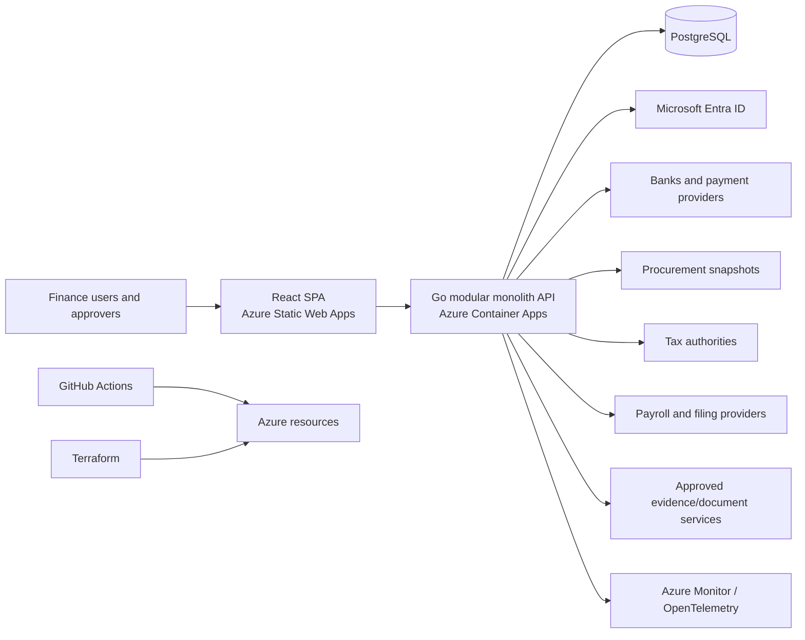
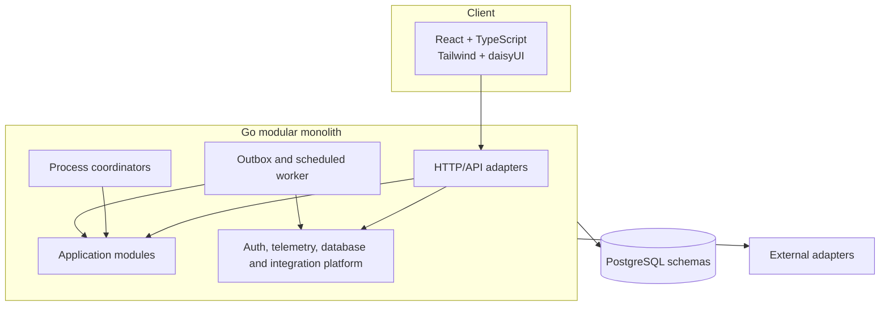

# Finance Platform Solution Architecture Overview

| Document-control field | Value |
|---|---|
| Version | 1.0 |
| Baseline date | 2026-07-24 |
| Status | Consistency-verified solution architecture baseline |
| Architecture style | Modular monolith |
| Deployment intent | Local-first learning platform with an explicit production-qualification profile |
| Source DDD | Finance DDD v3.1 |
| Source Functional PRD | Finance Functional PRD v1.5 |
| Source UX | Finance UX/Workflow Specification v1.0 |
| Source NFR | Finance NFR Specification v1.0 |

## 1. Purpose and Scope

This pack defines how the approved finance domain and product requirements are realized as a technical solution. It selects the architecture, runtime, data, integration, security, deployment and operational patterns needed before detailed API, database and code specifications are written.

The design is deliberately **cost-conscious for learning**. The local and Azure learning profiles optimize for simplicity and low recurring cost. They are not represented as satisfying the production availability, capacity, RTO or RPO targets. A separate production reference profile identifies the controls required for formal NFR qualification.

### 1.1 In scope

- Mapping all 19 bounded contexts to modules and owned PostgreSQL schemas.
- Go application, React SPA, Tailwind/daisyUI component layer and PostgreSQL architecture.
- Azure Static Web Apps, Container Apps, PostgreSQL Flexible Server, Entra ID, Key Vault and Azure Monitor.
- Terraform and GitHub Actions delivery architecture.
- REST/OpenAPI, domain events, outbox/inbox, process coordination and external integration.
- Security, privacy, audit, observability, recovery and testing controls.
- Traceability to every functional requirement, workflow and NFR.

### 1.2 Deferred to detailed technical specifications

- Exact endpoint paths and complete OpenAPI schemas.
- Table, column, index and constraint DDL.
- Exact library patch versions and dependency lockfiles.
- Terraform resource arguments, module source versions and environment variable names.
- Exact retry counts, timeout values and connection-pool sizes.
- Complete algorithms, query plans and migration scripts.

## 2. Architecture Drivers

1. Financial correctness has priority over availability and throughput.
2. Bounded-context authority and sole accounting producers must remain visible in code and data ownership.
3. Established financial facts are corrected through immutable lineage, not destructive editing.
4. The learning deployment must remain affordable and disposable.
5. The design must provide a credible path to the NFR production profile without rewriting domain semantics.
6. Authentication is delegated to Entra ID; finance authorization remains application-owned.
7. External integrations must tolerate duplicate, delayed and out-of-order delivery.
8. The solution must be observable and recoverable without exposing sensitive data.

## 3. Selected Technology Baseline

| Area | Selection | Design intent |
|---|---|---|
| Architecture | Modular monolith | One deployable Go application with enforced internal module boundaries; optional worker process from the same repository. |
| Backend language | Go 1.26.x | Pin the current security-patched 1.26 minor in CI and containers; update under dependency policy. |
| HTTP | `net/http` + `chi` | Small routing layer; middleware for auth, scope, idempotency, observability and error mapping. |
| API contract | REST/JSON + OpenAPI 3.1 | Contract-first public and internal HTTP interfaces; generated client types where useful. |
| Database | PostgreSQL 18.x | One server/database; schema per bounded context; current supported minor only. |
| Database access | `pgx` + `sqlc` | Explicit SQL and generated typed access; no cross-schema repository access. |
| Migrations | Goose | Ordered, reviewable schema migrations; expand/migrate/contract rollout discipline. |
| Frontend runtime | Node.js 24 LTS | Build and test runtime only; no Node server in the production path. |
| Frontend | React 19.2 + TypeScript | SPA workspaces aligned to the UX specification. |
| Build tooling | Vite 8 | Frontend development and production build. |
| Styling | Tailwind CSS 4.x | CSS-first tokens and utilities. |
| UI components | daisyUI 5.x | Visual component classes wrapped by typed accessible application components. |
| Client data | TanStack Query 5 | Server-state caching and mutation orchestration. |
| Forms | React Hook Form + Zod | Form state and client-side validation; server remains authoritative. |
| Tables | TanStack Table 8 | Finance grids styled with Tailwind/daisyUI. |
| Frontend tests | Vitest 4 + Testing Library + MSW | Unit, component and mocked-contract tests. |
| End-to-end tests | Playwright | Critical workflow, accessibility and recovery-path tests. |
| Backend tests | Go `testing` + Testcontainers | Unit, database, concurrency and integration tests against PostgreSQL. |
| Authentication | Microsoft Entra ID | OIDC/OAuth 2.0 authorization-code flow with PKCE for the SPA; JWT access tokens for the API. |
| Cloud | Microsoft Azure | Static Web Apps Free for learning, Container Apps Consumption, PostgreSQL Flexible Server, Container Registry, Key Vault and Azure Monitor. |
| Infrastructure as code | Terraform 1.x | AzureRM/AzureAD providers; remote state in Azure Blob for shared environments. |
| CI/CD | GitHub Actions | OIDC workload federation to Azure; no long-lived cloud credentials. |
| Telemetry | OpenTelemetry + Go `slog` | Structured logs, traces and metrics exported to Azure Monitor; local Prometheus/Grafana. |

### 3.1 Version policy

- Runtime and framework **major versions** are selected here; patch versions are pinned by Go modules, `package-lock.json` and container digests.
- Security patches are adopted through automated dependency checks and a reviewed upgrade pull request.
- PostgreSQL always runs a supported major and its current minor release.
- A major-version upgrade requires compatibility tests, migration rehearsal and rollback evidence.

## 4. System Context



## 5. Logical Architecture



### 5.1 Module and data ownership

| Prefix | Bounded context | Go module | Owned schema | Responsibility |
|---|---|---|---|---|
| OMD | Organization & Master Data | `internal/organization` | `organization` | Legal entities, parties, profiles, fiscal calendars and effective-dated reference data. |
| GL | General Ledger | `internal/gl` | `gl` | Ledger configuration, journals, posting admission, posting gates, reversals and ledger evidence. |
| AP | Accounts Payable | `internal/ap` | `ap` | Vendor invoices, matching, liabilities and payment requests. |
| AR | Accounts Receivable | `internal/ar` | `ar` | Customer invoices, open items, receipts, applications, credits, refunds and adjustments. |
| PAYR | Payroll | `internal/payroll` | `payroll` | Payroll calculations, liabilities, corrections, filings and payment obligations. |
| INV | Invoicing | `internal/invoicing` | `invoicing` | Billing schedules, charges and generated invoices. |
| PCM | Payments & Cash Management | `internal/payments` | `payments` | Payment batches and instructions, bank accounts, returns, expected incoming settlements and cash exceptions. |
| RPT | Financial Reporting | `internal/reporting` | `reporting` | Report definitions, statements, consolidation and reporting projections. |
| IC | Multi-Entity / Intercompany | `internal/intercompany` | `intercompany` | Agreements, intercompany transactions, reconciliation, netting, settlement and elimination instructions. |
| REV | Revenue Recognition | `internal/revenue` | `revenue` | Revenue contracts, schedules, modifications and accounting profiles. |
| FA | Fixed Assets | `internal/fixedassets` | `fixed_assets` | Asset lifecycle, depreciation, impairment, transfer, split and disposal. |
| FX | Multi-Currency | `internal/multicurrency` | `multi_currency` | Rates, realized and unrealized FX, revaluation and translation. |
| FPM | Fiscal Period Management | `internal/fiscalperiod` | `fiscal_period` | Period state, close, reopen and reclose orchestration. |
| COA | COA Segment Accounting | `internal/coa` | `coa` | Segment definitions, combinations and controlled changes. |
| BFR | Bank Feeds & Reconciliation | `internal/bankfeeds` | `bank_reconciliation` | Provider connections, statements, matching, unmatching and reconciliation. |
| TAX | Tax Filing | `internal/tax` | `tax` | Tax configurations, returns, submissions, amendments, adjustments and payment obligations. |
| WFA | Workflow & Approvals | `internal/workflow` | `workflow` | Approval policies, requests, decisions, delegation and escalation. |
| IAM | Identity & Access | `internal/identity` | `identity` | Application users, roles, permissions, scopes and segregation rules. |
| AUD | Audit Integrity | `internal/audit` | `audit` | Audit-chain evidence, sealing, verification and integrity incidents. |

Additional platform schemas are `integration` for outbox/inbox/process checkpoints and `platform` for operational configuration that is not a domain aggregate. They do not own business facts.

## 6. Deployment Profiles

| Profile | Purpose | Application | Database | Availability posture | Cost posture |
|---|---|---|---|---|---|
| Local | Daily development and tests | React/Vite and Go processes or Docker Compose | Local PostgreSQL container | Developer machine only | No Azure cost |
| Azure learning | Demonstration and Azure practice | Static Web Apps; Container Apps with `minReplicas=0`, `maxReplicas=1`; worker may share API process | Small burstable Flexible Server; stop or destroy when idle | Not an NFR qualification environment | Minimum recurring cost |
| Production reference | Formal NFR qualification | Zone-redundant Container Apps environment, minimum two API replicas, separately scalable worker | PostgreSQL HA, private access, backup/PITR and tested restore | Designed for Class A/B targets subject to load and recovery evidence | Higher cost; provision only when required |

## 7. Core Architecture Controls

| Control ID | Control | Design rule |
|---|---|---|
| ARC-DOM-001 | Bounded-context authority | Each module owns its domain model, application ports, repositories and database schema. Other modules call published application interfaces and never query or mutate the owner schema directly. |
| ARC-DOM-002 | Single accounting producer | Posting requests preserve the DDD accounting-entry ownership matrix; GL validates and persists all final journal entries. |
| ARC-DOM-003 | Immutable correction lineage | Posted or accepted financial facts are immutable; correction uses linked reversal, return, adjustment, amendment, replacement or compensation records. |
| ARC-MOD-001 | Compile-time module boundaries | Go `internal` packages, import rules and architecture tests prevent adapters and modules from bypassing application ports. |
| ARC-TXN-001 | Local transaction boundary | A command executes in one owning-module transaction. Approved multi-aggregate controls lock/version participants in deterministic order. |
| ARC-TXN-002 | Cross-module coordination | Cross-context work uses an explicit process coordinator and durable messages, even though modules share one deployment and database. |
| ARC-IDEM-001 | Business idempotency | State-changing endpoints require a business identity and canonical request fingerprint; duplicates return the established result and changed payloads conflict. |
| ARC-CON-001 | Optimistic concurrency | Mutable aggregates carry versions; expected-version mismatches return typed conflicts and never silently overwrite. |
| ARC-EVT-001 | Transactional outbox | Business state and integration-event intent commit atomically. A dispatcher publishes or invokes consumers after commit. |
| ARC-EVT-002 | Atomic inbox/effect | Consumer identity, local effect and resulting outbox messages commit atomically; replay returns the established consumer result. |
| ARC-EVT-003 | Ordering and replay | Events carry aggregate version, correlation and causation. Consumers reject gaps, tolerate duplicates and support controlled replay. |
| ARC-API-001 | Contract-first REST | OpenAPI defines routes, schemas, errors, idempotency, pagination, versioning and correlation conventions. |
| ARC-DATA-001 | Schema ownership | One PostgreSQL database contains one schema per bounded context plus platform schemas. Database roles and tests prevent cross-schema writes. |
| ARC-DATA-002 | Exact monetary values | PostgreSQL `NUMERIC` stores amounts and rates; Go uses a tested exact-decimal abstraction and currency-specific scale validation. |
| ARC-DATA-003 | Append-only financial records | Journal lines, approvals, postings, reversals, returns, audit evidence and accepted filing versions are append-only or lifecycle-restricted. |
| ARC-DATA-004 | Reporting projections | Reporting owns read-optimized projections keyed by source watermark and definition version; projections are rebuildable and reconciled to authoritative sources. |
| ARC-SEC-001 | Entra authentication | The SPA uses OIDC authorization code with PKCE. The API validates issuer, audience, signature, expiry and tenant before application authorization. |
| ARC-SEC-002 | Application authorization | Roles, permissions, accounting scopes, amount thresholds and segregation rules are application-owned and evaluated for every protected action. |
| ARC-SEC-003 | Managed identity and secrets | Azure workloads use managed identity. Secrets are referenced from Key Vault and never stored in source, Terraform variables, images or logs. |
| ARC-PRV-001 | Data minimization | API responses, events, logs, notifications and exports exclude unnecessary payroll, tax, bank and personal data. |
| ARC-AUD-001 | Audit evidence | Material actions produce an auditable envelope with actor, subject, scope, authorization, correlation, causation and fingerprints. |
| ARC-OBS-001 | Telemetry correlation | Every request, command, database transaction, outbox item and external call propagates trace, correlation and causation identifiers. |
| ARC-OBS-002 | Business health metrics | Operational telemetry includes posting failures, outbox backlog, reconciliation exceptions, approval age, close progress and integrity incidents. |
| ARC-REL-001 | Learning deployment profile | Scale-to-zero and smallest practical Azure resources minimize cost. This profile is not the NFR production qualification environment. |
| ARC-REL-002 | Production reference profile | At least two application replicas, zone-redundant Container Apps environment where supported, PostgreSQL HA, private networking and tested backup/restore are required for production qualification. |
| ARC-REC-001 | Backup and recovery | Database backups, point-in-time recovery, Terraform state backup, restore runbooks and financial reconciliation are tested against RTO/RPO classes. |
| ARC-PERF-001 | Workload separation | Interactive API, background worker and reporting jobs use separate concurrency pools and admission controls; reporting cannot starve financial writes. |
| ARC-CAP-001 | Measured limits | Batch sizes, queue depth, connection pools and database growth have explicit limits, metrics and controlled throttling. |
| ARC-ACC-001 | Accessible component layer | daisyUI classes are wrapped by semantic React components with keyboard, focus, labelling, error association and contrast tests. |
| ARC-IAC-001 | Terraform-controlled Azure | Shared Azure resources are created through reviewed Terraform plans; state uses Azure Blob with locking and environment separation. |
| ARC-CICD-001 | Federated delivery | GitHub Actions uses OIDC federation, signed/traceable artifacts, required checks and environment approvals. |
| ARC-TST-001 | Layered verification | Unit, architecture, contract, database, concurrency, failure-injection, accessibility, performance and recovery tests gate releases. |

## 8. Repository Structure

```text
finance-platform/
├── apps/web/                       # React SPA
├── cmd/api/                        # Go HTTP entry point
├── cmd/worker/                     # Go worker entry point
├── internal/
│   ├── organization/               # 19 bounded-context modules
│   ├── gl/
│   ├── ap/
│   ├── ar/
│   ├── ...
│   └── audit/
├── platform/
│   ├── auth/
│   ├── database/
│   ├── integration/
│   ├── observability/
│   └── web/
├── contracts/openapi/
├── migrations/
├── infra/terraform/
├── tests/architecture/
├── compose.yaml
├── go.mod
└── package.json
```

## 9. Architecture Quality Gates

A design or implementation increment passes only when:

- Module ownership and accounting-producer rules remain intact.
- State-changing routes define authorization, idempotency, expected version and auditable outcomes.
- Database changes preserve exact money, constraints, immutable lineage and rollback safety.
- Cross-module changes define process coordination, outbox/inbox handling and reconciliation.
- UX changes use the accessible component layer and preserve the UX specification states.
- NFR applicability is identified and the relevant performance, security, recovery and observability evidence exists.
- Terraform plans, migrations, contracts and tests are reviewed before deployment.

## 10. External Technology Validation References

These references validate the selected service and framework capabilities as of the baseline date; detailed implementation follows the official documentation current at implementation time.

| Reference | Official URL |
|---|---|
| Go release history | https://go.dev/doc/devel/release |
| Node.js release schedule | https://nodejs.org/en/about/previous-releases |
| React versions | https://react.dev/versions |
| PostgreSQL versioning policy | https://www.postgresql.org/support/versioning/ |
| Azure Static Web Apps overview | https://learn.microsoft.com/en-us/azure/static-web-apps/overview |
| Azure Container Apps scaling | https://learn.microsoft.com/en-us/azure/container-apps/scale-app |
| Azure Container Apps reliability | https://learn.microsoft.com/en-us/azure/reliability/reliability-container-apps |
| Azure Database for PostgreSQL overview | https://learn.microsoft.com/en-us/azure/postgresql/overview |
| Azure PostgreSQL supported versions | https://learn.microsoft.com/en-us/azure/postgresql/configure-maintain/concepts-supported-versions |
| Microsoft identity platform OIDC | https://learn.microsoft.com/en-us/entra/identity-platform/v2-protocols-oidc |
| Azure Container Apps managed identity | https://learn.microsoft.com/en-us/azure/container-apps/managed-identity |
| GitHub Actions authentication to Azure | https://learn.microsoft.com/en-us/azure/developer/github/connect-from-azure |
| Terraform AzureRM backend | https://developer.hashicorp.com/terraform/language/backend/azurerm |
| Tailwind CSS with Vite | https://tailwindcss.com/docs/installation/using-vite |
| daisyUI with Vite | https://daisyui.com/docs/install/vite/ |
| OpenTelemetry Go | https://opentelemetry.io/docs/languages/go/ |


## Verification Checkpoint

| Field | Value |
|---|---|
| Verified body SHA-256 | `254f63ea0ee9141d93091f63505cad65f2f21c6a9a5080962d1e866e774fcaaf` |
| Review status | Passed |
| Reuse rule | Re-run targeted checks when this hash or a source hash changes; re-run the full suite for architecture, data ownership, security, recovery, or technology-baseline changes. |
