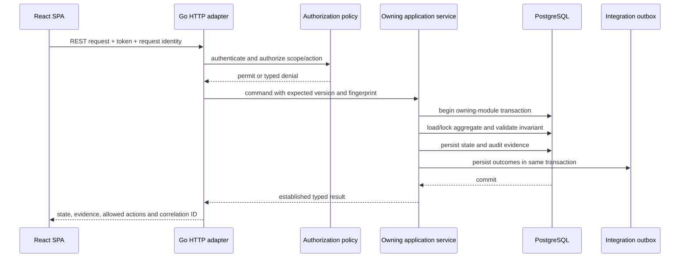
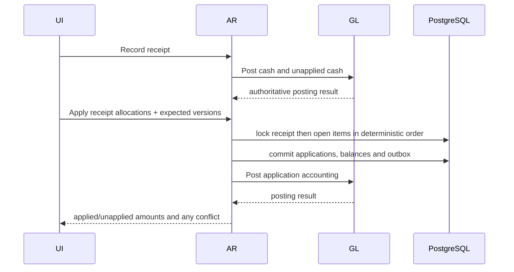
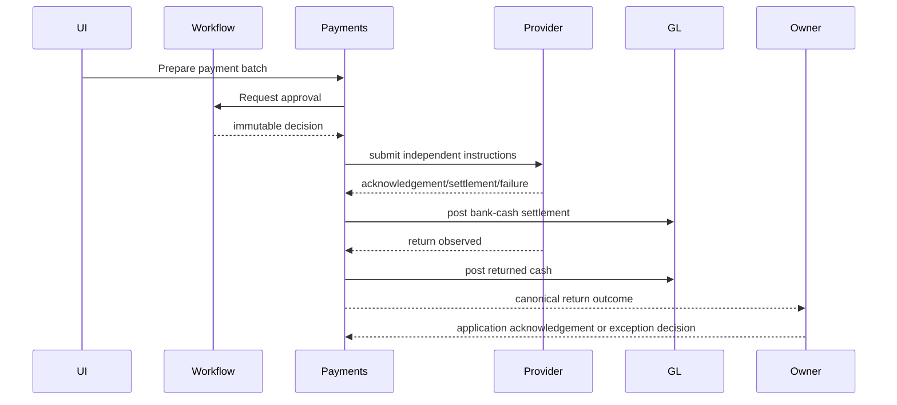
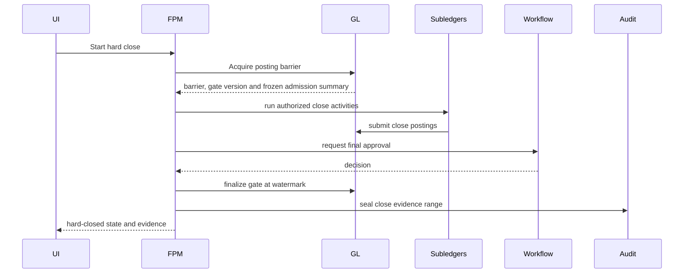
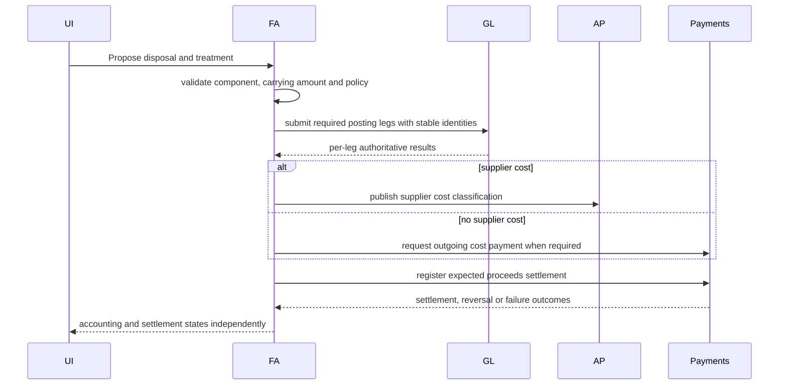
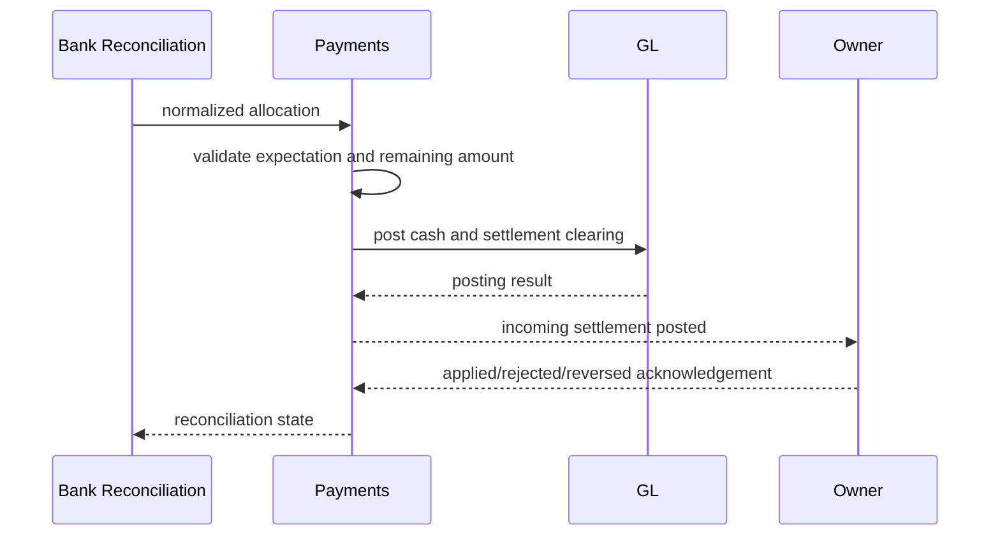
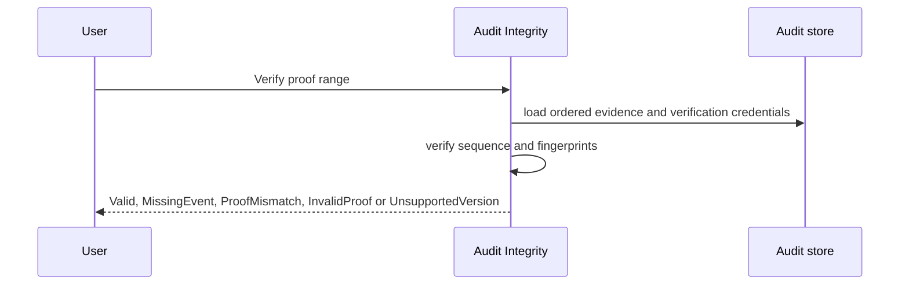

# Finance Platform Application and Module Design

| Field | Value |
|---|---|
| Version | 1.0 |
| Status | Consistency-verified application design |
| Parent | `01_solution_architecture_overview_v1.0.md` |

## 1. Modular Monolith Rules

1. Each bounded context is a Go module under `internal/` with `domain`, `application`, `ports` and `adapters` packages.
2. Domain packages import only the Go standard library and approved exact-value packages; they do not import HTTP, SQL, Azure or UI code.
3. Application packages coordinate aggregates and declare transactions through ports.
4. Adapters implement HTTP, PostgreSQL, external provider and event contracts.
5. No module imports another module's repository or adapter package.
6. Cross-module calls use a published application interface or a durable integration event.
7. Architecture tests fail the build when forbidden imports or cross-schema repository access are introduced.

```text
internal/gl/
├── domain/          # aggregates, value objects, policies, domain events
├── application/     # commands, queries, coordinators, transaction scripts
├── ports/           # repository, clock, authorization and external interfaces
└── adapters/        # postgres, HTTP mapping, integration-event mapping
```

## 2. Request Processing Pipeline



## 3. Module Specifications

### 1. Organization & Master Data

- **Package:** `internal/organization`
- **Database schema:** `organization`
- **Purpose:** Legal entities, parties, profiles, fiscal calendars and effective-dated reference data.
- **Functional scope:** FR-OMD-001, FR-OMD-002, FR-OMD-003, FR-OMD-004, FR-OMD-005, FR-OMD-006
- **Inbound ports:** command handlers, query handlers and reference operations defined by the DDD/PRD vocabulary.
- **Outbound ports:** GL posting, approvals, identity/authorization, audit evidence and context-specific external adapters.
- **Transaction rule:** changes commit inside the owning module; only DDD-approved multi-aggregate controls share a transaction.
- **Published outcomes:** integration events contain immutable business identity, aggregate version, accounting scope, correlation, causation and a safe data classification.
- **Failure rule:** domain rejection, authorization denial, dependency unavailability, version conflict and idempotency conflict are separate typed outcomes.
### 2. General Ledger

- **Package:** `internal/gl`
- **Database schema:** `gl`
- **Purpose:** Ledger configuration, journals, posting admission, posting gates, reversals and ledger evidence.
- **Functional scope:** FR-GL-001, FR-GL-002, FR-GL-003, FR-GL-004, FR-GL-005, FR-GL-006, FR-GL-007, FR-GL-008, FR-GL-009, FR-GL-010, FR-GL-011, FR-GL-012, FR-GL-013, FR-GL-014, FR-GL-015, FR-GL-016, FR-GL-017, FR-GL-018
- **Inbound ports:** command handlers, query handlers and reference operations defined by the DDD/PRD vocabulary.
- **Outbound ports:** GL posting, approvals, identity/authorization, audit evidence and context-specific external adapters.
- **Transaction rule:** changes commit inside the owning module; only DDD-approved multi-aggregate controls share a transaction.
- **Published outcomes:** integration events contain immutable business identity, aggregate version, accounting scope, correlation, causation and a safe data classification.
- **Failure rule:** domain rejection, authorization denial, dependency unavailability, version conflict and idempotency conflict are separate typed outcomes.
### 3. Accounts Payable

- **Package:** `internal/ap`
- **Database schema:** `ap`
- **Purpose:** Vendor invoices, matching, liabilities and payment requests.
- **Functional scope:** FR-AP-001, FR-AP-002, FR-AP-003, FR-AP-004, FR-AP-005, FR-AP-006, FR-AP-007, FR-AP-008, FR-AP-009, FR-AP-010
- **Inbound ports:** command handlers, query handlers and reference operations defined by the DDD/PRD vocabulary.
- **Outbound ports:** GL posting, approvals, identity/authorization, audit evidence and context-specific external adapters.
- **Transaction rule:** changes commit inside the owning module; only DDD-approved multi-aggregate controls share a transaction.
- **Published outcomes:** integration events contain immutable business identity, aggregate version, accounting scope, correlation, causation and a safe data classification.
- **Failure rule:** domain rejection, authorization denial, dependency unavailability, version conflict and idempotency conflict are separate typed outcomes.
### 4. Accounts Receivable

- **Package:** `internal/ar`
- **Database schema:** `ar`
- **Purpose:** Customer invoices, open items, receipts, applications, credits, refunds and adjustments.
- **Functional scope:** FR-AR-001, FR-AR-002, FR-AR-003, FR-AR-004, FR-AR-005, FR-AR-006, FR-AR-007, FR-AR-008, FR-AR-009, FR-AR-010, FR-AR-011, FR-AR-012, FR-AR-013, FR-AR-014, FR-AR-015, FR-AR-016
- **Inbound ports:** command handlers, query handlers and reference operations defined by the DDD/PRD vocabulary.
- **Outbound ports:** GL posting, approvals, identity/authorization, audit evidence and context-specific external adapters.
- **Transaction rule:** changes commit inside the owning module; only DDD-approved multi-aggregate controls share a transaction.
- **Published outcomes:** integration events contain immutable business identity, aggregate version, accounting scope, correlation, causation and a safe data classification.
- **Failure rule:** domain rejection, authorization denial, dependency unavailability, version conflict and idempotency conflict are separate typed outcomes.
### 5. Payroll

- **Package:** `internal/payroll`
- **Database schema:** `payroll`
- **Purpose:** Payroll calculations, liabilities, corrections, filings and payment obligations.
- **Functional scope:** FR-PAYR-001, FR-PAYR-002, FR-PAYR-003, FR-PAYR-004, FR-PAYR-005, FR-PAYR-006, FR-PAYR-007
- **Inbound ports:** command handlers, query handlers and reference operations defined by the DDD/PRD vocabulary.
- **Outbound ports:** GL posting, approvals, identity/authorization, audit evidence and context-specific external adapters.
- **Transaction rule:** changes commit inside the owning module; only DDD-approved multi-aggregate controls share a transaction.
- **Published outcomes:** integration events contain immutable business identity, aggregate version, accounting scope, correlation, causation and a safe data classification.
- **Failure rule:** domain rejection, authorization denial, dependency unavailability, version conflict and idempotency conflict are separate typed outcomes.
### 6. Invoicing

- **Package:** `internal/invoicing`
- **Database schema:** `invoicing`
- **Purpose:** Billing schedules, charges and generated invoices.
- **Functional scope:** FR-INV-001, FR-INV-002, FR-INV-003, FR-INV-004, FR-INV-005, FR-INV-006
- **Inbound ports:** command handlers, query handlers and reference operations defined by the DDD/PRD vocabulary.
- **Outbound ports:** GL posting, approvals, identity/authorization, audit evidence and context-specific external adapters.
- **Transaction rule:** changes commit inside the owning module; only DDD-approved multi-aggregate controls share a transaction.
- **Published outcomes:** integration events contain immutable business identity, aggregate version, accounting scope, correlation, causation and a safe data classification.
- **Failure rule:** domain rejection, authorization denial, dependency unavailability, version conflict and idempotency conflict are separate typed outcomes.
### 7. Payments & Cash Management

- **Package:** `internal/payments`
- **Database schema:** `payments`
- **Purpose:** Payment batches and instructions, bank accounts, returns, expected incoming settlements and cash exceptions.
- **Functional scope:** FR-PCM-001, FR-PCM-002, FR-PCM-003, FR-PCM-004, FR-PCM-005, FR-PCM-006, FR-PCM-007, FR-PCM-008, FR-PCM-009, FR-PCM-010, FR-PCM-011, FR-PCM-012, FR-PCM-013, FR-PCM-014, FR-PCM-015, FR-PCM-016, FR-PCM-017, FR-PCM-018, FR-PCM-019, FR-PCM-020, FR-PCM-021, FR-PCM-022, FR-PCM-023, FR-PCM-024, FR-PCM-025
- **Inbound ports:** command handlers, query handlers and reference operations defined by the DDD/PRD vocabulary.
- **Outbound ports:** GL posting, approvals, identity/authorization, audit evidence and context-specific external adapters.
- **Transaction rule:** changes commit inside the owning module; only DDD-approved multi-aggregate controls share a transaction.
- **Published outcomes:** integration events contain immutable business identity, aggregate version, accounting scope, correlation, causation and a safe data classification.
- **Failure rule:** domain rejection, authorization denial, dependency unavailability, version conflict and idempotency conflict are separate typed outcomes.
### 8. Financial Reporting

- **Package:** `internal/reporting`
- **Database schema:** `reporting`
- **Purpose:** Report definitions, statements, consolidation and reporting projections.
- **Functional scope:** FR-RPT-001, FR-RPT-002, FR-RPT-003, FR-RPT-004, FR-RPT-005, FR-RPT-006
- **Inbound ports:** command handlers, query handlers and reference operations defined by the DDD/PRD vocabulary.
- **Outbound ports:** GL posting, approvals, identity/authorization, audit evidence and context-specific external adapters.
- **Transaction rule:** changes commit inside the owning module; only DDD-approved multi-aggregate controls share a transaction.
- **Published outcomes:** integration events contain immutable business identity, aggregate version, accounting scope, correlation, causation and a safe data classification.
- **Failure rule:** domain rejection, authorization denial, dependency unavailability, version conflict and idempotency conflict are separate typed outcomes.
### 9. Multi-Entity / Intercompany

- **Package:** `internal/intercompany`
- **Database schema:** `intercompany`
- **Purpose:** Agreements, intercompany transactions, reconciliation, netting, settlement and elimination instructions.
- **Functional scope:** FR-IC-001, FR-IC-002, FR-IC-003, FR-IC-004, FR-IC-005, FR-IC-006, FR-IC-007, FR-IC-008, FR-IC-009, FR-IC-010, FR-IC-011
- **Inbound ports:** command handlers, query handlers and reference operations defined by the DDD/PRD vocabulary.
- **Outbound ports:** GL posting, approvals, identity/authorization, audit evidence and context-specific external adapters.
- **Transaction rule:** changes commit inside the owning module; only DDD-approved multi-aggregate controls share a transaction.
- **Published outcomes:** integration events contain immutable business identity, aggregate version, accounting scope, correlation, causation and a safe data classification.
- **Failure rule:** domain rejection, authorization denial, dependency unavailability, version conflict and idempotency conflict are separate typed outcomes.
### 10. Revenue Recognition

- **Package:** `internal/revenue`
- **Database schema:** `revenue`
- **Purpose:** Revenue contracts, schedules, modifications and accounting profiles.
- **Functional scope:** FR-REV-001, FR-REV-002, FR-REV-003, FR-REV-004, FR-REV-005, FR-REV-006
- **Inbound ports:** command handlers, query handlers and reference operations defined by the DDD/PRD vocabulary.
- **Outbound ports:** GL posting, approvals, identity/authorization, audit evidence and context-specific external adapters.
- **Transaction rule:** changes commit inside the owning module; only DDD-approved multi-aggregate controls share a transaction.
- **Published outcomes:** integration events contain immutable business identity, aggregate version, accounting scope, correlation, causation and a safe data classification.
- **Failure rule:** domain rejection, authorization denial, dependency unavailability, version conflict and idempotency conflict are separate typed outcomes.
### 11. Fixed Assets

- **Package:** `internal/fixedassets`
- **Database schema:** `fixed_assets`
- **Purpose:** Asset lifecycle, depreciation, impairment, transfer, split and disposal.
- **Functional scope:** FR-FA-001, FR-FA-002, FR-FA-003, FR-FA-004, FR-FA-005, FR-FA-006, FR-FA-007, FR-FA-008, FR-FA-009, FR-FA-010, FR-FA-011, FR-FA-012, FR-FA-013, FR-FA-014, FR-FA-015, FR-FA-016, FR-FA-017, FR-FA-018, FR-FA-019, FR-FA-020, FR-FA-021
- **Inbound ports:** command handlers, query handlers and reference operations defined by the DDD/PRD vocabulary.
- **Outbound ports:** GL posting, approvals, identity/authorization, audit evidence and context-specific external adapters.
- **Transaction rule:** changes commit inside the owning module; only DDD-approved multi-aggregate controls share a transaction.
- **Published outcomes:** integration events contain immutable business identity, aggregate version, accounting scope, correlation, causation and a safe data classification.
- **Failure rule:** domain rejection, authorization denial, dependency unavailability, version conflict and idempotency conflict are separate typed outcomes.
### 12. Multi-Currency

- **Package:** `internal/multicurrency`
- **Database schema:** `multi_currency`
- **Purpose:** Rates, realized and unrealized FX, revaluation and translation.
- **Functional scope:** FR-FX-001, FR-FX-002, FR-FX-003, FR-FX-004, FR-FX-005
- **Inbound ports:** command handlers, query handlers and reference operations defined by the DDD/PRD vocabulary.
- **Outbound ports:** GL posting, approvals, identity/authorization, audit evidence and context-specific external adapters.
- **Transaction rule:** changes commit inside the owning module; only DDD-approved multi-aggregate controls share a transaction.
- **Published outcomes:** integration events contain immutable business identity, aggregate version, accounting scope, correlation, causation and a safe data classification.
- **Failure rule:** domain rejection, authorization denial, dependency unavailability, version conflict and idempotency conflict are separate typed outcomes.
### 13. Fiscal Period Management

- **Package:** `internal/fiscalperiod`
- **Database schema:** `fiscal_period`
- **Purpose:** Period state, close, reopen and reclose orchestration.
- **Functional scope:** FR-FPM-001, FR-FPM-002, FR-FPM-003, FR-FPM-004, FR-FPM-005, FR-FPM-006, FR-FPM-007, FR-FPM-008, FR-FPM-009, FR-FPM-010, FR-FPM-011, FR-FPM-012, FR-FPM-013
- **Inbound ports:** command handlers, query handlers and reference operations defined by the DDD/PRD vocabulary.
- **Outbound ports:** GL posting, approvals, identity/authorization, audit evidence and context-specific external adapters.
- **Transaction rule:** changes commit inside the owning module; only DDD-approved multi-aggregate controls share a transaction.
- **Published outcomes:** integration events contain immutable business identity, aggregate version, accounting scope, correlation, causation and a safe data classification.
- **Failure rule:** domain rejection, authorization denial, dependency unavailability, version conflict and idempotency conflict are separate typed outcomes.
### 14. COA Segment Accounting

- **Package:** `internal/coa`
- **Database schema:** `coa`
- **Purpose:** Segment definitions, combinations and controlled changes.
- **Functional scope:** FR-COA-001, FR-COA-002, FR-COA-003, FR-COA-004, FR-COA-005
- **Inbound ports:** command handlers, query handlers and reference operations defined by the DDD/PRD vocabulary.
- **Outbound ports:** GL posting, approvals, identity/authorization, audit evidence and context-specific external adapters.
- **Transaction rule:** changes commit inside the owning module; only DDD-approved multi-aggregate controls share a transaction.
- **Published outcomes:** integration events contain immutable business identity, aggregate version, accounting scope, correlation, causation and a safe data classification.
- **Failure rule:** domain rejection, authorization denial, dependency unavailability, version conflict and idempotency conflict are separate typed outcomes.
### 15. Bank Feeds & Reconciliation

- **Package:** `internal/bankfeeds`
- **Database schema:** `bank_reconciliation`
- **Purpose:** Provider connections, statements, matching, unmatching and reconciliation.
- **Functional scope:** FR-BFR-001, FR-BFR-002, FR-BFR-003, FR-BFR-004, FR-BFR-005, FR-BFR-006
- **Inbound ports:** command handlers, query handlers and reference operations defined by the DDD/PRD vocabulary.
- **Outbound ports:** GL posting, approvals, identity/authorization, audit evidence and context-specific external adapters.
- **Transaction rule:** changes commit inside the owning module; only DDD-approved multi-aggregate controls share a transaction.
- **Published outcomes:** integration events contain immutable business identity, aggregate version, accounting scope, correlation, causation and a safe data classification.
- **Failure rule:** domain rejection, authorization denial, dependency unavailability, version conflict and idempotency conflict are separate typed outcomes.
### 16. Tax Filing

- **Package:** `internal/tax`
- **Database schema:** `tax`
- **Purpose:** Tax configurations, returns, submissions, amendments, adjustments and payment obligations.
- **Functional scope:** FR-TAX-001, FR-TAX-002, FR-TAX-003, FR-TAX-004, FR-TAX-005, FR-TAX-006, FR-TAX-007, FR-TAX-008, FR-TAX-009, FR-TAX-010, FR-TAX-011, FR-TAX-012, FR-TAX-013, FR-TAX-014, FR-TAX-015, FR-TAX-016
- **Inbound ports:** command handlers, query handlers and reference operations defined by the DDD/PRD vocabulary.
- **Outbound ports:** GL posting, approvals, identity/authorization, audit evidence and context-specific external adapters.
- **Transaction rule:** changes commit inside the owning module; only DDD-approved multi-aggregate controls share a transaction.
- **Published outcomes:** integration events contain immutable business identity, aggregate version, accounting scope, correlation, causation and a safe data classification.
- **Failure rule:** domain rejection, authorization denial, dependency unavailability, version conflict and idempotency conflict are separate typed outcomes.
### 17. Workflow & Approvals

- **Package:** `internal/workflow`
- **Database schema:** `workflow`
- **Purpose:** Approval policies, requests, decisions, delegation and escalation.
- **Functional scope:** FR-WFA-001, FR-WFA-002, FR-WFA-003, FR-WFA-004, FR-WFA-005
- **Inbound ports:** command handlers, query handlers and reference operations defined by the DDD/PRD vocabulary.
- **Outbound ports:** GL posting, approvals, identity/authorization, audit evidence and context-specific external adapters.
- **Transaction rule:** changes commit inside the owning module; only DDD-approved multi-aggregate controls share a transaction.
- **Published outcomes:** integration events contain immutable business identity, aggregate version, accounting scope, correlation, causation and a safe data classification.
- **Failure rule:** domain rejection, authorization denial, dependency unavailability, version conflict and idempotency conflict are separate typed outcomes.
### 18. Identity & Access

- **Package:** `internal/identity`
- **Database schema:** `identity`
- **Purpose:** Application users, roles, permissions, scopes and segregation rules.
- **Functional scope:** FR-IAM-001, FR-IAM-002, FR-IAM-003, FR-IAM-004, FR-IAM-005, FR-IAM-006
- **Inbound ports:** command handlers, query handlers and reference operations defined by the DDD/PRD vocabulary.
- **Outbound ports:** GL posting, approvals, identity/authorization, audit evidence and context-specific external adapters.
- **Transaction rule:** changes commit inside the owning module; only DDD-approved multi-aggregate controls share a transaction.
- **Published outcomes:** integration events contain immutable business identity, aggregate version, accounting scope, correlation, causation and a safe data classification.
- **Failure rule:** domain rejection, authorization denial, dependency unavailability, version conflict and idempotency conflict are separate typed outcomes.
### 19. Audit Integrity

- **Package:** `internal/audit`
- **Database schema:** `audit`
- **Purpose:** Audit-chain evidence, sealing, verification and integrity incidents.
- **Functional scope:** FR-AUD-001, FR-AUD-002, FR-AUD-003, FR-AUD-004, FR-AUD-005
- **Inbound ports:** command handlers, query handlers and reference operations defined by the DDD/PRD vocabulary.
- **Outbound ports:** GL posting, approvals, identity/authorization, audit evidence and context-specific external adapters.
- **Transaction rule:** changes commit inside the owning module; only DDD-approved multi-aggregate controls share a transaction.
- **Published outcomes:** integration events contain immutable business identity, aggregate version, accounting scope, correlation, causation and a safe data classification.
- **Failure rule:** domain rejection, authorization denial, dependency unavailability, version conflict and idempotency conflict are separate typed outcomes.


## 4. Shared Application Services

### 4.1 Authorization policy service

The IAM module evaluates actor identity, legal entity, business segment, account class, transaction type, amount, currency, period, data sensitivity, requested action and segregation rules. Decisions return permit/deny, policy version and evidence reference. Owning modules revalidate authorization for state-changing actions.

### 4.2 Approval integration

Approval-bearing modules create an `ApprovalRequest` through Workflow. Workflow owns decisions; the business module applies an immutable decision reference only after revalidating the current aggregate version and business state.

### 4.3 Posting gateway

Subledger modules create the standard posting contract and call GL through an application port. GL alone validates the authoritative period gate and persists journals. The gateway returns posted, rejected, pending-approval or idempotency-conflict results.

### 4.4 Process coordinators

Long-running workflows are stateful application coordinators. Coordinator records contain workflow identity, source versions, completed stages, pending obligations, last outcome, next permitted action and recovery evidence. They never become the owner of another module's aggregate.

## 5. Workflow Coordination Map

| Workflow | Title | Participating modules | Coordination rule |
|---|---|---|---|
| WF-6.1 | Period Close: Hard Close | `fiscalperiod`, `gl`, `workflow`, `multicurrency`, `fixedassets`, `revenue`, `intercompany`, `reporting`, `audit` | Coordinator in primary owning module; durable checkpoints for cross-context stages. |
| WF-6.2 | Fiscal Period Reopen and Reclose | `fiscalperiod`, `gl`, `workflow`, `reporting`, `audit` | Coordinator in primary owning module; durable checkpoints for cross-context stages. |
| WF-6.3 | Intercompany Reconciliation and Settlement | `intercompany`, `payments`, `gl`, `workflow`, `reporting` | Coordinator in primary owning module; durable checkpoints for cross-context stages. |
| WF-6.4 | Fixed Asset Disposal with Gain or Loss Recognition | `fixedassets`, `ap`, `payments`, `gl`, `workflow` | Coordinator in primary owning module; durable checkpoints for cross-context stages. |
| WF-6.5 | Revenue Recognition for a SaaS Contract | `revenue`, `invoicing`, `ar`, `gl`, `workflow` | Coordinator in primary owning module; durable checkpoints for cross-context stages. |
| WF-6.6 | Journal Entry Posting and Reversal | `gl`, `workflow`, `audit` | Coordinator in primary owning module; durable checkpoints for cross-context stages. |
| WF-6.7 | Customer Receipt Recording with Partial Application | `ar`, `gl`, `bankfeeds` | Coordinator in primary owning module; durable checkpoints for cross-context stages. |
| WF-7.1 | Vendor Invoice Registration, Matching, Approval, Dispute, and Void | `ap`, `organization`, `workflow`, `gl` | Coordinator in primary owning module; durable checkpoints for cross-context stages. |
| WF-7.2 | Payment Batch Approval, Submission, Retry, Partial Settlement, and Cancellation | `payments`, `ap`, `workflow`, `gl` | Coordinator in primary owning module; durable checkpoints for cross-context stages. |
| WF-7.3 | Customer Credit, Refund, Overpayment, Chargeback, and Write-Off | `ar`, `payments`, `workflow`, `gl` | Coordinator in primary owning module; durable checkpoints for cross-context stages. |
| WF-7.4 | Bank Statement Import, Matching, Unmatching, and Reconciliation | `bankfeeds`, `payments`, `ar`, `ap` | Coordinator in primary owning module; durable checkpoints for cross-context stages. |
| WF-7.5 | Foreign-Currency Invoice Settlement and Realized FX | `ar`, `ap`, `payments`, `multicurrency`, `gl` | Coordinator in primary owning module; durable checkpoints for cross-context stages. |
| WF-7.6 | Period-End Revaluation, Rerun, and Next-Period Reversal | `multicurrency`, `gl`, `fiscalperiod`, `workflow` | Coordinator in primary owning module; durable checkpoints for cross-context stages. |
| WF-7.7 | Full Fixed-Asset Lifecycle and Disposal Variants | `fixedassets`, `ap`, `payments`, `gl`, `workflow` | Coordinator in primary owning module; durable checkpoints for cross-context stages. |
| WF-7.8 | Revenue Modification, Renewal, Cancellation, Refund, and Variable Consideration | `revenue`, `ar`, `invoicing`, `gl`, `workflow` | Coordinator in primary owning module; durable checkpoints for cross-context stages. |
| WF-7.9 | Consolidation, Ownership Changes, Translation, Eliminations, and Rerun | `reporting`, `intercompany`, `multicurrency`, `workflow` | Coordinator in primary owning module; durable checkpoints for cross-context stages. |
| WF-7.10 | Tax Return Submission, Rejection, Amendment, Payment, and Evidence | `tax`, `payments`, `workflow`, `gl`, `audit` | Coordinator in primary owning module; durable checkpoints for cross-context stages. |
| WF-7.11 | Payroll Correction, Off-Cycle Run, Failed Payment, and Tax Amendment | `payroll`, `payments`, `tax`, `workflow`, `gl` | Coordinator in primary owning module; durable checkpoints for cross-context stages. |
| WF-7.12 | Period-Control Outage, Takeover, Cutoff, Exception Expiry, and Full Operational Reopen | `fiscalperiod`, `gl`, `workflow`, `audit` | Coordinator in primary owning module; durable checkpoints for cross-context stages. |
| WF-7.13 | Cross-Context Event Interpretation, Ordering, and Replay | `integration`, `audit`, `organization`, `gl`, `ap`, `ar`, `payroll`, `invoicing`, `payments`, `reporting`, `intercompany`, `revenue`, `fixedassets`, `multicurrency`, `fiscalperiod`, `coa`, `bankfeeds`, `tax`, `workflow`, `identity`, `audit` | Coordinator in primary owning module; durable checkpoints for cross-context stages. |
| WF-7.14 | Concurrent Aggregate and Domain-Process Modification Rules | `platform`, `organization`, `gl`, `ap`, `ar`, `payroll`, `invoicing`, `payments`, `reporting`, `intercompany`, `revenue`, `fixedassets`, `multicurrency`, `fiscalperiod`, `coa`, `bankfeeds`, `tax`, `workflow`, `identity`, `audit` | Coordinator in primary owning module; durable checkpoints for cross-context stages. |
| WF-7.15 | Audit Integrity Verification, Missing Evidence, Proof Mismatch, Verification-Credential Rotation, and Incident Escalation | `audit`, `identity`, `workflow` | Coordinator in primary owning module; durable checkpoints for cross-context stages. |

## 6. Representative Sequences

### 6.1 Journal posting and reversal — `SEQ-GL-001`

```mermaid
sequenceDiagram
    participant UI
    participant GL
    participant PG as PostgreSQL
    participant AUD as Audit
    UI->>GL: Submit journal or posting request
    GL->>PG: lock posting gate and validate scope/period
    GL->>PG: append journal, lines, gate evidence and outbox atomically
    PG-->>GL: journal number and ledger position
    GL-->>UI: Posted or typed rejection
    UI->>GL: Request reversal with original reference
    GL->>PG: append separate reversal journal
    GL-->>UI: reversal reference; original remains immutable
```

### 6.2 Receipt recording and application — `SEQ-AR-001`



### 6.3 Payment batch and provider return — `SEQ-PCM-001`



### 6.4 Hard close and reopen — `SEQ-FPM-001`



### 6.5 Fixed-asset disposal — `SEQ-FA-001`



### 6.6 Incoming settlement — `SEQ-PCM-002`



### 6.7 Audit verification — `SEQ-AUD-001`



## 7. Frontend Architecture

- Route-level capability workspaces follow the UX screen catalog.
- TanStack Query owns remote server state; domain records are never treated as authoritative client state.
- React Hook Form and Zod provide immediate feedback, while API validation remains authoritative.
- Shared components wrap daisyUI classes: `Button`, `StatusBadge`, `MoneyDisplay`, `EvidencePanel`, `VersionConflictDialog`, `ApprovalTimeline`, `DataTable` and `ConfirmationDialog`.
- Components use semantic HTML, keyboard operation, visible focus, labelled controls and error association.
- Mutations invalidate targeted query keys and display established results for duplicate submissions.
- Long-running workflows use progress polling or server notifications without implying synchronous completion.

## 8. Error Model

| Category | HTTP family | User behavior | Retry rule |
|---|---|---|---|
| Validation/domain rejection | 400/422 | Show field or business rule, current state and permitted correction | Retry only after content changes |
| Authentication | 401 | Reauthenticate; preserve unsent draft locally where safe | Automatic token refresh once |
| Authorization/segregation | 403 | Show denied action and policy reason without sensitive policy data | No automatic retry |
| Not found/scope mismatch | 404 | Show inaccessible or absent record consistently | No automatic retry |
| Version conflict | 409 | Open Version Conflict Dialog with current version/state | User refreshes and resubmits |
| Idempotency conflict | 409 | Show established identity and conflicting fingerprint | New business identity required for changed content |
| Dependency unavailable | 503 | Show pending/unavailable, owner and next recovery action | Bounded retry only for safe operations |
| Unexpected failure | 500 | Show correlation ID and safe generic message | No blind financial retry |


## Verification Checkpoint

| Field | Value |
|---|---|
| Verified body SHA-256 | `cb05b6596bacd9c4179fa84608e0a0d1f107efd0872b4f98c61faa4439bcb91e` |
| Review status | Passed |
| Reuse rule | Re-run targeted checks when this hash or a source hash changes; re-run the full suite for architecture, data ownership, security, recovery, or technology-baseline changes. |
