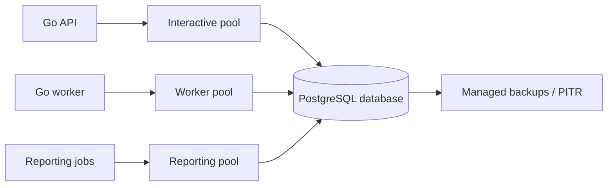
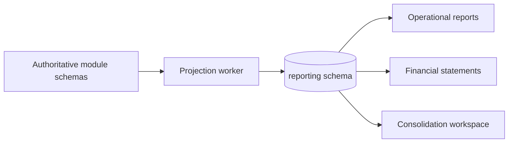

# Finance Platform Data and Integration Architecture

| Field | Value |
|---|---|
| Version | 1.0 |
| Status | Consistency-verified data and integration design |
| Parent | `01_solution_architecture_overview_v1.0.md` |

## 1. Data Architecture Principles

1. PostgreSQL is the authoritative system of record for domain state.
2. Each bounded context owns one schema and all writes to it.
3. Cross-context foreign keys are not used; stable identifiers and published contracts preserve autonomy.
4. Local foreign keys, unique constraints, checks and exclusion constraints enforce invariants where appropriate.
5. Monetary values and rates use exact decimals; binary floating point is prohibited for accounting calculations.
6. Established financial facts are append-only or lifecycle-restricted.
7. Reporting projections are derived, watermark-based and rebuildable.
8. Every migration is forward-compatible with the currently deployed application during rollout.

## 2. Database Topology



The learning profile uses one PostgreSQL instance. The production reference profile adds high availability, private connectivity, tested restore and capacity appropriate to NFR qualification.

## 3. Schema Ownership

| Schema | Context | Migration authority | Write access | Cross-context rule |
|---|---|---|---|---|
| organization | Organization & Master Data | Module role only | Owner repositories only | No direct writes; cross-context identifiers only |
| gl | General Ledger | Module role only | Owner repositories only | No direct writes; cross-context identifiers only |
| ap | Accounts Payable | Module role only | Owner repositories only | No direct writes; cross-context identifiers only |
| ar | Accounts Receivable | Module role only | Owner repositories only | No direct writes; cross-context identifiers only |
| payroll | Payroll | Module role only | Owner repositories only | No direct writes; cross-context identifiers only |
| invoicing | Invoicing | Module role only | Owner repositories only | No direct writes; cross-context identifiers only |
| payments | Payments & Cash Management | Module role only | Owner repositories only | No direct writes; cross-context identifiers only |
| reporting | Financial Reporting | Module role only | Owner repositories only | No direct writes; cross-context identifiers only |
| intercompany | Multi-Entity / Intercompany | Module role only | Owner repositories only | No direct writes; cross-context identifiers only |
| revenue | Revenue Recognition | Module role only | Owner repositories only | No direct writes; cross-context identifiers only |
| fixed_assets | Fixed Assets | Module role only | Owner repositories only | No direct writes; cross-context identifiers only |
| multi_currency | Multi-Currency | Module role only | Owner repositories only | No direct writes; cross-context identifiers only |
| fiscal_period | Fiscal Period Management | Module role only | Owner repositories only | No direct writes; cross-context identifiers only |
| coa | COA Segment Accounting | Module role only | Owner repositories only | No direct writes; cross-context identifiers only |
| bank_reconciliation | Bank Feeds & Reconciliation | Module role only | Owner repositories only | No direct writes; cross-context identifiers only |
| tax | Tax Filing | Module role only | Owner repositories only | No direct writes; cross-context identifiers only |
| workflow | Workflow & Approvals | Module role only | Owner repositories only | No direct writes; cross-context identifiers only |
| identity | Identity & Access | Module role only | Owner repositories only | No direct writes; cross-context identifiers only |
| audit | Audit Integrity | Module role only | Owner repositories only | No direct writes; cross-context identifiers only |

Platform schemas:

| Schema | Purpose | Owner |
|---|---|---|
| integration | Outbox, inbox, process checkpoints, dispatch attempts and replay evidence | Platform integration adapter |
| platform | Non-domain operational settings, feature release metadata and scheduler leases | Platform module |

## 4. Persistence Patterns

### 4.1 Aggregate tables

Mutable aggregates store identity, accounting scope, lifecycle state, version and timestamps. Child entities use owner identifiers and local referential constraints. Updates use `WHERE id = ? AND version = ?`; zero affected rows produce a typed version conflict.

### 4.2 Immutable facts

Journal lines, receipt applications, adjustments, reversals, returns, approval decisions, accepted filing versions and audit evidence are inserted, never overwritten. Query projections derive display status such as “reversed” from linked facts.

### 4.3 Money, currency and time

- Amount columns use `NUMERIC(38, 18)` as a broad storage envelope; technical specifications narrow scale per value where safe.
- Currency is an ISO currency code validated by a versioned reference set.
- Go domain values carry amount and currency together.
- Business dates are stored as `DATE`; instants are UTC `TIMESTAMPTZ`.
- Accounting scope is explicit on every ledger-bound aggregate and posting record.

### 4.4 Idempotency records

Each state-changing business operation stores owning context, operation type, business identity, canonical fingerprint, status and established result reference. A unique constraint prevents duplicate effects. The original established result remains queryable after retries and restarts.

### 4.5 Concurrency and locks

- Default isolation is PostgreSQL `READ COMMITTED` plus optimistic aggregate versions.
- Critical local controls use explicit row locks and deterministic order documented by the DDD baseline.
- GL posting locks the applicable posting gate and ledger sequence in the journal-append transaction.
- Receipt application locks the receipt then open items by stable identifier.
- Incoming settlement locks expectation then receipt.
- Payment return locks instruction then return.
- Period-control result application uses the documented aggregate-type order.
- Exact isolation choices and SQL are finalized in detailed technical specifications and concurrency proofs.

## 5. Migration Strategy

1. **Expand:** add nullable columns, new tables, indexes built safely and dual-readable contracts.
2. **Migrate:** backfill in bounded batches with checkpoints, metrics and reconciliation.
3. **Switch:** deploy code that writes/reads the new representation.
4. **Contract:** remove obsolete fields only after rollback and compatibility windows expire.
5. Every migration defines lock risk, expected duration, rollback/forward-fix, backup requirement and verification query.

## 6. API Architecture

### 6.1 Conventions

- Base path `/api/v1`; breaking changes require a new major route or negotiated media type.
- JSON field names use lower camel case; identifiers are opaque strings.
- State-changing requests include `Idempotency-Key` and expected aggregate version where applicable.
- Responses include correlation ID, authoritative record version, current state and evidence links.
- Pagination uses opaque cursors for large mutable worklists.
- Error responses use a stable problem-details schema with category, code, message, field issues, current version, established result and correlation ID as applicable.
- OpenAPI is the contract source for generated TypeScript client types and server contract tests.

### 6.2 API groups

| Group | Route prefix | Owning module |
|---|---|---|
| Organization & Master Data | `/api/v1/organization` | `internal/organization` |
| General Ledger | `/api/v1/gl` | `internal/gl` |
| Accounts Payable | `/api/v1/ap` | `internal/ap` |
| Accounts Receivable | `/api/v1/ar` | `internal/ar` |
| Payroll | `/api/v1/payroll` | `internal/payroll` |
| Invoicing | `/api/v1/invoicing` | `internal/invoicing` |
| Payments & Cash Management | `/api/v1/payments` | `internal/payments` |
| Financial Reporting | `/api/v1/reporting` | `internal/reporting` |
| Multi-Entity / Intercompany | `/api/v1/intercompany` | `internal/intercompany` |
| Revenue Recognition | `/api/v1/revenue` | `internal/revenue` |
| Fixed Assets | `/api/v1/fixedassets` | `internal/fixedassets` |
| Multi-Currency | `/api/v1/multicurrency` | `internal/multicurrency` |
| Fiscal Period Management | `/api/v1/fiscalperiod` | `internal/fiscalperiod` |
| COA Segment Accounting | `/api/v1/coa` | `internal/coa` |
| Bank Feeds & Reconciliation | `/api/v1/bankfeeds` | `internal/bankfeeds` |
| Tax Filing | `/api/v1/tax` | `internal/tax` |
| Workflow & Approvals | `/api/v1/workflow` | `internal/workflow` |
| Identity & Access | `/api/v1/identity` | `internal/identity` |
| Audit Integrity | `/api/v1/audit` | `internal/audit` |

## 7. Event and Messaging Architecture

### 7.1 Initial transport

No external broker is required for the learning baseline. Each transaction writes integration events to PostgreSQL. The worker claims due outbox items, invokes registered in-process consumers or external adapters, and records attempts and outcomes. Consumers use durable inbox identities before applying effects.

This preserves delivery, retry and replay semantics without adding Kafka or Azure Service Bus. `ADR-018` requires a new decision before introducing a broker.

### 7.2 Event envelope

```json
{
  "eventId": "opaque-id",
  "eventType": "JournalEntryPosted",
  "eventVersion": 1,
  "occurredAt": "UTC instant",
  "sourceContext": "gl",
  "sourceAggregateType": "JournalEntry",
  "sourceAggregateId": "opaque-id",
  "sourceVersion": 12,
  "accountingScope": {"tenantId":"...","legalEntityId":"...","ledgerId":"...","accountingBookId":"..."},
  "correlationId": "opaque-id",
  "causationId": "opaque-id",
  "dataClassification": "Internal",
  "payload": {}
}
```

### 7.3 Delivery state

```text
Pending -> Claimed -> Delivered
   |          |          |
   |          +-> RetryScheduled
   +-> CancelledNoEffect (only after authoritative no-effect proof)
              +-> Failed/Poison -> operator resolution -> Retry or AcceptedException
```

### 7.4 Ordering and replay

- Partition identity is source context + aggregate identity unless the contract defines a stronger business sequence.
- Aggregate versions detect gaps and out-of-order delivery.
- Duplicate event IDs return the inbox-established result.
- Replay selects an immutable event range and a consumer generation; it never deletes existing inbox evidence.
- Changed content under the same event identity is an integrity incident.

## 8. External Integration Adapters

| Adapter | Pattern | Primary controls |
|---|---|---|
| Banks/payment providers | HTTPS request/response plus provider callbacks or file exchange | Provider identity, idempotency, immutable attempts, settlement evidence, reconciliation |
| Bank feeds | Scheduled pull/file import/webhook normalized into statement allocations | Import fingerprint, source-line totals, duplicate detection, unmatched exception queue |
| Procurement | Versioned query/import of immutable PO and receipt snapshots | Snapshot version, source identity and anti-corruption mapping |
| Tax authorities | Submission and status polling/file exchange | Subject version, attempt history, rejection code, evidence retention |
| Payroll providers | Versioned inputs/outputs and payment obligations | Restricted data, file fingerprint, correction lineage |
| Evidence services | Reference-only attachment/evidence links | Access control, malware scanning by external service, retention and legal hold |

## 9. Reporting Architecture



- Source outcomes update reporting projections through outbox events.
- Every projection row carries source aggregate version and ledger watermark.
- Statement publication records report-definition version and source watermarks.
- Rebuild creates a new projection generation, compares totals, then switches readers after reconciliation.
- Heavy reporting uses its own connection pool and query limits.
- A read replica or analytical store is a future scaling decision, not part of the low-cost baseline.

## 10. Retention, Legal Hold and Deletion

- Retention policy is evaluated by record type, jurisdiction, accounting scope and legal entity.
- Legal hold blocks destruction but never authorizes business-record mutation.
- Deletion jobs produce candidate counts, hold exclusions, approval evidence and completion evidence.
- Secrets and tokens are not copied into domain events, audit evidence or reporting projections.
- Backups inherit the approved retention and access policy; restore does not bypass legal hold.

## 11. Data Recovery and Reconciliation

Recovery order:

1. Restore infrastructure state and database service.
2. Restore database to the approved recovery point.
3. Verify schemas, migrations and audit sequence.
4. Reconcile GL ledger positions and posting gates.
5. Resume outbox dispatch from durable state.
6. Reconcile external payment, bank, filing and payroll evidence.
7. Rebuild read projections where necessary.
8. Record recovery evidence and business sign-off.


## Verification Checkpoint

| Field | Value |
|---|---|
| Verified body SHA-256 | `08766b164781df7069609008b242c4546bcbe749f8b288baab542b421180e2bd` |
| Review status | Passed |
| Reuse rule | Re-run targeted checks when this hash or a source hash changes; re-run the full suite for architecture, data ownership, security, recovery, or technology-baseline changes. |
