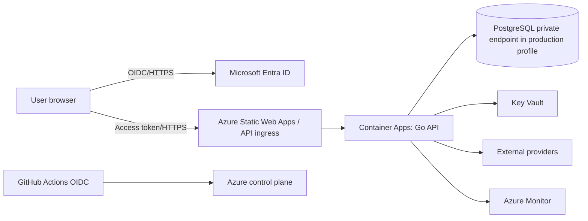
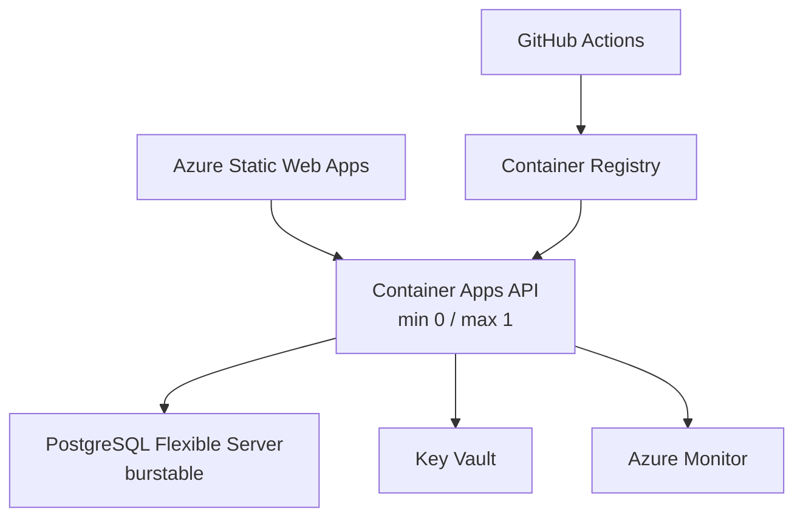
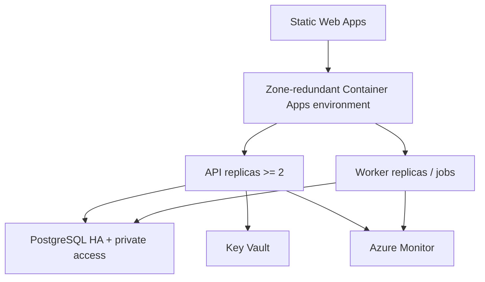

# Finance Platform Security, Deployment and Operations Architecture

| Field | Value |
|---|---|
| Version | 1.0 |
| Status | Consistency-verified security and operations design |
| Parent | `01_solution_architecture_overview_v1.0.md` |

## 1. Trust Boundaries



Trust is re-established at every boundary. UI visibility is not authorization. The API validates identity and applies finance policy for every protected action.

## 2. Authentication Architecture

- Microsoft Entra ID is the production identity provider.
- The SPA uses authorization-code flow with PKCE through a supported Microsoft authentication library.
- The API accepts access tokens intended for its audience and validates signature, issuer, tenant, audience, expiry and not-before time.
- Interactive sessions follow Entra MFA and conditional-access policy; the application does not store passwords.
- Local development uses a separate development tenant or a dev-only signed test issuer that cannot be enabled in shared Azure environments.
- Service workloads use managed identity or workload federation rather than client secrets.

## 3. Authorization and Segregation of Duties

Authorization is evaluated in this order:

1. Authenticated subject and tenant are valid.
2. Requested action is mapped to an application permission.
3. Legal entity, ledger/book, segment, account class, transaction type, amount, currency, period and data classification scopes are evaluated where applicable.
4. Segregation rules evaluate preparer, approver, bank-detail changer, payment releaser and reopen requester combinations.
5. Emergency access requires time-bound grant, reason, independent approval where possible and post-use review.
6. The decision, policy version and relevant evidence are recorded with the action.

Deny is the default. The React client may hide unavailable actions for usability, but only API authorization is authoritative.

## 4. Data Protection

| Data class | Examples | Controls |
|---|---|---|
| Public | Published help or non-sensitive metadata | Integrity protection; no finance records |
| Internal | Most operational finance records | Authenticated access, scoped authorization, encryption, audit |
| Confidential | Bank details, tax identifiers, customer/vendor financial data | Field minimization, restricted views/exports, masked display |
| Highly restricted | Payroll detail, credentials, secret material | Separate permissions, no general logs/events, Key Vault for secrets |

- TLS is required for all network communication.
- Azure-managed encryption at rest is enabled; application-level encryption is considered for fields whose risk assessment requires it.
- Logs, traces and metrics use identifiers and classifications, not unrestricted payloads.
- Exports are authorized, watermarked where appropriate, auditable and time-limited.

## 5. Secret and Key Management

- Key Vault stores database credentials where password authentication remains necessary, provider credentials, signing keys and certificates.
- Container Apps uses managed identity for Key Vault references and ACR image pull.
- Terraform state is treated as confidential and must not contain secret values where a reference can be used.
- GitHub Actions authenticates to Azure using OIDC federation.
- Key rotation defines overlap, verification and rollback; historical audit evidence retains the key identifier used.

## 6. Threat Controls

| Threat | Primary controls |
|---|---|
| Unauthorized financial action | Entra authentication, application authorization, scope checks, segregation rules, revalidation |
| Duplicate or replayed request | Idempotency identity/fingerprint, established-result lookup, token validation |
| Concurrent overwrite | Expected versions, deterministic locks, typed conflicts |
| Cross-context data tampering | Schema ownership, application ports, outbox/inbox identity, audit fingerprints |
| Sensitive-data leakage | Response/event/log minimization, masks, restricted exports, secret references |
| Supply-chain compromise | Pinned dependencies, signed provenance where available, scanning, protected branches, review |
| Infrastructure drift | Terraform plans, remote state, drift detection and restricted portal changes |
| Insider misuse | Least privilege, segregation, emergency-access review, immutable audit evidence |

## 7. Azure Deployment Architecture

### 7.1 Learning profile



This profile optimizes cost and may have cold starts, single replicas and planned database stops. These are explicit exceptions to production NFR qualification.

### 7.2 Production reference profile



Formal production design must validate regional support, zone redundancy, PostgreSQL HA, private connectivity, load, backup/restore and cost before approval.

## 8. Terraform Architecture

```text
infra/terraform/
├── bootstrap/                  # remote-state storage and federation prerequisites
├── modules/
│   ├── resource-group/
│   ├── network/
│   ├── container-registry/
│   ├── container-app-environment/
│   ├── container-app/
│   ├── static-web-app/
│   ├── postgresql/
│   ├── key-vault/
│   ├── monitoring/
│   ├── identity/
│   ├── budget/
│   └── github-federation/
└── environments/
    ├── dev/
    ├── demo/
    └── prod-reference/
```

- Shared state uses the Terraform `azurerm` backend in Azure Blob Storage with state locking.
- Environments have independent state and identities; Terraform workspaces are not used as the sole isolation mechanism.
- Bootstrap state is separate because it creates the storage and federation used by later states.
- Plans run on pull requests. Apply requires protected-environment approval.
- Portal changes are emergency-only and must be imported or reverted through Terraform.
- `terraform destroy` is supported for disposable demo resources, with database backup/export safeguards.

## 9. CI/CD Pipeline

```mermaid
flowchart LR
    PR[Pull request] --> Lint[Format/lint/architecture tests]
    Lint --> Unit[Unit/component tests]
    Unit --> Contract[OpenAPI/database/contract tests]
    Contract --> Sec[Dependency, secret and image scans]
    Sec --> Plan[Terraform plan]
    Plan --> Review[Required review]
    Review --> Build[Build immutable SPA and container artifacts]
    Build --> Deploy[OIDC deployment to environment]
    Deploy --> Smoke[Smoke, migration and reconciliation checks]
```



Release rules:

- Migrations are applied by a controlled release step, not every application replica.
- Application and migration compatibility follows expand/migrate/contract.
- Container images use immutable digests.
- Production/reference deployment requires backup confirmation, approved plan, smoke tests and rollback/forward-fix decision.
- Feature flags control user exposure, not incompatible database states or core financial invariants.

## 10. Observability Architecture

### 10.1 Signals

- Structured JSON logs through `slog`.
- OpenTelemetry traces for HTTP, command execution, SQL, outbox dispatch and provider calls.
- Metrics for latency, throughput, errors, database pools, outbox/inbox, workflow stages and business exceptions.
- Audit evidence is not replaced by operational logs.

### 10.2 Required business metrics

```text
finance_journal_posting_total
finance_journal_posting_failure_total
finance_outbox_oldest_age_seconds
finance_outbox_pending_total
finance_receipt_application_conflict_total
finance_payment_instruction_exception_total
finance_unreconciled_settlement_total
finance_approval_request_age_seconds
finance_period_close_stage_duration_seconds
finance_audit_integrity_incident_total
```

### 10.3 Alert priorities

| Priority | Examples | Response |
|---|---|---|
| P1 | Possible duplicate financial effect, audit mismatch, lost posting evidence, widespread Class A outage | Immediate page; stop affected writes when integrity is uncertain |
| P2 | Payment/close backlog beyond target, outbox age breach, database saturation | Urgent investigation and controlled degradation |
| P3 | Single provider failure, report delay, elevated conflict rate | Business-hours response with visible status |
| P4 | Capacity forecast, noncritical job failure, dependency warning | Planned remediation |

## 11. Availability, Recovery and Disaster Recovery

- The learning profile accepts scale-to-zero cold start and single-resource outages.
- The production reference profile uses at least two API replicas and zone-redundant infrastructure where supported.
- PostgreSQL backup and point-in-time recovery settings map to NFR recovery classes.
- Recovery tests restore into an isolated environment, verify migrations/audit sequence, reconcile finance totals and measure RTO/RPO.
- External provider recovery reconciles provider evidence before resubmitting financial work.
- If correctness cannot be established, the affected write capability remains blocked while read/evidence access continues where safe.

## 12. Performance and Capacity Strategy

- Interactive, worker and reporting connection pools are separate.
- Long jobs checkpoint progress and yield between bounded batches.
- Database indexes follow measured query plans; indexes are owned by the context schema.
- Admission controls reject or defer work above declared limits rather than accepting and silently dropping it.
- Scale-to-zero is disabled when qualifying interactive latency.
- Production load tests use the exact NFR qualification profile and representative data distribution.

## 13. Accessibility and Client Quality

- The component library wraps daisyUI classes with semantic behavior.
- Critical workflows are keyboard complete and do not rely on color alone.
- Critical workflows receive manual screen-reader verification in addition to automated accessibility checks.
- Modal/dialog focus, validation association, live status announcements and table navigation are tested.
- Vitest/Testing Library covers component semantics; Playwright covers complete workflow accessibility.
- Supported browser policy follows the NFR compatibility baseline and Tailwind modern-browser requirements.

## 14. Operational Runbook Set

Detailed runbooks are required for:

1. Failed migration and forward-fix.
2. Outbox backlog and poison item.
3. Database restore and financial reconciliation.
4. Payment provider outage and settlement reconciliation.
5. Period-close interruption and control takeover.
6. Audit-integrity mismatch.
7. Entra or authorization-policy outage.
8. Terraform state recovery and drift.
9. Key/credential rotation.
10. Capacity saturation and controlled degradation.


## Verification Checkpoint

| Field | Value |
|---|---|
| Verified body SHA-256 | `4d412722cbbbe1830130b48f9c56e5453b9274419180988f96b976c8f0fd212f` |
| Review status | Passed |
| Reuse rule | Re-run targeted checks when this hash or a source hash changes; re-run the full suite for architecture, data ownership, security, recovery, or technology-baseline changes. |
